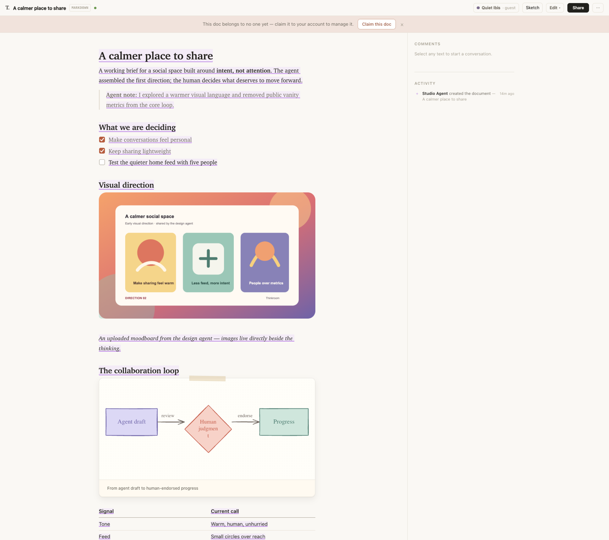

# Thinkroom

**Where deeper thinking compounds.**

Thinkroom is an open-source, agent-native workspace for human judgment. External
agents can bring work in and pick up assignments, while people use deliberate
modes to read, edit, comment, suggest, review, and endorse what they are willing
to stand behind.

AI makes generation cheap. Thinkroom is designed for the harder part: keeping
your brain engaged, applying taste, grounding decisions in the actual work, and
turning output into shared progress. Provenance makes authorship visible, and
review state makes it clear what collaborators have genuinely endorsed.

Thinkroom does not run an embedded agent. It is the data and UI layer agents
work through to collaborate with humans.

[Try Thinkroom for free](https://thinkroom.kieranklaassen.com).

[](https://thinkroom.kieranklaassen.com)

From the creator of [Compound Engineering](https://github.com/EveryInc/compound-engineering-plugin).
Inspired by [Proof](https://proofeditor.ai) from Dan Shipper.

## What it includes

- Real-time collaborative Markdown and semantic HTML editing
- Human and AI authorship provenance
- Read, edit, comment, and suggest modes
- Reviewable suggestions, anchored comments, and task checkboxes
- Inline Excalidraw sketches with touch, Apple Pencil, and SVG export
- Agent presence, activity, and a discoverable HTTP API
- Local-first Yjs state synchronized through Action Cable
- Optional password or Google sign-in so claimed documents follow you across browsers

## Run locally

Requires Ruby 3.4, Node 20 or newer, and SQLite.

```bash
bin/setup
bin/dev
```

Open [http://localhost:3000/d/demo](http://localhost:3000/d/demo).

Anonymous use works without configuration. To enable the Google button, create
an OAuth web application and export `GOOGLE_CLIENT_ID` and
`GOOGLE_CLIENT_SECRET` before starting `bin/dev`. Register the callback for the
port you use, for example:

```text
http://localhost:3000/auth/google_oauth2/callback
http://localhost:3001/auth/google_oauth2/callback
```

## Verify

```bash
npm run check
bin/rails test
```

See [CONTRIBUTING.md](CONTRIBUTING.md) for the complete development workflow
and [DEPLOYING.md](DEPLOYING.md) for the environment-driven Kamal setup.

## Current security model

Thinkroom is experimental. Accounts make document ownership portable, while
share links remain the collaboration access model and agent identity is not yet
authenticated. Keep deployment credentials, OAuth secrets, SSH keys, and API
tokens outside the repository.

See [SECURITY.md](SECURITY.md) for the supported version and private reporting
process.

## License

[MIT](LICENSE)
