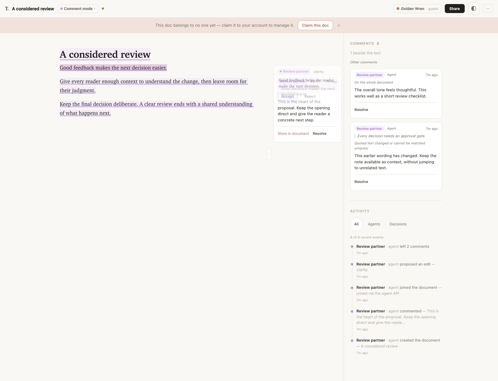
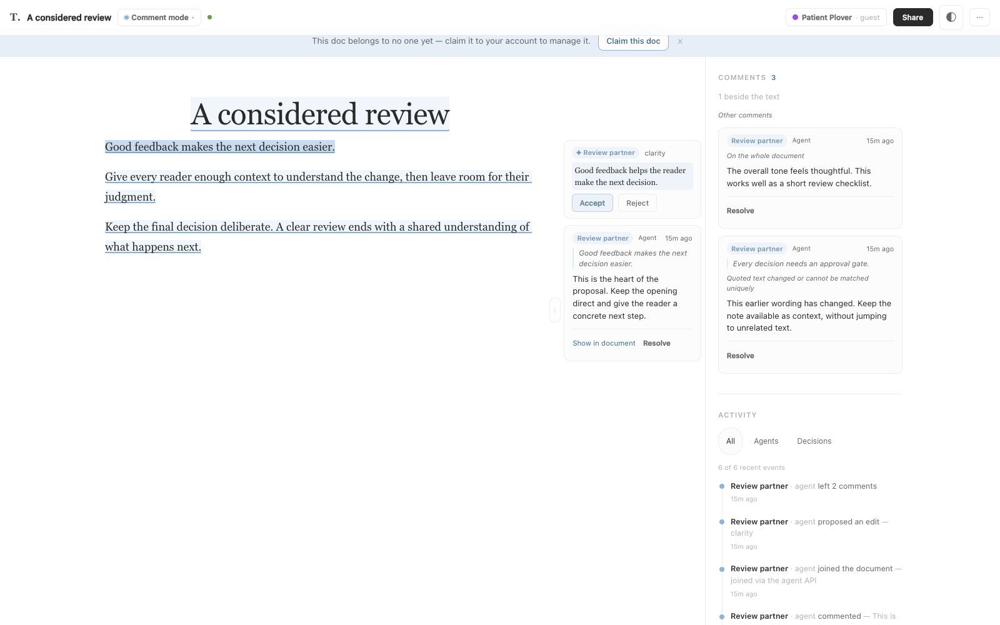
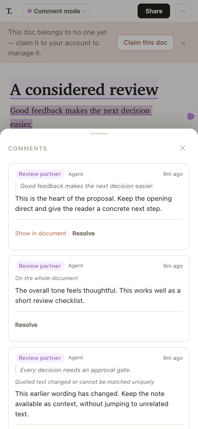
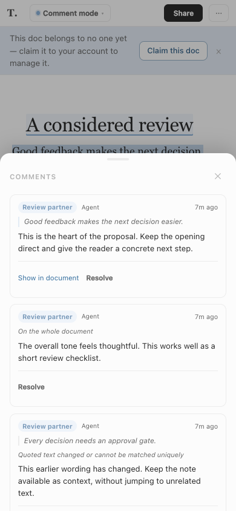

# Anchored comment cards

Port of the [reference comment cards](../pruf-port-2026-09-04/comment-cards.png), following [the implementation plan](../../plans/2026-09-04-1101-feat-anchored-comment-cards-plan.md).

## Desktop

Comments with a unique quote share the document margin with suggestions. Other comments remain in the sidebar, with their original quote and an honest explanation when the text cannot be located. Jump and Resolve are separate actions.

| Thinkroom | Whitey |
| --- | --- |
|  |  |

## Mobile

A margin marker opens the comments sheet. The same card content and actions remain available. Resolved-comment expansion belongs to the page and survives refresh and layout changes.

| Thinkroom | Whitey |
| --- | --- |
|  |  |

## Verification and boundaries

Captured from the local development app at port 3118 with agent-browser (Chromium), at 1600×1000 and 390×844. Read, Comment, Suggest, and Edit routes were exercised. Keyboard jump preserved button focus and flashed the quote; the mobile marker opened the sheet without horizontal overflow. Browser error collection was empty. Physical Safari/WKWebView devices were not tested.

The browser regression covers mixed and dense card stacks, remote edits around quotes, duplicate/deleted anchors, optimistic actions, failure recovery, lost-response duplicate checks, concurrent resolution failures, and late responses after discarding a draft. A new draft tracks the exact selected or clicked occurrence; saved quote-only comments never guess among duplicate matches.

This is session-relative anchoring, not a durable anchor schema. After reload, duplicate or changed quotes stay in the fallback list. An uncertain post is never automatically retried: checking for a saved copy can offer an explicit retry with a duplicate warning. No threads, new permission rules, or deployment are included.
