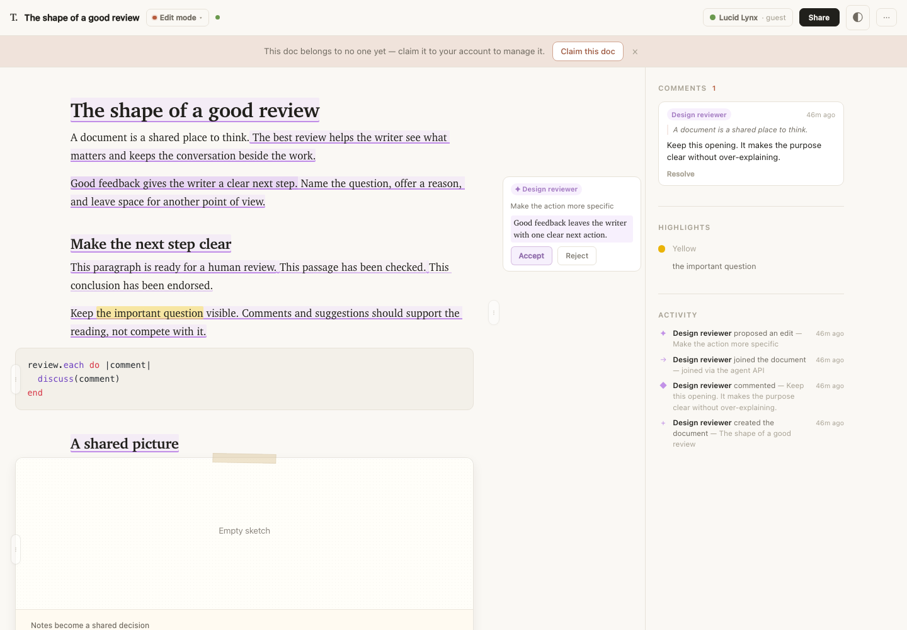
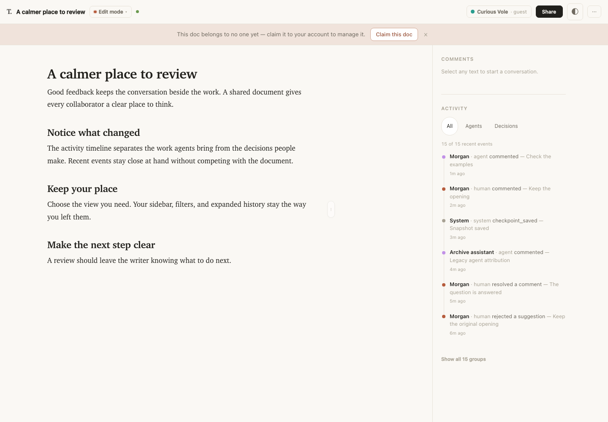
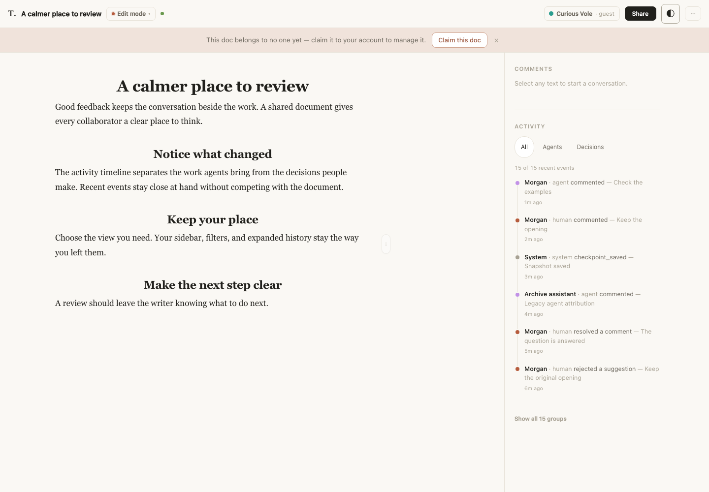
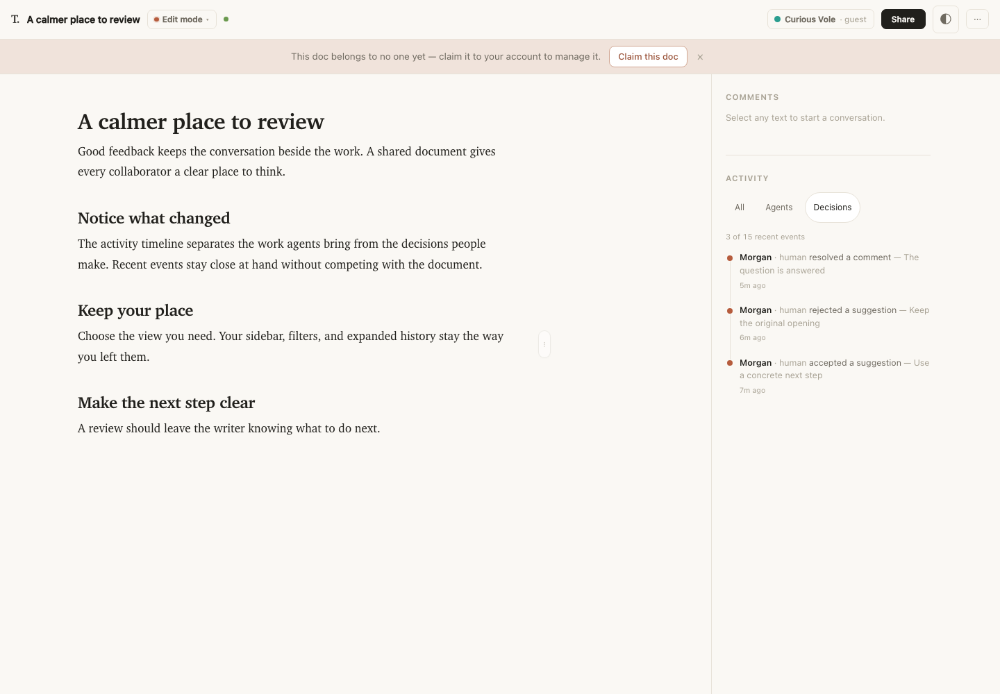
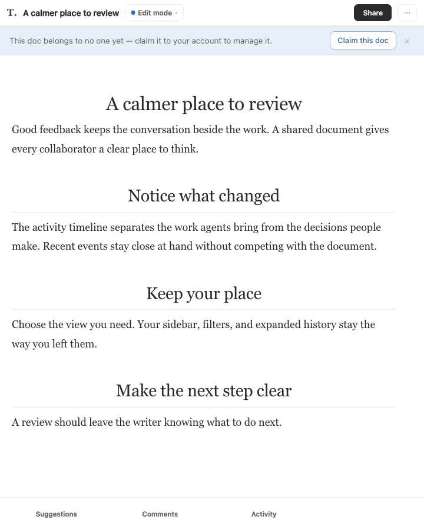
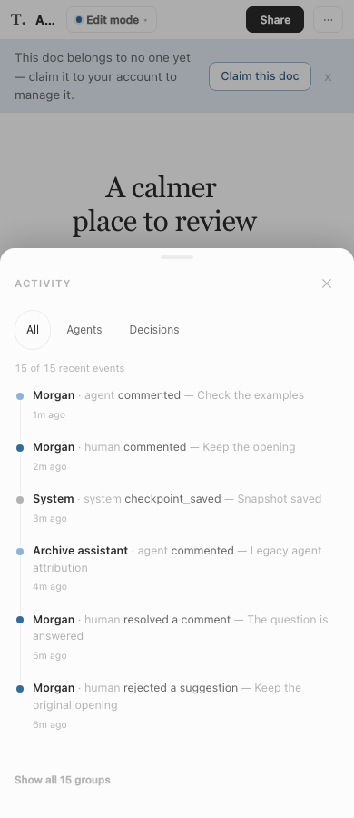
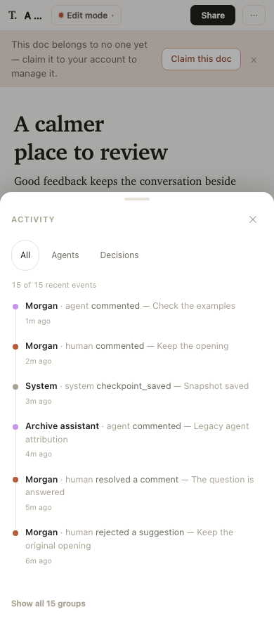

# Sidebar activity port

Actual Chromium captures from this branch, using an isolated local fixture. The before image uses the existing theme-port review document. The after fixture includes human and agent namesakes, legacy agent attribution, system/unknown activity, and all three decision actions. No external model identifiers or user documents are included.

| Surface | Capture |
| --- | --- |
| Previous timeline |  |
| Thinkroom desktop |  |
| Whitey desktop |  |
| Decisions filter |  |
| Tablet, 720 CSS pixels |  |
| Whitey phone |  |
| Thinkroom phone |  |

The 720 CSS-pixel viewport also covers the responsive width available to a 1440-pixel desktop window at 200% browser zoom; this is not a claim of Safari or native-device testing. Reduced motion was enabled for these captures. The desktop rail has no internal scrollbar. The compact sheet uses its existing page-scroll lock.

`script/meta_refresh_check.mjs` verifies real incoming events, retained DOM-row identity and focus, recent counts, refresh persistence, shared compact controls, touch targets, and rejected cookie writes. `script/native_shell_check.mjs` verifies opening and restoring the filter through the native bridge. The native check simulates its user agent and DOM bridge in Chromium; actual WKWebView hardware remains untested.
