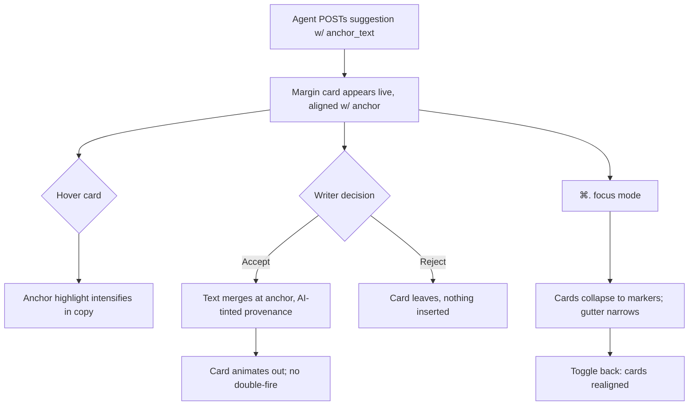
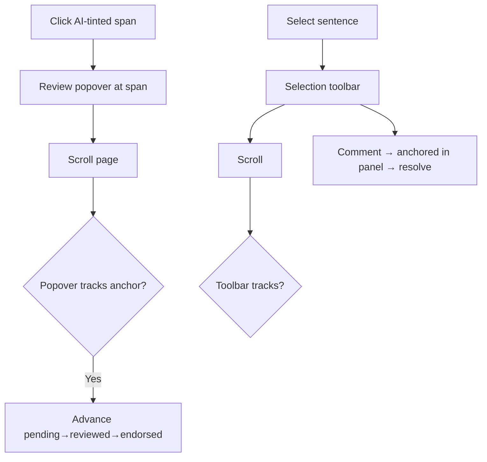
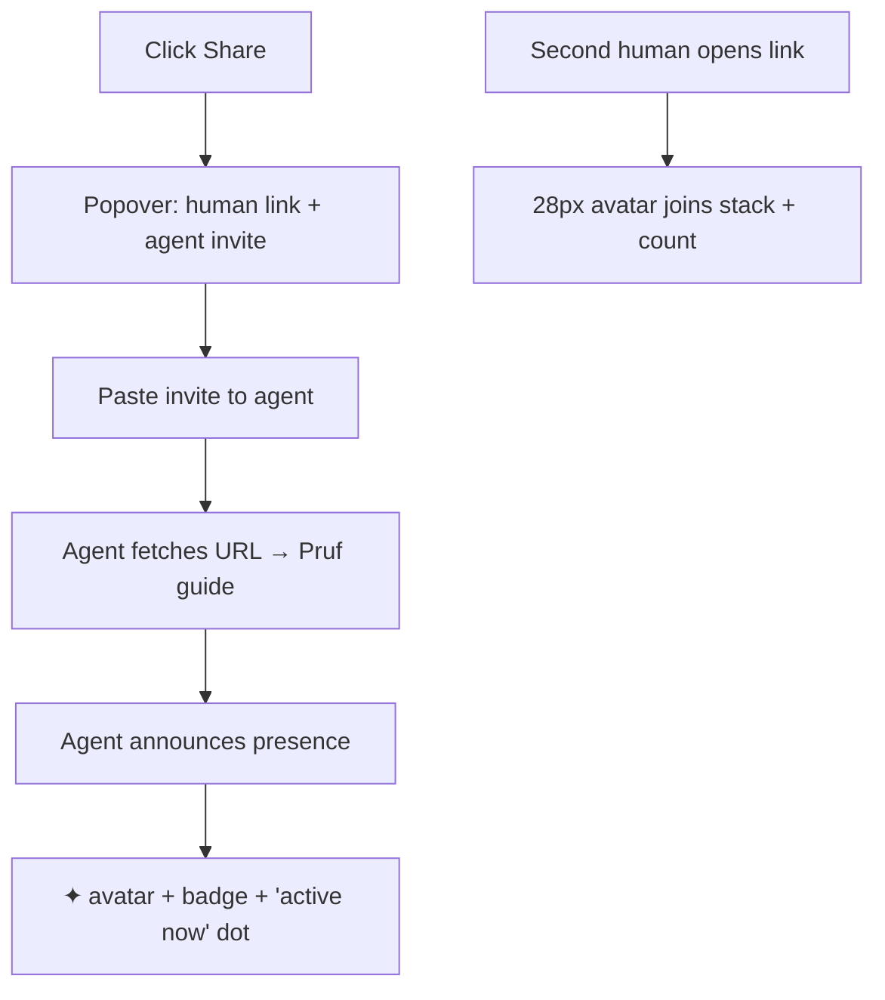
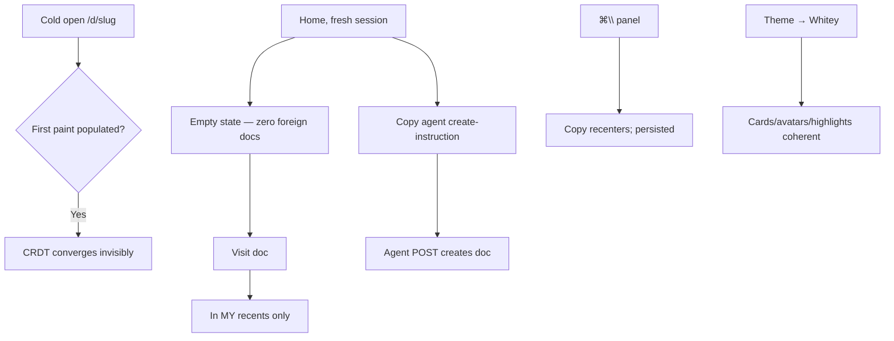

# Dogfood Report — feat/proof-clone (Pruf demo-polish pass)

**Date:** 2026-06-05 · **Branch:** `feat/proof-clone` · **Scope:** uncommitted demo-polish diff (12 modified + 2 new files, +544/−157) · **Server:** :3201 (live)

## Diff Summary

Seven-feature UX pass on the Pruf editor plus floating-UI scroll fixes:

1. **Google-Docs margin suggestions** — `app/frontend/components/margin_suggestions.tsx` (new), gutter layout in `show.tsx`, rail de-stickied (one scroll)
2. **Readable presence avatars** — `presence_bar.tsx` rewrite (28px initials stack, +N, agent ✦ avatars)
3. **Instant populated first paint** — `yjs_state_b64` prop (`documents_controller.rb`) hydrated via `Y.applyUpdate` before cable connect (`milkdown_editor.tsx`); Shiki warm at import
4. **Focus modes** — `⌘\` panel hide, `⌘.` suggestion focus; persisted (`pruf:panel` / `pruf:focus`)
5. **Session-scoped recents** — `session[:recent_slugs]` in show/create/index
6. **Homepage agent create-instruction** — copyable block in `index.tsx`
7. **Pruf rebrand** — display strings only (layout, manifest, theme labels, share invite, `agent_guide.rb`)
8. *(in flight)* **Anchored floating UI** — ReviewPopover/SelectionToolbar tracking their anchors through scroll

## Personas (inferred — no STRATEGY.md/VISION.md in repo)

- **The Writer** — drafts with AI; cares about a calm copy surface, trustworthy provenance, frictionless review
- **The Agent Operator** — wires agents in via API; cares about discoverability (share/home instructions), identity attribution
- **The Invited Collaborator** — opens a share link cold; cares about instant load and knowing who's here

## Flows Tested

### Flow B — Suggestion lifecycle (Writer × Agent Operator)

### Flow C/D — Review + selection floating UI (Writer)

### Flow E/F — Share & presence (Agent Operator × Collaborator)

### Flow A/G/H — First load, home, chrome

## Test Matrix & Results

| # | Scenario | Persona | Status |
|---|----------|---------|--------|
| A1 | Cold load — instant populated paint, no console errors | Collaborator | **Pass** — populated at first observable frame (178ms post-nav, 1249 chars); console clean |
| B1 | Agent suggestion → margin card aligned with anchor | Operator | **Pass** — verified live twice (Playwright + agent-browser); card lands at its anchor, ✦ author chip |
| B2 | Nearby suggestions stack without overlap | Writer | **Pass** — y=644 h=169 → next at y=823, zero overlap |
| B3 | Hover highlights anchor; click scrolls to it | Writer | **Pass** — sug-anchor-hot registers on hover; click jumps |
| B4 | Accept merges AI-attributed, no double-fire | Writer | **Pass** — Pruf-rebrand suggestion accepted end-to-end via real UI; CRDT merged once, 303 |
| B5 | Reject discards cleanly | Writer | **Pass** — PATCH reject confirmed, nothing inserted |
| B6 | Focus mode markers ↔ cards | Writer | **Pass** — 10px markers in 32px gutter, aligned; cards return |
| B7 | One scroll surface | Writer | **Pass** — card and copy co-travel 400px; no inner scrollbars |
| C1 | Review popover tracks scroll + advances states | Writer | **Pass (after fix)** — tracked 250px scroll exactly; Endorse advanced live |
| D1 | Selection toolbar tracks scroll; comment flow | Writer | **Pass (after fix)** — toolbar moved 300px with text |
| E1 | Share popover: link + agent invite + live state | Operator | **Pass** — Copy link + Copy agent invite; “✦ 1 active now” green dot with live agent |
| E2 | Dual-audience URL, Pruf-branded guide | Operator | **Pass** — guide says Pruf; title Pruf; JSON guide OK |
| F1 | Avatars: two clients + distinct agent | Collaborator | **Pass** — AL/AK initial avatars + “3 here”; agent as dashed-ring ✦ + chip |
| G1 | Session-scoped recents + empty state | Collaborator | **Pass** — two-cookie-jar proof + regression test |
| G2 | Homepage agent create-instruction works | Operator | **Pass** — block + Copy verified visually; POST per instruction created a doc |
| H1 | Panel hide recenters + persists | Writer | **Pass** — persisted across reload |
| H2 | Whitey coherence across new UI | Writer | **Pass** — cards/highlights/avatars/popover restyle to blue family |
| H3 | ~900px degradation | Collaborator | **Pass** — scrollWidth=900, gutter+rail hide cleanly |

## What Was Fixed

1. **Frozen floating UI (user-reported)** — ReviewPopover/SelectionToolbar stored birth coordinates; now store anchor identity only, re-derive geometry per render with rAF-throttled scroll/resize listeners; hide when the anchor leaves viewport. (`show.tsx`)
2. **Live updates dying with HTTP 500 (found while dogfooding)** — two simultaneous Inertia partial reloads raced `ViteRuby.digest`'s process-global `Dir.chdir` → `conflicting chdir during another chdir block` → 500 → error modal. Fixed with a Mutex-serialized `safe_vite_digest` (`inertia_controller.rb`) + batching broadcast-triggered reloads into one `router.reload` (`use_meta_channel.ts`).
3. **302 redirects after non-GET (found via RoutingError in logs)** — `redirect_back` after PATCH/POST caused clients to replay `PATCH /d/:slug` → RoutingError. All 8 non-GET redirects now `status: :see_other`. **Regression test added** (`test/integration/redirect_status_test.rb`, also covers session-recents scoping + agent-fetch exclusion). Full suite: 72 runs, 0 failures.
4. **Restack jank** — margin cards animate `top` only after first placement (`is-placed` flag) so initial layout doesn't fly in.
5. **Data fixes** — seeded doc title + CRDT body H1 said "Proof": title via rails runner; the body H1 fixed *through the product itself* (agent-API replacement suggestion → accepted in the editor — the full loop as the fix).

## Paper Cuts (by persona)

| Paper cut | Persona | Severity | Status |
|-----------|---------|----------|--------|
| Demo copy drift: the "still awaits review — notice the tint" sentence got endorsed during testing, so its claim no longer matches its tint | Writer | Low | Deferred (review states are forward-only by design; needs re-seed or copy rewording) |
| Stale `pixel.png` ActiveStorage 404s from pre-reset uploads referenced by re-synced CRDT state | Writer | Low | Deferred (data; harmless broken thumbnails in old docs only) |
| Hover-hot highlight can sit on a slightly stale range during a concurrent remote edit until pointer re-enters | Writer | Low | Deferred (base highlights re-register; only the hover layer waits) |
| Margin cards can sit below the fold; a reader may not notice a new suggestion arrived off-screen | Writer | Med | Deferred — consider a subtle "1 suggestion below" affordance |

## Decisions for a Human

- None blocking. The "suggestion arrived off-screen" paper cut is a product call (indicator vs auto-scroll vs nothing).

## Learnings

1. **Inertia + Rails: every non-GET redirect needs `status: :see_other`** — a 302 after PATCH makes clients replay the method against the redirect target. Grep for `redirect_back`/`redirect_to` in mutation actions.
2. **`ViteRuby.digest` is not thread-safe in dev** (process-global chdir); any `inertia_config version:` calling it must serialize. Surfaces as intermittent 500s only under concurrent partial reloads — i.e., exactly when broadcasts fan out.
3. **Wiping a CRDT server-side doesn't wipe the doc** — connected clients re-sync their full state on reconnect. A true reset needs fresh slugs or coordinated client wipes.
4. **Floating UI must store anchor identity, not coordinates** — derive geometry at render; coordinates captured at open-time are stale one scroll later.
5. **Headless coordinate clicks below the fold silently no-op** — scrollIntoView before trusted clicks in browser automation (test-harness lesson, not app bug).

## Final Status

**READY** — 18/18 scenarios pass with screenshot/log/test evidence (21 Playwright captures in `/tmp/pruf-dogfood-*.png`, 4 agent-browser captures `/tmp/qa-*.png`). Full Rails suite green (72 runs / 0 failures), `tsc --noEmit` clean, `vite build` clean. Three real bugs found and fixed during dogfooding (frozen popovers, chdir-race 500s, 302-after-PATCH), one with a regression test. Deferred paper cuts listed above; none blocking.

---

## Mobile pass (same day, follow-up iteration)

**Scope:** make Pruf complete on phones (320px up). Previously everything ≤64rem dropped the margin gutter *and* the rail — suggestions, comments, Ask AI, and activity were simply gone.

### What was built

- **Bottom dock** (`mobile_dock.tsx`): fixed, safe-area-aware, backdrop-blurred bar — Suggestions / Comments / Ask AI / Activity — with live count badges and a pulsing dot while AI is thinking.
- **Bottom sheets**: max-height 70dvh, drag-handle, ✕, Esc, backdrop tap; body scroll locks beneath; the desktop rail panels (CommentsPanel, AskAiPanel, ActivityPanel) render inside unchanged, with sheet-scoped 44px touch targets.
- **Suggestions, Google-Docs-mobile style**: anchors stay tinted; a slim marker strip (36×44 touch targets via transparent borders) sits at each anchor line. Tapping a marker — or tapping inside a tinted anchor in the copy — opens the suggestion sheet scrolled to that card (author ✦, intent, struck-through old / tinted new, Accept/Reject, double-tap guarded).
- **Header condensed**: truncating title, 24px avatars max 3, chrome toggles hidden, theme picker relocated into the Share sheet, Share popover portaled to body as a full-width bottom sheet.
- **Touch floating UI**: selection toolbar and review popover get ≥44px targets, clamp into the viewport, prefer above the anchor (clear of the keyboard), and flip below when they'd cover the sticky header. Anchor tracking through scroll carried over from the desktop fix.

### Scenarios (Playwright, Chromium touch emulation; screenshots `/tmp/pruf-mobile-*.png`)

| # | Scenario | Result |
|---|----------|--------|
| m1 | Cold load 390×844: populated paint, condensed header, dock, no overflow | PASS (scrollW=390, header 44px) |
| m2 | API suggestion → marker at anchor + live badge | PASS (marker y=354 vs anchor y=351) |
| m3 | Tap marker → sheet card → Accept merges with AI provenance, once | PASS (44px buttons) |
| m4 | Touch selection → toolbar → comment composed in sheet → resolve | PASS (sheet stays open through submit) |
| m5 | Ask AI from dock → sheet closes → busy dot → badge increments | PASS |
| m6 | Touch-selection toolbar tracks 200px scroll | PASS (200px/200px) |
| m7 | Tap AI span → review popover fits 390px, advance works | PASS (Pending → Reviewed) |
| m8 | Share → full-width sheet, copy buttons work | PASS |
| m9 | Whitey theme via Share-sheet picker: dock/sheets coherent | PASS |
| m10 | 320px fresh load: scrollWidth=320, dock items ≥44px | PASS |
| — | Desktop 1280 sanity: rail + margin cards, no dock/markers | PASS |

Zero console errors across the final run.

### Bugs found & fixed during the mobile pass

1. **Horizontal overflow at every phone width** — `.doc-main { width:100% }` + the marker gutter overflowed `.doc-canvas`; mobile now gives the canvas `width:100%` and lets the copy flex around the strip.
2. **Share popover stranded off-screen** — the sticky header's `backdrop-filter` makes it the containing block for `position:fixed` descendants, so the "full-width sheet" positioned against a 44px header. Fixed by portaling to `document.body` on mobile (plus backdrop).
3. **Header spilling past the viewport edge** — `.doc-header-right { min-width:0 }` let the rigid chrome side get squeezed below content, pushing Share past 320/390px. Now `flex:none`, with the title side absorbing all shrinkage (`min-width:0` on `.doc-title` — flex won't truncate a nowrap span otherwise).
4. **Markers misaligned under slow images** — anchor tops were measured before images loaded and never recomputed; a capture-phase `load` listener now triggers the debounced remeasure (committed separately — also fixes desktop cards).
5. **Marker touch borders forcing 8px overflow** — the 44px transparent hit-area centered in a 28px gutter at the viewport edge; asymmetric borders end the box flush with the edge.

### Test-harness learnings (not app bugs)

- ProseMirror ignores programmatic `Range`/`selectionchange` injection — drive selection through PM itself (tap to place caret, `Shift+ArrowRight` to extend).
- `agent-cursor` label widgets pollute `textContent` reads — clone-and-strip `.agent-cursor, .ProseMirror-yjs-cursor` before using DOM text as `replaces` anchors.
- Playwright `isMobile` contexts keep a stale layout viewport across `setViewportSize` — test small widths with fresh contexts.
- `waitForFunction(fn, {timeout})` passes the options object as the *arg*; the third position holds options.

### Gates

`tsc --noEmit` clean · `vite build` clean · `bin/rails test` 72 runs / 0 failures · desktop 1280 screenshot unchanged (`/tmp/pruf-mobile-11-desktop-sanity.png`).

**Commits:** `52ad296` fix(margin): remeasure suggestion anchors when images load · `1eeed8a` feat(mobile): bottom dock, sheets, and anchor markers — full product from 320px up.
