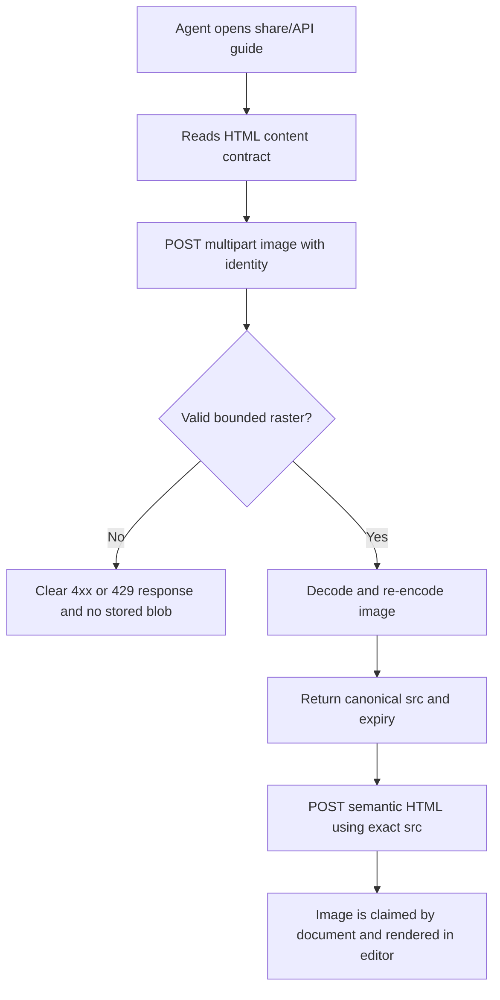
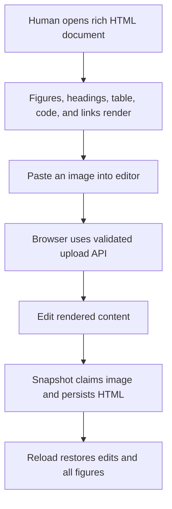
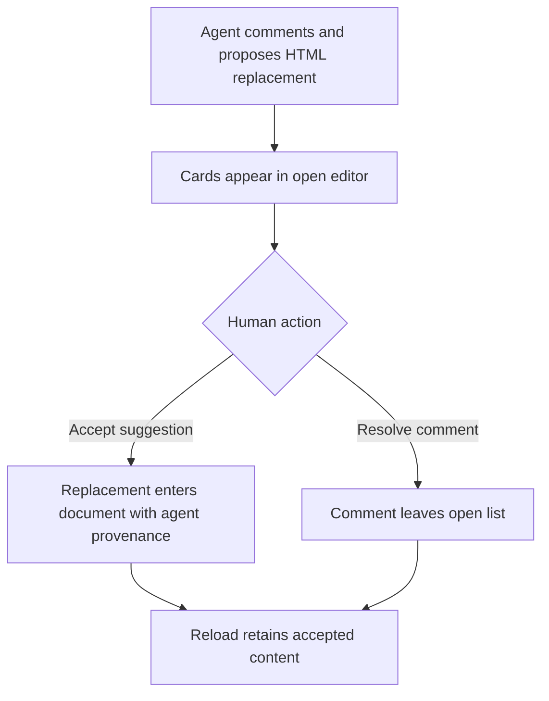
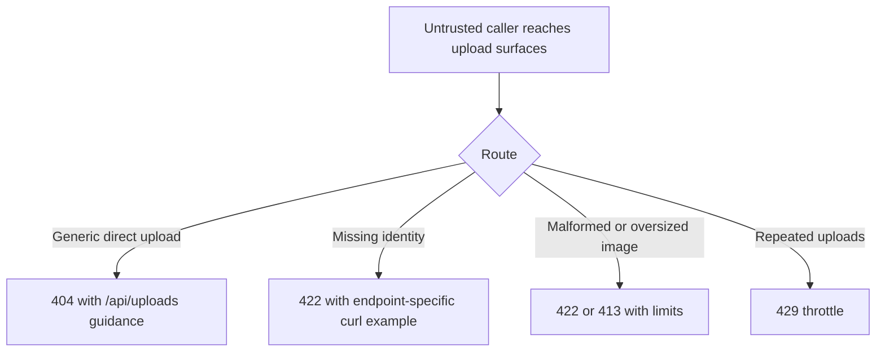

# Dogfood Report — feat/agent-rich-html-api

> Diff-scoped browser QA of `feat/agent-rich-html-api` vs `main`. Generated by `/ce-dogfood-beta` on 2026-06-08.

## Diff Summary

- Adds a public multipart image upload endpoint for browser and agent-authored HTML.
- Decodes and re-encodes PNG, JPEG, and WebP inputs with byte, dimension, pixel, rate, and capacity limits.
- Tracks temporary uploads, claims images when HTML is saved, and purges files with their document.
- Disables generic Active Storage direct-upload creation so browser and agent uploads share one policy.
- Expands machine-readable and plain-text API discovery with explicit HTML, CSS, image, and normalization contracts.

## Personas

No strategy, vision, or persona document exists in the repository, so these are inferred from the product and diff.

- **Participating agent** — needs a discoverable, copyable API for producing substantial HTML documents with hosted figures.
- **Human reviewer** — needs uploaded research documents to render cleanly and support edits, comments, suggestions, and reload.
- **Operator** — needs the unauthenticated upload surface bounded so it cannot consume unbounded request memory or persistent disk.

## Flows Tested

## Test Matrix & Results

| # | Flow | Journey / Scenario | Status | Issue | Fix | Commit |
|---|------|--------------------|--------|-------|-----|--------|
| 1 | Discovery | HTML state and text guide explain source, CSS, upload, expiry, and participation sequence | Pass | - | - | - |
| 2 | Upload | Upload three production-scale figures and receive bounded, re-encoded source metadata | Pass | - | - | - |
| 3 | Creation | Create a substantial research document using exact returned image sources | Pass | - | - | - |
| 4 | Rendering | Render headings, prose, quote, lists, code, rule, aligned table, links, and all figures | Pass | - | - | - |
| 5 | Browser upload | Paste an image in the editor, save it through `/api/uploads`, and claim it on snapshot | Pass | - | - | - |
| 6 | Persistence | Make a browser edit and reload with all edits and figures intact | Pass | - | - | - |
| 7 | Review | Create and resolve a comment; create and accept an HTML replacement suggestion | Pass | - | - | - |
| 8 | Safety | Reject direct uploads, missing identity, malformed data, oversized bodies, and burst traffic | Pass | - | - | - |
| 9 | Normalization | Remove scripts, remote images, event handlers, classes, and unsupported CSS with warning | Pass | - | - | - |
| 10 | Responsive | Desktop and 390px mobile layouts render without overflow or console errors | Fixed | A long live-agent cursor label added 35px of horizontal overflow on the production document | Clamp cursor labels to viewport gutters, truncate oversized names, and cover the case in the browser smoke test | Hotfix |
| 11 | Regression | Landing page and Markdown creation remain usable after uploader replacement | Pass | - | - | - |

## What Was Fixed

- **Mobile agent cursor overflow:** Production verification found that a long
  live-agent name could extend beyond a 390px viewport even though the rich
  document content and images were responsive. Cursor labels now cap their
  width, translate back inside 8px viewport gutters after editor resize, scroll,
  or cursor movement, and remove their observers and listeners when ProseMirror
  destroys the widget. The browser smoke test creates an intentionally oversized
  agent name, moves it between document positions, toggles the side-panel
  layout, and asserts both the label bounds and page scroll width.

## Console Errors

None observed in the final desktop, mobile, rich-document, normalization, or Markdown regression passes.

## Human Verifications

Not applicable. This branch has no OAuth, email, payment, SMS, or other external-interaction leg.

## Paper Cuts

No unresolved paper cuts were observed for the participating agent, human reviewer, or operator personas.

## Decisions for a Human

None.

## Learnings

- Browser paste/drop should use the same upload boundary as agents; otherwise documentation and enforcement drift.
- Upload ownership must be established from canonical saved HTML, not from the pre-document upload request.
- A source-ready image response needs expiry and normalization semantics, not only a URL.
- Agent API documentation is most useful when it includes headers, statuses, limits, and format-specific creation contracts.

## Final Status

The matrix is green. A substantial HTML research document rendered three
production-scale figures and one browser-pasted image, persisted browser edits,
accepted an agent HTML replacement, resolved an anchored comment, and survived
reload. Production testing exposed and fixed a mobile overflow caused by a long
live-agent cursor label; the final 390px regression now keeps the label and page
inside the viewport. Invalid uploads, disabled direct uploads, normalization,
and throttling returned the documented errors. The landing page and Markdown
creation/edit/reload journey also remained green.
