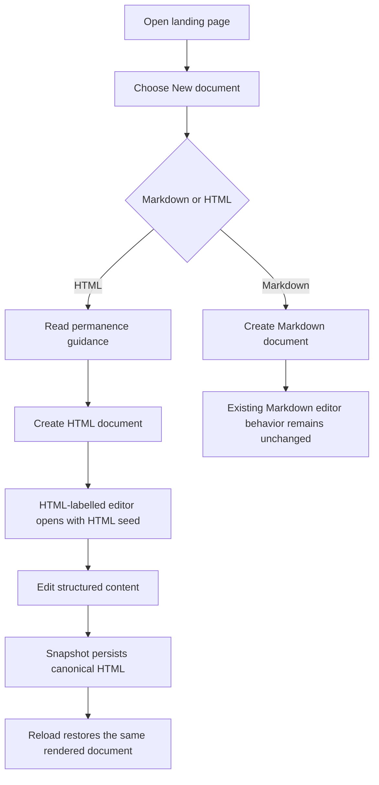
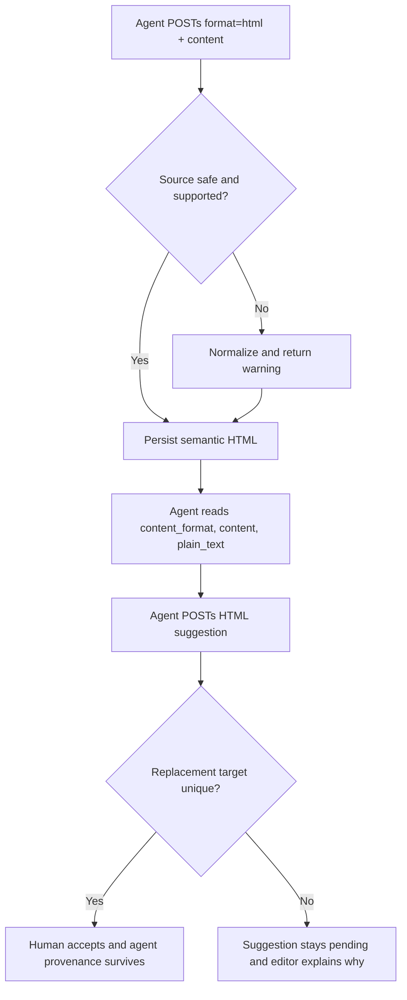
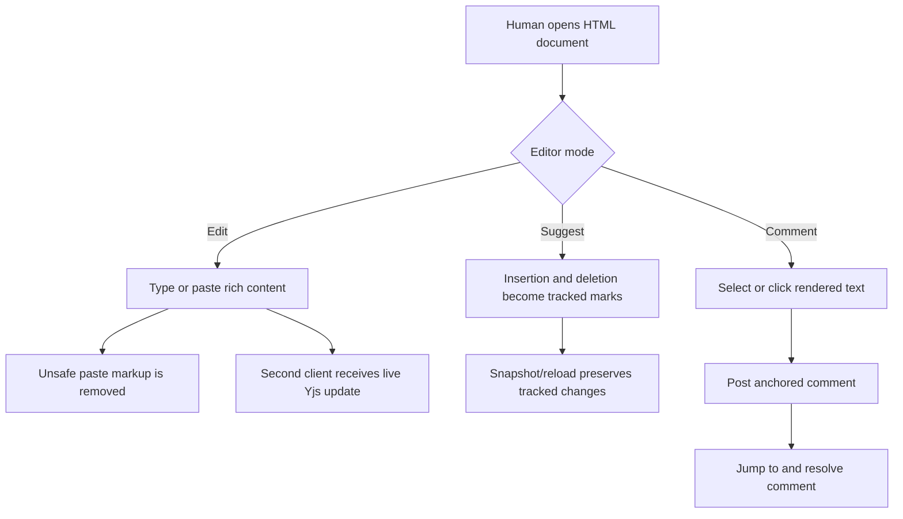

# Dogfood Report — feat/html-documents

> Diff-scoped browser QA of `feat/html-documents` vs `main`. Generated by `/ce-dogfood-beta` on 2026-06-08.

## Diff Summary

- Adds immutable Markdown or HTML document formats with compatible storage accessors and seed synchronization.
- Adds trust-specific HTML sanitation, schema-based browser parsing/serialization, safe rich-text paste, and generic agent state fields.
- Makes agent suggestions, rendered-text matching, comments, tracked changes, snapshots, and provenance work with HTML documents.
- Adds a compact accessible format chooser plus visible format labels in document lists and the editor header.
- Retains legacy Markdown creation, state aliases, collaboration, and snapshot behavior.

## Personas

No strategy, vision, or persona document exists in the repository, so these are inferred from the product and branch.

- **Human reviewer** — collaborates with agents and needs comments, suggestions, and authorship to remain understandable and trustworthy.
- **Web-content author** — needs semantic HTML structure to survive collaborative editing and reload without scripts, tracking resources, or unsupported styling.
- **Participating agent** — needs one share URL, an explicit native source format, rendered plain text for context, and predictable proposal semantics.

## Flows Tested

## Test Matrix & Results

| # | Flow | Journey / Scenario | Status | Issue | Fix | Commit |
|---|------|--------------------|--------|-------|-----|--------|
| 1 | Creation | Format chooser is clear, keyboard-operable, defaults to Markdown, and states permanence | Fixed | Focus fell back to the page body when the chooser opened | Move focus to the selected Markdown radio and restore it to New document on Cancel | Feature branch |
| 2 | Creation | Create HTML from the landing page and land in an HTML-labelled editor with the correct seed | Fixed | The browser form's `format` field was treated specially and the long-running server had stale schema metadata | Send `content_format` from the human UI and restart the branch web process after migration | Feature branch |
| 3 | Round trip | Render supported HTML structure, edit it, snapshot canonical HTML, and reload without drift | Pass | - | - | - |
| 4 | Safety | Unsafe HTML creation and rich paste remove scripts, handlers, remote images, and arbitrary styles | Fixed | Server sanitation removed script tags but retained their JavaScript as visible text | Drop dangerous containers with their contents before safe-list sanitation; verified browser paste policy too | Feature branch |
| 5 | Agent state | HTML API state exposes format, source, plain text, guide copy, and normalization feedback | Pass | - | - | - |
| 6 | Suggestions | Accept a uniquely targeted HTML replacement and retain agent provenance | Pass | - | - | - |
| 7 | Suggestions | Ambiguous HTML replacement remains pending with an explanatory notice | Pass | - | - | - |
| 8 | Review modes | HTML Suggest mode preserves tracked insertions/deletions through snapshot and reload | Pass | - | - | - |
| 9 | Comments | Create, jump to, and resolve a comment anchored in HTML content | Pass | - | - | - |
| 10 | Collaboration | Two HTML editor clients converge live and a reload restores persisted state | Fixed | Rapid dependent Yjs frames could be processed out of order and disappear after reload | Sequence frames per client and drain them in order before persistence and relay | Feature branch |
| 11 | Regression | Markdown create, edit, snapshot, suggestion, and reload behavior remains intact | Pass | - | - | - |
| 12 | Experience | Landing, lists, and editor labels are clean at desktop/mobile widths with no console errors | Fixed | Share state updated its parent from inside a child state updater | Notify the parent from an effect after the open state commits | Feature branch |
| 13 | Review actions | Accept all clears its cards and header action immediately, then persists every replacement | Fixed | The header count used stale server props while cards were optimistically hidden | Derive the action count from the same optimistic suggestion list | Feature branch |

## What Was Fixed

### Format chooser focus continuity
- **Symptom:** Opening the chooser with a keyboard or pointer removed the trigger and left focus on the page body.
- **Root cause:** The newly mounted radio group did not receive focus, and Cancel did not restore focus to the returning trigger.
- **Fix:** Added explicit open/close focus management in `app/frontend/pages/documents/index.tsx`.
- **Regression test:** Dogfood keyboard flow verifies initial Markdown focus, ArrowRight selection, and Cancel restoration.

### Human HTML creation contract
- **Symptom:** Submitting Create HTML initially posted no usable format and hit a stale model schema in the running development server.
- **Root cause:** `format` is reserved request vocabulary in the Rails/Inertia path, and the server predated the migration.
- **Fix:** The human form now posts `content_format`; `DocumentsController` accepts that field while the public agent API keeps `{format, content}`. The branch web process was restarted after migration.
- **Regression test:** `test/integration/document_create_test.rb` now exercises the `content_format` browser parameter, and dogfood confirms redirect to an HTML-labelled live editor with the HTML seed.

### Dangerous container content survived normalization
- **Symptom:** Imported `` could not execute, but `window.__BAD__=true` remained as visible document text.
- **Root cause:** The Rails safe-list sanitizer unwraps unsupported elements instead of dropping their text content.
- **Fix:** `app/services/html_document_sanitizer.rb` removes script, style, iframe, object, embed, template, SVG, and MathML containers before applying the semantic allowlist.
- **Regression test:** `test/services/html_document_sanitizer_test.rb` now asserts script body text is absent. Browser paste verification also confirms handlers, remote images, arbitrary styles, and scripts never enter the live document or snapshot.

### Escaped HTML in agent guide example
- **Symptom:** The plain-text curl guide rendered `
` as `\u003c...\u003e`, which was valid JSON but harder for an agent or human to scan.
- **Root cause:** Active Support's `to_json` HTML escaping was used inside the guide heredoc.
- **Fix:** Generate the example payload with `JSON.generate` in `app/services/agent_guide.rb`.
- **Regression test:** `test/integration/agent_discovery_test.rb` asserts readable literal HTML and no Unicode escaping.

### Out-of-order collaboration frames could vanish on reload
- **Symptom:** A peer saw a rapid typed edit live, but an immediate reload could restore an older server state.
- **Root cause:** Action Cable can dispatch a burst on multiple workers. Y-Rb does not include unresolved pending structs in `full_diff`, so persisting a causally later frame first could discard it.
- **Fix:** Browser clients sequence persistent frames, and `SyncChannel` buffers a bounded gap and drains frames in client order before persistence and broadcast.
- **Regression test:** The channel test sends dependent updates in reverse arrival order. The broad Playwright suite verifies live propagation followed by immediate reload persistence.

### Optimistic bulk review left stale chrome
- **Symptom:** Accepted cards disappeared, but the header could still show `Accept all` until the partial reload completed.
- **Root cause:** Cards used the optimistic suggestion list while the header counted the original Inertia props.
- **Fix:** Both surfaces now derive from `visibleSuggestions`.
- **Regression test:** The broad browser suite asserts the action retires as soon as no pending cards remain and that all replacements survive reload.

### Share popover emitted a React render warning
- **Symptom:** Opening or closing Share could log a parent-update-during-child-render warning.
- **Root cause:** `onOpenChange` ran inside the `setOpenState` functional updater.
- **Fix:** State notification now runs in an effect after React commits the open state.
- **Regression test:** The broad browser suite completes with no page or console errors.

## Console Errors

None observed in the final desktop or mobile passes.

## Human Verifications

Not applicable. This branch has no external OAuth, email, payment, SMS, or similar interaction.

## Decisions for a Human

None.

## Paper Cuts

- **Human reviewer, high, fixed:** focus continuity broke when the format chooser replaced its trigger.
- **Web-content author, high, fixed:** the initial human form field name conflicted with Rails request vocabulary.
- **Web-content author, medium, fixed:** dangerous container text survived import as visible prose.
- **Participating agent, low, fixed:** the HTML curl example was correct but unnecessarily escaped.

## Learnings

- Keep canonical source format separate from the shared ProseMirror/Yjs editing model.
- Sanitizer allowlists need an explicit drop-with-content phase for executable or opaque containers.
- Browser-created forms should avoid Rails-reserved `format`; the public JSON API can still use it deliberately.
- Suggestion acceptance must preflight rendered-text ambiguity before changing server status.

## Final Status

Dogfood matrix is green. Structured review fixes added body-only API format
parsing, empty-snapshot semantics, legacy Markdown seed props, stricter Pruf
metadata and Active Storage URL sanitation, database format constraints, and
recoverable suggestion acceptance when a collaborative target changes. Final
verification passed 216 Rails tests, the full browser suite, four consecutive
focused HTML browser runs, type checks, Vite build, RuboCop, Zeitwerk,
Brakeman, bundler-audit, and the sequenced two-client CRDT convergence check.
