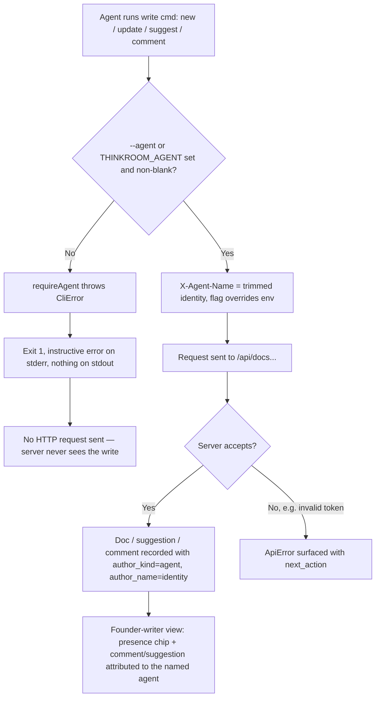
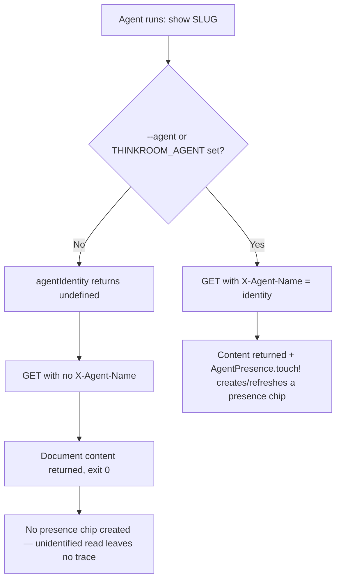

# Dogfood Report — cursor/fix-cli-agent-identity-provenance-d620

> Diff-scoped browser + CLI QA of `cursor/fix-cli-agent-identity-provenance-d620` (PR #123) vs `main`. Generated by `/ce-dogfood-beta` on 2026-06-30.

## Diff Summary

This PR implements GitHub issue #113: the Thinkroom CLI must self-assert an agent identity on writes instead of silently inventing a generic one. Scope is CLI-only (`cli/`); the other files in the `main...HEAD` diff (`app/frontend/pages/documents/index.tsx`, `app/frontend/entrypoints/application.css`, `script/browser_check.mjs`, `Gemfile.lock`, `docs/plans/*`) are noise from the `main` merge that refreshed CI, not part of this change, and were out of scope.

- **Removed the `DEFAULT_AGENT_NAME = 'Thinkroom CLI'` fallback.** `resolveAgent`/`writeAgent` (which always produced an identity and merely *warned* when none was given) are replaced by `agentIdentity()` (trims `--agent` / `THINKROOM_AGENT`, returns `undefined` when empty) and `requireAgent()` (throws a `CliError` when no identity is present).
- **Writes now fail fast client-side.** `new`, `update`, `suggest`, and `comment` call `requireAgent()` first; with no identity they exit 1 with an instructive error and never reach the server.
- **Reads stay identity-optional.** `show` forwards `X-Agent-Name` only when an identity was supplied (presence), and never fabricates one — an unidentified read must not create a presence chip.
- **Docs + help updated.** `cli/README.md`, `cli/skill/thinkroom/SKILL.md`, and the `help` text now present `--agent NAME` as required on writes and add a "Writes require an agent identity" line.
- **Test rewritten.** `cli/test/thinkroom.test.js` swaps the "warn on generic fallback" test for "writes require an agent identity and honor THINKROOM_AGENT" (refused write must exit 1, print nothing, and never reach the server; env-supplied identity succeeds silently).

The CLI change aligns with existing server behavior: `suggest`/`comment` endpoints already returned 422 (`Missing X-Agent-Name header`) without the header, while `new`/`update` accepted anonymous writes. The old generic default papered over the difference; the new CLI refuses uniformly before any request.

## Personas

Source: `STRATEGY.md` "Who it's for", plus the agent-native track described there.

- **Founder-writer (human, primary)** — Delegates creative work to AI and needs to know *who* contributed what when they read, judge, and endorse. Provenance must be legible: distinct agents must show as distinct identities, never collapsed into one meaningless "Thinkroom CLI" name.
- **External agent (the CLI caller)** — Brings work in and picks up assignments via the CLI. Must be able to self-identify cleanly and get a clear, actionable error when it forgets, rather than silently misattributing the write.

## Flows Tested

### Write commands (new / update / suggest / comment) under each identity condition

### Read command (show) — identity optional, no fabrication

## Test Matrix & Results

| # | Flow | Journey / Scenario | Status | Issue | Fix | Commit |
|---|------|--------------------|--------|-------|-----|--------|
| 1 | new | No identity → refuse client-side (exit 1, no stdout, no server call) | Pass | - | - | - |
| 2 | new | `--agent "Scout Agent"` → doc created, seed_author = agent/Scout Agent | Pass | - | - | - |
| 3 | new | `THINKROOM_AGENT="Claude Env"` (no flag) → created, silent, attributed to env identity | Pass | - | - | - |
| 4 | new | `--agent` overrides `THINKROOM_AGENT` (flag "Flag Wins" beat env "Env Loses") | Pass | - | - | - |
| 5 | new | Whitespace-only `--agent "   "` treated as missing → refuse | Pass | - | - | - |
| 6 | update | No identity → refuse client-side (exit 1, no stdout, no server call) | Pass | - | - | - |
| 7 | update | `--agent "Scout Agent"` → update round-trips, content verified via `show` | Pass | - | - | - |
| 8 | suggest | No identity → refuse client-side BEFORE server (CLI error, not server 422) | Pass | - | - | - |
| 9 | suggest | `--agent "Reviewer Bot"` → suggestion recorded author_kind=agent / Reviewer Bot | Pass | - | - | - |
| 10 | comment | No identity → refuse client-side BEFORE server (CLI error, not server 422) | Pass | - | - | - |
| 11 | comment | `--agent "Commenter Bot"` --anchor → comment recorded author_kind=agent / Commenter Bot | Pass | - | - | - |
| 12 | show | No identity → succeeds, NO presence chip; `--agent "Reader Bot"` → succeeds + creates presence | Pass | - | - | - |
| 13 | help | `help` shows `--agent NAME` required (unbracketed) on writes + "Writes require an agent identity" line | Pass | - | - | - |

All 13 scenarios `Pass`. The CLI's own test suite (`node --test cli/test/thinkroom.test.js`) is green: 5/5, including the rewritten `writes require an agent identity and honor THINKROOM_AGENT`.

### Verification evidence

- **Server attribution (DB):** `Scout Memo` → `seed_author_kind="agent", seed_author_name="Scout Agent"`, activity `created_document:agent/Scout Agent`. `Env Memo` → `agent/Claude Env`. `Precedence Memo` → `agent/Flag Wins` (env "Env Loses" correctly ignored). Suggestion #1 → `author_kind=agent, author_name="Reviewer Bot"`. Comment #1 → `author_kind=agent, author_name="Commenter Bot"`.
- **Founder-writer browser view** (`/d/PzQsJYY6s9`): header shows distinct presence chips **Reviewer Bot** and **Commenter Bot** ("2 here"), the title reflects the `update` ("Memo from Scout (revised)"), and the comment anchor highlight renders inline. Distinct agents render as distinct identities — the provenance this PR protects.
- **No presence pollution:** an unidentified `show demo` left `AgentPresence` empty; `show demo --agent "Reader Bot"` created exactly one presence ("Reader Bot").
- **Client-side refusal proven:** refused writes emit the CLI's own wording ("Set your agent identity before writing…"), never the server's "Missing X-Agent-Name header" 422, confirming the guard fires before any HTTP request.

## Console Errors

None. `agent-browser errors` was clean on every page load (demo doc, Scout Memo, attribution view).

## Human Verifications

None required. This is a CLI + JSON-API change with no OAuth, email, payment, or SMS legs. All flows were driven headlessly via the `thinkroom` binary and verified in the browser and DB.

## Decisions for a Human

None. Every scenario passed; no fixes were needed, so nothing was auto-fixed and nothing was escalated. The branch implements issue #113 correctly and completely.

## Paper Cuts (by persona)

- **External agent — minor:** When the CLI holds a *stale* saved token (e.g. a real production login in `~/.config/thinkroom/config.json`) and is pointed at a different server via `THINKROOM_URL`, write commands fail with `Invalid or revoked Thinkroom access token` before the identity check is ever reached. This is pre-existing behavior, unrelated to this PR, and surfaced only because dogfooding ran the prod-logged-in CLI against a local server. Noting it only as an observation; not a regression and not in scope.
- **External agent — trivial:** `new` and `update` require a Bearer token client-side (`requireToken: true`) even though the *server* accepts anonymous document creation. Again pre-existing and unchanged by this PR; the identity work is orthogonal to the token requirement. No action.

No paper cuts were introduced by this PR. The new error message is clear, actionable, and names both the flag and the env var.

## Learnings

- **The fix is a client-side mirror of an already-asymmetric server contract.** `suggest`/`comment` already hard-required `X-Agent-Name` (422); `new`/`update` did not. The pre-PR generic default hid that seam by always sending *something*. Refusing uniformly on the client is the right call: it makes all four write commands behave consistently and turns a server 422 into a friendlier, earlier CLI error — without changing any server behavior.
- **"No fabricated identity" is verifiable two ways and both hold:** refused writes never reach the server (the test asserts `seen.length === 0`), and unidentified reads create no `AgentPresence` row. The provenance guarantee is observable end to end, not just asserted in code comments.
- **Agent-thread cwd resets between bash calls** — every command in this worktree needed an explicit `cd /Users/.../worktrees/agent-aeb6499724d5824a7` (or absolute paths), or it ran against the repo root, which sits on a different branch. A bare `git branch --show-current` briefly reported the wrong branch for this reason.

## Final Status

**Ready to merge.** The branch fully and correctly implements issue #113. All 13 dogfood scenarios pass across the four write commands and the read command, under every identity condition (flag, env, both, neither, whitespace-only). Server-side attribution, the founder-writer's browser-visible provenance, and the no-fabrication guarantees (no fake writes, no phantom presence) are all verified. The CLI test suite is green. No bugs were found, no fixes were needed, and there is nothing outstanding or blocked. The non-CLI files in the diff are `main`-merge noise and out of scope.
