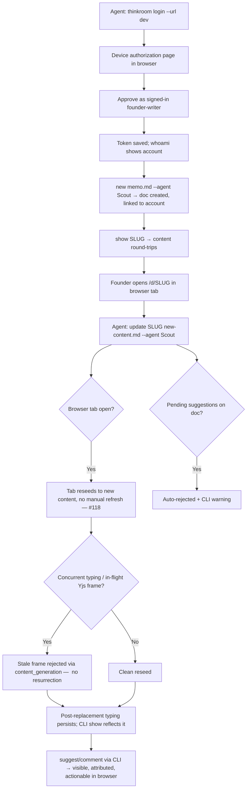
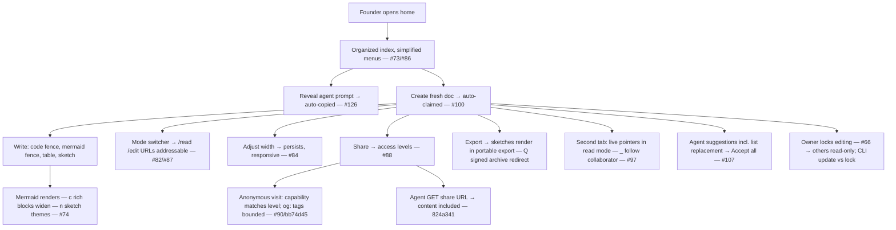

# Dogfood Report — main, two-week release sweep (2026-06-16 → 2026-07-01)

> Release-scoped browser + CLI QA of everything merged to `main` in the last two weeks (`2871149..c9568ae`, ~50 PRs, 250 files, ~29k insertions). Generated by `/ce-dogfood-beta` on 2026-07-01. Priority focus per Kieran: **the CLI edit lifecycle**.

## Diff Summary

- **Thinkroom CLI** (#101) — account-linked CLI (`login`/`whoami`/`prime`/`new`/`show`/`update`/`suggest`/`comment`/`open`) plus a chain of fixes to CLI-driven edits: owners update own claimed docs (#114), identity warning (#115) then hard requirement (#123), owners replace live documents (#117), browser reseeds after replacement (#118), stale-CRDT race closed via content generations (#127).
- **Document modes & layout** — document mode primary (#82), addressable mode URLs (#87), clarified menus + simplified home (#86), responsive/adjustable width (#84), independent sketch/table widening, rich-block width for code + Mermaid (#110).
- **Rich content** — Mermaid diagrams (#99), sketches follow reading theme (#74), sketches in portable exports (#81), document + sketch exports (#67), inline sketch canvas (#47).
- **Sharing** — shared-link access levels (#88), redesigned social previews (#90) with bounded excerpts (bb74d45), minimal link previews (#78), agent share responses include content (824a341), signed archive redirect (a98720d).
- **Home & agent onboarding** — agent-start promotion (#105), auto-copy agent prompt on reveal (#126), auto-claim fresh docs for signed-in users (#100), organized document index (#73).
- **Collaboration** — live pointers in read mode (#95), follow collaborators (#97).
- **Suggestions & locking** — list replacements no longer block batch acceptance (#107), owner editing lock (#66).
- Plus: SSR (#50/#51), instant first paint (#48), rebrand (#32), open-source readiness (#33), dependency bumps.

**Baseline health (before any browser testing):** `bin/rails test` 495 runs / 0 failures, `bin/rubocop` clean, `npm run check` (tsc + CLI tests) green, `node --test cli/test` 6/6.

**Prior coverage:** `2026-06-30-cli-agent-identity-provenance-dogfood.md` cleared PR #123 (13/13). Identity behavior gets a spot-check only (A11).

## Personas

Source: `STRATEGY.md` "Who it's for" + agent-native track.

- **Founder-writer (human, primary)** — hires Thinkroom to think deeply while delegating to AI; needs provenance, judgment modes (read/suggest/endorse), and trust that content on screen is the real current content.
- **External agent (CLI caller)** — brings work in and picks up assignments via CLI; needs reliable writes, clear errors, and edits that land exactly as sent — especially replacing live documents without corrupting them.

## Flows Tested

### A. CLI edit lifecycle (priority)

### B–G. Browser feature flows

## Test Matrix & Results

| # | Flow | Journey / Scenario | Status | Issue | Fix | Commit |
|---|------|--------------------|--------|-------|-----|--------|
| A1 | CLI | prime/whoami sane logged-out and logged-in | Pass | Paper cut: `prime` lists shipped plans as "Active plans" | | |
| A2 | CLI | login device flow end-to-end in browser | Pass | Device page shows code + account + honest scope copy | | |
| A3 | CLI | new doc → attribution + account link | Pass | Paper cut: home index dates render in UTC ("Jul 2" on Jul 1) | | |
| A4 | CLI | show round-trip + share-URL normalization | Pass | slug/URL outputs identical; `content` carries provenance spans (see paper cuts) | | |
| A5 | CLI | update own claimed doc (owner path) | Pass | show→edit→update round-trip clean, no span nesting; activity attributes Reviser Agent | | |
| A6 | CLI | live replacement w/ open tab: reseed + stale-CRDT guard | Pass | Tab reseeds live; old content unrecoverable; content_generation advances; console clean | | |
| A7 | CLI | post-replacement editing persists | Pass | Typed edit after reseed persisted to server via CRDT | | |
| A8 | CLI | suggest → browser review/accept | Fixed | BUG: suggestion committed during a page(-reset) load window never appeared until manual reload (meta-channel gap). Accept path works. | Refresh cable-fed props on channel `connected` | ea2bb99 |
| A9 | CLI | comment w/ anchor → render + reply | Pass | Live delivery on stable tab; anchored correctly; Resolve works (replies are not a feature) | | |
| A10 | CLI | replacement auto-rejects pending suggestions + warning | Pass | CLI warning verbatim + suggestion 284 rejected + margin cleared | | |
| A11 | CLI | identity refusal spot-check | Pass | Writes refuse w/ instructive error; reads fine without identity | | |
| B1 | Modes | mode primary + addressable mode URLs | Pass | Paper cut: `/d/:slug/read` raw-404s (only edit/suggest/comment routable; Read's canonical URL is the bare slug) | | |
| B2 | Layout | responsive + adjustable width | Pass | Keyboard-accessible handle; persists via `pruf_width` cookie; no overflow at 480px | | |
| B3 | Layout | rich-block widths (code/mermaid/sketch/table) | Pass | `script/rich_block_width_check.mjs` 20/20 on this server | | |
| C1 | Content | Mermaid renders; invalid fence fallback | Pass | `script/mermaid_check.mjs` 12/12 incl. sanitization + mobile | | |
| C2 | Content | code block highlighting | Pass | Shiki render verified visually; covered by width check | | |
| C3 | Content | sketch create/render + theme | Pass | Insert → Excalidraw mounts → persists via CRDT → renders in read mode | | |
| C4 | Content | exports incl. sketches + signed archive redirect | Pass* | Markdown+HTML downloads clean w/ sketch SVG. BUG (escalated): read-mode copy bypasses the clean clipboard serializer — see Decisions for a Human | | |
| D1 | Sharing | access levels enforced for anonymous | Pass | Can view → read-only + disabled switcher; Can comment → edit/suggest disabled w/ explanations; API write on view doc → 423 | | |
| D2 | Sharing | social preview tags + excerpt bounds | Pass | Full og: set, bounded description, live 1200×630 og.png with alt text | | |
| D3 | Sharing | agent share response includes content | Pass | Agent UA gets an "agent guide" incl. canonical content in a delimited block with injection hygiene | | |
| E1 | Home | simplified home + organized index | Pass | Clean two-CTA layout; week grouping; tags. Paper cut: dates in UTC | | |
| E2 | Home | agent-start promotion + prompt auto-copy | Pass | Reveal auto-copies + "Copied" feedback (verified w/ clipboard perms). Paper cut: no `.catch` on denied clipboard | | |
| E3 | Home | auto-claim fresh docs when signed in | Pass | New doc claimed by account (user_id + claimed_at + owner_name), lands in /edit | | |
| F1 | Collab | live pointers in read mode | Pass | Remote guest pointer renders with name chip in owner's read view | | |
| F2 | Collab | follow collaborators | Pass | Viewport tracks followed peer; unfollow works; presence expires ~30s after peer leaves. Paper cut: following an idle peer gives no feedback | | |
| G1 | Suggest | list replacements + accept-all | Pass | `script/suggestion_list_replace_check.mjs` 12/12 incl. skipped stale target | | |
| G2 | Lock | owner editing lock incl. CLI interplay | Pass | Lock = `link_access` (view). Owner CLI update succeeds through lock; stranger agent redirected to suggestion workflow; browser writes 423 | | |

Status values: `Pending`, `Pass`, `Fixed`, `Skipped`, `Blocked (needs human verify)`, `Blocked (human decision)`.

## What Was Fixed

### Meta events lost during page-load window — `ea2bb99`
- **Symptom:** an agent chained `thinkroom update` + `thinkroom suggest`; the update's `content_reset` full-reloaded the founder's tab, and the suggestion (committed while the fresh page was booting) never appeared — the margin rail stayed empty until a manual reload. Reproduces for any suggestion/comment/activity landing while a doc page is loading.
- **Root cause:** the server renders page props before the browser subscribes to `DocumentMetaChannel`; broadcasts in that window reach nobody, and nothing refetched the cable-fed props afterward (`app/frontend/lib/use_meta_channel.ts`).
- **Fix:** on channel `connected` (initial connect and reconnects), schedule the existing debounced partial reload for `suggestions`, `comments`, `activities`, `presences`.
- **Regression test:** `script/meta_refresh_check.mjs` — holds `/cable` via Playwright `routeWebSocket` until the suggestion POST commits (broadcast deterministically lost), then requires the margin to populate without a manual reload. Verified failing pre-fix, passing post-fix.

## Console Errors

- **Hydration errors are an automation artifact here, not an app bug.** agent-browser sessions (which instrument the DOM before React hydrates) log "Hydration failed" on every SSR page; clean Playwright contexts show **zero** hydration errors across anonymous/signed-in/empty-account states, base and mode URLs, plain and rich docs, with and without width cookies. The check scripts' own console dumps show the same artifact when they mutate viewport mid-load. Lesson recorded below.
- No other console or network errors observed across the matrix.

## Human Verifications

- Google OAuth login leg: not driveable headlessly — password/anonymous flows used instead.
- Real social unfurls (Slack/Twitter scrapers): only meta tags verified locally.

## Decisions for a Human

### Read-mode copy bypasses the clean clipboard serializer
- **What's broken:** in Read mode, select-all + Cmd+C puts the raw live DOM on the clipboard (~48KB of internal markup for a ~600-char doc: provenance spans, sketch scene internals, width-handle buttons) instead of the clean portable serialization Edit mode produces (~1.7KB with rendered sketch SVG). `script/export_check.mjs` fails on exactly this ("copied html contains a rendered sketch SVG" — PM copy handler returns nothing in Read mode; the browser's native copy then serializes the raw DOM).
- **Why escalated:** the clean serializer is a ProseMirror view option, and PM only handles copy when the selection is a PM selection. Read mode's selection is native (the read-pointer work #95 builds on that). Fixing it means either mapping native selections back to PM positions on copy, or rethinking how Read mode hosts the editor — both touch the mode/pointer architecture; competing approaches with real trade-offs.
- **Options:** (a) document-level `copy` listener in Read mode that maps the DOM selection to PM positions and reuses `configureCleanClipboard`'s serializers; (b) keep PM focus/selection ownership in Read mode (revisit #82/#95 selection model); (c) mitigate: `user-select: none` on internal widgets + strip `data-*` via CSS/DOM in a copy handler without full PM mapping.
- **Recommendation:** (a) — contained, reuses the existing serializer, and keeps Read mode's native-selection model. Also: add `script/export_check.mjs` (and siblings) to CI so this can't rot silently again; it isn't run by `ci.yml` today.
- **Note:** HTML *download* export retains `data-provenance` spans while Markdown export strips them — likely intentional (canonical source carries provenance) but worth a deliberate yes/no.

## Paper Cuts (by persona)

| Paper cut | Persona | Severity | Status |
|-----------|---------|----------|--------|
| Home index dates render in UTC — "Created Jul 2" on the evening of Jul 1 Pacific (`created_label` is server-formatted without user TZ) | Founder-writer | Medium | Deferred — needs a TZ-plumbing decision (cookie like `pruf_width`, or client-side swap post-hydration) |
| Share dialog neither shows nor links the current link-access level; the radios live only under ⋯ More options, and Share copy always says "can open and join" even when view-only | Founder-writer | Medium | Deferred — UX decision |
| `/d/:slug/read` is a raw 404 while `/edit|/suggest|/comment` are routable; Read's canonical URL is the bare slug | External agent | Low | Deferred — adding the route creates duplicate canonical URLs; product call |
| `thinkroom show` (default output) is the canonical source full of `` — correct per the contract, but the contract is undocumented in `cli/README.md`/SKILL.md; a naive agent that edits round-tripped spans re-attributes its changes to the original author | External agent | Medium | Deferred — docs fix; consider documenting how to mark new spans |
| `prime` lists already-shipped plans under "Active plans" | External agent | Low | Deferred — repo hygiene (mark plans completed) |
| Agent-prompt auto-copy has no `.catch`: denied clipboard (permissions/insecure origin) fails silently with an unhandled rejection and no fallback hint | Founder-writer | Low | Deferred — one-line-ish, but bundled with a UX copy decision |
| Following an idle/parked collaborator gives no feedback that nothing will happen | Founder-writer | Low | Deferred |
| Owner's link-access radios can show stale checked/disabled state transiently right after changing the level in a live tab | Founder-writer | Low | Deferred — could not reproduce on fresh load |
| Doc page `<title>` for the owner is share-visitor copy ("— Open this shared document on Thinkroom") | Founder-writer | Low | Deferred |

## Learnings

1. **Don't trust hydration errors from instrumented browser sessions.** agent-browser (and any tool that injects DOM before React boots) triggers hydration de-opts that look exactly like app bugs. Verify with a clean Playwright context before filing. (Cost: ~40 minutes of this run.)
2. **Check scripts that aren't in CI rot silently.** `script/export_check.mjs` fails on `main` today (read-mode copy) and nobody noticed because `ci.yml` doesn't run the `script/*_check.mjs` family. Wiring them into CI is cheap insurance on exactly the surfaces this sprint kept fixing.
3. **The render→subscribe gap is a standing class of bug for cable-fed props.** Anything the server renders once and then maintains via broadcast has a window where events vanish. The `connected`-refresh pattern (ea2bb99) closes it generically; apply it to any future cable-fed prop.
4. **The test pyramid held.** 495 unit/integration tests were green while two real bugs (meta-gap, read-mode copy) lived exclusively in the browser/CRDT/cable layer — exactly where the check scripts (not run) and dogfooding look.

## Final Status

**Ready, with two escalations.** All 28 matrix scenarios executed: 27 Pass, 1 Fixed (meta-channel gap, `ea2bb99`, with regression script). The CLI edit lifecycle — Kieran's priority — is solid end-to-end: login, create, show/update round-trip, live replacement with open tabs (reseed + stale-CRDT guard), post-replacement editing, suggest/comment, auto-reject warnings, identity enforcement, and owner-through-lock authority all behave.

Escalated to a human:
1. **Read-mode copy bypasses the clean clipboard serializer** (see Decisions for a Human) — real UX defect, architectural fix.
2. **CI doesn't run the `script/*_check.mjs` regression family** — recommend adding; `export_check` is failing on main today and would have caught itself.

Human verification still open: Google OAuth login leg; real social unfurls (Slack/Twitter) — only meta tags verified locally.
