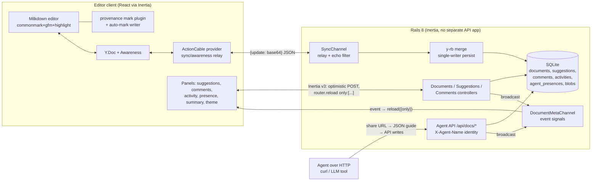
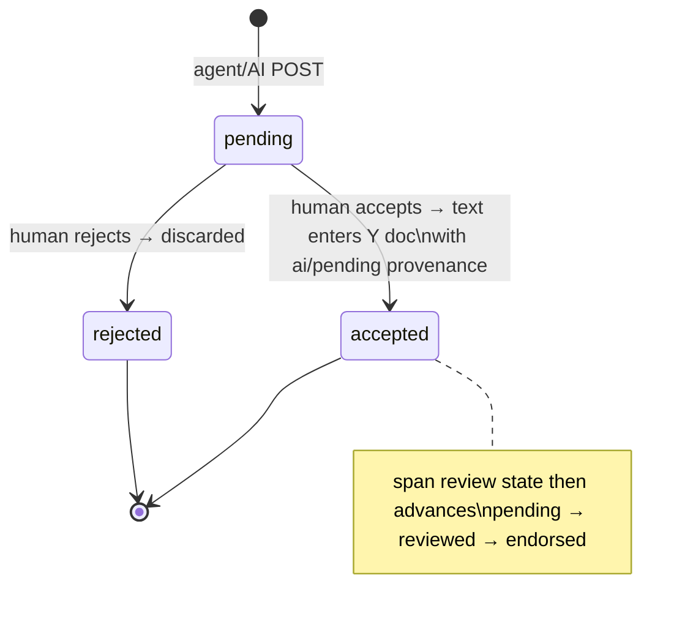

# feat: Proof Clone — Provenance-Tracking Collaborative Editor

## Summary

Build a complete Rails 8 + Inertia (React) application that clones Proof: a live-collaborative markdown editor where every text span carries authorship provenance (human vs AI), AI contributions arrive as reviewable suggestions, comments anchor to selections, documents share by slug, and agents are first-class collaborators over plain HTTP — visible in presence, attribution, and an activity feed. CRDT sync runs over Yjs + ActionCable; the editor is Milkdown bound to the Yjs doc; provenance travels as ProseMirror marks inside the CRDT so it survives sync, copy/paste, and reload.

Greenfield build in this repo. Everything below lands as one app: `bin/setup && bin/dev`.

---

## Problem Frame

The benchmark tests distributed-state correctness on a thin-training-data stack: Yjs CRDTs relayed over ActionCable (`yrb-actioncable`), Milkdown with custom marks, Inertia Rails v3 optimistic UI, and an agent-native API where agent and human actions flow through identical machinery. The hard parts, in order of risk:

1. **CRDT sync over ActionCable that actually converges** — initial-state exchange, echo filtering, reconnect healing, server persistence.
2. **Provenance as marks that survive everything** — y-prosemirror sync, markdown serialization (custom marks make Milkdown's serializer throw unless handled), reload.
3. **Agent parity** — suggestions/comments created over HTTP appear live in editors with full attribution; an agent handed only the share URL can discover how to participate.
4. **Product feel** — instant optimistic UI, calm editorial design, two coherent themes.

---

## Assumptions

Headless-mode inferred bets (no synchronous user to confirm):

- **SQLite** over Postgres — zero-setup `bin/setup`, and the `async` ActionCable adapter in dev is single-process, which is exactly the demo topology. Solid Cable stays the production default.
- **Minitest** over RSpec — Rails default, no extra setup; inertia_rails assertions auto-include in `ActionDispatch::IntegrationTest`. The task allows "your choice of framework."
- **Manual relay channel as the end state** for Yjs sync, after a documented gem spike. The `y-rb_actioncable` gem (0.1.7, Apr 2024) is by its maintainer's own testimony "a proof of concept… never used in production" with a known message-loss issue ([yrb-actioncable#71](https://github.com/y-crdt/yrb-actioncable/issues/71)), per-subscription server-side `Y::Doc` memory cost, and full-state persistence per message. We still install and exercise it first (the task asks for this), record findings in the README, and ship the ~60-line relay that reuses its wire format (`{update: base64}` JSON) and the actively-maintained `y-rb` 0.7.0 for server-side merge/persist.
- **Milkdown raw builder** (`@milkdown/kit` presets + `@milkdown/react`) over Crepe — Crepe+collab is community-supported but officially unexampled, and Crepe's CodeMirror node views under y-sync are the least-tested intersection. The raw builder keeps the schema surface fully controlled (critical for provenance marks) and the chrome minimal (a design requirement). Code highlighting via `@milkdown/plugin-highlight/shiki`.
- **Suggestions live in the database, not the Y doc, until accepted.** Accept happens client-side: the accepting editor inserts the proposed text into the Yjs doc carrying AI provenance marks. This keeps the server out of CRDT mutation entirely (y-rb authoring of ProseMirror-shaped XML is verified-possible but awkward) while satisfying "agent writes flow through the same provenance/suggestion machinery" — agents *propose*; humans *merge*; the merge applies AI attribution.
- **Document seeding is client-side with a server-issued claim.** When a doc's stored Yjs state is empty, the sync channel atomically claims seeding for exactly one client (`UPDATE … WHERE seed_state = 'pending'`), which applies the markdown template via Milkdown collab's `applyTemplate` after sync. Avoids the double-seed race the Milkdown docs warn about without server-side Y-doc authoring.
- **Server-readable document state is a client-pushed snapshot.** Editor clients debounce-push `{markdown, provenance_spans}` derived from the live doc to a snapshot endpoint. The Yjs binary (merged server-side via y-rb) is the document of record for sync; the snapshot serves the Agent API's read surface and the provenance summary. Only connected editor clients mutate the Y doc, so the snapshot can only go stale when nobody is editing — acceptable and documented.
- **Agent presence is a broadcast event, not Yjs awareness.** The server can't cheaply participate in the awareness protocol (y-rb has `Y::Awareness` but the gem-relay path doesn't track it). Agents announce presence over the API; the server broadcasts; clients render an agent chip in the presence area and a labeled pseudo-cursor decoration at the agent's anchor. Satisfies "appears as a labeled cursor at the location it's editing" without a server-side Yjs client.
- A real **Gemini call** is attempted when `GEMINI_API_KEY` is present, with a canned-passage fallback so the machinery works offline.

---

## Requirements

Traceability from the task's required capabilities:

| R-ID | Requirement | Units |
|------|-------------|-------|
| R1 | Live CRDT collaboration, two windows converge, no LWW | U3, U4, U15 |
| R2 | Provenance marks: human-typed vs AI-inserted, visible, survive reload | U5 |
| R3 | AI path: "Ask AI" inserts generated/canned passage as suggestion | U7 |
| R4 | Suggestion review: pending renders distinctly; accept merges keeping AI provenance; reject discards | U6 |
| R5 | Review states pending → reviewed → endorsed with styling shifts | U5 |
| R6 | Comments on selections, margin/panel, resolvable | U8 |
| R7 | Share by slug URL; anyone on link joins live doc | U2 |
| R8 | Live provenance summary in UI | U5 |
| R9 | Agent API: create doc, read full state, propose suggestions, comment — live, attributed, same machinery | U9 |
| R9b | Agent sharing first-class: visible shared state, one-URL-two-audiences discovery, agent identity everywhere, cold-start loop proven | U9, U10, U14 |
| R10 | Full rich markdown + code blocks with syntax highlighting + input shortcuts | U4 |
| R11 | Images: paste/drop → Active Storage direct upload → inline → syncs → survives reload | U11 |
| R12 | Presence cursors with labels incl. agents + live agent activity panel | U4, U10 |
| R13 | Theme picker: default + Whitey, instant optimistic switch, persists | U12 |
| R14 | Instant & optimistic everything; partial reloads; no blocking spinners | U6, U8, U12 (cross-cutting) |
| R15 | Inertia Rails skills audit, fixes recorded | U16 |
| R16 | Design: real product feel, minimal chrome, critique pass applied | U13 |
| R17 | Tests: provenance model + suggestion accept/reject; two-client sync check; README (setup, architecture, yrb-actioncable findings) | U15, U16 |

---

## Key Technical Decisions

All grounded in 2026-06-05 research verified against source/registries (see Sources).

1. **Stack pins**: Rails 8.1.3, Ruby 3.4.2, SQLite, `inertia_rails` 3.21.1 + `@inertiajs/react` 3.3.1 (Inertia v3, React 19), `vite_rails`, Tailwind v4 via `@tailwindcss/vite`. Installer: `bin/rails generate inertia:install --framework=react --typescript --tailwind --vite --no-interactive`. Inertia v3 matters: built-in `router.optimistic()` with automatic rollback on error is exactly R14's contract.

2. **Yjs sync = gem spike → manual relay + y-rb persistence.** `y-rb` 0.7.0 (Jan 2026, precompiled arm64-darwin) provides blind merge: `ydoc.sync(update)` / `ydoc.full_diff` — the server merges binary updates without understanding document structure. Channel design (mirrors the gem's wire format so the spike swap is cheap):
   - `subscribed`: build server `Y::Doc` from stored blob, `transmit` `{type: "sync", update: b64(full_diff), sv: b64(state_vector)}`.
   - Client on sync: `Y.applyUpdate(doc, update, provider)`, reply `{type: "sync-reply", update: b64(encodeStateAsUpdate(doc, serverSV))}` (= sync step 2), set synced.
   - `receive`: broadcast to all (tagged with `connection_identifier` for echo filtering); merge `update`/`sync-reply` payloads into the stored blob via a debounced single-writer (per-document lock).
   - `awareness` message type: relay-only, never persisted; client y-protocols handles 30s expiry.
   - Pitfalls handled by design: handshake runs inside `connected()` (reconnect healing for free); always pass `origin` to `applyUpdate` and filter in `doc.on('update')`; `transmit` in `subscribed` is delivered post-confirmation so ordering is safe.

3. **Milkdown 7.21.2, everything pinned lockstep** (version mismatch = duplicate `@milkdown/ctx` = the #1 reported failure). `@milkdown/kit` umbrella + separate `@milkdown/plugin-collab` and `@milkdown/plugin-highlight` at the exact same version. Collab service: `bindDoc(doc)` (fragment name hardcoded `'prosemirror'` — server-side y-rb reads must match), `setAwareness`, `applyTemplate(markdown)` only after provider sync and only on the claim-holding client, then `connect()`.

4. **Provenance = one custom mark type** `provenance` with attrs `{kind: 'human'|'ai', author: string, state: 'verbatim'|'pending'|'reviewed'|'endorsed'}` (humans get `verbatim`; AI spans walk pending→reviewed→endorsed). y-prosemirror stores marks as formatting attributes keyed by type name — one provenance mark per char span, attrs must stay plain JSON. Same-type marks replace each other, which makes review-state advancement a simple re-apply. Components:
   - `$markAttr` + `$markSchema` with `toDOM` emitting `data-kind`/`data-author`/`data-state` + classes for CSS tinting.
   - `$prose` appendTransaction plugin auto-marking newly inserted text as `{kind: 'human', author: currentUser, state: 'verbatim'}` — **must skip transactions with `ySyncPluginKey` meta** or remote text gets re-attributed and update loops occur. AI-inserted text gets marks applied explicitly at insertion, so `isInSet` leaves it alone.
   - `toMarkdown` via `withMark(mark, 'provenance', …)` + a `$remark` stringify handler emitting `<span data-provenance …>` HTML (without this, `getMarkdown()` **throws** on the first provenance-marked char — wire serialization before any listener).
   - Round-trip import (markdown → marks) via a remark transformer matching the span pairs — needed so seeded/API-created docs preserve provenance spans.
   - Provenance summary: walk the PM doc client-side (char counts per kind/state), render live; same numbers serialize into the snapshot for the API.

5. **Suggestions/comments/activity/presence are Rails models + ActionCable broadcast + Inertia partial reload.** A second channel (`DocumentMetaChannel`) broadcasts `{event: 'suggestions'|'comments'|'activity'|'presence'}`; a client hook debounce-calls `router.reload({only: [event]})`. Mutations from the UI use Inertia v3 optimistic chains (`router.optimistic(cb).post(...)` with `only:` reloads). This is the canonical "cable signals, controller stays source of truth" pattern.

6. **Agent API under `/api/docs`** (JSON, no auth — share-link trust model, identity via `X-Agent-Name` header):
   - `POST /api/docs` `{title, markdown}` → `{slug, urls}`
   - `GET /api/docs/:slug` → full state: markdown, provenance spans, pending suggestions, comments, presence, activity
   - `POST /api/docs/:slug/suggestions` `{anchor_text?, replaces?, body, intent}` → pending suggestion, broadcast live
   - `POST /api/docs/:slug/comments` `{anchor_text, body}` → comment, broadcast live
   - `POST /api/docs/:slug/presence` `{status: 'active'|'done', location?}` → presence chip + pseudo-cursor
   - `GET /api/docs/:slug/events/pending` + `POST …/events/ack` (bonus) → agent reacts to human activity
   - Every write requires `X-Agent-Name`, creates an `Activity` row, and broadcasts. Identity flows into suggestion attribution, provenance marks on accept, presence labels, activity entries.
   - **Discovery**: the share URL (`/d/:slug`) content-negotiates — browsers get the Inertia editor; `Accept: application/json`, `?format=json`, or non-browser user agents get a self-describing JSON guide (endpoints, how to announce presence, how to propose). The HTML page also embeds the same guidance in a visually-hidden `<script type="text/llms.txt">` block so a cold text fetch surfaces it.

7. **Images**: Active Storage (SQLite service: Disk) + `@rails/activestorage` `DirectUpload` + `@milkdown/kit/plugin/upload` custom uploader (paste/drop) and image node insertion with the blob redirect URL. The URL is plain text in the Y doc, so it syncs and survives reload like everything else.

8. **Themes as CSS custom properties** on `[data-theme]`: `proof` (default: warm paper, editorial serif body) and `whitey` (Typora Whitey homage: clean white, minimal chrome, generous margins, quiet type). All provenance tints, code-block themes, and chrome derive from the variables so switching restyles coherently. Persist in `localStorage` + cookie (cookie lets the server render the right theme on first paint — no flash).

9. **Two-client sync check = Node script** (`script/sync_check.mjs`): two `@rails/actioncable` consumers + two Y.Docs against a running server; client A inserts, client B asserts convergence, then both edit concurrently and assert identical state vectors. More deterministic headless than a two-session Capybara test; documented in README.

---

## High-Level Technical Design



Data flow for the core loop:
- **Typing**: Milkdown → Y.Doc update → provider → SyncChannel broadcast (all clients) + debounced y-rb merge → SQLite blob. Auto-mark plugin attributes the span to the typist.
- **Snapshot**: editor debounces (~1s idle) `POST /docs/:slug/snapshot` with `{markdown, spans}` → serves API reads + summary.
- **Agent suggestion**: `POST /api/docs/:slug/suggestions` → row + Activity + broadcast → every client's suggestion panel reloads (`only: ['suggestions']`) and an anchor decoration appears → human clicks Accept → optimistic UI + client inserts text into Y.Doc with `{kind: 'ai', author: agentName, state: 'pending'}` marks → syncs to everyone → suggestion marked accepted.
- **Review advance**: human selects an AI span → popover advances state → client re-applies mark with new `state` attr → syncs; summary updates.

### Suggestion lifecycle



---

## Output Structure

```
.
├── bin/{setup,dev}                      # standard Rails + overmind/foreman fallback
├── Procfile.dev                         # vite + rails s
├── app/
│   ├── channels/{sync_channel,document_meta_channel}.rb
│   ├── controllers/
│   │   ├── documents_controller.rb      # Inertia: show (slug), create, snapshot
│   │   ├── suggestions_controller.rb    # accept/reject (UI path)
│   │   ├── comments_controller.rb
│   │   └── api/{docs,suggestions,comments,presences,events}_controller.rb
│   ├── models/{document,suggestion,comment,activity,agent_presence}.rb
│   ├── services/{yjs_persistence,gemini_suggester,agent_guide}.rb
│   └── frontend/
│       ├── entrypoints/{inertia.tsx,application.css}
│       ├── pages/documents/show.tsx     # the editor page
│       ├── editor/                      # milkdown setup, provenance plugin,
│       │   ...                          # actioncable provider, upload, seeding
│       ├── components/                  # panels, presence, summary, theme picker
│       └── themes/{proof.css,whitey.css}
├── script/sync_check.mjs                # two-client convergence proof
├── db/{migrate/*,seeds.rb}              # demo doc with mixed provenance
└── test/{models,integration,services}/*
```

---

## Implementation Units

### U1. Rails + Inertia + Vite scaffold

**Goal:** Running Rails 8 app with Inertia v3 (React 19 + TS), Tailwind v4, Vite, `bin/setup`/`bin/dev` working.
**Requirements:** foundation for all.
**Dependencies:** none.
**Files:** `Gemfile`, `config/*`, `bin/setup`, `bin/dev`, `Procfile.dev`, `vite.config.ts`, `app/frontend/entrypoints/*`, `app/controllers/inertia_controller.rb`, `package.json`.
**Approach:** `rails new . --skip-js` (SQLite default) → `bundle add inertia_rails` → `bin/rails generate inertia:install --framework=react --typescript --tailwind --vite --no-interactive`. Verify the generated initializer carries the v3 flags (`use_script_element_for_initial_page` etc.). Pin `@inertiajs/react` ≥3.3. Dev cable adapter `async`; mount `/cable`. Remove example page after smoke check.
**Test scenarios:** Test expectation: none — scaffolding; verified by U15's request tests booting the stack.
**Verification:** `bin/setup` from clean clone succeeds; `bin/dev` serves an Inertia page with HMR.

### U2. Document model, slugs, seeds, editor page shell

**Goal:** Documents persist; `/d/:slug` renders the editor page via Inertia; "New doc" flow; demo doc seeded.
**Requirements:** R7.
**Dependencies:** U1.
**Files:** `db/migrate/*_create_documents.rb`, `app/models/document.rb`, `app/controllers/documents_controller.rb`, `config/routes.rb`, `app/frontend/pages/documents/show.tsx`, `db/seeds.rb`, `test/models/document_test.rb`.
**Approach:** `documents(title, slug [unique, URL-safe random], yjs_state binary, content_markdown text, provenance_spans json, seed_markdown text, seed_state string default 'pending', theme string)`. `show` renders Inertia props `{document, suggestions, comments, activities, presences}` with lambdas for partial-reload granularity. `create` (one click from header or `POST /docs`) → redirect to slug. Seed: a demo doc whose `seed_markdown` showcases headings, lists, blockquote, code block, and pre-attributed AI spans (via provenance HTML spans round-tripped on seed).
**Test scenarios:** slug generated and unique; slug immutable across update; lookup by slug 404s cleanly on miss; seeds create the demo doc idempotently.
**Verification:** open `/d/<seed-slug>` → editor shell renders with title.

### U3. Yjs sync channel: gem spike, manual relay, y-rb persistence

**Goal:** Two clients on one slug converge in real time; doc state survives server restart.
**Requirements:** R1; persistence requirement.
**Dependencies:** U2.
**Files:** `app/channels/sync_channel.rb`, `app/services/yjs_persistence.rb`, `app/frontend/editor/cable_provider.ts`, `app/controllers/documents_controller.rb` (snapshot action), `Gemfile` (`y-rb`; `y-rb_actioncable` during spike), `test/services/yjs_persistence_test.rb`, `test/channels/sync_channel_test.rb`.
**Approach:** Timeboxed spike (≤45 min): install `y-rb_actioncable` 0.1.7 + `@y-rb/actioncable` 0.3.0, stand up its `Sync` channel, note behavior on Rails 8.1 — findings go in README regardless of outcome. Then implement the manual relay per KTD 2 (same wire format). `YjsPersistence.merge(document, b64_update)` uses y-rb `sync`/`full_diff` with `with_lock` + debounce (skip merge if last persist <500ms ago, always merge on `unsubscribed`). Snapshot action stores client-pushed `{markdown, spans}`. Keep `@y-rb/actioncable` only if the spike succeeds outright; otherwise a ~100-line provider wrapping `createConsumer` (handshake in `connected()`, echo filter by client id, origin-tagged `applyUpdate`).
**Execution note:** spike first, decide, document — the README's yrb-actioncable findings section is a deliverable, not an afterthought.
**Test scenarios:** merging two independent updates from different Y docs yields a state containing both edits (y-rb round-trip in a service test); persistence: merge → reload record → full_diff reproduces content; concurrent merge calls serialize via lock without losing either update; channel test: subscribe transmits sync message with state vector; receive broadcasts to stream and filters nothing server-side.
**Verification:** `script/sync_check.mjs` precursor — two consumers converge (full check lands in U15); restart server, reload page, content intact.

### U4. Milkdown editor bound to the CRDT

**Goal:** Full markdown editing (R10) live-synced through the provider, presence cursors for humans, seeding via claim.
**Requirements:** R1, R10, R12 (human half).
**Dependencies:** U3.
**Files:** `app/frontend/editor/{milkdown.tsx,use_collab.ts,seeding.ts,cursors.css}`, `app/frontend/pages/documents/show.tsx`.
**Approach:** Raw builder via `useEditor`: `@milkdown/kit` core + commonmark + gfm + listener + history + clipboard + indent + trailing + `@milkdown/plugin-collab` + `@milkdown/plugin-highlight` (shiki parser, themes follow the app theme). All `@milkdown/*` pinned to one exact version; CI-check via `npm ls @milkdown/ctx`. Y.Doc/Awareness/provider created **outside** the editor factory (StrictMode-safe), wired in an effect after `loading === false`; cleanup disconnects collab + destroys provider/awareness. Seeding: channel transmits `seed: true` to the claim winner; that client `applyTemplate(seedMarkdown)` post-sync then `connect()`; others just `connect()`. Awareness local state `{user: {name: funAnonName(), color}}`; cursor CSS for `.ProseMirror-yjs-cursor`/`selection` (Milkdown ships none). Markdown input shortcuts come free with the presets (`##`, `**`, backticks); verify code fence + syntax highlight.
**Test scenarios:** Test expectation: none in Ruby — covered by the U15 sync script (typed markdown constructs survive a round trip between two clients) and browser verification.
**Verification:** two windows: typing, headings via `##`, bold via `**`, lists, blockquote, fenced code with highlighting — all mirror live in both; cursors labeled; reload preserves content.

### U5. Provenance marks, review states, live summary

**Goal:** Every span attributed; AI spans tinted by review state; summary stats live; all of it survives sync + reload + copy/paste.
**Requirements:** R2, R5, R8.
**Dependencies:** U4.
**Files:** `app/frontend/editor/provenance/{mark.ts,writer.ts,remark.ts,review_popover.tsx,summary.ts}`, `app/frontend/components/provenance_summary.tsx`, styling in theme CSS.
**Approach:** Per KTD 4. Mark attrs `{kind, author, state}`; `inclusive: true`. Writer plugin: appendTransaction over changed ranges, skip `ySyncPluginKey` transactions, skip text already carrying the mark. Remark stringify handler emits `<span data-provenance …>`; remark transformer parses those spans back to marks (powers seeded docs with pre-attributed AI content). Review popover: clicking/selecting inside an AI span shows current state + advance action; advancing re-applies the mark with the next state across the span's contiguous range (optimistic — it's a local PM transaction that syncs via Yjs; also logs Activity via fetch). Summary component subscribes to the editor listener: walk doc, count chars by kind/state, render "62% human · 38% AI · 12% unreviewed"; debounce-push into the snapshot payload.
**Test scenarios:** (service-level, U15 carries the Ruby side) snapshot ingestion: spans JSON persisted and served back; summary math: given spans fixture, percentages computed correctly server-side for API state. Client behaviors verified via sync script assertions on serialized markdown containing provenance spans after a two-client session, plus browser checks: typed text gets human attribution; reload shows identical tints; copy/paste within doc keeps marks.
**Verification:** type → no tint (human/verbatim); seeded AI span shows pending tint; advance to reviewed → tint softens; endorse → tint clears to a subtle underline; summary updates as you type.

### U6. Suggestions: model, panel, accept/reject

**Goal:** Pending suggestions render distinctly (panel cards + inline anchor decoration); accept merges text with AI provenance; reject discards. Optimistic everywhere.
**Requirements:** R4, R14.
**Dependencies:** U5.
**Files:** `db/migrate/*_create_suggestions.rb`, `app/models/suggestion.rb`, `app/controllers/suggestions_controller.rb`, `app/channels/document_meta_channel.rb`, `app/frontend/components/suggestions_panel.tsx`, `app/frontend/editor/suggestion_decorations.ts`, `app/frontend/lib/use_meta_channel.ts`, `test/models/suggestion_test.rb`, `test/integration/suggestion_flow_test.rb`.
**Approach:** `suggestions(document_id, author_name, author_kind ['agent','ai'], intent, body text [markdown], anchor_text, replaces text nullable, status ['pending','accepted','rejected'], resolved_by, created_at)`. Panel lists pending (slide-in on arrival); each card shows author, intent, proposed text, Accept/Reject. Anchor decoration: locate `anchor_text` in doc (plain-text search via PM `doc.textBetween` scan), underline the range. Accept: `router.optimistic` marks card accepted instantly → client inserts `body` at anchor (after `anchor_text`, or replacing `replaces` range) as parsed markdown with `{kind:'ai', author, state:'pending'}` marks forced on inserted text → `PATCH /suggestions/:id/accept`. Reject: optimistic discard → `PATCH …/reject`. `use_meta_channel` hook: subscribe per-doc, debounce `router.reload({only: [event]})`. Activity row on every transition.
**Test scenarios:** model: status transitions valid (pending→accepted, pending→rejected; accepted→rejected refused); request: accept marks accepted + creates activity + broadcasts (assert via `assert_broadcasts` on the meta stream); reject path same; accepting an already-rejected suggestion 422s; suggestions list excludes non-pending in default scope; markdown body preserved verbatim.
**Verification:** two windows: suggestion created in one appears in the other <1s; accept in window A → text lands in both with AI tint; card transitions smoothly.

### U7. The AI path: Ask AI

**Goal:** Human triggers AI; a generated (Gemini) or canned passage arrives as a pending suggestion through the same machinery.
**Requirements:** R3.
**Dependencies:** U6.
**Files:** `app/services/gemini_suggester.rb`, `app/controllers/ai_suggestions_controller.rb`, `app/frontend/components/ask_ai.tsx`, `test/services/gemini_suggester_test.rb`.
**Approach:** "Ask AI" affordance in the editor (selection toolbar + panel button): optional instruction + selected context → `POST /docs/:slug/ai_suggestions`. `GeminiSuggester` calls `generativelanguage.googleapis.com` (model `gemini-2.0-flash` family, `ENV["GEMINI_API_KEY"]`, Net::HTTP, short timeout) and falls back to canned passages on missing key/error — never blocks the product on the LLM. Result becomes a `Suggestion(author_kind: 'ai', author_name: 'Gemini')` → broadcast → same accept/reject flow. Request is fired async from the UI (button shows subtle working state; the suggestion arrives via the live channel — no blocking spinner).
**Test scenarios:** no API key → canned passage suggestion created; API error/timeout → canned fallback, no exception; with stubbed HTTP success → suggestion body matches response text; created suggestion is pending + ai-attributed + activity logged.
**Verification:** click Ask AI in one window → suggestion card slides into both windows, AI-attributed.

### U8. Comments

**Goal:** Select text → comment → margin panel → resolve. Live + optimistic.
**Requirements:** R6, R14.
**Dependencies:** U4 (editor selection), U6 (meta channel exists).
**Files:** `db/migrate/*_create_comments.rb`, `app/models/comment.rb`, `app/controllers/comments_controller.rb`, `app/frontend/components/comments_panel.tsx`, `app/frontend/editor/comment_decorations.ts`, `test/models/comment_test.rb`, `test/integration/comment_flow_test.rb`.
**Approach:** `comments(document_id, author_name, author_kind ['human','agent'], body, anchor_text, resolved_at, created_at)`. Selection bubble → "Comment" → inline composer in panel; `router.optimistic` appends to the comments prop instantly, POST reconciles. Anchor decoration highlights `anchor_text` occurrences; clicking a comment scrolls/flashes its anchor. Resolve: optimistic strikethrough/collapse → PATCH; resolved comments collapse into a toggle-able section. Broadcast via meta channel.
**Test scenarios:** create requires body + anchor_text; resolve sets resolved_at + activity + broadcast; unresolve not supported (resolved stays) — or explicitly allowed, pick and test; comments serialize author_kind for agent comments; index scopes open vs resolved.
**Verification:** comment in window A appears in B live; resolve animates and persists across reload.

### U9. Agent API + discovery + identity

**Goal:** Everything an agent needs over plain HTTP, same machinery as the UI, discoverable from the share URL alone.
**Requirements:** R9, R9b (identity + one-URL-two-audiences).
**Dependencies:** U6, U8 (suggestion/comment machinery), U2.
**Files:** `app/controllers/api/{docs,suggestions,comments,presences,events}_controller.rb`, `app/services/agent_guide.rb`, `db/migrate/*_create_{activities,agent_presences}.rb`, `app/models/{activity,agent_presence}.rb`, `config/routes.rb`, `test/integration/agent_api_test.rb`, `test/integration/agent_discovery_test.rb`.
**Approach:** Per KTD 6. `Api::BaseController`: require `X-Agent-Name` on writes (422 with a helpful JSON error that *teaches* the header), expose `current_agent`. Doc create: `{title, markdown}` → document with `seed_markdown`, returns slug + share URL + endpoint map. State read: snapshot markdown + spans, pending suggestions, open comments, presences, recent activity — and when the Yjs state is still empty, fall back to `seed_markdown`. Suggestion/comment create reuse the same model paths as the UI controllers (no side channel). Presence: upsert `agent_presences(document_id, agent_name, status, location_text, last_seen_at)`, broadcast; reaped after 90s inactivity (touched by every API call from that agent). Events (bonus): `activities` since last ack, filtered to human actions, `POST ack` advances a cursor per agent. Discovery: `DocumentsController#show` content-negotiates (JSON/text/UA sniff → `AgentGuide.render(document)`); HTML embeds the guide in a hidden block; guide includes literal curl examples bound to the doc's actual slug.
**Test scenarios:** create doc returns slug + urls, doc appears at `/d/:slug`; state read includes seeded markdown before first editor session; write without `X-Agent-Name` → 422 with instructive body; suggestion via API lands pending + agent-attributed + activity + broadcast assertions; comment via API same; presence announce upserts and re-announce updates `last_seen_at`; share URL with `Accept: application/json` returns guide JSON containing state/suggest/comment/presence endpoints; share URL via curl (text UA) surfaces guidance; browser UA gets HTML.
**Verification:** the U14 cold-start loop.

### U10. Agent visibility: presence chips, pseudo-cursor, activity panel, shared badge

**Goal:** A human glancing at the editor never wonders whether an agent is in the doc.
**Requirements:** R12 (agent half), R9b (visible shared state).
**Dependencies:** U9.
**Files:** `app/frontend/components/{presence_bar.tsx,activity_panel.tsx,agents_badge.tsx}`, `app/frontend/editor/agent_cursor.ts`.
**Approach:** Presence bar merges Yjs awareness states (humans) + `presences` prop (agents, live via meta channel) — agents get a distinct chip treatment (e.g., dotted ring + bot glyph). Header badge: "Shared with agents · N active" whenever any agent presence is live (or the doc has agent activity, shown muted). Agent pseudo-cursor: decoration widget at the agent's `location_text` anchor (or its latest suggestion/comment anchor), labeled with the agent name in its color — visually parallel to human cursors. Activity panel: reverse-chron feed ("Researcher suggested an edit · 12:04", "Gemini commented…"), timestamps, live via meta channel, grouped by agent.
**Test scenarios:** Test expectation: none beyond U9's broadcast/request coverage — these are presentational; verified in browser + U14.
**Verification:** run an API session: chip appears, cursor shows at anchor, feed logs each action live, badge counts active agents.

### U11. Images via Active Storage direct upload

**Goal:** Paste/drop image → direct upload → inline render → syncs → survives reload.
**Requirements:** R11.
**Dependencies:** U4.
**Files:** `config/storage.yml` (+ Active Storage install migration), `app/frontend/editor/upload.ts`, `package.json` (`@rails/activestorage`), `test/integration/direct_upload_test.rb`.
**Approach:** Per KTD 7: `uploadConfig` uploader filters `image/*`, runs `DirectUpload` against `/rails/active_storage/direct_uploads`, returns image nodes with `blobs/redirect/:signed_id` URLs; placeholder widget while uploading (local-only decoration — correct behavior). `enableHtmlFileUploader` for pasted HTML images.
**Test scenarios:** direct upload endpoint issues blob + signed upload instructions (request test); blob redirect URL serves the file after upload (integration with fixture file).
**Verification:** paste a screenshot in window A → renders inline both windows; reload → image still there.

### U12. Theme picker: default + Whitey

**Goal:** Instant, optimistic, persistent theme switching that restyles everything coherently.
**Requirements:** R13, R14.
**Dependencies:** U5 (provenance tints exist to be themed).
**Files:** `app/frontend/themes/{proof.css,whitey.css,tokens.css}`, `app/frontend/components/theme_picker.tsx`, layout cookie read in `app/views/layouts/application.html.erb`.
**Approach:** Per KTD 8. Tokens: surface, ink, accent, provenance-pending/reviewed/endorsed tints, code-block palette, margins/measure. Whitey per the Typora reference: pure white, near-black quiet type, generous measure, minimal borders. Picker in header (tiny, recedes): optimistic `data-theme` swap on `<html>` + localStorage + cookie write; shiki highlight theme follows via CSS-variable-based theme or dual-theme classes.
**Test scenarios:** Test expectation: none — presentational; cookie persistence sanity-checked in a request test asserting the layout renders the persisted theme attribute.
**Verification:** switch themes → instant restyle incl. provenance tints + code blocks; reload + new tab keep the choice.

### U13. Design critique pass

**Goal:** Every surface critiqued and improved: editor chrome, suggestion cards, comments panel, activity feed, theme picker, share flow, empty states; micro-interactions smoothed.
**Requirements:** R16.
**Dependencies:** U6, U8, U10, U12 (surfaces exist).
**Files:** frontend components + theme CSS (touch-ups), `README.md` (critique notes).
**Approach:** Use the `interface-craft` critique methodology (available in this environment) per surface: hierarchy, spacing, alignment, states (hover/focus/loading/empty/error), motion. Sweep checklist: header minimalism (title, share, theme, presence — nothing else), suggestion slide-in/accept transitions, comment open/resolve motion, empty states for panels (calm, instructive), focus rings, reduced-motion respect. Record what changed in README.
**Test scenarios:** Test expectation: none — design pass.
**Verification:** critique notes in README enumerate findings → changes.

### U14. Agent cold-start loop: run it for real

**Goal:** Prove an agent handed nothing but the share link finds its way in; refine until it works without special knowledge.
**Requirements:** R9 curl walkthrough, R9b iterate-until-real.
**Dependencies:** U9, U10.
**Files:** `README.md` (walkthrough), fixes wherever the loop snags.
**Approach:** Against the running app: (1) curl the share URL cold (no headers) → confirm guidance surfaces; (2) follow it: announce presence, read state, propose a suggestion, leave a comment — `X-Agent-Name: Scout`; (3) verify in the browser: presence chip, pseudo-cursor, live suggestion card, activity entries, badge; (4) accept the suggestion in the UI and confirm agent-attributed provenance; (5) fix every snag (unclear instructions, missing endpoint hint, dead link) and re-run from (1). Capture the final transcript as the README walkthrough (doc create → suggest → live accept).
**Test scenarios:** codified subset in `test/integration/agent_discovery_test.rb` (U9) — the full loop is manual + documented.
**Verification:** the README walkthrough commands work verbatim against `bin/dev`.

### U15. Test suite + two-client sync check

**Goal:** The verification deliverables: provenance/suggestion tests green; convergence proven.
**Requirements:** R17, R1.
**Dependencies:** U3–U9.
**Files:** `script/sync_check.mjs`, `test/**` (gaps from earlier units), `README.md` (sync-check capture).
**Approach:** Consolidate: ensure model tests (document, suggestion, comment), service tests (yjs_persistence, gemini_suggester), integration tests (suggestion flow, comment flow, agent API, discovery, snapshot) all pass via `bin/rails test`. Sync check per KTD 9: boots two cable consumers, asserts (a) edit propagation A→B, (b) concurrent edits converge to identical `Y.encodeStateVector`, (c) provenance attrs present on synced text. Run it, paste the output summary into README.
**Test scenarios:** the suite itself; sync script asserts the three convergence properties above and exits non-zero on failure.
**Verification:** `bin/rails test` green; `node script/sync_check.mjs` prints convergence proof.

### U16. Inertia skills audit + README

**Goal:** Audit against `inertia-rails-skills`, fix findings, finish the README.
**Requirements:** R15, R17 (README).
**Dependencies:** all prior.
**Files:** `.claude/skills/` (installed skills), audited app code, `README.md`, `docs/REVIEW-NOTES.md` (if findings are long).
**Approach:** `npx skills add cole-robertson/inertia-rails-skills` (installs into `.claude/skills/`); audit against `inertia-rails-best-practices`, `-forms`, `-performance`, `-testing` (note: repo predates Inertia v3 — where a rule conflicts with v3 idioms, prefer v3 and record the conflict). Fix what's real; record findings + changes. README final shape: setup (`bin/setup`/`bin/dev`), architecture (a few paragraphs: CRDT relay, provenance marks, suggestion machinery, agent surface), yrb-actioncable findings (from U3 spike), curl walkthrough (U14), sync-check capture (U15), critique notes (U13), audit findings.
**Test scenarios:** Test expectation: none — documentation/audit unit; fixes it produces must keep `bin/rails test` green.
**Verification:** README complete; audit findings recorded; suite green.

---

## Scope Boundaries

**In scope:** everything under Requirements above, plus bonus items that fall out of the architecture cheaply: agent event polling + ack (U9), presence cursors for humans and agents (U4/U10).

### Deferred to Follow-Up Work
- Markdown export with annotated provenance spans as a dedicated export UI (the serializer already emits provenance HTML spans — export button deferred).
- Per-paragraph endorse-whole-block affordance.
- Authorship-colored blame view toggle.
- Auth/users — share-link trust model is the product (matches Proof's slug-link sharing); no accounts.
- Production cable adapter tuning (Redis/AnyCable), horizontal scaling, awareness server-side tracking.

### Outside this product's identity
- Document organization (folders, search, listing beyond create+share).
- Offline-first persistence (IndexedDB) — Yjs makes it possible; not asked.

---

## Risks & Mitigations

| Risk | Likelihood | Mitigation |
|------|-----------|------------|
| Milkdown collab + custom mark interaction surprises (e.g., marks lost across `applyTemplate`) | Medium | U4/U5 ordered before all feature UI; remark round-trip tested early via seeded doc; fallback documented path to Tiptap exists but research says unneeded |
| ActionCable message drops under load (gem issue #71 root cause applies to any relay) | Medium | Handshake re-runs on every reconnect; periodic re-sync on `visibilitychange`; per-keystroke payloads are tiny |
| `getMarkdown()` throws once provenance marks exist, breaking snapshots | High if mis-ordered | Wire `toMarkdown` + remark handler in the same unit as the mark schema (U5), before any listener consumes markdown |
| Seeding race (two simultaneous first visitors) | Low | DB atomic claim picks exactly one seeder; `applyTemplate` default empty-check is the second guard |
| Anchor-text matching fails after doc edits (suggestion/comment anchors drift) | Medium | Accept/decorate by first-occurrence search; on miss, card stays in panel marked "anchor moved" and accept appends at end with a notice — degraded but never lost |
| React StrictMode double-mount duplicating subscriptions | High if naive | Provider/Y.Doc created outside editor factory; effect cleanup destroys provider + disconnects collab |
| Gemini API unavailable in CI/offline | High | Canned fallback is the tested default path; real call is opportunistic |
| Inertia v3 being new — skills repo rules may conflict | Medium | U16 explicitly prefers v3 idioms and records conflicts |

---

## Verification Strategy

- **Unit/integration (Ruby, Minitest)**: provenance snapshot ingestion + summary math, suggestion accept/reject transitions, comment lifecycle, Yjs merge/persistence round-trips, agent API contract incl. discovery negotiation, broadcasts (`assert_broadcasts`).
- **Two-client convergence**: `script/sync_check.mjs` (KTD 9) — run and captured in README.
- **Cold-start agent loop**: executed for real against the dev server (U14), transcript in README.
- **Browser passes**: two-window collaboration, provenance tints, accept flow, comments, images, themes — performed during U13/U15; key flows also exercised by the pipeline's browser-test phase.

---

## Sources & Research

- yrb-actioncable: versions/API/issues verified from source + RubyGems/npm 2026-06-05; maintainer PoC statement in [issue #71](https://github.com/y-crdt/yrb-actioncable/issues/71); awareness TODO [#97](https://github.com/y-crdt/yrb-actioncable/issues/97). y-rb 0.7.0 API (`sync`, `diff`, `full_diff`, `state`, XML types) verified from source.
- Milkdown 7.21.2: collab service semantics, `$markSchema`/`$prose`/`$remark` patterns, y-prosemirror mark→formatting-attribute mapping ([sync-utils.js](https://github.com/yjs/y-prosemirror/blob/master/src/sync-utils.js)), serializer throw-on-unknown-mark, upload plugin, [version-mismatch issue #2295](https://github.com/Milkdown/milkdown/issues/2295), [maintainer architecture guidance #1993](https://github.com/orgs/Milkdown/discussions/1993).
- Inertia: v3 (March 2026) optimistic API, installer flags, testing helpers, `inertia_cable` pattern — verified against [inertia-rails.dev](https://inertia-rails.dev/) and generator source. Skills repo: [cole-robertson/inertia-rails-skills](https://github.com/cole-robertson/inertia-rails-skills), installed via `npx skills add`.
- Typora Whitey theme reference: https://theme.typora.io/theme/Whitey/
