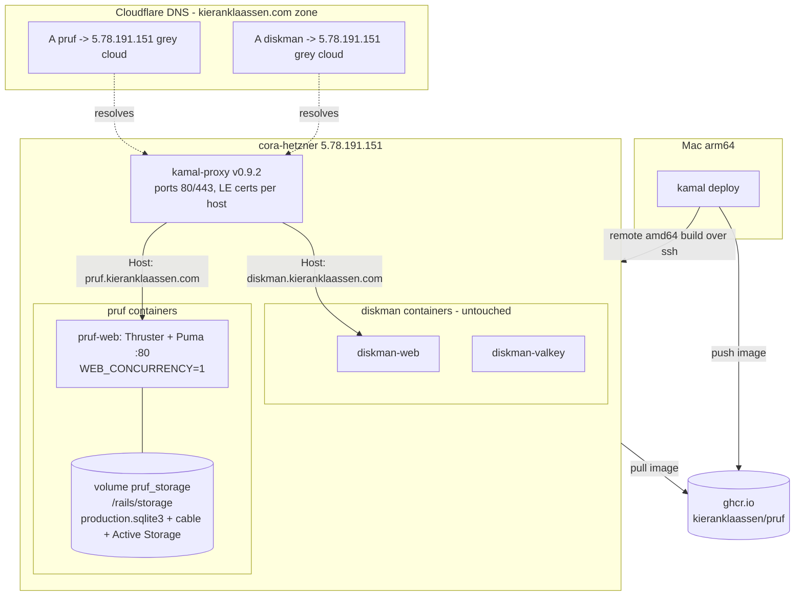
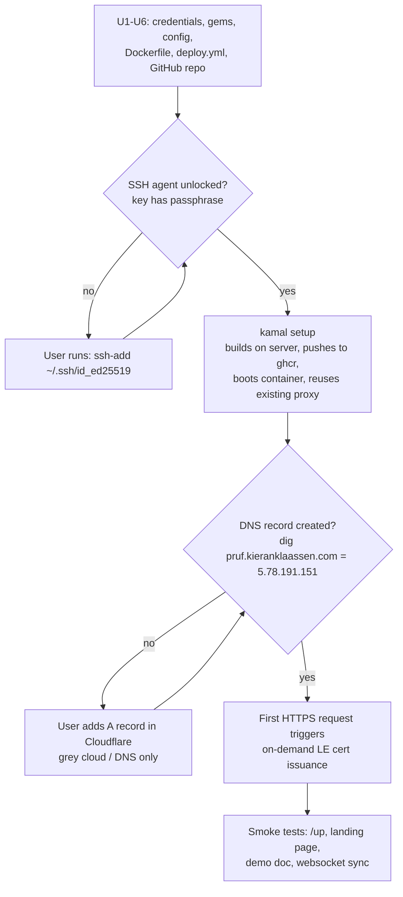

# feat: Deploy Pruf with Kamal 2 to cora-hetzner

## Summary

Deploy Pruf (the Proof-clone collaborative editor) to the existing Hetzner box `cora-hetzner` using Kamal 2, mirroring the working `~/diskman` setup: ghcr.io registry, remote amd64 builder on the server itself, kamal-proxy SSL via Let's Encrypt, SQLite on a persistent volume, served at `https://pruf.kieranklaassen.com`. DNS lives in Cloudflare and is added manually (no Cloudflare API credentials exist on this machine — exact record values are specified in U7).

---

## Problem Frame

Pruf currently runs only in development. The repo has a stock Rails 8 Dockerfile that cannot build Vite assets (no Node), a production database config that is commented out, a cable adapter (`redis`) whose gem is not installed, and a missing `config/master.key`. None of the Kamal scaffolding exists yet (`config/deploy.yml`, `.kamal/`), and the repo has no git remote. The reference deployment (`~/diskman`, same owner, same server, same SQLite-on-one-box topology, Kamal 2.11.0) is healthy and provides the proven pattern to mirror.

---

## Requirements

**Deployment**

- R1. Pruf deploys to `cora-hetzner` via `kamal setup` / `kamal deploy` from the repo, mirroring the diskman configuration (ghcr.io registry, remote amd64 builder, kamal-proxy, persistent storage volume).
- R2. The app is served at `https://pruf.kieranklaassen.com` with a valid Let's Encrypt certificate issued by kamal-proxy.
- R3. The existing diskman app on the same host is undisturbed (shared kamal-proxy is reused, never rebooted by this work).

**Application correctness in production**

- R4. Realtime collaboration (ActionCable: Yjs sync, presence, Inertia partial-reload broadcasts) works in production.
- R5. SQLite databases and Active Storage files persist across deploys (named Docker volume mounted at `/rails/storage`).
- R6. AI suggestions work in production (`GEMINI_API_KEY` injected as a Kamal secret; the app's canned-suggestion fallback remains if the key is absent).

**Infrastructure handoff**

- R7. The Cloudflare DNS record is documented with exact values for manual creation (name, type, IP, proxy mode), and deployment verification confirms DNS resolves before declaring success.
- R8. The repo gains a GitHub remote (`kieranklaassen/pruf`, private) so image naming, the registry token flow (`gh auth token`), and PR workflows function.

---

## Key Technical Decisions

- **Mirror diskman, simplify where Pruf needs less.** Diskman's `config/deploy.yml` is the schema-current reference (Kamal 2.11.0). Pruf drops what it doesn't have: no Solid Queue (`SOLID_QUEUE_IN_PUMA`), no Valkey accessory, no `llm_jobs` role — Pruf has zero background jobs; Gemini calls are synchronous in-request.
- **Solid Cable over Redis for ActionCable.** `config/cable.yml` production currently says `adapter: redis` but the `redis` gem is commented out — production cannot boot as-is. Solid Cable matches diskman, keeps the zero-accessory SQLite story (no Valkey needed for Pruf), and survives any future `WEB_CONCURRENCY` bump because broadcasts go through the shared cable database. `polling_interval: 0.1.seconds` (diskman's value) keeps collab latency acceptable.
- **Regenerate Rails credentials.** `config/credentials.yml.enc` exists but `config/master.key` is missing — the existing credentials are undecryptable. No app code reads custom credentials (only `secret_key_base` matters), so regenerating is safe and unblocks `RAILS_MASTER_KEY`.
- **Thruster in front of Puma.** Mirrors diskman (`EXPOSE 80`, `CMD ["./bin/thrust", "./bin/rails", "server"]`); adds X-Sendfile, asset caching/compression. Pruf's stock `bin/docker-entrypoint` checks the last two argv entries for `./bin/rails server`, which still matches under Thruster, so `db:prepare` keeps running on boot.
- **`WEB_CONCURRENCY: "1"`** — single Puma worker avoids multi-process SQLite write contention, mirroring diskman.
- **Pin Kamal to 2.11.0** — the exact version diskman runs. Same gem version means same kamal-proxy minimum (v0.9.2), so deploying Pruf reuses the running proxy and never triggers a proxy reboot (proxy version skew is the #1 reported multi-app failure mode).
- **Remote amd64 builder on the server** (`builder.remote: ssh://ubuntu@cora-hetzner`) — mirrors diskman; native amd64 builds from the arm64 Mac. Both apps share one buildx builder (named per remote URL, not per app) — fine as long as builds don't run concurrently.
- **ghcr.io registry, token via `gh auth token`** — mirrors diskman; the local `gh` login already has `write:packages` scope.
- **DNS-only (grey cloud) Cloudflare record first** — `diskman.kieranklaassen.com` is already grey-cloud on this box. kamal-proxy issues certs on-demand at first TLS handshake via HTTP-01/TLS-ALPN-01; a proxied (orange) record breaks TLS-ALPN-01 entirely and makes HTTP-01 unreliable during issuance. Optionally flip to proxied + "Full (strict)" after the cert exists (renewal caveats documented in Risks).
- **Database layout: flat `storage/` paths** (`storage/production.sqlite3`, `storage/production_cable.sqlite3`) rather than diskman's `storage/databases/` subdirectory — matches Pruf's existing dev convention (`storage/development.sqlite3`) and avoids touching `bin/docker-entrypoint` (diskman needed an `mkdir -p storage/databases`; Pruf does not). One named volume `pruf_storage:/rails/storage` covers both DBs plus Active Storage.

---

## Assumptions

Inferred decisions made without user confirmation (pipeline mode):

- The GitHub repo should be **private** (`kieranklaassen/pruf`). The ghcr.io image inherits private visibility; the server pulls via the same authenticated token Kamal logs in with.
- Cloudflare DNS stays manual. No `CLOUDFLARE_API_TOKEN`, `flarectl`, or authenticated `wrangler` exists on this machine (verified), and the user said "I'll do in Cloudflare" — so the plan documents exact record values rather than automating creation.
- The app ships publicly **without authentication** (its current state: the agent API trusts an `X-Agent-Name` header; documents are unlisted-URL access). This is a conscious demo posture, flagged in Risks, not fixed in this plan.
- `GEMINI_API_KEY` is sourced from the user's shell environment (it is exported in `~/.zshrc`).

---

## High-Level Technical Design

### Target topology

### Deploy sequence and gates

Deploy order note: `kamal setup` does not require DNS (it connects over SSH via Tailscale), and kamal-proxy retries cert issuance on each TLS handshake — so deploy-then-DNS is safe. The reverse order (DNS first) is equally fine. What matters is not hammering `https://pruf.kieranklaassen.com` while DNS is wrong: Let's Encrypt allows only 5 failed validations per hostname per hour.

---

## Implementation Units

### U1. Regenerate Rails credentials

- **Goal:** A working `config/master.key` + `config/credentials.yml.enc` pair so `RAILS_MASTER_KEY` can be supplied to production.
- **Requirements:** R1 (deploy blocker).
- **Dependencies:** none.
- **Files:** `config/credentials.yml.enc` (replaced), `config/master.key` (created, stays gitignored).
- **Approach:** The existing `credentials.yml.enc` is undecryptable (key missing) and contains nothing the app reads — delete it and regenerate via the standard Rails credentials flow, which creates a fresh key and a credentials file holding a new `secret_key_base`. Sessions/cookies reset, which is irrelevant pre-launch.
- **Test scenarios:** Test expectation: none — credential regeneration; correctness is proven by U7's production boot (a wrong key fails the boot loudly).
- **Verification:** `bin/rails runner 'Rails.application.credentials.secret_key_base'` prints a value locally; `config/master.key` exists and is gitignored (`git check-ignore config/master.key` passes).

### U2. Add deployment gems: kamal, thruster, solid_cable

- **Goal:** The toolchain Pruf needs to build, serve, and broadcast in production.
- **Requirements:** R1, R4.
- **Dependencies:** none.
- **Files:** `Gemfile`, `Gemfile.lock`, `bin/kamal` (binstub), `bin/thrust` (binstub).
- **Approach:** Add `kamal` (pinned `"~> 2.11.0"` to match diskman — see KTDs), `thruster`, and `solid_cable`, all following diskman's Gemfile placement (`kamal` and `thruster` with `require: false`). Leave the commented-out `redis` gem as-is. `Gemfile.lock` already carries all Linux platforms (x86_64-linux-gnu etc.) including precompiled `y-rb` binaries, so no platform additions are needed — verify this remains true after bundling.
- **Patterns to follow:** `~/diskman/Gemfile` lines 17-28 (solid gems + kamal + thruster placement).
- **Test scenarios:** Existing suite must stay green after `bundle install` (`bin/rails test` — no behavior change expected since all three gems are inert in test).
- **Verification:** `bundle exec kamal version` reports 2.11.x; `bin/thrust` exists; `bin/rails test` passes.

### U3. Production datastore and cable configuration

- **Goal:** Production boots with SQLite primary + cable databases and Solid Cable broadcasting.
- **Requirements:** R4, R5.
- **Dependencies:** U2 (solid_cable gem).
- **Files:** `config/database.yml`, `config/cable.yml`, `db/cable_schema.rb` (new), `config/environments/production.rb`.
- **Approach:**
  - `config/database.yml` production becomes multi-db: `primary` at `storage/production.sqlite3`, `cable` at `storage/production_cable.sqlite3` with `migrations_paths: db/cable_migrate` — mirroring diskman's production block shape but with flat `storage/` paths (see KTDs). Development and test blocks untouched.
  - `config/cable.yml` production switches from `redis` to `solid_cable` with `connects_to: database: writing: cable`, `polling_interval: 0.1.seconds`, `message_retention: 1.day` — exactly diskman's production block. Development (`async`) and test (`test`) untouched.
  - `db/cable_schema.rb` comes from the solid_cable installer (or copied from the gem's canonical schema); `db:prepare` in `bin/docker-entrypoint` loads it for the cable database on first boot.
  - `config/environments/production.rb`: uncomment the `/up` health-check SSL-redirect exclusion (line 34) so kamal-proxy health checks over plain HTTP don't get 301s — diskman has this exact line active.
- **Patterns to follow:** `~/diskman/config/database.yml` (production multi-db), `~/diskman/config/cable.yml` (production solid_cable), `~/diskman/config/environments/production.rb` line 34 (`ssl_options` exclusion).
- **Test scenarios:** Test expectation: none for production blocks (unreachable in test env) — guarded instead by: `bin/rails test` stays green (test config untouched), and `RAILS_ENV=production SECRET_KEY_BASE_DUMMY=1 bin/rails runner 'ActiveRecord::Base.configurations.configs_for(env_name: "production").map(&:name)'` lists `primary` and `cable`.
- **Verification:** The production boot in U7 reaches a healthy `/up`; two browsers on the deployed demo doc sync edits (proves Solid Cable end-to-end).

### U4. Dockerfile: Node build stage and Thruster

- **Goal:** A Docker image that can actually build Vite assets and serves through Thruster.
- **Requirements:** R1, R2.
- **Dependencies:** U2 (thruster gem must be in `Gemfile.lock` before the image builds).
- **Files:** `Dockerfile`.
- **Approach:** Mirror diskman's Dockerfile delta against the same Rails-default base:
  - Build stage: install Node 22 via NodeSource alongside the existing build packages; `COPY package.json package-lock.json ./` + `npm ci` after `bundle install` and before `COPY . .` (layer-cache friendly). `assets:precompile` (already present with `SECRET_KEY_BASE_DUMMY=1`) then succeeds — vite_rails invokes `vite build`.
  - Final stage: `EXPOSE 80`, `CMD ["./bin/thrust", "./bin/rails", "server"]` replacing `EXPOSE 3000` / plain `rails server`. The existing entrypoint's `./bin/rails server` argv detection still matches, so `db:prepare` runs on boot.
  - Fix the stale image-name comments (`proof` → `pruf`).
  - Skip diskman's `COPY vendor/* ./vendor/` line — Pruf's `vendor/` is empty.
- **Patterns to follow:** `~/diskman/Dockerfile` (Node stage lines ~35-43, npm ci lines ~56-58, Thruster CMD tail).
- **Test scenarios:** Test expectation: none — Dockerfile only; proven by the remote image build in U7 (build failure = loud failure).
- **Verification:** `kamal build` (or the build phase of `kamal setup`) completes on the remote builder; the built image's vite manifest exists (asset pages load in U7 smoke tests).

### U5. Kamal configuration: deploy.yml and secrets

- **Goal:** Complete Kamal scaffolding so `kamal setup` can run.
- **Requirements:** R1, R2, R3, R5, R6.
- **Dependencies:** U2 (binstub), U6 (registry image path assumes `kieranklaassen/pruf` exists as the gh-token-owned namespace — package is created on first push, so only the gh login matters; no hard ordering).
- **Files:** `config/deploy.yml` (new), `.kamal/secrets` (new).
- **Approach:** Start from diskman's `config/deploy.yml` and adapt:
  - `service: pruf`, `image: kieranklaassen/pruf`, `servers.web: [cora-hetzner]` (resolves via `~/.ssh/config` + Tailscale, as diskman does).
  - `proxy: { ssl: true, host: pruf.kieranklaassen.com }` — the running kamal-proxy (v0.9.2, shared with diskman) registers the new host and issues its cert on demand; the proxy is reused, not rebooted (R3).
  - `registry: { server: ghcr.io, username: kieranklaassen, password: [KAMAL_REGISTRY_PASSWORD] }`.
  - `env.secret: [RAILS_MASTER_KEY, GEMINI_API_KEY]`; `env.clear: { WEB_CONCURRENCY: "1" }`. No `SOLID_QUEUE_IN_PUMA`, no `REDIS_URL` (see KTDs).
  - `volumes: ["pruf_storage:/rails/storage"]`; `asset_path: /rails/public/vite`; `builder: { arch: amd64, remote: ssh://ubuntu@cora-hetzner }`; `ssh: { user: ubuntu }`; diskman's four aliases (console, shell, logs, dbc).
  - `.kamal/secrets`: `KAMAL_REGISTRY_PASSWORD=$(gh auth token)`, `RAILS_MASTER_KEY=$(cat config/master.key)`, `GEMINI_API_KEY=$GEMINI_API_KEY` — same adapter-free style as diskman's secrets file (safe to commit; no raw values).
- **Patterns to follow:** `~/diskman/config/deploy.yml` and `~/diskman/.kamal/secrets` (the authoritative reference for every block above).
- **Test scenarios:** Test expectation: none — deployment config; `kamal config` (validates and prints resolved config) is the static check.
- **Verification:** `bundle exec kamal config` succeeds and shows the resolved service/image/proxy/volume values; secrets resolve non-empty via `kamal secrets print` (or equivalent) without raw values being committed.

### U6. Create the GitHub remote

- **Goal:** `kieranklaassen/pruf` exists as a private GitHub repo with this branch pushed, enabling the registry namespace flow and PR workflows.
- **Requirements:** R8.
- **Dependencies:** none.
- **Files:** none in-repo (git remote configuration only).
- **Approach:** Create the private repo under the authenticated `gh` account and add it as `origin`, then push the current branch. Outward-facing action — creating a repository on GitHub — justified because the user's request requires the registry/PR plumbing and no remote exists at all.
- **Test scenarios:** Test expectation: none — infrastructure action.
- **Verification:** `git remote -v` shows `origin` → `github.com/kieranklaassen/pruf`; `gh repo view kieranklaassen/pruf` reports private visibility; the branch is visible on GitHub.

### U7. First deploy, DNS, and end-to-end verification

- **Goal:** Pruf live at `https://pruf.kieranklaassen.com` with realtime collab working; diskman untouched.
- **Requirements:** R1-R7.
- **Dependencies:** U1-U6.
- **Files:** none (execution + verification).
- **Approach:**
  - **Operator prerequisite (user action):** unlock the SSH key — `ssh-add ~/.ssh/id_ed25519` (the key has a passphrase; the agent socket at `~/.ssh/agent.sock` was restarted and is empty). Every Kamal command needs it.
  - Run `kamal setup` from the repo root: creates the `kamal` docker network if needed, reuses the running proxy, builds remotely (amd64) on cora-hetzner, pushes to ghcr.io, boots the container with the `pruf_storage` volume. First boot runs `db:prepare` → creates both SQLite DBs, loads schemas, seeds the demo document at `/d/demo`.
  - **Cloudflare DNS (user action, exact values):** zone `kieranklaassen.com` → add record — Type `A`, Name `pruf`, IPv4 `5.78.191.151`, Proxy status **DNS only (grey cloud)**, TTL auto. (Optional later: flip to Proxied with SSL/TLS mode "Full (strict)" once the origin cert exists.)
  - Avoid requesting `https://pruf.kieranklaassen.com` repeatedly before DNS resolves (LE rate limit: 5 failed validations/hostname/hour).
- **Test scenarios:** (deployment smoke tests, not unit tests)
  - `dig +short pruf.kieranklaassen.com` returns `5.78.191.151`.
  - `curl -s https://pruf.kieranklaassen.com/up` returns 200 with a valid certificate (no `-k` needed).
  - Landing page and `/d/demo` render (Inertia page loads, Vite assets resolve — proves the asset build and `asset_path` bridging).
  - Two browser sessions on the same doc see each other's edits and presence within ~1s (proves ActionCable over wss + Solid Cable polling).
  - An agent-API request (e.g., suggestion creation via `/api/docs/...` with `X-Agent-Name`) appears in the open browser session in realtime.
  - `kamal app logs` shows no recurring errors; a second `kamal deploy` (no-op change) keeps data: the demo doc and any created content survive (proves volume persistence, R5).
  - `https://diskman.kieranklaassen.com` still responds (R3).
- **Verification:** All smoke tests above pass; `kamal proxy logs` shows the new host registered without proxy restart.

---

## Scope Boundaries

**In scope:** everything required to take the current `feat/proof-clone` build to a working public deployment mirroring diskman.

### Deferred to Follow-Up Work

- **Authentication / API hardening** — the agent API trusts `X-Agent-Name`, documents are public-by-URL, and there are known P2 residuals (corrupt `yjs_state` blob bricks subscribes, no cable payload-size cap — see `docs/residual-review-findings/feat-proof-clone.md`). Going public makes these real; they are tracked there, not fixed here.
- **Backups** — SQLite volume backup (e.g., Litestream or scheduled volume snapshots) is not configured, matching diskman's current posture.
- **CI/CD deploy automation** — deploys remain manual `kamal deploy` from the Mac; no GitHub Actions deploy pipeline.
- **Monitoring/alerting** — no AppSignal/uptime checks added.
- **Cloudflare proxied mode (orange cloud)** — documented as an optional post-cert flip; not executed or verified in this plan.

---

## Risks & Dependencies

- **Unrelated uncommitted work in the tree.** The working tree on `feat/proof-clone` currently holds in-progress frontend changes (activity grouping, CSS polish across `app/frontend/`) that are not part of this plan. Implementation must stage only deployment-related files; do not sweep these into deployment commits.
- **Public exposure without auth.** Deploying makes the unauthenticated app and header-trusting agent API internet-reachable. Accepted demo posture (see Assumptions); revisit before sharing the URL widely. Cloudflare Access is a cheap later mitigation.
- **Let's Encrypt rate limits.** 5 failed validations/hostname/hour. Mitigation: create the DNS record promptly, don't poll HTTPS while DNS is wrong; cert issuance self-heals on the next handshake once DNS resolves.
- **Shared kamal-proxy blast radius.** Never run `kamal proxy reboot` during this work — it briefly downs diskman too. Pinning kamal 2.11.0 (= diskman) means the version check passes and no reboot is ever demanded.
- **Shared remote builder.** Both apps build via the same buildx builder on cora-hetzner (named per remote URL). Don't build diskman and pruf concurrently; `kamal build remove` from either app removes the shared builder (recreated on next build).
- **Deploy-time websocket blips.** kamal-proxy cancels hijacked (websocket) connections immediately on container replacement; ActionCable clients auto-reconnect and Yjs re-syncs on subscribe. Expected and acceptable; worth knowing when reading logs.
- **SSH key passphrase.** All Kamal commands and the remote builder require the unlocked agent (`ssh-add ~/.ssh/id_ed25519`). This is a hard prerequisite for U7 that only the user can perform.
- **Tailscale dependency.** `cora-hetzner` resolves via Tailscale; deploys require Tailscale up on the Mac. (DNS for the public record uses the public IP `5.78.191.151`, not the tailnet address.)

---

## Sources & Research

- `~/diskman/config/deploy.yml`, `~/diskman/.kamal/secrets`, `~/diskman/Dockerfile`, `~/diskman/config/database.yml`, `~/diskman/config/cable.yml` — the reference implementation this plan mirrors (note: the user's prompt said `~/discman`; the actual path is `~/diskman`).
- Kamal 2.11.0 multi-app behavior verified against gem source and official docs: shared proxy reuse (no reboot when running proxy ≥ v0.9.2), per-host on-demand LE issuance with handshake-triggered retry, websockets exempt from proxy timeouts after hijack, remote builder named per remote URL (shared between apps). Key docs: [proxy configuration](https://kamal-deploy.org/docs/configuration/proxy/), [proxy commands](https://kamal-deploy.org/docs/commands/proxy/), [builders](https://kamal-deploy.org/docs/configuration/builders/), [kamal-proxy README](https://github.com/basecamp/kamal-proxy).
- Cloudflare + Let's Encrypt interaction (grey-cloud-first recommendation): TLS-ALPN-01 impossible behind CF proxy; HTTP-01 unreliable when proxied; "Full (strict)" 526s before origin cert exists. Community guidance and `kamal` template comment ("set encryption mode to Full").
- `docs/residual-review-findings/feat-proof-clone.md` — production-hardening backlog that becomes relevant once public (deferred).
- `docs/REVIEW-NOTES.md` item 1 — the lambda-wrapped `ViteRuby.digest` Inertia version is the post-deploy cache-busting mechanism; preserved by this plan (no changes to `config/initializers/inertia_rails.rb`).
- Server state: `cora-hetzner` = Tailscale `100.94.210.105`, public IP `5.78.191.151` (verified: `diskman.kieranklaassen.com` A record + Tailscale direct endpoint). Docker + kamal-proxy already running (diskman deploys).
