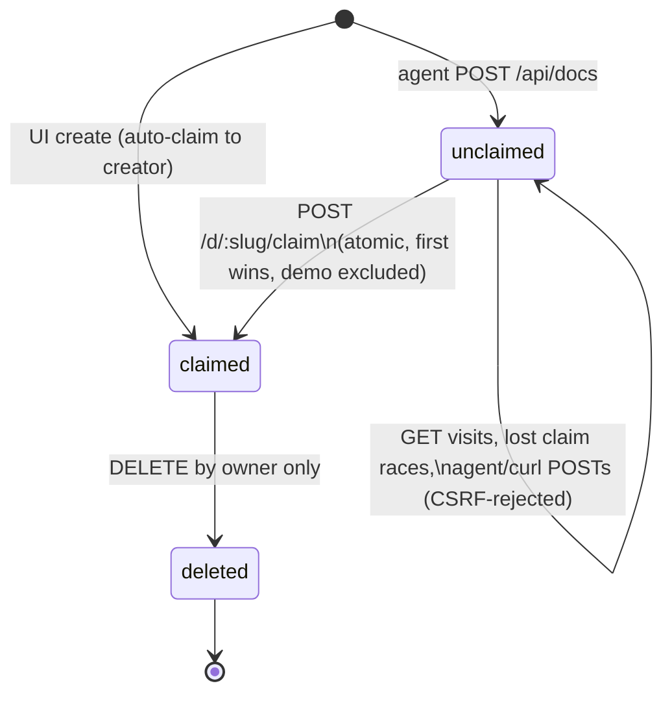
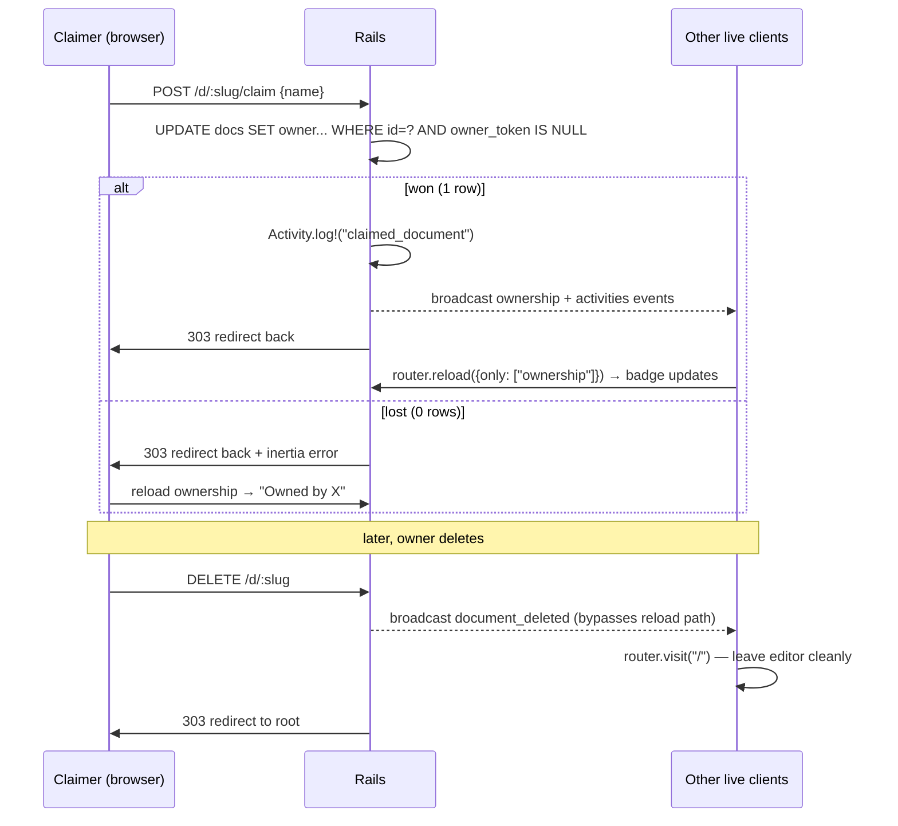

# feat: Claim Agent-Created Docs to Your Browser Identity

## Summary

Agent-created documents currently belong to no one. This plan adds lightweight, session-free ownership: a stable signed browser cookie identifies each visitor, unclaimed docs show a **Claim** button in the editor header, claiming is atomic first-wins, and ownership grants exactly one right — delete. The home page gains a "Your docs" section above the existing recents list (which stays as is). Agents see ownership state through their API surface but cannot claim.

---

## Problem Frame

Docs created via `POST /api/docs` exist only at their slug URL. Opening one adds it to the visitor's session recents (`app/controllers/documents_controller.rb` `remember_recent`), but nothing marks it as anyone's: every visitor sees the identical doc, nobody can delete it, and "my doc that my agent made for me" is indistinguishable from "a doc someone shared with me." The product has no accounts by design (share-link trust model) — so ownership must ride on browser identity, not auth.

---

## Assumptions

Headless-mode inferred bets (pipeline run, no synchronous user to confirm):

- **Ownership identity is a permanent signed cookie (`owner_token`), not the Rails session.** The app sets no `expire_after`, so session cookies die on browser quit — ownership scoped to a tab lifetime would strand docs as owned-by-ghost. `cookies.permanent.signed[:owner_token]` survives restarts; `session[:recent_slugs]` stays untouched (recents keep their existing behavior, per user confirmation).
- **Claim grants delete only.** The user said "if it's claimed you can delete etc" — delete is the confirmed right; rename/ownership-transfer/edit-gating are deferred. Everyone with the link can still edit (trust model preserved).
- **UI-created docs auto-claim to their creator.** Clicking "New document" makes you the owner — the claim button exists for agent-created (and pre-existing) docs.
- **The demo doc is unclaimable.** Claim's only power is delete, so claiming `demo` would let a random visitor delete the instance's demo. A slug guard excludes it.
- **Recents display dedupes against "Your docs."** The recents mechanism is unchanged, but the home page hides docs from the Recent list when they already appear under Your docs.
- **Accepted limitations**, surfaced honestly rather than solved: clearing cookies loses ownership forever; ownership does not follow you across devices; docs that exist before this migration (and agent docs nobody claims) are unclaimed → undeletable until someone claims them; first visitor to any pre-existing doc may claim it.

---

## Requirements

**Claiming**

- R1. A browser visitor opening an unclaimed doc sees a Claim affordance; claiming binds the doc to their browser identity with their display name.
- R2. Claiming is atomic first-claim-wins; a lost race surfaces the new owner without an error modal.
- R3. A claimed doc shows "Owned by ‹name›" to others and a "Yours" badge to the owner; the claim button never shows on claimed docs.
- R4. GET requests never claim or mutate ownership (link prefetchers, unfurlers, curl must be inert).
- R5. The demo doc cannot be claimed.

**Ownership rights**

- R6. The owner can delete the doc; non-owners cannot (attempt is refused).
- R7. When a doc is deleted, other connected live clients route home gracefully — no raw 404 modal, no typing into a dead editor (including clients that were offline during the delete).

**Creation paths**

- R8. UI-created docs are owned by their creator at creation time.
- R9. Agent-created docs (`POST /api/docs`) start unclaimed.

**Surfaces**

- R10. Home page shows "Your docs" (claimed by this browser) above Recent; recents behavior unchanged, display deduped.
- R11. The agent API surface (state JSON + text guide) exposes ownership state and explains that claiming is browser-only.
- R12. Explicit claims appear in the activity feed with the claimer's name (UI auto-claims at create are silent — the doc was never up for grabs).
- R13. Ownership survives browser restart.

---

## Key Technical Decisions

1. **`owner_token` is a permanent signed cookie, minted eagerly.** Set in a `before_action` on the browser controller stack with an explicit `same_site: :lax` (documented next to the CSRF assumption so the two defense layers are auditable together) — eager minting avoids the lazy-generation race where two simultaneous claims from one browser mint different tokens (cookie last-write-wins would strand one doc). Signed prevents trivial forgery. The Rails session keeps doing recents only.

2. **Claim is a CSRF-protected browser POST, absent from the API namespace.** `POST /d/:slug/claim` lives on the Inertia stack, so Rails authenticity-token protection applies — a drive-by curl/agent POST cannot mint a throwaway cookie and burn the doc. The agent guide explicitly says claiming happens in the browser.

3. **Atomic first-claim-wins via conditional UPDATE, model-owned.** `Document#claim!` mirrors the existing seed-claim pattern (`Document.where(id:, owner_token: nil).update_all(...)` — affected-rows tells the winner) and the model-owned create + `Activity.log!` + broadcast convention of `Suggestion.propose!` (with `Suggestion#transition!` as the raise-`RecordInvalid`-on-lost-race shape); controller stays thin. Lost race → `redirect_back` with Inertia errors, matching `SuggestionsController#accept`'s lost-race handling — not a bare 409. Unclaimable slugs raise a distinct `Document::UnclaimableError` so the controller can show "This document cannot be claimed" instead of a phantom race winner. Re-claim by the owner's own token is a no-op success (no `claimed_at` change, no activity, no broadcast) — a double-click or second tab never surfaces a fake lost-race error.

4. **Ownership is its own lazy Inertia prop + `ownership` meta event.** The `document` prop embeds the full Yjs state (`yjs_state_b64`, potentially MBs); reloading it on claim events would re-ship the CRDT to every client. A dedicated `ownership: -> { … }` prop shaped `{ claimed:, claimable:, owner_name:, yours: }` reloads cheaply through the existing `useMetaChannel` event→prop mapping (`claimable:` is false for `UNCLAIMABLE_SLUGS`, so the demo doc never renders a doomed Claim button). The claimer's own POST is scoped the same way (`only: ['ownership', 'activities']`, mirroring the `acceptSuggestion` pattern) so the redirect-back doesn't re-ship the CRDT either. `owner_token` never reaches the client.

5. **Deletion propagates via a special-cased broadcast plus `rejected` handlers.** A `document_deleted` event must bypass `useMetaChannel`'s reload path (reloading a destroyed doc raises). Clients handle it by navigating home. Clients offline during the delete are covered on reconnect: both cable subscriptions (`SyncChannel`, `DocumentMetaChannel`) `reject` for a missing doc, and a new `rejected` callback routes home — today `cable_provider.ts` has no `rejected` handler and a user would keep typing into a dead editor.

6. **Owner display name is sent by the client at claim/create time** from the existing localStorage identity (`app/frontend/editor/identity.ts`), falling back to `"Anonymous"` server-side (the established `comments_controller.rb` pattern). The "Yours" badge renders the word *Yours*, never the stored name as if it were current identity (localStorage identity can drift after claiming).

---

## High-Level Technical Design

Ownership lifecycle:

Claim and delete propagation across connected clients:

---

## Implementation Units

### U1. Browser identity + Document ownership foundation

**Goal:** Every browser carries a stable `owner_token`; documents can hold and atomically transition ownership.
**Requirements:** R2, R4, R5, R13.
**Dependencies:** none.
**Files:** `db/migrate/*_add_ownership_to_documents.rb`, `app/models/document.rb`, `app/controllers/application_controller.rb`, `test/models/document_test.rb`.
**Approach:** Migration adds `owner_token` (string, indexed), `owner_name` (string, `limit: 255`), `claimed_at` (datetime) to `documents`. `ApplicationController` gains `before_action :ensure_owner_token` (mint `cookies.permanent.signed[:owner_token] = { value: SecureRandom.hex(16), same_site: :lax }` if absent — KTD 1) plus an `owner_token` reader helper; API controllers (`ActionController::API`) are untouched. `Document` gains: `UNCLAIMABLE_SLUGS = %w[demo]`, `Document::UnclaimableError`, `claimed?`, `owned_by?(token)` (presence-guarded — never true for nil/blank tokens), `claim!(token:, name:)` performing the conditional-UPDATE win check (KTD 3): no-op success when already owned by the same token, `UnclaimableError` for unclaimable slugs, `ActiveRecord::RecordInvalid` on lost race; on win, log `claimed_document` activity (detail includes the claimer's name — agents poll the feed) and broadcast `:ownership` (two events total with `Activity.log!`'s `:activities` — intentional; clients batch events landing within 150ms). Validate `owner_name` length (max 255) — it's broadcast to every client and served to agents, so unbounded names are an amplification vector (deliberate exception to the no-validation convention on `author_name`).
**Patterns to follow:** seed-claim atomic update in `app/channels/sync_channel.rb` / `Document`; `Suggestion.propose!` for model-owned create + activity + broadcast; `Suggestion#transition!` for the raise-on-invalid shape; `Activity.log!`.
**Test scenarios:** claim on unclaimed doc sets token/name/claimed_at and returns the doc claimed; claim on already-claimed doc raises and leaves owner unchanged; re-claim by the same token no-ops successfully without changing `claimed_at`, logging, or broadcasting (two-tab double-click case); two concurrent claims — simulate by claiming after a manual `update_all` — exactly one winner; claim on slug `demo` raises `UnclaimableError`; `owned_by?` true only for the matching token and false for nil token on unclaimed doc; `owner_name` longer than 255 chars is rejected; claim logs one activity whose detail contains the claimer name and broadcasts `:ownership` and `:activities` (`assert_broadcasts`).
**Verification:** model tests green; a doc claimed in console shows `claimed?` true and survives reload.

### U2. Claim, delete, and ownership endpoints

**Goal:** Browser routes for claim and delete with owner-only authorization; ownership exposed to the editor page; UI creates auto-claim.
**Requirements:** R1, R2, R3, R6, R8, R9, R12.
**Dependencies:** U1.
**Files:** `config/routes.rb`, `app/controllers/documents_controller.rb`, `test/integration/ownership_flow_test.rb`.
**Approach:** Routes: `post "d/:slug/claim"`, `delete "d/:slug"`. `documents#claim`: `document.claim!(token: owner_token, name: params[:name].presence || "Anonymous")`, redirect back `303`; rescue lost race → `redirect_back` with Inertia errors (KTD 3) so the refreshed `ownership` prop shows the winner; rescue `UnclaimableError` → redirect back with a "This document cannot be claimed" error (never a phantom winner). `documents#destroy`: `find_by` (idempotent — already-gone doc redirects home rather than 404), refuse unless `owned_by?(owner_token)` (redirect back with error), else broadcast `document_deleted` via `DocumentMetaChannel.broadcast_event` **before** destroy, destroy (associations cascade via existing `dependent: :destroy`), redirect to root `303`. `documents#show` adds lazy prop `ownership: -> { { claimed:, claimable:, owner_name:, yours: document.owned_by?(owner_token) } }` (KTD 4). `documents#create` auto-claims by setting `owner_token`/`owner_name`/`claimed_at` inline in the `create!` (atomic — a UI doc can never exist momentarily unclaimed; no `claimed_document` activity and no broadcast, so R12 covers explicit claims only) with `params[:name]` (R8). API `docs#create` untouched — agent docs stay unclaimed (R9).
**Patterns to follow:** `redirect_back` + `inertia: { errors: }` lost-race handling in `app/controllers/suggestions_controller.rb`; thin controllers delegating to model methods.
**Test scenarios:** claim via POST sets ownership and redirects 303; losing claimer gets redirect (not 5xx/409) and doc keeps first owner; claiming `demo` redirects back with the unclaimable error message; forged-POST CSRF rejection — note `config/environments/test.rb` sets `allow_forgery_protection = false`, so the test must temporarily set `ActionController::Base.allow_forgery_protection = true` (with `ensure` reset) around the forged POST or it verifies nothing — and the forged set must include a `Content-Type: application/json` variant with no CSRF token (the classic Rails JSON bypass shape), both rejected; GET `/d/:slug` never sets ownership (R4); delete by owner destroys doc + dependents and redirects root; delete by non-owner refused, doc intact; delete of already-deleted slug redirects home (idempotent); delete broadcasts `document_deleted`; UI create assigns ownership to creator's token with provided name in the same INSERT; API create leaves doc unclaimed; show includes `ownership` prop with `yours` true only for the owner's session and `claimable` false for demo.
**Verification:** integration tests green; curl POST to claim fails (CSRF), browser claim succeeds.

### U3. Editor ownership UI + deleted-doc handling

**Goal:** The editor header shows the right ownership state with a working claim action; owners can delete; all live clients leave a deleted doc cleanly.
**Requirements:** R1, R3, R6, R7.
**Dependencies:** U2.
**Files:** `app/frontend/components/ownership_chip.tsx` (new), `app/frontend/pages/documents/show.tsx`, `app/frontend/lib/use_meta_channel.ts`, `app/frontend/editor/cable_provider.ts`.
**Approach:** New `OwnershipChip` in the `doc-header-right` cluster (before `SharePopover`), four states from the `ownership` prop, all in the same visual register as the existing chrome-toggle buttons (Panel, Focus) — no modal, no dropdown, no new interactive primitive:
  - *Unclaimed + claimable* → "Claim" button. `router.post` with `userIdentity().name`, scoped `{ only: ['ownership', 'activities'], preserveScroll: true, async: true }` (mirroring the `acceptSuggestion` pattern — the redirect-back must not re-ship `yjs_state_b64`). Optimistic flip to "Yours", rollback per Inertia v3. On network-error rollback: transient "Try again" label (~3s) reverting to "Claim" — no toast. On lost race: chip resolves directly to "Owned by ‹winner›" from the refreshed prop — the state change is the complete communication, no error banner.
  - *Yours* → quiet "Yours" badge (renders the word *Yours*, never the stored name — KTD 6). Click expands inline within the chip to a two-step "Delete? / Keep" confirm; confirming fires `router.delete` (keyboard-navigable, matches the app's no-modal pattern).
  - *Claimed by other* → muted "Owned by ‹name›" text, non-interactive.
  - *Unclaimed + not claimable* (demo) → renders nothing.
  At ≤64rem the chip stays in the header in compact form (same states, tighter padding; "Owned by ‹name›" truncates) — no new dock sheet; the inline expand works for touch. `useMetaChannel` signature becomes `useMetaChannel(slug: string, options?: { onDeleted?: () => void })`; the `document_deleted` branch clears the pending event set and cancels the armed debounce timer **before** invoking `onDeleted` (events broadcast just before a delete must not fire a reload against the destroyed slug), and `show.tsx` passes an `onDeleted` doing `router.visit('/')`. Add `rejected` callbacks to both subscriptions (`cable_provider.ts`, `use_meta_channel.ts`) routing home — covers clients that were offline during the delete and reconnect to a rejected stream (KTD 5). `DocumentProps` gains the `ownership` type. The activity feed already renders `detail` as React text content — keep it that way (never `dangerouslySetInnerHTML`); claimer names pass through as inert text.
**Patterns to follow:** header chrome composition in `show.tsx` (`doc-header-right`); optimistic mutations as in suggestion accept; `postJSON`/`router` idioms already in the page.
**Test scenarios:** Test expectation: none in Ruby — presentational and client-routing behavior; covered by U2's endpoint tests plus browser verification (pipeline browser-test phase): claim button appears only on unclaimed claimable docs (demo shows no button); click → badge flips to Yours without full reload; second browser shows "Owned by ‹name›" within a second (meta event); delete from owner → both windows land on home; reload of a deleted slug 404s without claiming anything.
**Verification:** two-window manual pass per the scenarios above.

### U4. Home page: Your docs + deduped recents

**Goal:** The landing page surfaces claimed docs first; recents keep working unchanged underneath.
**Requirements:** R10.
**Dependencies:** U1 (ownership exists), U2 (`owner_token` helper).
**Files:** `app/controllers/documents_controller.rb` (index), `app/frontend/pages/documents/index.tsx`, `test/integration/ownership_flow_test.rb` (index cases).
**Approach:** `documents#index` adds `yours: Document.where(owner_token:).order(created_at: :desc).limit(50).map { slice(:title, :slug) }` and filters the existing `recent` list to exclude slugs present in `yours` (mechanism untouched — only display dedupe). `index.tsx` renders a "Your docs" section above Recent (empty state: omit the section entirely rather than showing placeholder text), and the "New document" form switches to `useForm(() => ({ name: userIdentity().name }))` — the lazy initializer reads localStorage at first render, and keeping `useForm` preserves the existing `processing` double-submit guard on the button (imports `userIdentity` from `../../editor/identity`).
**Patterns to follow:** existing Recent section markup/classes in `index.tsx`; session-scoped index props in `documents#index`.
**Test scenarios:** index lists docs claimed by this session's token under `yours`, newest first; docs owned by another token don't appear in `yours`; a doc both owned and recently viewed appears only under `yours`; unowned recently-viewed docs still appear under `recent`; `yours` caps at 50.
**Verification:** create a doc (auto-claimed) + open a foreign doc → home shows one under Your docs, the other under Recent, no duplicates.

### U5. Agent surface: ownership visibility

**Goal:** Agents reading a doc know whether and by whom it's claimed, and learn that claiming is a browser action they cannot perform.
**Requirements:** R11.
**Dependencies:** U1.
**Files:** `app/services/agent_guide.rb`, `app/controllers/api/docs_controller.rb`, `test/integration/agent_api_test.rb`, `test/integration/agent_discovery_test.rb`.
**Approach:** `AgentGuide.state` gains `ownership: { claimed:, owner_name: }` (no token). `AgentGuide.text`/`.notes` gain two lines: docs can be claimed by a human in the browser; claimed docs show an owner; agents cannot claim (no session) — don't POST to the claim path. And: a claimed doc can be deleted by its owner, after which every endpoint returns 404 — treat a 404 on a previously-working slug as deletion, not an outage to retry. `Api::DocsController#create` response adds a `note` that the first person to open the share URL in a browser can claim the doc. Keep wording terse to match the guide's existing voice.
**Patterns to follow:** existing `AgentGuide` JSON/text shapes; teaching-error tone of `Api::BaseController#require_agent!`.
**Test scenarios:** state JSON includes ownership with `claimed: false` for fresh agent docs and `owner_name` after a claim; text guide marks claiming browser-only and explains deletion → 404 semantics; create response includes the claim note; no token or cookie material leaks into any agent payload.
**Verification:** `curl -H "Accept: application/json" /d/:slug` shows ownership; agent guide text reads sensibly.

---

## Scope Boundaries

**In scope:** everything under Requirements; the `rejected`-handler hardening (R7) since delete makes dead-doc streams reachable in normal use.

### Deferred to Follow-Up Work

- Rename/title editing for owners (the "etc" beyond delete).
- Ownership transfer / unclaim / re-claim of orphaned docs.
- Real cross-device accounts (magic link / passkey) — would replace the cookie token.
- Gating any *editing* rights by ownership (share-link trust model intentionally preserved).
- Admin/cleanup path for permanently-unclaimed docs.

### Outside this product's identity

- Full user accounts, login, profiles — the product is share-link-first by design.

---

## Risks & Dependencies

- **Cookie-scoped ownership is fragile by design** — clearing cookies or switching devices orphans docs (undeletable until someone else claims… which nobody can, since claim requires `owner_token IS NULL`; orphaned docs are permanently undeletable). Accepted and documented; the deferred admin path is the eventual remedy.
- **Pre-existing docs land-rush** — every doc predating the migration is claimable by its first visitor. Accepted for this product (links are unguessable; visitors are invitees).
- **Event-name/prop-name coupling** — `useMetaChannel` reloads `only: [event]`; the new event string `ownership` must exactly match the prop key, and `document_deleted` must never fall through to the reload path (it would 404). U3's special-casing is the guard; a typo here fails silently, so the two-window verification pass is load-bearing.
- **Broadcast-before-destroy ordering** — destroyed records keep their `id`, so broadcasting after `destroy` would also work; broadcast-before-destroy is chosen for simplicity and so the event reliably precedes stream teardown. Pinned in U2.
- **CSRF assumption** — KTD 2 relies on authenticity-token protection being active on the Inertia stack (Rails default). U2's forged-POST tests (including the JSON content-type variant) make the assumption executable — noting the test env disables forgery protection by default, so the tests must re-enable it locally.
- **No rate limiting on claim** — a bot iterating scraped/bookmarked slugs could bulk-claim unclaimed docs. Accepted for now: slugs are unguessable, the endpoint is CSRF-protected, and the deferred admin path is the recovery story.
