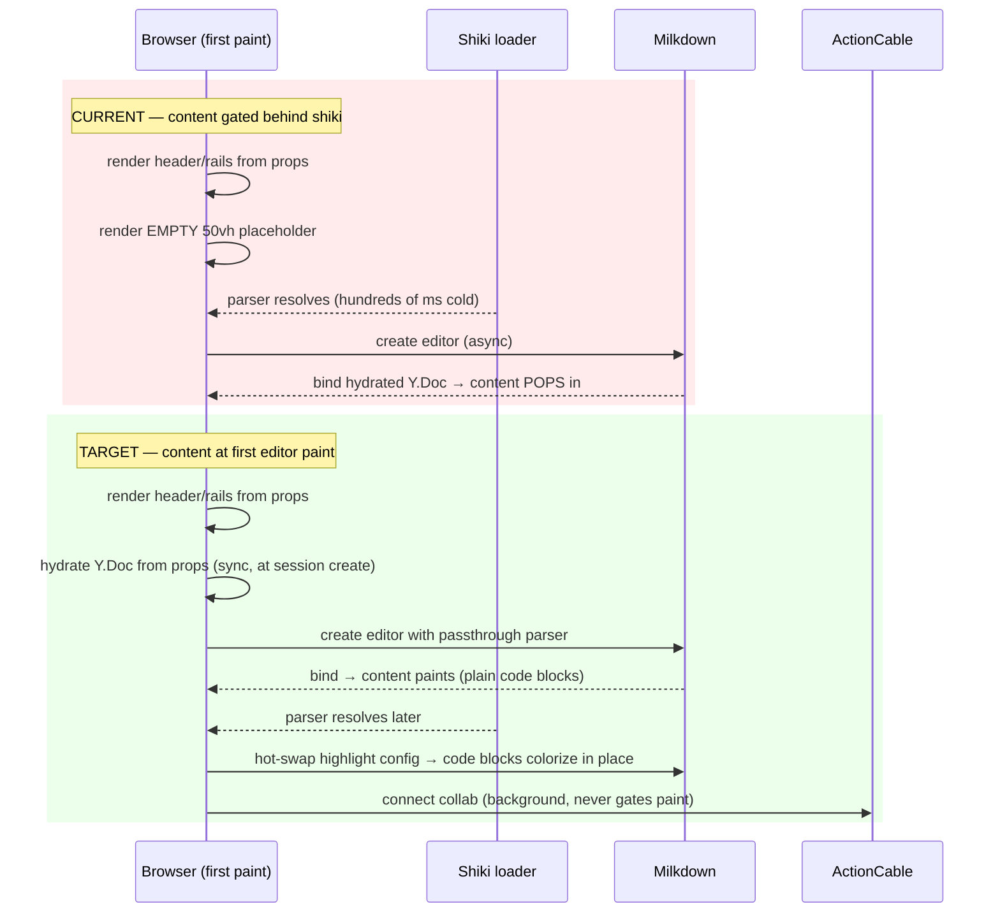
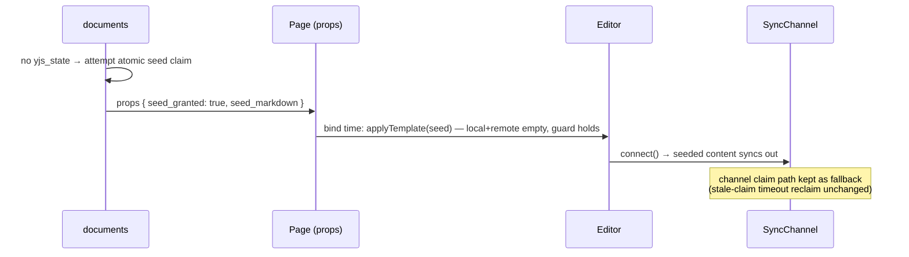

# fix: Eliminate document-load flicker — content at first paint

## Summary

Loading a document shows a short flicker: a blank 50vh placeholder paints first, then the editor and content pop in. The user requirement is **zero visible flicker** — everything needed for first paint must arrive via Inertia props (which it already does) and actually *render* at first paint, with progressive upgrades (syntax highlighting, live collab) layering in afterward without visual disruption.

Research confirms the Inertia layer is already props-first: `documents#show` ships the full document including the base64 Yjs state inline, with no deferred props and no client-side fetches gating first paint. The flicker lives entirely in the client editor bring-up chain in `app/frontend/editor/milkdown_editor.tsx`:

1. **Shiki gate (primary).** `EditorInner` returns an empty `.doc-editor-loading` div (min-height 50vh) until the shiki highlighter — 15 grammars + theme + regex engine — finishes loading. The entire document is invisible until then. Blank page → content pop = the flicker.
2. **Milkdown async creation.** `useEditor` builds the editor asynchronously; `<Milkdown />` renders an empty root for a few frames after shiki resolves, before the Yjs doc binds.
3. **New-document seed path.** A never-edited doc has no Yjs state; its seed content appears only after the ActionCable subscription round-trip grants the seed claim — the worst-case blank window, even though `seed_markdown` is already in props.

The fix inverts the dependency: the editor mounts and paints content immediately from props-hydrated state; syntax highlighting upgrades in place when shiki arrives; new docs seed from props via an HTTP-time claim instead of waiting on the WebSocket.

---

## Problem Frame

**Observed:** Visible flicker on every document load — blank space where the document should be, then content appears.

**Root cause:** Client-side render gates, not data availability. All data is in the initial Inertia response; the page component (`app/frontend/pages/documents/show.tsx`) renders header/rails synchronously from props — but the editor area withholds content behind async initialization (shiki, Milkdown creation, and for new docs, the WebSocket seed handshake).

**Goal:** Document content visible at the editor's first paint with no blank placeholder, no content pop, and no layout shift. Progressive enhancement (highlighting, live cursors) must layer in without visual disruption.

**Out of scope:** SSR (the app has none; first paint is client-rendered and that stays), dev-mode-only CSS injection flash from Vite (does not affect production), and the cosmetic `connecting → live` status dot transition.

---

## Requirements

- **R1** — No blank placeholder or content pop when loading an existing document: document text is present the moment the editor area first paints.
- **R2** — All data needed for first paint arrives via Inertia props (preserve the existing props-first contract; no new client-side fetches, no mount-time `router.reload`).
- **R3** — Brand-new documents (no Yjs state yet) render their seed content without waiting for the ActionCable round-trip.
- **R4** — Syntax highlighting still works; it may upgrade progressively (plain code block → highlighted) but must not cause layout shift or block content paint.
- **R5** — No collab regressions: Yjs convergence, single-seeder guarantee, StrictMode-safe session reuse, snapshot push, and reconnect behavior all preserved.

---

## Key Technical Decisions

1. **Decouple shiki from editor mount (hot-swap parser), rather than pre-rendering static HTML.** The editor module is statically imported (already in the main chunk) and Milkdown creation is pure CPU work — the only slow async dependency is shiki's grammar/engine loading. Mounting the editor immediately with a passthrough parser and swapping in the shiki parser when it resolves removes the dominant flicker source with no second rendering pipeline. A server- or client-rendered static markdown preview was considered and rejected: it requires a second markdown renderer whose output must pixel-match ProseMirror's, otherwise the editor-swap itself becomes a new flicker (see Alternatives).
2. **Hydrate the Y.Doc at session creation, not in the post-mount effect.** `yjs_state_b64` is already in props; applying it when `acquireSession` creates the Y.Doc (instead of inside the `loading`-gated effect) means the doc is populated before the editor ever binds, so bind paints content in the same frame.
3. **Move the seed claim to the HTTP response for page loads.** `SyncChannel#claim_seed?` already implements atomic first-claim-wins with stale-claim timeout reclaim. Extract that into the `Document` model and let `documents#show` attempt the claim when the doc has no state, passing `seed_granted` + the seed markdown via props. The client applies the template at bind time (local doc empty, remote doc empty — the existing double-guard holds) and then connects. The channel-side claim path remains for resilience (stale-claim reclaim when an HTTP-granted seeder never applies). This is the genuinely props-first answer to R3 and reuses the existing claim state machine rather than inventing a parallel one.
4. **Defense in depth on layout stability.** Even with gates removed, a 1–2 frame empty-editor window can exist on slow devices. Keep the editor container dimensionally stable (reserve min-height on the mount container, not on a separate placeholder div) so any residual frames are blank-within-stable-layout rather than layout shift + pop.

---

## High-Level Technical Design

Current vs. target load sequence for an existing document:



New-document seed flow (target):



Diagrams are directional; prose and per-unit approach notes are authoritative.

---

## Implementation Units

### U1. Mount the editor immediately; hot-swap the shiki parser

**Goal:** Remove the `!parser` gate so the document paints without waiting for shiki; highlighting upgrades in place when ready.

**Requirements:** R1, R2, R4

**Dependencies:** none

**Files:**
- `app/frontend/editor/milkdown_editor.tsx` (modify — remove `EditorInner` gate, add parser hot-swap effect)
- `app/frontend/editor/highlighter.ts` (modify — export a synchronous passthrough parser alongside the async loader)
- `app/frontend/entrypoints/application.css` (modify — retire `.doc-editor-loading` or repurpose per U4)

**Approach:**
- `EditorInner` no longer returns the empty placeholder. `CollabEditor` is created with a synchronous passthrough parser (`() => []` — code blocks render as plain text with their existing block styling; no decorations).
- When the module-level `shikiParserPromise` resolves, update the live editor's `highlightPluginConfig` via `editor.action((ctx) => ctx.update(highlightPluginConfig.key, …))` and trigger a re-decoration pass so visible code blocks colorize.
- **Deferred to implementation:** the exact mechanism to force the highlight plugin to recompute decorations after a config swap (the plugin recomputes on doc changes; a no-op transaction dispatch or the plugin's own refresh hook are candidates). If hot-swap proves infeasible in `@milkdown/plugin-highlight` 7.x, fallback: inspect the props-supplied markdown (`seed_markdown` / hydrated doc) for fenced code blocks (markdown ``` delimiters; inline code does not count) and only await shiki when the document actually contains them — documents without fenced code (the common case) never wait. **The fallback is a last resort and a known R1 carve-out for fence-bearing documents — if used, record it explicitly in the PR so the residual flicker for that subset is tracked, not silently accepted.** Hot-swap is the target.
- Highlighting is color-only (decorations), so the upgrade causes no layout shift (R4).

**Patterns to follow:** existing `ctx.update(...PluginConfig.key, ...)` calls in the same file's `Editor.make().config` block; the module-level warm-load pattern (`shikiParserPromise`) stays.

**Test scenarios:**
- Loading a document with no fenced code blocks paints text without any shiki wait (verify via type check + browser verification; no JS unit framework exists).
- Loading a document containing fenced code blocks shows the code as plain text first, then colorized — same block dimensions before/after (no layout shift).
- Shiki load failure (network error) leaves the editor fully functional with plain code blocks — the passthrough parser never throws.
- Test expectation: frontend behavior verified via `npm run check` (tsc) and the browser-test pass — repo has no JS unit-test framework; minitest cannot reach this layer.

**Verification:** Cold-load a document with code blocks (disable cache): document text visible at editor first paint; code blocks colorize afterward without movement.

---

### U2. Hydrate the Y.Doc at session creation

**Goal:** The Y.Doc is populated from `yjs_state_b64` before the editor binds, so bind renders content immediately instead of after an effect-time hydration.

**Requirements:** R1, R2, R5

**Dependencies:** none (lands cleanly with or before U1)

**Files:**
- `app/frontend/editor/milkdown_editor.tsx` (modify — move the `Y.applyUpdate` hydration from the post-`loading` effect into `acquireSession`)

**Approach:**
- `acquireSession(slug, identity, initialStateB64)` applies the base64 state right after `new Y.Doc()`, guarded by `ydoc.store.clients.size === 0` exactly as today (idempotent across StrictMode remounts and session reuse — a reused session already has clients and skips).
- Keep the existing `try/catch` for corrupt/stale props falling back to the wait-for-synced path.
- The bind-time branch (`provider.synced || ydoc.store.clients.size > 0`) is unchanged and now always takes the immediate path for existing documents.

**Patterns to follow:** the session map's StrictMode-safety comments and structure (`sessions`, `acquireSession`, `releaseSession`) — preserve the ref-counting and grace-period teardown untouched.

**Test scenarios:**
- Existing document (has Yjs state): bind happens synchronously on first effect run — no empty-editor frame between editor creation and content.
- StrictMode double-mount: hydration applies exactly once (second mount sees `clients.size > 0`).
- Corrupt `yjs_state_b64` prop: editor still loads via the synced fallback path, no crash.
- Test expectation: verified via `npm run check` + browser pass (no JS unit framework).

**Verification:** With network throttled, an existing document's text appears in the same paint as the editor surface — no empty-editor flash.

---

### U3. Props-first seed for brand-new documents

**Goal:** A fresh document renders its seed content at bind time from props, instead of blank-until-WebSocket-handshake.

**Requirements:** R1, R2, R3, R5

**Dependencies:** U2 (bind-time flow is the integration point)

**Files:**
- `app/models/document.rb` (modify — extract atomic seed claim into a model method, e.g. claim-seed with stale-reclaim semantics)
- `app/channels/sync_channel.rb` (modify — `claim_seed?` delegates to the model method; behavior unchanged)
- `app/controllers/documents_controller.rb` (modify — `show` attempts the claim when `yjs_state` is blank and HTML is being served; adds `seed_granted` to the document prop)
- `app/frontend/pages/documents/show.tsx` (modify — pass seed grant through to the editor)
- `app/frontend/editor/milkdown_editor.tsx` (modify — apply template at bind time when granted via props; skip waiting for `synced`)
- `app/frontend/editor/cable_provider.ts` (modify only if needed — the channel may still grant a seed on sync; the client must not double-apply)
- `test/integration/document_seed_claim_test.rb` (create)
- `test/channels/sync_channel_test.rb` (modify — cover delegation)

**Approach:**
- The atomic `update_all` claim logic (first-claim-wins, stale `seed_claimed_at` reclaim) currently lives **only** in `SyncChannel#claim_seed?` — the `Document` model has no seed methods today. This unit creates a new model method (e.g. `Document#try_claim_seed`) carrying that logic verbatim, so HTTP and channel paths share one state machine.
- `documents#show`: when the doc has no state and has seed markdown, attempt the claim; on grant, include `seed_granted: true` in props — a **new** prop introduced by this unit (seed markdown is already shipped as `seed_markdown`).
- Client: when `seed_granted` arrives via props, the bind gate in `milkdown_editor.tsx` changes — instead of `provider.on('synced', start)` for empty docs, a props-granted client calls `start()` immediately and applies the template there, then `connect()`s. This is what removes the ActionCable round-trip from the paint path (R3). The existing `applyTemplate` remote-empty double-guard stays as the race backstop. Consume one-shot exactly like the current `provider.seedMarkdown = null` pattern so remounts never re-apply.
- The channel-side grant path stays: if an HTTP-granted client never connects (closed tab), the stale-claim timeout lets the next subscriber reclaim — identical to today's crashed-seeder recovery. Client must tolerate receiving a channel seed grant it already satisfied via props (the one-shot consume + remote-empty guard cover this; verify in implementation).
- JSON/txt/agent requests in `show` must NOT claim the seed — only the HTML editor render path does (an agent fetching state should never burn the claim).

**Test scenarios:**
- `GET show` (HTML) on a stateless doc with seed markdown: claim transitions to `claimed`, props include the grant. Second concurrent-style request: no grant (already claimed, not stale).
- Covers seed atomicity: two claim attempts, exactly one wins (model-level test mirroring the existing channel guarantee).
- Stale claim (`seed_claimed_at` older than timeout): a later `show` request reclaims and gets the grant.
- Doc with existing `yjs_state`: `show` never attempts a claim; no `seed_granted` in props.
- JSON and agent-UA requests on a stateless doc: no claim attempted.
- Channel path regression: `SyncChannel` still grants the seed to a subscriber when the doc is unclaimed (delegation works).
- Integration: granted page load → editor applies template → connect → seeded content persists (snapshot/state lands server-side).

**Verification:** Create a new document, load it on a throttled connection: seed content visible at editor first paint, before the WebSocket connects. Existing channel tests stay green.

---

### U4. Stable editor container — no layout shift in residual frames

**Goal:** Any remaining sub-perceptual empty frames occur inside a dimensionally stable layout — nothing below the editor jumps when content binds.

**Requirements:** R1

**Dependencies:** U1 (placeholder div is removed there)

**Files:**
- `app/frontend/entrypoints/application.css` (modify — move the min-height reservation onto the persistent editor container / `.milkdown` mount, remove the now-dead `.doc-editor-loading` rule)
- `app/frontend/pages/documents/show.tsx` (modify if the container needs a class hook)

**Approach:** Reserve the same `min-height: 50vh` on the always-present editor mount container instead of a transient placeholder div, so the DOM never swaps a sized element for an unsized one. Audit that header, margin-suggestion rail, and comments rail don't reflow when the editor binds.

**Test scenarios:**
- Test expectation: none — pure CSS/layout change with no behavioral logic; covered by the browser-pass layout-shift check in Verification.

**Verification:** Record a load with DevTools performance/layout-shift overlay: CLS contribution from the editor area is zero; footer/rails don't move when content binds.

---

## Scope Boundaries

**In scope:** the document show page's first-paint path (editor bring-up, seed claim plumbing), and the minimal CSS to keep layout stable.

**Not in scope (true non-goals):**
- SSR — out of the product's current architecture; first paint remains client-rendered.
- The `connecting → live` status dot transition — cosmetic, not layout shift.
- Presence polling / ActionCable subscription timing — none of it gates first paint today.

### Deferred to Follow-Up Work
- Dev-only flash of unstyled editor from Vite's JS-injected CSS (`prosemirror.css`, `tables.css`, `table_block.css` static imports) — does not affect production builds; fix separately if dev DX warrants.
- Lazy-loading shiki grammars per-language (load only grammars the document uses) — a payload optimization, orthogonal once the gate is removed.
- Capturing this fix as the repo's first `docs/solutions/` learning (no knowledge base exists yet).

---

## Risks & Dependencies

- **Highlight config hot-swap is unverified in `@milkdown/plugin-highlight` 7.x** (the one execution-time unknown). Mitigated by the U1 fallback: gate on shiki only when the document actually contains code fences — which still satisfies R1 for the common no-code case and keeps R4 intact for code-bearing docs.
- **Seed protocol change (U3) touches the single-seeder guarantee.** Mitigated by reusing the exact atomic claim + stale-reclaim state machine (extracted, not reimplemented), keeping the `applyTemplate` remote-empty double-guard, and full minitest coverage of both claim paths. The dogfood-report learning applies: no new mount-time reloads, and non-GET redirects keep `status: :see_other`.
- **StrictMode regressions** if session/hydration ordering changes (U2). The session-reuse map and its guards are preserved verbatim; hydration moves but keeps its idempotency guard.

---

## Sources & Research

- Repo research: full document-show flow traced through `app/controllers/documents_controller.rb`, `app/frontend/pages/documents/show.tsx`, `app/frontend/editor/milkdown_editor.tsx`, `app/frontend/editor/highlighter.ts`, `app/frontend/editor/cable_provider.ts`, `app/channels/sync_channel.rb`. Confirmed: no deferred Inertia props, no client-side initial-data fetches; flicker is editor bring-up.
- Institutional context: `docs/plans/2026-06-05-001-feat-proof-reimagining-collaborative-editor-plan.md` (origin architecture — props-first by design, theme-cookie "server knows everything at first paint" precedent), `docs/REVIEW-NOTES.md` ("no useEffect+fetch for page data" is documented policy), `docs/dogfood-reports/2026-06-05-feat-proof-reimagining-dogfood.md` (batched-reload learning — add no mount-time reloads).
- External research: skipped — fix area is fully local with strong existing patterns; the single library-behavior unknown (highlight config hot-swap) is deferred to implementation with a designed fallback.
