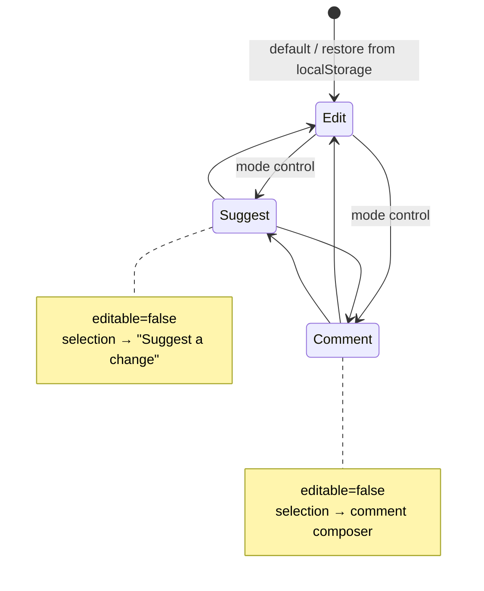
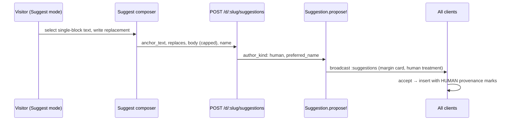

# feat: Claim Visibility, Header Cleanup, and Editor Modes

## Summary

A Riffrec feedback session (71s, voice + screen, evidence in `docs/brainstorms/riffrec-feedback/2026-06-05-1854/`) surfaced four explicit asks: a claim affordance on home-page Recent rows, a prominent "claim this doc" banner on the doc page, a consolidated doc header with Share as the primary action, and a Google Docs-style Edit / Suggest / Comment mode switcher. The first three are visibility/hierarchy fixes on existing flows; the fourth is a new capability that reuses the existing Suggestion and Comment pipelines rather than introducing track-changes editor infrastructure.

---

## Problem Frame

Pruf's ownership model (anonymous `owner_token` cookie, atomic first-claim-wins) shipped recently, but its UI surface is too quiet: the home Recent list ships no ownership metadata at all, and the doc-page Claim button renders at the same visual weight as the Panel/Focus view toggles. Transcript: *"it has a claim button, but maybe make it a little bit more clear, like a banner."* Meanwhile the doc header has grown to 8 equal-weight elements — *"this menu here is a little bit messy… Share is the most important thing"* — and the user wants per-visitor editor modes: *"edit mode, suggest mode, or comment mode."* Suggestions today are agent-only margin cards; comments exist but there is no read-only stance a human can adopt.

---

## Assumptions

Headless-mode inferred bets (pipeline run; flow-analysis defaults adopted — see origin doc for evidence):

- **Ownership status moves into the overflow menu after header consolidation.** "Yours" + delete confirm, "Owned by ‹name›", and a fallback "Claim" item live in the new menu; the banner is the primary claim CTA. The standalone `OwnershipChip` placement in the header row goes away.
- **Accepted human suggestions carry human provenance and skip the AI review-state machinery.** Threading `author_kind` through the accept path is in scope — silently counting human prose as AI would break the product's core attribution promise.
- **Read-only modes restrict direct typing only.** Accepting/rejecting suggestions, advancing AI review states, and resolving comments remain available in all three modes.
- **Suggest composer is limited to single-block selections** (the existing `findTextRange` anchor matching is per-block); multi-block selections show a hint instead of a composer.
- **Banner dismissal is per-doc localStorage** following the existing stored-flag pattern; dismissing hides the banner only — claiming stays reachable via the menu.
- **Mode is per-doc client state** (localStorage, default Edit), never persisted server-side, never affecting other collaborators.
- **Home-page claim is inline** (POST from the index with optimistic UI), not a detour through the doc page.

---

## Requirements

From origin (`docs/brainstorms/riffrec-feedback/2026-06-05-1854/requirements-kickoff.md`):

- **R1–R2** Claim affordance on claimable Recent rows; inline atomic claim with race-tolerant UI (F1, AE1)
- **R3–R4** Prominent dismissible claim banner on unclaimed claimable docs; never on demo, GET-inert (F2, AE2)
- **R5–R6** Header right side collapses to ≤4 groups; Share is the primary action (F3, AE3)
- **R7–R8** Three-way mode control, Edit default; Comment mode = read-only + selection-to-comment (F4, AE4)
- **R9** Suggest mode routes changes through the existing suggestion pipeline, human-attributed (F4, AE5)
- **R10** Mode is per-visitor, client-side only (F4)

---

## Key Technical Decisions

1. **One `useClaim(slug)` hook for all three claim surfaces** (index row, banner, menu item). The claim flow already exists server-side; three independent implementations of double-fire guards, `claimFailed` state, and race handling would drift. The hook owns POST, optimistic state, and silent `onError` (a lost race must re-render ownership, not raise Inertia's default error modal).
2. **Index ships ownership metadata per row.** `documents#index` props expand from `{title, slug}` to include `{claimed, claimable, yours, owner_name}` via the existing `Document#ownership_props`. The index has no live channel; staleness is handled at click time by the race-tolerant claim flow with `router.reload(only: ['yours', 'recent'])` on settle (the show page's `only: ['ownership']` scoping does not transfer).
3. **Read-only modes are implemented as ProseMirror `editable: () => false` only.** Never gate provider connection, Yjs sync, or seed application on mode — a visitor with `seed_granted: true` loading into a restored read-only mode must still seed programmatically, or the seed claim burns for the timeout window (see `docs/plans/2026-06-05-006-fix-document-load-flicker-plan.md` context).
4. **Suggest mode v1 = selection-based propose, not track-changes.** Reuses `Suggestion.propose!` + margin cards + accept/reject. Inline track-changes rendering is deferred (origin scope boundary).
5. **Human suggestion authorship is a first-class backend change.** `Suggestion::AUTHOR_KINDS` widens to include `human`; a browser-facing create endpoint mirrors `CommentsController#create` conventions (`preferred_name` precedence, `propose!` for activity + broadcast, `redirect_back`, body-size cap). The accept path threads `author_kind` so inserted text gets human provenance marks instead of hardcoded `kind: ai, state: pending`.
6. **Header contract: `[identity/presence] [mode control] [Share (primary)] [⋯ menu]`.** Menu contains Panel, Focus, Feedback, and ownership status/actions. Provenance summary chip joins the identity/presence group or the menu, whichever keeps groups ≤4.

---

## High-Level Technical Design

### Header layout (before → after)

```
BEFORE  [P. title status] ............ [Identity][Provenance][Presence][Panel][Focus][Ownership][Feedback][Share]
AFTER   [P. title status] ............ [Identity·Provenance·Presence] [Edit ▾] [Share] [⋯]
                                                                        │               └─ Panel / Focus / Feedback /
                                                                        │                  ownership (Yours·Delete / Owned by X / Claim)
                                                                        └─ Edit | Suggest | Comment
```

### Mode state machine (per visitor, per doc)



### Per-mode capability matrix (directional contract)

| Capability | Edit | Suggest | Comment |
|---|---|---|---|
| Direct typing into doc | ✅ | ❌ | ❌ |
| Selection toolbar | Comment · Ask AI | Suggest a change | Comment |
| Accept/reject suggestions | ✅ | ✅ | ✅ |
| Advance AI review states / resolve comments | ✅ | ✅ | ✅ |
| Presence/caret broadcast | ✅ | ✅ | ✅ |

### Suggest-mode flow (directional, not implementation spec)



---

## Implementation Units

Shipping order is serial on the UI track — U1 → U2 → U3 → U5 → U6 (the banner must exist before the chip loses its header slot, and the header slot before the mode control) — with U4 as the only fully parallel track.

### U1. Ship ownership metadata to the home page and add the shared claim hook

**Goal:** Index rows know their claim state; one reusable claim primitive exists.
**Requirements:** R1, R2 (AE1)
**Dependencies:** none
**Files:**
- `app/controllers/documents_controller.rb` (index props)
- `app/frontend/lib/use_claim.ts` (new)
- `app/frontend/pages/documents/index.tsx`
- `test/integration/ownership_flow_test.rb` (or a new `test/integration/home_claim_test.rb`)

**Approach:** Expand `yours`/`recent` props with `ownership_props(viewer_token)` fields per row. Build `useClaim(slug)` owning POST to the existing claim route, in-flight guard, silent `onError`, and settle-time reload scoped to the page's props. Render a claim affordance (icon-button per the transcript ask) only when `claimable && !claimed`; claimed rows show nothing (own docs already sit under "Your docs"). The icon button carries `aria-label="Claim this document"` and a matching tooltip, copy-consistent with the U2 banner. On win, the row moves lists via the scoped reload; on lost race, the row re-renders with the winner's name — no modal.
**Patterns to follow:** `app/frontend/components/ownership_chip.tsx` optimistic claim + scope reload; `assert_inertia_props` usage in `test/integration/ownership_flow_test.rb`.
**Test scenarios:**
- Covers AE1. Index props include `claimable: true` for an unclaimed agent-created doc in recents, and `claimable: false` + `owner_name` for a doc claimed by another token.
- Demo doc row is never claimable in props.
- POST claim from index context with an unclaimed doc → 200-family redirect, doc owned by caller, subsequent index props place it under `yours`.
- Lost race (doc claimed between render and click) → response carries updated ownership, no 5xx; props show the winner.
- Recents dedupe still holds after claim (doc no longer duplicated in `recent`).
**Verification:** Home page shows claim affordances on claimable recents; claiming moves the row without leaving the page; race produces no error modal.

### U2. Doc-page claim banner

**Goal:** Unclaimed claimable docs greet visitors with a prominent, dismissible claim CTA.
**Requirements:** R3, R4 (AE2)
**Dependencies:** U1 (consumes `useClaim`)
**Files:**
- `app/frontend/components/claim_banner.tsx` (new)
- `app/frontend/pages/documents/show.tsx`
- `app/frontend/entrypoints/application.css`
- `test/integration/ownership_flow_test.rb`

**Approach:** Banner renders below the sticky header when `ownership.claimable` and not locally dismissed ("Claim this doc to your account" + claim button + dismiss). Dismissal writes a per-slug stored flag (existing `readStoredFlag` pattern); the dismiss flag gates **only the banner element** — it never suppresses the ownership update path, so on any `:ownership` broadcast or scoped reload that transitions claimable→claimed-by-other, the header/menu ownership state switches to "Owned by ‹name›" regardless of the stored dismiss flag (a dismissed visitor must not be offered a doomed claim). On claim or on `:ownership` broadcast showing the doc claimed, the banner unmounts for all viewers via the existing scoped reload. Check the popover `anchorPosition` threshold against the shifted header geometry (flow-analysis gap: hardcoded sticky-header offset).
**Test scenarios:**
- Covers AE2. Unclaimed claimable doc → ownership props mark `claimable`; claimed doc and demo doc → not claimable (banner precondition false).
- GET requests never mutate ownership (existing tests already lock this — extend only if banner introduces a new route, which it should not).
- Claim via banner path is the same POST as the chip path (no new endpoint).
- Test expectation note: dismissal persistence is client-only localStorage — covered by the browser-test pass, not Minitest.
**Verification:** First visit to an unclaimed doc shows the banner without hunting the header; dismiss survives reload; claimed docs never show it.

### U3. Header consolidation — overflow menu and primary Share

**Goal:** Header right side reads in one scan: identity/presence · mode · Share · menu.
**Requirements:** R5, R6 (AE3)
**Dependencies:** U2 (banner is the claim CTA before the chip loses its slot); U5 reserves the mode-control slot but can land after — leave a placeholder gap, not a hard dependency
**Files:**
- `app/frontend/components/header_menu.tsx` (new)
- `app/frontend/pages/documents/show.tsx`
- `app/frontend/components/ownership_chip.tsx` (content reused/relocated into menu)
- `app/frontend/entrypoints/application.css`

**Approach:** New `⋯` menu holding: Panel toggle, Focus toggle, Feedback, and ownership section ("Yours" + two-step delete confirm / "Owned by ‹name›" / "Claim" fallback item). `header_menu.tsx` is a content-layer component that **composes** the existing popover primitive from `share_popover.tsx` (extract/reuse its open-close/positioning mechanics rather than reimplementing them). Share gets primary-button styling. Provenance summary chip merges into the identity/presence group or menu — implementer's call, bounded by the ≤4-groups contract. Preserve the mobile dock behavior; decide the menu's mobile placement by mirroring existing MobileDock patterns.
**Test scenarios:** Test expectation: none for Minitest — pure presentation reshuffle over existing flows (delete/claim/panel/focus behavior is already integration-tested); regression coverage comes from the browser-test pass (AE3: Panel and Focus reachable inside the menu, Share visually primary, ≤4 groups).
**Verification:** No control is lost: panel/focus toggles, feedback, delete-with-confirm, claim, share all reachable; header matches the layout contract on desktop and mobile.

### U4. Backend: human-authored suggestions

**Goal:** Browsers can propose suggestions; the model and API treat `human` as a first-class author kind.
**Requirements:** R9 (AE5 server half)
**Dependencies:** none (parallel with U1–U3)
**Files:**
- `app/models/suggestion.rb`
- `app/controllers/suggestions_controller.rb` (extend the existing controller — add a `create` action alongside the existing accept/reject actions)
- `config/routes.rb`
- `test/integration/suggestion_flow_test.rb`

**Approach:** Widen `AUTHOR_KINDS` to `%w[ai agent human]`. New `POST /d/:slug/suggestions` mirroring `CommentsController#create`: `preferred_name` precedence (session display name wins over posted name), `author_kind: "human"` fixed server-side (never client-supplied), `Suggestion.propose!` so activity logging + `:suggestions` broadcast stay uniform, `redirect_back` with Inertia error shape on validation failure, rescue deleted-doc as the claim action does. Cap field sizes: `body` AND `anchor_text` AND `replaces` (all three are unbounded strings stored and broadcast; `replaces` is inserted verbatim into every client's CRDT on accept — a multi-megabyte payload would propagate to all connected clients). Cap magnitude consistent with `MAX_SNAPSHOT_BYTES` thinking; `anchor_text` can be tighter (~10 KB — it must match a real span in the doc).
**Test scenarios:**
- Covers AE5. POST with anchor_text/replaces/body on a live doc → pending suggestion, `author_kind: "human"`, attributed to session display name, activity row created, `:suggestions` broadcast asserted.
- Posted `author_kind: "agent"` (or any client value) is ignored — server forces `human` on this route.
- Body over the cap → validation error via Inertia error shape, no record. Same validation-failure assertions for oversized `anchor_text` and `replaces`.
- Session display name wins over a client-posted name; absent both → guest naming convention matches comments.
- POST to a deleted doc → graceful redirect, no 500.
- Agent API suggestion creation is unaffected (existing tests still green).
**Verification:** `Suggestion.propose!` path identical for all author kinds; existing agent suggestion tests untouched and passing.

### U5. Mode switcher infrastructure (Edit / Suggest / Comment)

**Goal:** Per-visitor mode control with read-only enforcement, per the capability matrix.
**Requirements:** R7, R8 (AE4), R10
**Dependencies:** U3 (header slot)
**Files:**
- `app/frontend/components/mode_control.tsx` (new)
- `app/frontend/editor/milkdown_editor.tsx` (editable wiring)
- `app/frontend/pages/documents/show.tsx` (mode state, selection-toolbar matrix)
- `app/frontend/components/selection_toolbar.tsx`

**Approach:** Mode state lives in `show.tsx`, persisted per-doc via the stored-flag pattern, default Edit. On the demo doc the mode control renders locked to Edit with a tooltip explaining mode switching is disabled there. During editor initialization (before seed/sync settles), switching is a no-op — the editable toggle is idempotent, so no separate disabled visual state is needed. Editor read-only is **exclusively** ProseMirror `editable: () => false` through Milkdown's view options — provider connection, Yjs sync, agent edits, and seed application must be mode-independent (KTD 3; this is the seeding-burn trap from the flicker fix). Selection toolbar renders per the capability matrix; review actions (accept/reject, review states, comment resolution) remain enabled in all modes. Presence/caret broadcast unchanged.
**Execution note:** Verify the restored-mode + fresh-seed path early — load an unseeded doc with Suggest mode pre-stored and confirm content seeds.
**Test scenarios:** Test expectation for Minitest: none — mode is client-only state with no server surface (R10). Behavioral coverage lands in the browser-test pass: Covers AE4 — in Comment mode typing mutates nothing and selection offers comment; mode persists across reload per doc; other collaborators' editors unaffected; seeding works when a read-only mode is restored on first load.
**Verification:** All three modes switchable by a guest; Edit identical to current behavior; no Yjs/seed regression with read-only modes active.

### U6. Suggest-mode composer and human provenance threading

**Goal:** Suggest mode produces human-attributed margin suggestions whose acceptance inserts human-provenance text.
**Requirements:** R9 (AE5 client half)
**Dependencies:** U4, U5
**Files:**
- `app/frontend/components/suggest_composer.tsx` (new; mirror comment composer mechanics, including the mobile sheet route)
- `app/frontend/editor/suggestions.ts` (`applySuggestion` author-kind threading)
- `app/frontend/components/margin_suggestions.tsx` (human card treatment)
- `app/frontend/pages/documents/show.tsx` (aiPendingCount keying)

**Approach:** Before building `suggest_composer.tsx`, assess whether the existing comment composer can be parameterized (submit handler + title/placeholder props) instead of cloned; create the new file only if the anchor/replaces fields genuinely require a distinct form, and note the decision in the commit. In Suggest mode, single-block selections offer "Suggest a change" → composer posts to the U4 endpoint; for multi-block selections the toolbar renders "Suggest a change" disabled with a tooltip ("Suggestions work on single paragraphs — narrow your selection") — the anchor matching in `suggestions.ts` is per-block (flow-analysis gap 5). Composer states mirror the comment composer: empty body disables submit (no round-trip); validation/cap errors render inline via the Inertia error shape; deleted-doc follows `redirect_back`. Thread `author_kind` through `applySuggestion`: accepted human suggestions insert text with human provenance marks — `kind: "human"` with the human-text state used by the provenance writer, NOT `state: "pending"` (the review-state machinery keys on `kind === "ai"` and must ignore human spans) — and skip the AI pending-review state machine (KTD 5). This protects `provenance_summary` percentages, the product's core promise. Margin cards branch on `author_kind` for icon/label/activity copy. Fix the `aiPendingCount` decrement to key on suggestion `author_kind` (or request correlation) instead of list length, so a human suggestion arriving mid-Ask-AI doesn't clear the AI-thinking state.
**Test scenarios:**
- Covers AE5. Accepting a human suggestion via the existing accept route leaves provenance summary's AI percentage unchanged (server-side proxy for the provenance contract — assert via provenance summary props/state after accept where the test surface allows).
- Margin/activity strings name the human display name, not an agent label (integration-level where strings are server-rendered; otherwise browser pass).
- Browser pass: full AE5 loop — select, suggest, margin card appears for a second client, accept, text lands attributed as human; Ask AI pending state survives an unrelated human suggestion arriving.
**Verification:** End-to-end suggest loop works for a guest; provenance percentages stay honest; agent suggestion flow visually unchanged.

---

## Scope Boundaries

**In scope:** the four feedback findings, on the existing anonymous browser-identity trust model.

### Deferred to Follow-Up Work
- Inline track-changes rendering for Suggest mode (in-text diff marks à la Google Docs) — v1 routes through margin cards (origin: Deferred for later).
- Server-persisted mode preference; comment mode surfaces for agents (origin: Deferred for later).
- Multi-block suggestion anchoring (requires reworking `findTextRange`'s per-block matching).
- Live ownership channel for the home page (index stays render-time + claim-time reconciliation).
- "Your docs" reordering by `claimed_at` (cosmetic; flow-analysis minor gap 12).

**Outside this product's identity:** accounts/auth, ownership transfer, per-mode edit-gating of *other* collaborators (origin: Outside this product's identity).

---

## Risks & Dependencies

- **Provenance misattribution (highest risk).** Hardcoded `kind: ai` in the accept path means a missed thread silently counts human prose as AI. U6 test scenarios pin this; treat it as the unit's acceptance bar.
- **Seed-claim burn under restored read-only mode.** Mitigated by KTD 3 (editable-only enforcement) and U5's execution note; regression risk against the just-shipped flicker fix (`docs/plans/2026-06-05-006-fix-document-load-flicker-plan.md`).
- **Inertia error-modal leak on claim races from the index.** The claim controller returns Inertia errors; `useClaim` must handle `onError` silently (U1).
- **Unbounded suggestion bodies** from an unauthenticated endpoint — capped in U4; same trust model as comments otherwise.
- **Header regressions on mobile.** U3/U5 must mirror MobileDock and sheet patterns; browser pass covers it.

---

## Sources & Research

- Origin requirements + evidence: `docs/brainstorms/riffrec-feedback/2026-06-05-1854/` (transcript, frames M1–M6, problem analysis).
- Source mapping and flow analysis: repo-grounded (claim flow `app/models/document.rb`, ownership UI `app/frontend/components/ownership_chip.tsx`, suggestion pipeline `app/models/suggestion.rb` + `app/frontend/editor/suggestions.ts`, header `app/frontend/pages/documents/show.tsx`). No external research run — strong local patterns for every surface; the Milkdown editable toggle is a known ProseMirror surface resolved at implementation time.
- Prior art in-repo: `docs/plans/2026-06-05-003-feat-claim-doc-ownership-plan.md` (claim semantics), `docs/plans/2026-06-05-006-fix-document-load-flicker-plan.md` (seed-grant constraints).
