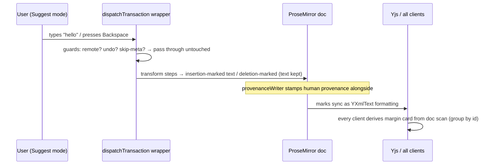
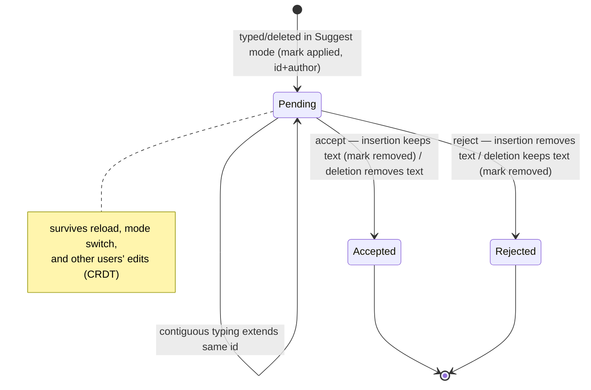

# feat: Google-Docs-style Suggest Typing and Click-to-Comment

## Summary

Upgrade the editor modes shipped in `docs/plans/2026-06-05-007-feat-claim-visibility-editor-modes-plan.md` to true Google Docs parity: in **Suggest mode** the user types directly into the document and their insertions/deletions render inline as tracked suggestions (insertions styled, deletions struck through but kept) that anyone can accept or reject; in **Comment mode** clicking a text block offers a comment affordance without needing a drag-selection; **Edit mode** is unchanged. Track changes are implemented as ProseMirror marks that sync through Yjs as document content — no new server rows.

---

## Problem Frame

Editor modes v1 made Suggest and Comment read-only: Suggest routes through a select → composer → margin-card detour, and Comment requires a precise drag-selection. The user's ask is the Google Docs interaction model — "in comment you click on stuff to comment; with suggest you can edit but it will show as a suggestion; and edit will edit." Plan 007 explicitly deferred "inline track-changes rendering for Suggest mode (in-text diff marks à la Google Docs)"; this plan implements that deferral plus the click-to-comment affordance. The origin requirements doc (`docs/brainstorms/riffrec-feedback/2026-06-05-1854/requirements-kickoff.md`) carries the original transcript ask: *"edit mode, suggest mode, or comment mode."*

---

## Assumptions

Headless-mode inferred bets (pipeline run; flow-analysis questions resolved as decisions):

- **Pending suggestions persist until resolved — by design.** Switching modes, reloading, or closing the tab leaves insertion/deletion marks in the shared doc, reviewable by anyone from any mode. This is Google Docs semantics, not orphaned state; no warning modal.
- **`insertion`/`deletion` are new mark types, distinct from `provenance`.** Authorship (permanent) and pending-change lifecycle (transient) are separate concerns with separate serialization and styling.
- **Edit-mode typing never carries suggestion marks.** A normalization guard strips insertion/deletion marks from locally typed text whenever suggest interception is off, so an Edit-mode user typing inside someone's pending insertion splits it rather than silently extending it.
- **Accept/reject are idempotent.** Commands re-scan the doc for the suggestion id at execution time and silently no-op when the marks are already gone (cross-client race converges via CRDT).
- **Pending insertion text is excluded from provenance percentages** until accepted; deletion-marked text still counts (it is still document content). Keeps the attribution promise honest during the pending window.
- **The server-row Suggestion pipeline stays for agent/AI proposals.** Inline marks are the human suggest mechanism; margin cards from server rows (agent/AI) and doc-derived cards (inline) co-exist. The human selection→composer UI path is retired; the `POST /d/:slug/suggestions` endpoint stays (tested, API-stable).
- **Click-to-comment fires only on non-empty textblocks.** Empty paragraphs, images, and rules show no affordance; code blocks and table cells with text are commentable via their text.
- **Demo doc is hardened**: when mode is locked, stored mode is ignored entirely so localStorage tampering cannot reach the new editable suggest path.

---

## Requirements

**Suggest mode (track changes)**

- R1. In Suggest mode the editor accepts direct typing; inserted text renders inline as a styled pending suggestion attributed to the typist.
- R2. Deleting in Suggest mode keeps the text in the document with strikethrough pending-deletion styling; content is only removed on accept.
- R3. Pending suggestions are document content: they sync to all clients through Yjs, render in every mode, and survive reload and mode switches.
- R4. Each suggestion (contiguous edit group sharing an id) is individually acceptable/rejectable by any participant; accept insertion = keep text, accept deletion = remove text, reject inverts; operations are idempotent under cross-client races.
- R5. Accepted insertions carry human provenance attributed to the suggester. The provenance chip excludes pending insertion text while pending (display-only exclusion); accepting a human suggestion never changes the AI-attributed character count — the accepted text enters the totals as human. Server-persisted provenance snapshots stay complete: they include pending insertion text with its provenance attrs.
- R6. Suggestion marks round-trip every markdown surface safely: remark serialization handlers exist before any `getMarkdown()` call, snapshots and agent API reads carry `<ins>`/`<del>` inline HTML, and `Document#plain_markdown` unwraps both tags keeping content.
- R7. Remote Yjs transactions, undo/redo, and agent edits are never re-intercepted into suggestions; paste in Suggest mode is tracked as an insertion; pasted content is sanitized of pre-existing suggestion marks.
- R8. The demo doc cannot enter Suggest or Comment behavior even via localStorage tampering — locked mode ignores stored mode.

**Comment mode (click-to-comment)**

- R9. In Comment mode, clicking a non-empty text block shows a comment affordance anchored to that block; activating it opens the existing comment composer with the block's text as `anchor_text` (capped at the existing 10 KB anchor limit). On mobile, it routes into the comments sheet.
- R10. Selection-based commenting continues to work in Comment mode; the editor stays read-only there.

**Mode system integrity**

- R11. Edit mode is unchanged for the editing user; Edit-mode users see others' pending suggestions inline and can accept/reject them; their own typing never carries suggestion marks.
- R12. The agent/AI margin suggestion pipeline (server rows, accept/reject routes, broadcasts) is unchanged and its tests stay green.

---

## Key Technical Decisions

1. **Mark-based track changes, not decorations or changesets.** Insertion/deletion marks are part of the ProseMirror document, so y-prosemirror syncs them as `YXmlText` formatting attributes — every peer sees the same pending suggestions with zero extra sync machinery. Decorations live in local plugin state and never reach other clients; `prosemirror-changeset` builds per-client diffs that diverge across peers. (External research: this is the approach BlockNote is validating for Yjs track changes.)
2. **Adopt `@handlewithcare/prosemirror-suggest-changes` (v0.1.8, MIT) for the step-transform logic.** Its `withSuggestChanges` dispatch wrapper already guards all six re-interception vectors (history, collab, `ySyncPluginKey.isChangeOrigin`, `isUndoRedoOperation`, self-skip meta) and covers `ReplaceStep`/`ReplaceAroundStep`/mark/attr steps including block-boundary handling. Reimplementing that transform matrix is the riskiest code in this feature; don't. **Wiring seam (priority order):** primary is a `$prose` plugin that wraps dispatch at plugin-init time via the plugin's `view` initializer — this mirrors how `provenanceWriter` already hangs off the editor and keeps construction-time view options clean; `editorViewOptionsCtx.dispatchTransaction` (set once at construction, reading a `suggestEnabledRef` at call time) is the fallback if plugin-init ordering conflicts with the collab service. Either way the wrapper is always installed and becomes a pass-through when suggesting is off — there is no mid-session re-wiring. **Constraint:** the repo accesses ProseMirror only through `@milkdown/kit` re-exports, so `instanceof` step checks require a single resolved copy of each `prosemirror-*` package. The library declares them as peerDependencies (`^1.0.0`), already satisfied by Milkdown's resolved versions — dedupe is the expected no-op, verified with `npm ls` in U1. **Escalation path (named risk):** if any `prosemirror-*` package resolves more than once, add npm `overrides` pinning to Milkdown's versions; if duplication survives one overrides attempt, vendor the library's step-transform modules into `app/frontend/editor/suggest_changes/` (MIT permits) immediately rather than iterating, keeping the same architecture.
3. **Marks are registered through Milkdown, with `author` added to the attrs.** Wrap the library's `insertion`/`deletion` mark specs in `$markSchema` (the `provenance` mark precedent in `app/frontend/editor/provenance/mark.ts`), extending attrs with `author` so attribution syncs as part of the mark. Mark specs keep the library's `inclusive: false` and mutual `excludes` so suggestion marks don't auto-extend and never stack same-type.
4. **Suggestions are doc-native — no server rows for inline suggestions.** The margin UI derives cards by scanning the doc for marks grouped by suggestion id (the `collectSpans` pattern in `app/frontend/editor/provenance/summary.ts`). No anchor matching, no broadcast, no accept endpoint: accept/reject are local ProseMirror transforms that sync via Yjs. The server `Suggestion` pipeline remains untouched for agent/AI proposals. Activity-feed entries for inline suggestions are deferred (Scope Boundaries).
5. **Mode wiring becomes `editable = mode !== 'comment'`, interception enabled only in Suggest mode.** Plan 007 KTD 3's sync/seeding invariant still binds — provider connection, Yjs sync, seeding, and agent edits stay mode-independent — while its read-only-Suggest constraint is explicitly superseded by this plan. Only the ProseMirror `editable` closure and the suggest-enabled flag (a ref, mirroring `editableRef`) react to mode.
6. **Provenance and suggestion marks compose; the provenanceWriter keeps working untouched in spirit.** Typed suggest-mode text gets the local human provenance mark at type time (provenanceWriter already does this), with the insertion mark alongside. Accept-insertion = remove the insertion mark — provenance is already correct, no re-attribution step. Accept-deletion = delete text (its provenance leaves with it). Accept/reject transactions set `addToHistory: false` and the existing `SKIP_PROVENANCE` meta, mirroring the provenance review-state pattern. **Ordering invariant:** the dispatch wrapper transforms steps *upstream* of all `appendTransaction` plugins — provenanceWriter and the edit-mode strip guard always observe the already-transformed (insertion/deletion-marked) transaction, which is why provenanceWriter stamps marked ranges correctly with no modification. The strip guard registers after `provenanceWriter` in the plugin chain and checks `SKIP_PROVENANCE` to avoid recursion. This invariant is verified, not assumed, in U2 (the wrapper's output shape — a transformed transaction the `appendTransaction` plugins observe — is an explicit early check).
7. **Serialization mirrors the provenance remark pattern.** `insertion`/`deletion` serialize to `<ins data-suggestion-id data-author>` / `<del data-suggestion-id data-author>` inline HTML with a parse transformer restoring the marks (pattern: `app/frontend/editor/provenance/remark.ts`). Handlers register with the marks — before any listener calls `getMarkdown()` (hard invariant from the original editor build: Milkdown throws on the first marked character otherwise). Server-side, `Document#plain_markdown` unwraps both tags keeping inner text (the document-as-is view: insertion text is in the doc; deletion text is still in the doc).

---

## High-Level Technical Design

### Updated per-mode capability matrix

| Capability | Edit | Suggest | Comment |
|---|---|---|---|
| ProseMirror `editable` | ✅ | ✅ (new) | ❌ |
| Typing effect | direct edit | tracked suggestion (new) | none |
| Selection toolbar | Comment · Ask AI | Comment (composer path retired) | Comment |
| Click block → comment affordance | ❌ | ❌ | ✅ (new) |
| Accept/reject suggestions (margin) | ✅ | ✅ | ✅ |
| Yjs sync / seeding / presence | ✅ | ✅ | ✅ (unchanged invariant) |

### Suggest-mode typing flow

### Suggestion mark lifecycle

### Accept/reject semantics

| | Insertion mark | Deletion mark |
|---|---|---|
| **Accept** | remove mark (text stays, human provenance already on it) | delete text |
| **Reject** | delete text | remove mark (text stays, original provenance) |

---

## Implementation Units

Serial on the editor track — U1 → U3 → U2 → U6 — ordered for testability: the scan/accept/reject core (U3) lands *before* interception (U2) because it operates on marks that tests can apply directly with mark transactions, giving U2 a ready-made acceptance path before the dispatch wrapper is wired. U4 (comment mode) depends only on U1's CSS scaffolding conventions and can run in parallel after U1; U5 (browser coverage) lands last. Units are listed in shipping order.

### U1. Suggestion marks, schema registration, and markdown serialization

**Goal:** `insertion`/`deletion` marks exist in the schema with `{id, author}` attrs, render styled, and round-trip every markdown surface safely.
**Requirements:** R6, foundation for R1–R3
**Dependencies:** none
**Files:**
- `package.json` (add `@handlewithcare/prosemirror-suggest-changes`; npm `overrides` only if `npm ls` shows duplicate `prosemirror-*` resolutions)
- `app/frontend/editor/suggest_changes/marks.ts` (new — `$markSchema` wrappers extending library specs with `author`)
- `app/frontend/editor/suggest_changes/remark.ts` (new — stringify/parse handlers, pattern-copied from `app/frontend/editor/provenance/remark.ts`)
- `app/frontend/editor/milkdown_editor.tsx` (register marks + handlers)
- `app/frontend/entrypoints/application.css` (`ins`/`del` pending styles, distinct from `.prov--*` treatments)
- `app/models/document.rb` (`plain_markdown` unwraps `<ins>`/`<del>` keeping content)
- `test/integration/document_markdown_test.rb` (or the existing test file covering `plain_markdown`)

**Approach:** Define both marks via `$markSchema` mirroring `provenance/mark.ts`, keeping the library's `inclusive: false` and mutual `excludes`, adding `author` (and `id`) attrs that serialize to `data-` attributes. Remark handlers emit `<ins …>`/`<del …>` inline HTML and a parse transformer restores marks — registered together with the marks so no `getMarkdown()` can fire first. Dependency verification (mandatory before U1 merges): `npm ls prosemirror-model prosemirror-transform prosemirror-state prosemirror-view` must show exactly one resolved copy of each — expected no-op, since the library declares them as peerDependencies (`^1.0.0`) satisfied by the installed versions (`prosemirror-view` 1.41.8, already ≥ 1.33.11 for the `inclusive: false` IME fix). Any duplicate → add npm `overrides`; duplication surviving one overrides attempt → vendor immediately (KTD 2 escalation path). Directional visual language (refine at implementation): insertions read as additions — tinted background/underline in an accent family distinct from the amber `.prov--ai` treatments; deletions are strikethrough with a muted/red-family tint; both must stay legible when stacked on provenance highlights, with the suggestion tint visually dominant while pending.
**Patterns to follow:** `app/frontend/editor/provenance/mark.ts` (mark schema + DOM attrs), `app/frontend/editor/provenance/remark.ts` (stringify/parse pair), `Document#plain_markdown`'s existing `data-provenance` span stripping.
**Test scenarios:**
- `plain_markdown` on content containing `<ins data-suggestion-id="x" data-author="A">new</ins>` and `<del …>old</del>` returns `new` and `old` inline with tags removed.
- `plain_markdown` on provenance spans is unchanged (regression).
- Round-trip: markdown containing `<ins>`/`<del>` HTML parses into marks and serializes back to equivalent HTML (browser-pass assertion via the editor; Minitest covers the server-side strip only).
- Test expectation for CSS/registration: none for Minitest — covered by the browser pass (marked text renders with the pending styles).
**Verification:** A doc whose Yjs content contains suggestion marks snapshots without throwing, agent API `content_markdown` shows the tags, `plain_markdown` shows clean text.

### U3. Inline suggestion core: scan, idempotent accept/reject, provenance summary

**Goal:** The mark-consuming core exists and is testable without interception: doc scan derives suggestions, accept/reject transforms work idempotently, provenance stays honest.
**Requirements:** R4, R5 (transform half), R12
**Dependencies:** U1
**Files:**
- `app/frontend/editor/suggest_changes/scan.ts` (new — walk doc, group marks by id into `InlineSuggestion[]` carrying exact `from`/`to` positions)
- `app/frontend/editor/suggest_changes/commands.ts` (new — idempotent accept/reject transforms wrapping the library commands)
- `app/frontend/editor/provenance/summary.ts` (display-only exclude-pending variant of `collectSpans`; snapshot path keeps the unfiltered scan)

**Approach:** `scan.ts` walks the doc grouping marks by id into `{id, author, insertedText, deletedText, from, to}` — positions come from the marks themselves, never text matching. Accept/reject call the library's `applySuggestion`/`revertSuggestion` by id, wrapped to: re-check the id still exists at execution time (silent no-op otherwise — race convergence), set `addToHistory: false` + `SKIP_PROVENANCE` meta. Provenance summary: the pending-insertion exclusion is **display-only** — `collectSpans` gains an exclude-pending variant (or parameter, default off) used by the header-chip path, with the insertion-mark check as a separate guard that precedes the existing provenance-mark lookup (text nodes carry both marks simultaneously; a naive single-mark lookup misses this); deletion-marked text keeps counting. The snapshot path (`pushSnapshot` in `milkdown_editor.tsx` calls `collectSpans` to build the persisted `provenance_spans`) keeps the complete unfiltered scan so the server provenance record stays accurate while suggestions are pending. Everything here is exercisable by applying marks directly with mark transactions — no interception layer needed — which is exactly how its checks are written and why this unit lands before U2.
**Test scenarios:** Minitest: none beyond R12 regression (existing `test/integration/suggestion_flow_test.rb` stays green untouched — run it). Browser/unit-level checks (synthetic marks via direct mark transactions): scan groups two disjoint ranges sharing an id into one suggestion; accept-insertion removes the mark and keeps text; reject-insertion removes the text; accept-deletion removes the text; reject-deletion keeps text and removes the mark; double-resolve of the same id no-ops silently; chip-path summary ignores insertion-marked text and counts deletion-marked text, while the snapshot-path scan still includes insertion-marked text with provenance attrs.
**Verification:** With marks applied programmatically, the scan→accept/reject→summary loop behaves per the accept/reject semantics table with no interception code present.

### U2. Suggest-mode transaction interception and mode rewiring

**Goal:** Suggest mode is editable; typing/deleting produces tracked suggestion marks; nothing else in the system notices.
**Requirements:** R1, R2, R3, R7, R8, R11 (typing-normalization half)
**Dependencies:** U1, U3 (the scan/commands core is the acceptance path for verifying interception output)
**Files:**
- `app/frontend/editor/suggest_changes/intercept.ts` (new — `$prose` dispatch-wrapper wiring, suggest-enabled state, paste sanitization)
- `app/frontend/editor/suggest_changes/normalize.ts` (new — separate `$prose` plugin: edit-mode mark stripping via `appendTransaction`)
- `app/frontend/editor/milkdown_editor.tsx` (suggest-enabled ref alongside `editableRef`; plugin registration order)
- `app/frontend/pages/documents/show.tsx` (`editable = mode !== 'comment'`; demo-lock hardening; remove the suggest-composer wiring in full — `suggestTarget`/`suggestError`/`suggestSubmitting` state, `submitSuggestion`, `liveSuggestPosition`, and the `SuggestComposer` render block; selection toolbar shows Comment in Suggest mode)
- `app/frontend/components/suggest_composer.tsx` (delete — UI path retired)
- `app/frontend/components/selection_toolbar.tsx` (drop the "Suggest a change" branch)
- `app/frontend/components/mode_control.tsx` (update the Suggest hint — the current copy "Propose changes for review — nothing edits the doc directly" becomes false; replace with copy like "Type directly — edits appear as tracked suggestions for review")

**Approach:** Wire the library's transform through a `$prose` plugin that wraps dispatch at plugin-init time (KTD 2 primary seam; `editorViewOptionsCtx.dispatchTransaction` is the fallback). The wrapper is always installed and passes through when `suggestEnabledRef.current` is false — the ref is read at call time, mirroring `editableRef`, with an empty-transaction nudge on mode change. Keep the library's six guards intact (remote `ySyncPluginKey.isChangeOrigin`, undo/redo, self-skip). Suggestion-id grouping: hold the current id in a ref while typing is continuous (same focus session), reset on selection jump or blur — each pause-and-move starts a new card. Add `transformPasted` stripping both suggestion marks from pasted slices (then, in suggest mode, the paste itself gets tracked as a fresh insertion). The edit-mode normalization guard lives in its own `$prose` plugin (`normalize.ts`), registered **after** `provenanceWriter`, checking both `ySyncPluginKey` and `SKIP_PROVENANCE` metas before stripping suggestion marks from locally typed text (KTD 6 ordering invariant). Demo hardening: when `modeLocked`, ignore `readStoredMode` entirely.
**Execution note:** Verify early — before any UI — that (a) a suggest-mode insertion survives a two-client round-trip (type in client A, confirm mark + author attr in client B via the U3 scan), (b) the seed path is safe with suggest mode pre-stored on a fresh doc: confirm the `applyTemplate`/collab-connect transactions are not wrapped into suggestions (they may not carry `ySyncPluginKey` meta — if not, gate the wrapper off until seeding settles, using a concrete signal such as the one-shot seed consumption already tracked in `milkdown_editor.tsx`), and (c) the wrapper's output shape matches the KTD 6 ordering invariant — the transformed (marked) transaction is what `appendTransaction` plugins like `provenanceWriter` observe, so provenance stamping lands on the marked ranges. This is the seed-burn-adjacent risk from plans 006/007; sync and seeding stay mode-independent.
**Test scenarios:** Test expectation for Minitest: none — interception is client-only with no server surface. Browser pass covers: typing in Suggest mode produces styled insertion (not plain edit); Backspace produces strikethrough kept text; remote client sees both with author attribution; seeding a fresh doc with pre-stored suggest mode yields clean unmarked seed content; Edit-mode typing inside a pending insertion splits it without extending it; paste in Suggest mode arrives as a tracked insertion; undo in Suggest mode removes the suggestion cleanly; demo doc with `pruf:mode:demo = suggest` in localStorage stays in Edit mode.
**Verification:** With two browsers open, suggest-mode typing in one renders as pending suggestion in both; Edit-mode collaborator keeps editing normally; no Yjs/seed regression on fresh docs with a stored suggest mode.

### U6. Inline suggestion review surface: margin cards and mobile sheet

**Goal:** Pending inline suggestions appear as margin cards (and in the mobile sheet) wired to the U3 commands.
**Requirements:** R4, R5 (surface half), R11 (review half)
**Dependencies:** U2, U3
**Files:**
- `app/frontend/components/margin_inline_suggestions.tsx` (new — sibling of `margin_suggestions.tsx`, not an extension)
- `app/frontend/pages/documents/show.tsx` (derive inline suggestions on doc change; pass to margin lane and mobile sheet)
- `app/frontend/components/margin_suggestions.tsx` (only if shared stacking needs lifting — keep changes minimal)
- `app/frontend/entrypoints/application.css`

**Approach:** A sibling component, not a `MarginSuggestions` extension — the payloads diverge on every axis that matters: inline suggestions position by exact `from`/`to` (`view.coordsAtPos(from)` directly, no `findTextRange` text matching, which would mis-anchor on duplicated text), and accept/reject are local ProseMirror commands, not server PATCHes. Both components render into the same margin gutter and share the CSS card skeleton; inline cards get a distinct "tracked edit" treatment versus agent/AI cards. Re-scan on doc change (the existing `spans` recompute cadence in `show.tsx` is the precedent). The mobile sheet list grows a section for inline suggestions so they are reviewable on small screens. Flash the affected range on resolve (`flashMergedRange` precedent).
**Test scenarios:** Minitest: none — pure client rendering over U3's tested core. Browser pass: suggest-mode edit in window A shows a margin card in window B with the author's name; accepting from window B lands text attributed to the suggester (`[data-provenance][data-kind="human"][data-author]` in DOM); double-resolve from two windows produces no error; the provenance chip excludes a pending insertion's text while pending, and accepting it adds the text as human attribution without changing the AI-attributed character count; agent margin suggestion accept flow still works alongside; inline suggestions appear in the mobile sheet at narrow viewport.
**Verification:** Full Google-Docs loop in two browsers: suggest → card appears for both → accept from the *other* client → text lands attributed to the suggester; provenance chip never lies.

### U4. Comment-mode click-to-comment

**Goal:** In Comment mode, clicking a text block offers a comment affordance — no drag-selection needed.
**Requirements:** R9, R10
**Dependencies:** U1 (CSS conventions only; parallel with U2/U3 otherwise)
**Files:**
- `app/frontend/pages/documents/show.tsx` (click handling in comment mode, affordance state, composer wiring)
- `app/frontend/components/selection_toolbar.tsx` or a small new `comment_affordance.tsx` (implementer's call — reuse the toolbar's positioning if it parameterizes cleanly)
- `app/frontend/entrypoints/application.css`

**Approach:** In Comment mode (editor read-only — clicks don't place a working cursor), handle click via the editor view: `posAtCoords` → resolve to the containing textblock → if its text is non-empty, show a compact "Comment" affordance positioned near the click (`anchorPosition` helper precedent). Activating it calls the existing `setComposerAnchor(blockText)` with the block's text capped at the 10 KB anchor limit; the existing mobile effect already routes `composerAnchor` into the comments sheet. Empty paragraphs, images, and rules: no affordance. Selection-based commenting keeps working (the existing `handleSelection` bypass for non-editable views already fires). Known limitation, accepted: `anchor_text` matching is first-occurrence (`findTextRange`), so a click on a duplicated paragraph anchors to its first occurrence — same behavior as existing comments.
**Test scenarios:** Minitest: none — comment creation flow and anchor caps are already integration-tested; this adds no server surface. Browser pass: in Comment mode, click on a paragraph → affordance appears → activating opens composer quoting that paragraph → submitted comment lands with that anchor; click on empty space/empty paragraph shows nothing; drag-selection commenting still works; Edit/Suggest modes show no click affordance.
**Verification:** A guest in Comment mode can comment on any paragraph with one click + composer; nothing regresses for selection comments.

### U5. Browser-test coverage for the new mode behaviors

**Goal:** The client-only behaviors above are pinned in the repo's Playwright check suite.
**Requirements:** regression net for R1–R5, R7–R11
**Dependencies:** U2, U3, U4, U6
**Files:**
- `script/browser_check.mjs`

**Approach:** Extend the existing two-window collab checks with the scenarios enumerated in U2, U3, U4, and U6 (they are listed there to avoid duplication; implement them as concrete checks here). Prioritize the cross-client cases — suggest-type → remote render → remote accept → provenance DOM assertion — and the seed-with-stored-suggest-mode check, which guards the highest-risk regression.
**Test scenarios:** This unit *is* the test work; the scenario inventory lives in U2/U3/U4/U6.
**Verification:** `script/browser_check.mjs` passes with the new checks included.

---

## Scope Boundaries

**In scope:** Google-Docs-parity behavior for the three existing modes on the existing anonymous trust model; doc-native inline suggestions; click-to-comment.

### Deferred to Follow-Up Work

- Activity-feed entries for inline suggestion propose/accept/reject (doc-native suggestions have no server row; an activity ping endpoint is a later add).
- Agent/API accept-reject of *inline* suggestions (agents keep the server-row pipeline; they can read pending tracked changes via `content_markdown`'s `<ins>`/`<del>` tags).
- Suggestion reply threads / per-suggestion discussion.
- Structural-edit suggestions beyond the library's block-boundary handling (paragraph joins render with zero-width anchors; full structural diff UX is out).
- Hover "+ comment" gutter affordance in Edit mode (this plan adds click-to-comment in Comment mode only).
- Removing the now-UI-orphaned `POST /d/:slug/suggestions` human endpoint (kept deliberately; revisit when agent surfaces evolve).

**Outside this product's identity** (carried from origin): accounts/auth, ownership transfer, per-mode edit-gating of other collaborators.

---

## Risks & Dependencies

- **Duplicate ProseMirror instances.** Un-deduped `prosemirror-*` copies break `instanceof` step checks silently. Expected no-op — the library declares them as peerDependencies satisfied by Milkdown's resolved versions — but U1's `npm ls` verification is mandatory, with a hard escalation trigger: any duplicate surviving one overrides attempt → vendor immediately (KTD 2).
- **Provenance dishonesty during the pending window.** Pinned by R5 + U3's summary exclusion and browser assertions; this is the unit's acceptance bar (the product promise from plan 007 carries forward).
- **Seed-claim burn regression.** Suggest mode becoming editable touches the same wiring as the flicker fix (plan 006). Sync/seed stay mode-independent (KTD 5); U2's execution note front-loads the check.
- **y-prosemirror same-type mark merge (upstream issue #34).** Two users' overlapping insertion marks merge into one suggestion attributed to the surviving mark's author. Accepted v1 limitation — non-overlapping concurrent suggestions are unaffected; revisit when y-prosemirror v2 / Yjs 14 changesets land.
- **IME/composition with `inclusive: false` marks.** Fixed in prosemirror-view ≥ 1.33.11; U1 verifies/pins the resolved version.
- **Library maturity.** v0.1.8, young but Marijn-ecosystem-adjacent and the basis of BlockNote's track-changes work; the vendoring fallback bounds the downside.
- **Mobile review surface.** Inline cards must reach the mobile sheet (U6) or suggestions are invisible on small screens — flow-analysis gap pinned in U6's files.
- **Seed transactions wrapped as suggestions.** The `applyTemplate`/collab-connect path may not carry `ySyncPluginKey` meta; if the dispatch wrapper is live at seed time with pre-stored suggest mode, the seeded content could arrive insertion-marked. U2's execution note front-loads this check; mitigation is gating the wrapper off until seeding settles.

---

## Sources & Research

- Origin requirements + transcript evidence: `docs/brainstorms/riffrec-feedback/2026-06-05-1854/requirements-kickoff.md` (modes ask; inline track-changes deferred there and in plan 007).
- Prior plans: `docs/plans/2026-06-05-007-feat-claim-visibility-editor-modes-plan.md` (mode infrastructure, KTD 3 editable-only invariant), `docs/plans/2026-06-05-006-fix-document-load-flicker-plan.md` (seeding constraints), `docs/plans/2026-06-05-001-feat-proof-clone-collaborative-editor-plan.md` (provenance mark invariants: `ySyncPluginKey` skip, toMarkdown-before-first-serialize, same-type mark replacement).
- Repo grounding: `app/frontend/editor/milkdown_editor.tsx` (editable ref + collab bind), `app/frontend/editor/provenance/` (mark/writer/remark/summary patterns), `app/frontend/components/margin_suggestions.tsx` (card positioning), `app/frontend/pages/documents/show.tsx` (mode state, selection toolbar matrix, `anchorPosition`).
- External (load-bearing for KTD 1–3): [`@handlewithcare/prosemirror-suggest-changes`](https://github.com/handlewithcarecollective/prosemirror-suggest-changes) (mark schema, six-guard dispatch wrapper, accept/reject commands); [y-prosemirror issue #34](https://github.com/yjs/y-prosemirror/issues/34) (same-type mark merge); ProseMirror discuss on IME + `inclusive: false` (fixed prosemirror-view 1.33.11); BlockNote/Yjs-14 track-changes direction (FOSDEM 2026) validating the mark-based approach.
