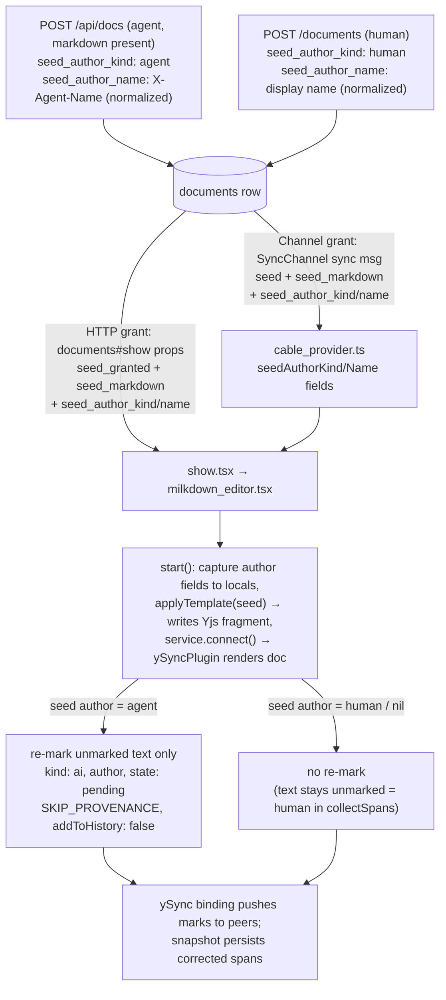

# fix: Attribute agent-seeded documents to the agent, not the opening human

## Summary

When an AI agent creates a document via `POST /api/docs` with markdown, the provenance chip shows **"100% human · 0% AI"** — exactly backwards. The seed markdown is stored on the document and applied into the shared Yjs doc by the first browser client; the seeded text ends up carrying **no provenance mark at all**, and `collectSpans` counts unmarked text as human. The fix: record seed authorship on the `Document` row, carry it through both seed-grant paths (HTTP props and SyncChannel), and explicitly mark seeded text as AI-authored after the collab connection renders it — mirroring how accepted agent suggestions are already attributed.

---

## Problem Frame

Pruf tracks character-level provenance via a ProseMirror mark (`kind: 'human' | 'ai'`, `author`, `state`). Attribution happens in three places today:

1. **Typed input** — `provenanceWriter` (`app/frontend/editor/provenance/writer.ts`) auto-marks locally inserted text as `{kind: 'human', author: me, state: 'verbatim'}`. It skips remote transactions (`ySyncPluginKey` meta) and explicitly opted-out transactions (`SKIP_PROVENANCE` meta).
2. **Accepted agent suggestions** — `applySuggestion` (`app/frontend/editor/suggestions.ts`) explicitly marks merged text `{kind: 'ai', author, state: 'pending'}` and sets `SKIP_PROVENANCE` so the writer doesn't re-attribute. **Correct today.**
3. **Document seeding** — `collabService.applyTemplate(seedMarkdown)` in `app/frontend/editor/milkdown_editor.tsx` `start()`. Verified against the Milkdown source (`@milkdown/plugin-collab`): `applyTemplate` writes the parsed template **directly into the Yjs XmlFragment** (`fragment.delete` + `applyUpdate`) — it never dispatches a ProseMirror transaction. The content only reaches the editor view when `service.connect()` installs `ySyncPlugin`, whose initial render transaction carries `ySyncPluginKey` meta — which `provenanceWriter` skips as remote. Net result: **seeded text carries no provenance mark.** `collectSpans` (`app/frontend/editor/provenance/summary.ts`) defaults unmarked text to `kind: 'human'`, so a fully agent-written doc reads "100% human · 0% AI". **Wrong when the seed came from an agent.**

Nothing records *who authored the seed*. `Api::DocsController#create` logs an `Activity` but the `documents` table has no seed-authorship columns, so neither grant path can tell the editor "this content is AI-written."

Secondary symptom: before any browser opens the doc, `provenance_spans` is empty, so `GET /api/docs/:slug` serves `summary: {total: 0, ...}` for a doc that is 100% agent-written. And once the bug fires, the first debounced snapshot persists the *wrong* spans (100% human) to the server, which the agent API then serves indefinitely.

## Requirements

- R1: A document created by an agent via `POST /api/docs` with markdown shows the seed content as AI-authored in the editor chip (0% human · 100% AI for a doc the human hasn't touched).
- R2: Attribution survives both seed-grant paths: the HTTP page-render grant and the SyncChannel subscribe-handshake grant (including stale-claim reclaim).
- R3: Human-created documents keep current behavior — seed attributed to the human (no AI inflation).
- R4: Subsequent human edits inside or around AI-seeded text are still attributed to the human (existing `provenanceWriter` typed-input override must keep working).
- R5: The persisted snapshot (`provenance_spans`) and the agent API summary reflect the corrected attribution.
- R6: The agent API cold-read (`GET /api/docs/:slug` before any browser session) reports attribution consistent with seed authorship rather than `total: 0`.

---

## Key Technical Decisions

1. **Store seed authorship on the `Document` model** (`seed_author_kind: "human" | "agent"`, `seed_author_name`), set at create time by both controllers. Both grant paths (HTTP props and channel transmit) read from the row, so authorship survives the stale-claim reclaim path where a different client than the original grantee ends up seeding. Nullable, no default — `nil` means "legacy doc or no attributable author, treat as human" for backward compatibility. **Agent authorship is recorded only when the agent actually supplied markdown** — an agent create that falls back to `Document::DEFAULT_SEED` leaves the columns nil, so placeholder boilerplate is never claimed as AI prose (and the U4 cold-read can't lie about it).
2. **Attribute after `connect()` with a re-mark transaction over unmarked text only.** `applyTemplate` mutates the Yjs fragment directly; the content first exists in the ProseMirror view after `service.connect()` installs `ySyncPlugin` (its init render runs synchronously inside `connect()` via `view.updateState`). So the re-mark dispatches **immediately after `service.connect()`**: walk text nodes, and for each text node that carries **no existing provenance mark**, `addMark` `{kind: 'ai', author: seedAuthorName, state: 'pending'}`, with `SKIP_PROVENANCE` and `addToHistory: false` metas. Marking only unmarked text is the race guard: if `applyTemplate` no-opped (its remote-empty condition found content from another seeder), that content already carries marks and the re-mark touches nothing. This mirrors the established `applySuggestion` pattern (explicit attribution + `SKIP_PROVENANCE`) and avoids widening `provenanceWriter`'s skip logic. The dispatched re-mark propagates to all peers through the now-installed ySync binding.
3. **Agent-seeded text gets `state: 'pending'`**, consistent with accepted agent suggestions: machine prose stays visibly machine prose until a human reviews it. The chip will read "0% human · 100% AI · 100% unreviewed" and the seed content plugs into the existing review-state machinery (`reviewed`/`endorsed` advancement). **Deliberate UX consequence:** the entire seeded document renders with the pending-AI tint on first open, and any AI span is clickable for review — that is the product's existing visual language for unreviewed AI text, applied doc-wide because the whole doc *is* unreviewed AI text. If this proves too heavy in practice, dialing the initial state back is a one-line change.
4. **`seed_author_kind` uses `"human" | "agent"` values** — a deliberate two-value subset of the `suggestions.author_kind` vocabulary (`ai | agent | human`): seeds come either from the browser create form (human) or the agent API with an `X-Agent-Name` header (agent); there is no third source. The frontend maps any non-`human` kind to the provenance mark kind `'ai'`, same as `applySuggestion` does (`const human = suggestion.author_kind === 'human'`).
5. **`seed_author_name` is normalized and length-capped at write time.** The name flows to every doc opener via Inertia props and the SyncChannel transmit — the same broadcast-amplification surface that motivated the `owner_name` 255-char cap (`app/models/document.rb`). Reuse `Document.normalize_owner_name` (strip, cap 255, "Anonymous" fallback) for the human path and `Document.normalize_display_name` (strip, cap 255, nil for blank) for the agent path, plus a `length: { maximum: 255 }, allow_nil: true` validation mirroring `owner_name`.
6. **Cold-read fallback in `Document#provenance_summary`:** when `provenance_spans` is empty, `seed_markdown` is present, and `seed_author_kind == "agent"`, return a summary derived from a synthetic single span (`kind: "ai"`, `state: "pending"`, `chars: seed_markdown.length`) so `AgentGuide.state` serves honest numbers before the first client snapshot arrives. The total is an approximation (markdown source length exceeds rendered text length — syntax overhead), acceptable as an upper bound that gets replaced by the first real snapshot. Human-authored or legacy seeds keep returning zeros (chip hides at `total: 0`; claiming 100% human for never-opened human seeds is also defensible but a behavior change beyond the bug — deferred).

## Assumptions

- "Should be 100% AI" means AI-authored **and unreviewed** (`state: 'pending'`), not pre-endorsed. This matches the existing accepted-suggestion convention; the doc-wide tint consequence is accepted (KTD 3).
- An agent creating a doc *without* markdown gets `Document::DEFAULT_SEED` boilerplate with **nil** authorship (treated as human, no AI claim) — see KTD 1.
- Human-created docs (`documents#create`) record `seed_author_kind: "human"` with the same normalized name used for `owner_name`; editor behavior for them is unchanged.
- `X-Agent-Name` remains self-asserted (pre-existing trust model; suggestion author names already flow the same way). This plan caps and normalizes the value but does not add authentication.

---

## High-Level Technical Design

Seed authorship flow across the two grant paths:

---

## Implementation Units

### U1. Record seed authorship on Document

**Goal:** The `documents` row knows who authored its seed markdown.

**Requirements:** R1, R2, R3 (foundation), R6

**Dependencies:** none

**Files:**
- `db/migrate/` (new migration: add `seed_author_kind` and `seed_author_name` string columns to documents, nullable, no default; `seed_author_name` with `limit: 255` mirroring `owner_name`)
- `app/models/document.rb`
- `app/controllers/api/docs_controller.rb`
- `app/controllers/documents_controller.rb`
- `test/integration/agent_api_test.rb`
- `test/integration/document_create_test.rb` (**new file** — no integration test for `documents#create` exists today; create it as an `ActionDispatch::IntegrationTest` following the structure of `test/integration/document_seed_claim_test.rb`)

**Approach:** Follow the `add_ownership_to_documents` migration pattern (`db/migrate/20260605200000_add_ownership_to_documents.rb`). `Api::DocsController#create` sets `seed_author_kind: "agent"`, `seed_author_name: Document.normalize_display_name(current_agent)` **only when `current_agent` is present AND `params[:markdown]` is present** (KTD 1 — DEFAULT_SEED fallback docs stay nil). `DocumentsController#create` sets `seed_author_kind: "human"`, `seed_author_name:` the exact same `Document.normalize_owner_name(...)` value already computed for `owner_name` (assign once to a local, use for both). Add `validates :seed_author_name, length: { maximum: 255 }, allow_nil: true` to the model, mirroring the `owner_name` cap and its rationale comment (the value is transmitted to every doc opener).

**Test scenarios:**
- `POST /api/docs` with `X-Agent-Name: Claude` and markdown → document persists `seed_author_kind == "agent"`, `seed_author_name == "Claude"`.
- `POST /api/docs` with `X-Agent-Name` but **no markdown** → DEFAULT_SEED stored, `seed_author_kind` nil (KTD 1).
- `POST /api/docs` with markdown but no `X-Agent-Name` header → `seed_author_kind` nil (no attributable author).
- `POST /api/docs` with an oversized (>255 chars) agent name → stored name capped, create succeeds.
- `POST /documents` as a human with a session display name → `seed_author_kind == "human"`, `seed_author_name` matches `owner_name`.
- `POST /documents` with no name at all → `seed_author_name == "Anonymous"` (normalize_owner_name fallback), kind `"human"`.

**Verification:** `bin/rails test` green; new assertions pass.

### U2. Carry seed authorship through both grant paths to the client

**Goal:** Whichever path grants the seed claim, the editor receives `seed_author_kind`/`seed_author_name` alongside `seed_markdown`.

**Requirements:** R2

**Dependencies:** U1 (run the U1 migration before writing or running U2 tests — the props/channel code reads the new columns)

**Files:**
- `app/controllers/documents_controller.rb` (show props)
- `app/channels/sync_channel.rb` (seed message)
- `app/frontend/pages/documents/show.tsx` (`DocumentProps` interface + `<DocumentEditor>` props)
- `app/frontend/editor/cable_provider.ts` (`SyncMessage` type, `seedAuthorKind`/`seedAuthorName` fields, `case 'sync'` handler)
- `app/frontend/editor/milkdown_editor.tsx` (`EditorProps`, prop→provider threading)
- `test/integration/document_seed_claim_test.rb`
- `test/channels/sync_channel_test.rb`

**Approach:** Symmetric extension of the existing seed-grant fields. HTTP path: add the two fields to the `document:` props hash in `documents#show` (always include them — they're cheap and the client gates on `seed_granted`). Channel path: add them to the `message` hash inside the `claim_seed?` branch in `SyncChannel#subscribed`. Client: extend `SyncMessage`, store on the provider next to `seedMarkdown` (same one-shot consume semantics — consumed and nulled together with `seedMarkdown` in `start()`), and in `milkdown_editor.tsx` assign provider fields on the HTTP-grant branch (`provider.seedMarkdown = seedMarkdown` gains sibling assignments). Both paths converge on `provider.seedAuthorKind`/`seedAuthorName` read inside `start()`.

**Patterns to follow:** The existing `seed`/`seed_markdown` threading at `sync_channel.rb` (subscribed transmit), `cable_provider.ts` (`case 'sync'` handler), and `milkdown_editor.tsx` (seed-grant branch).

**Test scenarios:**
- Channel grant: subscribing to a fresh agent-seeded doc transmits `seed: true` with `seed_author_kind: "agent"` and the agent's name (`sync_channel_test.rb`).
- Channel no-grant: a hydrated doc (yjs_state present) transmits no seed authorship fields.
- HTTP grant: `GET /d/:slug` first HTML render includes `seed_author_kind`/`seed_author_name` in Inertia props (`document_seed_claim_test.rb`, `assert_inertia_props`).
- Stale-claim reclaim: after the HTTP grant times out, the channel reclaim still carries the agent authorship (it reads the same row).

**Verification:** `bin/rails test` green; TypeScript compiles (Vite build / typecheck used by the repo).

### U3. Attribute seeded text as AI after the collab connection renders it

**Goal:** An agent-seeded doc renders "0% human · 100% AI" in the chip from the first settled frame after seeding, and the corrected marks sync to all clients and the snapshot.

**Requirements:** R1, R3, R4, R5

**Dependencies:** U2

**Files:**
- `app/frontend/editor/milkdown_editor.tsx` (inside `start()`)

**Approach:** In `start()`, capture `provider.seedAuthorKind`/`seedAuthorName` into **local constants before the one-shot null-out** (same consume discipline as `seedMarkdown` — a later refactor that clears provider fields must not silently disable attribution). Then, **after `service.connect()`** (the point at which `ySyncPlugin`'s init render has populated the ProseMirror view from the Yjs fragment — `applyTemplate` itself writes only to the fragment), when the captured kind is `"agent"`: dispatch a single re-mark transaction that walks text nodes (respecting `parent.type.allowsMarkType`, mirroring the writer's guard) and adds `{kind: 'ai', author: seedAuthorName ?? '', state: 'pending'}` **only to text nodes with no existing provenance mark**. Set `SKIP_PROVENANCE` and `addToHistory: false`, then dispatch. Guard rationale: seeded text is unmarked; if `applyTemplate` no-opped because another seeder's content was already present, that content carries marks and the re-mark touches nothing (race-safe), and `nil`/`"human"` kinds skip the re-mark entirely (legacy + human docs keep today's behavior). The ySync binding (installed by `connect()`) writes the marks back into the Yjs doc, so peers receive correctly attributed content. If the doc is empty after `connect()` (template skipped and no remote content yet), the walk finds nothing — harmless.

Two implementation notes:
- The mark is `inclusive: true`, so text typed at an AI-span boundary momentarily inherits the AI mark within the dispatch cycle before `provenanceWriter`'s appendTransaction replaces it with the local-human mark (the writer only skips when the existing mark is already local-human). No code change needed — expected behavior when debugging intermediate states; this is what satisfies R4.
- Verify during implementation that the view contains the seeded content immediately after `connect()` returns (ySyncPlugin's init render is synchronous inside `view.updateState`); if a Milkdown upgrade ever makes it async, the re-mark needs to chain on the first ySync render instead.

**Technical design (directional, not prescriptive):** the re-mark mirrors the explicit-attribution + `SKIP_PROVENANCE` pattern of `applySuggestion` in `app/frontend/editor/suggestions.ts`, applied doc-wide to unmarked text instead of to an inserted range.

**Test scenarios** (no frontend unit-test runner exists in this repo; cover via Rails-side snapshot assertions plus the browser pass in the pipeline's test phase):
- Agent-seeded doc opened in a browser → chip shows 0% human · 100% AI · 100% unreviewed (browser verification).
- Human types a sentence into the agent-seeded doc → chip human percentage rises; typed range carries the human mark (browser verification; exercises R4).
- Snapshot after seeding persists `provenance_spans` with `kind: "ai"`, `state: "pending"` spans (browser-phase verification; server shape already covered by `test/integration/snapshot_test.rb`).
- Human-created doc seed → no AI spans (regression guard, browser verification).
- Second client joining an agent-seeded doc sees the same AI attribution (Yjs propagation, browser verification if feasible).

**Verification:** Manual/Playwright pass: create a doc via `POST /api/docs` with markdown and an `X-Agent-Name` header, open `/d/:slug` in a browser, confirm the chip; type text and confirm human percentage appears; reload and confirm marks persisted through Yjs state.

### U4. Honest cold-read summary for never-opened agent docs

**Goal:** `GET /api/docs/:slug` reports AI authorship for an agent-seeded doc even before any browser session has pushed a snapshot.

**Requirements:** R6

**Dependencies:** U1

**Files:**
- `app/models/document.rb` (`provenance_summary`)
- `app/services/agent_guide.rb` (one-line wording fix)
- `test/models/document_test.rb`

**Approach:** In `Document#provenance_summary`, when `provenance_spans` is empty, `seed_markdown` is present, **and** `seed_author_kind == "agent"`, return a summary derived from a synthetic span covering the seed length (`total: seed_markdown.length, human_pct: 0, ai_pct: 100, unreviewed_pct: 100`). All other empty-span cases keep returning zeros (no behavior change for human or legacy docs; DEFAULT_SEED agent docs are excluded automatically because U1 leaves their `seed_author_kind` nil). The total approximates rendered length from the markdown source (syntax overhead inflates it) — acceptable upper bound, replaced by the first real snapshot. `AgentGuide.state` picks this up with no changes since it calls `provenance_summary` directly. Leave the `spans:` array it serves as-is (empty) — the summary is the headline number; synthesizing fake span *objects* invites drift with the client format. While in `agent_guide.rb`: correct the guide text that says contributed text is marked `kind=agent` — the provenance mark vocabulary is `kind=ai` (`mark.ts` renders only `prov--ai`/`prov--human` classes), and this plan's re-mark uses `'ai'`.

**Test scenarios:**
- Agent-seeded doc, no spans → summary `{ai_pct: 100, human_pct: 0, unreviewed_pct: 100, total: seed length}`.
- Human-seeded doc, no spans → all zeros (unchanged).
- Legacy doc (nil `seed_author_kind`), no spans → all zeros (unchanged).
- Agent doc created without markdown (DEFAULT_SEED, nil kind) → all zeros — no AI claim on boilerplate.
- Agent-seeded doc **with** pushed spans → spans win; fallback not used.

**Verification:** `bin/rails test` green.

---

## Scope Boundaries

**In scope:** seed-authorship recording, both grant paths, post-connect attribution, cold-read summary fallback, `seed_author_name` normalization/cap, `agent_guide.rb` provenance-kind wording fix.

**Out of scope (true non-goals):**
- Changing how typed input, paste, or suggestion acceptance attribute text — all correct today.
- Backfilling `seed_author_kind` for existing documents (unknowable retroactively; nil-as-human is the honest default).
- Authenticating `X-Agent-Name` (pre-existing self-asserted trust model shared with the suggestions path).

### Deferred to Follow-Up Work

- Cold-read summary for *human*-seeded never-opened docs (currently zeros; claiming 100% human pre-snapshot is defensible but is a behavior change beyond this bug).
- Surfacing snapshot push failures (existing P2 finding: failures are silently swallowed in `milkdown_editor.tsx`; a failed first snapshot would delay the corrected spans reaching the agent API).
- Serving synthetic `spans:` entries (not just summary) on the agent API cold read.
- Server-side validation of client-pushed `provenance_spans` values (`kind`/`state` enums) — pre-existing surface, slightly more load-bearing now that summaries derive from it.

---

## Risks & Dependencies

- **ySync init-render timing:** the re-mark assumes the ProseMirror view reflects the seeded Yjs content synchronously after `service.connect()` returns (verified against the current `@milkdown/plugin-collab` source: `connect()` → `#flushEditor` → `view.updateState`, and `ySyncPlugin`'s view init renders synchronously). A future Milkdown upgrade could change this — U3 carries an implementation-time verification note.
- **Unmarked-only guard vs. pre-fix documents:** docs seeded before this fix have unmarked text, but they can never receive a seed grant again (`try_claim_seed` requires blank `yjs_state`), so the re-mark can't fire on them — their text remains human-by-default, same as today.
- **Suggest-mode interaction:** seeding runs with suggesting off by design (existing invariant in `milkdown_editor.tsx`); the re-mark happens inside `start()` before `syncSuggesting`, so it cannot be intercepted into a suggestion. No change needed, but don't reorder.
- **Agent-controlled author names:** `seed_author_name` originates from the `X-Agent-Name` header. It is normalized and capped at write time (KTD 5); it then flows into mark attrs the same way suggestion author names already do (rendered via ProseMirror's attribute-setting DOM path, not HTML injection). No new exposure class, but the cap is mandatory, not optional.
- **y-prosemirror mark fidelity:** provenance attrs are plain JSON and already survive Yjs round-trips for suggestion-merged text; the seed re-mark uses the identical mark, so no new serialization surface.
