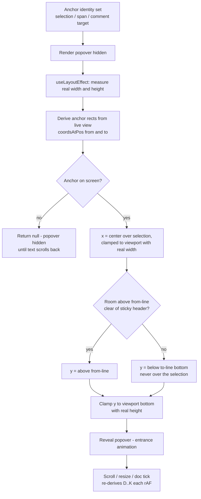

# feat: Slick Anchored Placement for Selection, Comment, and Review Chrome

## Summary

Polish the positioning and UX of the floating forms around the edit/suggest/comment modes: the selection toolbar, the click-to-comment affordance, the AI review popover, and the comment composer. Replace estimated-width placement with measured, selection-centered placement that never covers selected text; stop the toolbar from jittering during drag-selection; and move the desktop comment composer from the far-right rail to an anchored card next to the selection (Google Docs style), which also fixes a real bug where the composer is invisible when the side panel is hidden.

---

## Problem Frame

A design critique of the current floating chrome (all in `app/frontend/pages/documents/show.tsx` + `app/frontend/entrypoints/application.css`) surfaces five placement problems:

1. **Left-edge anchoring, not selection-centered.** `anchorPosition()` (show.tsx) anchors every popover at `view.coordsAtPos(selection.from)` and left-aligns at `coords.left`. Selecting mid-line or selecting backwards puts the toolbar far from where the user's eye and cursor are. Google Docs, Medium, and Notion center the toolbar horizontally over the selection.
2. **Estimated widths, not measured.** Clamping uses hardcoded guesses (`estWidth` of 190/200/320). The actual rendered width differs (label lengths vary by mode — "Comment on this paragraph" vs "Comment · Ask AI"), so near the right viewport edge the toolbar either overflows or over-clamps. There is no bottom-edge clamping at all.
3. **Flip-below covers the selection.** When there's no room above (`above < 52`), the toolbar flips to `coords.bottom + 8` of the *start* position — for a multi-line selection that lands on top of the selected text.
4. **Drag jitter.** `handleSelection` fires on every selection change, so the toolbar appears and chases the cursor while the user is still dragging. Polished editors show selection chrome only after the pointer is released.
5. **Composer disconnect + hidden-panel bug.** Clicking "Comment" opens the composer in the right rail (`CommentsPanel`), ~36rem of eye travel away from the selected text, with only a truncated quote as context. Worse: when the panel is hidden (⌘\, `doc-page.is-panel-hidden .doc-rail { display: none }`), the composer opens invisibly — "Comment" appears to do nothing.

The margin suggestion cards already have a strong placement system (anchor-height stacking, two-pass measure, placed-then-animate); the popover chrome deserves the same level of craft.

---

## Key Technical Decisions

- **Keep positioning hand-rolled; centralize it in one shared hook.** No `@floating-ui/dom` dependency. The repo is deliberately dependency-light and the needed logic (measure, center, clamp, flip) is ~60 lines. Today the math lives inline in `show.tsx` with per-callsite estimates; the fix is one `useAnchoredPopover`-style hook all three popovers share.
- **Two-pass measure-then-place, mirroring the margin-card pattern.** Render the popover invisibly (`visibility: hidden` or opacity 0) on first mount, measure its real box in `useLayoutEffect`, then position before paint. This is the same discipline `MarginSuggestions` already uses (`is-placed` flag) — initial placement never flashes at a wrong position and clamping uses true dimensions.
- **Anchor geometry stays identity-based and re-derived live.** Preserve the existing architecture: popover state stores *what* is anchored (selection text, span), never coordinates; geometry re-derives from the live editor on the existing rAF-throttled scroll/resize tick (`popoverTick`) and doc changes. This plan changes *how* coordinates are computed, not *when*.
- **Center over the selection range, flip below the selection's end.** Horizontal: midpoint between `coordsAtPos(from)` and `coordsAtPos(to)` when they're on the same line; on multi-line selections, center over the line containing the toolbar's vertical anchor. Vertical: prefer above `from`'s line; when blocked by the sticky header, place below `coordsAtPos(to).bottom` — below the *last* line of the selection, never on top of it.
- **Show selection chrome on settle, not mid-drag.** Track primary-pointer-down state (window-level `pointerdown`/`pointerup`); while the pointer is down with a growing selection, defer showing the toolbar until release. Keyboard selections (shift+arrows) show after the existing selection-change signal settles — no timer-based debounce of position updates, only of first reveal.
- **Desktop comment composer becomes an anchored floating card; the rail keeps the comment list.** The composer renders adjacent to the selection using the same shared positioning hook (below the selection's last line by default — composers are taller than toolbars and reading flows downward). Submitting posts exactly as today (`anchor_text` semantics, optimistic insert into the rail list). Mobile keeps the comments sheet path untouched. This removes the rail-visibility dependency, fixing the hidden-panel bug structurally rather than by force-opening the panel.
- **Anchor stays visibly marked while composing.** Reuse the CSS Custom Highlight API pattern from `MarginSuggestions` (`CSS.highlights`) to tint the anchored text while the composer is open, so the connection between form and text is explicit even though the selection itself collapses when focus moves into the textarea.

---

## High-Level Technical Design

Placement algorithm for the shared hook (directional guidance, not implementation specification):

Reveal gating sits in front of this pipeline: while the primary pointer is down, a non-empty selection sets the anchor identity but holds reveal until `pointerup`.

---

## Requirements

**Placement correctness**

- R1. Selection toolbar and click-to-comment affordance render horizontally centered over the selection (or the anchor line for multi-line selections), clamped fully inside the viewport on both axes using measured dimensions — no hardcoded width estimates remain.
- R2. Popovers never cover selected text: above the selection's first line by default; when blocked by the header, below the selection's last line.
- R3. First paint is already correctly placed — no visible jump from an unmeasured position (two-pass measure before reveal).
- R4. Scroll, resize, and document-change tracking continue to work exactly as today (rAF-throttled, identity-anchored, hide-when-offscreen), with no additional per-frame cost beyond one `getBoundingClientRect` of the popover.

**Interaction feel**

- R5. During a mouse drag-selection the toolbar does not appear or chase the cursor; it reveals once the pointer is released over a non-empty selection. Keyboard-driven selections still reveal without requiring a pointer event.
- R6. The existing entrance animation (`popover-in`) plays on reveal; repositioning while open (scroll/typing) remains instant with no transition lag.

**Comment composer**

- R7. On desktop, choosing "Comment" opens an anchored composer card adjacent to the selection instead of (not in addition to) the rail composer; Escape and Cancel dismiss it; ⌘/Ctrl+Enter submits; submit behavior (optimistic comment, `anchor_text`, server POST) is byte-identical to today.
- R8. The composer is fully usable when the side panel is hidden — the hidden-panel invisible-composer bug is gone.
- R9. While the composer is open, its anchored text is visibly highlighted; the highlight clears on submit, cancel, or dismiss.
- R10. Mobile (≤64rem) behavior is unchanged: "Comment" routes into the comments sheet with the composer at the top, as today.

**Review popover parity**

- R11. The AI review popover adopts the same measured, centered, flip-safe placement (it currently shares the worst of the estimate-based logic with `estWidth = 320`).

---

## Implementation Units

### U1. Shared anchored-popover placement hook

**Goal:** One reusable hook that turns an anchor (ProseMirror position range) plus a popover element ref into measured, centered, clamped, flip-safe viewport coordinates.

**Requirements:** R1, R2, R3, R4

**Dependencies:** none

**Files:**
- `app/frontend/lib/use_anchored_popover.ts` (new)
- `app/frontend/pages/documents/show.tsx` (replace `anchorPosition` and the three `useMemo` position derivations)
- `app/frontend/entrypoints/application.css` (pre-measure hidden state)

**Approach:** The hook owns the two-pass cycle: callers pass a function deriving the anchor range (`from`/`to`) from the live view, plus the existing invalidation signals (`spans`, `popoverTick`, doc tick). It measures the popover element via ref, computes x (centered, clamped with real width), y (above-first-line preferred, below-last-line fallback, bottom-clamped with real height), and returns `null` when the anchor is offscreen. The mobile offset constants (44/60) and header clearance (52) move into the hook as named constants. Keep the `try/catch` around `coordsAtPos` — the editor can be mid-teardown. Note: today's `anchorPosition` is already a single shared helper — what's per-callsite is only the width estimates; the hook replaces it with measured geometry, it is not a first-time extraction. During the pre-measure hidden phase the popover element is inert to keyboard focus (`aria-hidden="true"` and unfocusable children) so a Tab press can never land inside an invisible popover.

**Patterns to follow:** `MarginSuggestions`' two-pass `useLayoutEffect` measure + `is-placed` reveal flag (`app/frontend/components/margin_suggestions.tsx`); the existing rAF-throttled `popoverTick` effect in `show.tsx`.

**Test scenarios:**
- Happy path: selecting a short mid-line phrase shows the toolbar centered above it; toolbar's box never overlaps the selection rect.
- Edge: selection beginning near the right viewport edge — toolbar clamps inside the viewport (assert `boundingBox().x + width <= viewport width - 8`), with its real width, not an estimate.
- Edge: selection on the first visible line under the sticky header — toolbar flips below the selection's *last* line (assert toolbar top ≥ selection bottom).
- Edge: selection scrolled offscreen — popover unmounts/hides; scrolling back restores it at the right place.
- Edge: multi-line (3+ lines) selection — flip-below places the toolbar under the final line, not inside the block.
- First-paint (R3): the popover's first visible frame is already at its final position — assert no positional mutation between reveal and the next frame (e.g., compare `boundingBox()` across two rAFs after appearance).
- Performance (R4): repositioning work per scroll/resize tick stays at one `coordsAtPos` per anchor end plus one `getBoundingClientRect` of the popover — verified by code review of the hook, not instrumentation; the existing rAF-throttle effect is reused unchanged.
- Test expectation: these run as Playwright assertions in U5's check script (the repo has no JS unit-test framework; `npm run check` covers types).

**Verification:** `npm run check` passes; U5 browser-check scenarios for placement pass.

### U2. Reveal-on-settle for drag selections

**Goal:** The selection toolbar appears once per settled selection instead of chasing the cursor mid-drag.

**Requirements:** R5, R6

**Dependencies:** U1

**Files:**
- `app/frontend/pages/documents/show.tsx`

**Approach:** Track primary-pointer state with window-level listeners (capture phase, passive). While the pointer is down, `handleSelection` still records the selection target (anchor identity) but the render gate holds the toolbar hidden; `pointerup` flips the gate and the toolbar reveals with its entrance animation at the final, settled position. Keyboard selections: reveal on the first non-empty selection-change event with no pointer down — no timer or debounce anywhere. A held Shift+Arrow sweep will reposition the visible toolbar per keystroke; that is accepted (only mouse drag gets the hold-until-release gate). Mode switches and Escape clear the gate state. Click-to-comment in Comment mode is a bare click (empty selection) and is unaffected by the drag gate.

**Patterns to follow:** the existing window-level listener effects in `show.tsx` (keyboard shortcuts, scroll/resize tick) — add/remove in one effect with cleanup.

**Test scenarios:**
- Happy path: mouse-drag a selection slowly — toolbar is absent during the drag, appears after release (Playwright: assert `.selection-toolbar` not visible between `mouse.down()` and `mouse.up()`).
- Happy path: select via Shift+ArrowRight — toolbar appears without any pointer event.
- Edge: drag that ends with an empty/whitespace selection — no toolbar appears after release.
- Edge: pointer released outside the editor (drag out of the window) — toolbar still reveals (listener is window-level).

**Verification:** U5 browser-check drag scenario passes; manual feel check during `bin/dev`.

### U3. Anchored desktop comment composer

**Goal:** "Comment" opens a floating composer card next to the selection on desktop, replacing the rail composer entry point and structurally fixing the hidden-panel invisibility bug.

**Requirements:** R7, R8, R9, R10

**Dependencies:** U1

**Files:**
- `app/frontend/components/anchored_composer.tsx` (new — composer card: quote, textarea, Comment/Cancel)
- `app/frontend/components/comments_panel.tsx` (desktop no longer renders the inline composer; keep it for the mobile sheet path)
- `app/frontend/lib/highlights.ts` (new — extract the `domRange` + `supportsHighlights` + set/clear lifecycle from `margin_suggestions.tsx` into a small shared helper consumed by both)
- `app/frontend/components/margin_suggestions.tsx` (consume the extracted highlight helper)
- `app/frontend/pages/documents/show.tsx` (desktop branch renders the anchored composer via U1's hook, positioned below the selection's last line; submit wires to the existing `submitComment`)
- `app/frontend/entrypoints/application.css` (composer card styles — reuse `comment-composer` tokens: `--surface-raised`, `--accent-soft`, radius 10px, `card-in` animation)
- `script/browser_check.mjs` (the existing comment flow asserts `.comment-composer` and `.comment-input` in the rail — update those selector paths to the anchored card)

**Approach:** `composerAnchor` (existing state) drives the anchored card on desktop and the sheet on mobile — the state shape doesn't change, only the desktop render target. The card autofocuses its textarea (the existing `CommentsPanel` focus effect moves with the composer). Anchor highlight: on open, resolve the anchor text to a range via `findTextRange` and set a `CSS.highlights` entry (new name, e.g. `comment-anchor`) through the shared `lib/highlights.ts` helper; clear it on close. While the composer is open, suppress the selection toolbar (one floating form at a time).

Lifecycle contract (the floating card is the most stateful chrome in the plan — these are pinned, not implementer-invented):
- **Dismissal:** only Escape, Cancel, and Submit close the card. Clicking outside (editor, margin cards, header) does not dismiss a composer with a non-empty draft — drafts are never silently lost. An outside click with an empty draft dismisses.
- **Mode switch:** switching editor mode while the composer is open closes it without posting (same as Cancel) and clears the highlight.
- **Anchor lost to a remote edit:** if re-derivation (`popoverTick`/doc tick) finds the anchor text no longer locatable, the card stays open but detaches to a stable position (stops tracking), shows a one-line "original text changed" note, and submit still posts with the captured `anchor_text` (the server already tolerates non-matching anchors; the rail quote remains as context). The highlight clears.
- **Placement:** below the selection's last line by default; if that would overflow the viewport bottom, flip above the selection's first line; if neither side fully fits, clamp downward with the hard floor `selectionBottom + 8` — the card never overlaps the selected text (R2 applies to the composer too).
- **Anchor change while open:** the card remounts (`key={composerAnchor}`), resetting the draft — same behavior as dismissing and reopening.
- **Focus:** textarea autofocuses on open; on close (any path), focus returns to the editor (`view.focus()`).
- **Stacking:** the composer joins the selection-chrome layer (z-50, same as toolbar/review popover, below the share popover's z-60); opening the share popover suppresses selection chrome.

**Patterns to follow:** composer markup/behavior from `CommentsPanel` (Escape, ⌘Enter, disabled-submit-when-empty); highlight lifecycle from `MarginSuggestions.hover`; optimistic submit already in `show.tsx`.

**Test scenarios:**
- Happy path: select text → Comment → composer card appears below the selection, textarea focused; type and ⌘Enter → comment appears in the rail list with the right quote; composer closes; highlight clears.
- Happy path (bug fix): hide the panel (⌘\) → select → Comment → composer is visible and submits successfully (this is the regression test for the invisible-composer bug).
- Edge: Escape with text typed — composer closes, no comment posted.
- Edge: selection near the bottom of the viewport — composer clamps upward enough to stay fully visible (taller-than-toolbar case exercises R1's height clamping).
- Edge: click-to-comment in Comment mode (collapsed selection on a paragraph) — composer anchors below that block's line.
- Integration: mobile viewport — "Comment" still opens the comments sheet, composer inside the sheet, unchanged.

**Verification:** U5 browser-check composer scenarios pass; existing Rails `test/integration/comment_flow_test.rb` stays green (server contract untouched).

### U4. Review popover and CSS polish on the shared system

**Goal:** `ReviewPopover` and the click-to-comment affordance adopt the shared hook; floating-chrome CSS is consolidated so all popovers share entrance, radius, shadow, and z-index tokens.

**Requirements:** R11, R6

**Dependencies:** U1

**Files:**
- `app/frontend/pages/documents/show.tsx` (review position derivation moves to the hook)
- `app/frontend/components/review_popover.tsx` (accept ref-based measurement if the hook requires forwarding)
- `app/frontend/entrypoints/application.css` (dedupe `.selection-toolbar` / `.review-popover` shared properties; keep the existing mobile touch-target overrides at ≤64rem)

**Approach:** Mechanical adoption of U1. While here, verify the mobile `max-width: calc(100vw - 16px)` wrap behavior for the review popover still holds under measured clamping. Pin the z-index ladder explicitly in the CSS (header 30 · selection chrome — toolbar/review popover/anchored composer — 50 · share popover 60 · mobile dock 60 · sheets 70+) and make opening the share popover suppress selection chrome so the two never stack ambiguously.

**Test scenarios:**
- Happy path: caret inside an AI-attributed span — review popover appears centered over the span start, fully in-viewport.
- Edge: AI span at the far right margin — popover clamps with its real (≈320px+) width.
- Test expectation: covered by U5 script scenarios; no behavioral change to review-state advancing (existing logic untouched).

**Verification:** `npm run check`; U5 scenarios pass.

### U5. Browser-check coverage for floating-chrome placement

**Goal:** Executable regression coverage for the placement behaviors, in the repo's established Playwright-script style.

**Requirements:** R1, R2, R5, R7, R8 (the browser-executable placement/reveal behaviors). R3, R4, R6, R9, R10, and R11 are verified within their owning units (U1–U4) via their own scenarios, `npm run check`, and manual feel checks — this script does not claim coverage of them.

**Dependencies:** U1, U2, U3, U4

**Files:**
- `script/browser_check.mjs` (default: append a placement section to the existing script — it already owns the comment flow and selection-toolbar assertions, and one CI entry point beats two; split into a separate `script/popover_check.mjs` only if the section makes the script unwieldy)

**Approach:** Follow `script/browser_check.mjs` conventions exactly: plain `node` script, `BASE_URL` env, `ok`/`fail` helpers, fresh doc created via `POST /api/docs`, console/pageerror capture. Scenarios: centered placement, right-edge clamp, header flip-below, drag-hold-no-toolbar, hidden-panel composer (⌘\ → select → Comment → visible textarea → submit → comment card in rail after panel reopen), bottom-edge composer clamp.

**Test scenarios:** the script *is* the test enumeration (see U1–U3 scenarios). Test expectation beyond the script: none — pure verification harness, no app behavior of its own.

**Verification:** `node script/browser_check.mjs` (including the new placement section) exits 0 against a local `bin/dev` server.

---

## Scope Boundaries

**In scope:** placement/reveal of the selection toolbar, click-to-comment affordance, review popover, and desktop comment composer; the hidden-panel composer bug; anchor highlighting while composing.

**Non-goals:**
- Mode semantics, suggest-mode tracked-changes behavior, accept/reject flows, and all server APIs — untouched.
- Margin card stacking (`margin_suggestions.tsx`, `margin_inline_suggestions.tsx`) — already well-placed; only referenced as the pattern source.
- Adding a positioning dependency (`@floating-ui/dom`) — rejected in KTDs.

**Deferred to Follow-Up Work:**
- Ask AI panel placement (rail) — the same anchored-card treatment could apply to an "Ask AI about this selection" composer, but it's a product decision beyond placement polish.
- Comment threads/replies anchored in the margin (full Google Docs margin-thread model) — a larger feature; this plan only moves the *composer* to the anchor.
- Animated reposition (springy follow) — explicitly keeping instant tracking on scroll for now.

---

## Assumptions

Headless-run inferred bets (pipeline mode; flag at review if wrong):

- "Edit/suggest/comment forms" means the floating chrome around those modes (selection toolbar, click-to-comment affordance, comment composer, review popover) — not the `ModeControl` switcher in the header, which recent work already placed.
- Replacing the rail composer with the anchored composer on desktop (rather than keeping both) is the intended "slick" outcome; the rail remains the home of the comment *list*.
- One floating form at a time is acceptable UX (composer suppresses the selection toolbar while open).

---

## Sources & Research

- Current placement logic: `app/frontend/pages/documents/show.tsx` (`anchorPosition`, `liveSelectionPosition`, `liveCommentPosition`, `liveReview`, `popoverTick` effect).
- Popover components: `app/frontend/components/selection_toolbar.tsx`, `app/frontend/components/review_popover.tsx`; composer: `app/frontend/components/comments_panel.tsx`.
- Placement pattern source: `app/frontend/components/margin_suggestions.tsx` (two-pass measure, `is-placed`, `CSS.highlights`).
- Styling/tokens: `app/frontend/entrypoints/application.css` (`.selection-toolbar`, `.review-popover`, `.comment-composer`, `popover-in`, `card-in`, mobile overrides at ≤64rem).
- Prior mode work: `docs/plans/2026-06-05-008-feat-google-docs-suggest-comment-modes-plan.md` (origin of the mode-gated action matrix and click-to-comment).
- Verification harness convention: `script/browser_check.mjs`.
