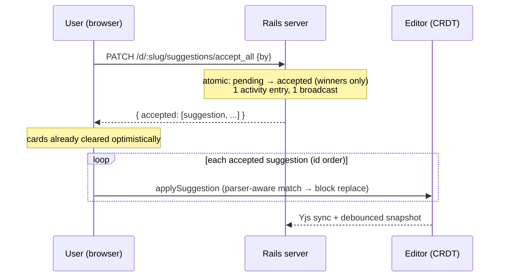

# fix: Suggestion replace duplication + fast bulk accept

## Summary

Accepting agent suggestions that *replace* existing text can duplicate content instead of replacing it, and Accept all is slow (N sequential PATCH round-trips with an Inertia partial reload each). Production doc `J3YVc161mb` now contains its entire talk outline twice: the original 60-minute outline untouched, followed by the accepted 30-minute rewrite appended at the end.

Two deliverables: (1) markdown-aware, block-level suggestion matching so `replaces` actually replaces, and (2) a server-side bulk-accept endpoint so Accept all is one round trip with optimistic card clearing. Plus a one-time repair of the damaged production doc.

---

## Problem Frame

### Bug: duplication on accept (root cause, confirmed)

Production evidence (doc `J3YVc161mb`, all 11 suggestions accepted):

- `plain_markdown` contains the full original outline (60-min, sections 1–10 + Q&A) at lines 0–118, then a complete second outline (30-min) at lines 120–175.
- The stored suggestion rows quote **markdown source** in `replaces`: e.g. `## Talk outline - Blastoff Ruby, June 12 (\~60 minutes: 45 talk + Q\&A)` and `### 1. Cold open (3 min)` — including heading markers and backslash escapes.
- The two plain-text suggestions (no markdown syntax in `replaces`) matched and replaced correctly; every markdown-quoting suggestion duplicated.

Code-level mechanism in `app/frontend/editor/suggestions.ts`:

1. `findTextRange` searches the **rendered plain text** of single textblocks (`text.indexOf(search)`). A `replaces` string containing `## `, `**`, or `\~` can never match — markdown syntax does not exist in textContent. Multi-block `replaces` (anything containing a blank line) can also never match, since matching is per-textblock.
2. `applySuggestion` only performs a replacement when `replaces` matched AND the parsed body is a **single textblock**. In every other case it falls through to the insert-after-anchor path (or doc-end append), which **inserts the new content without deleting the old** — that is the duplication.

So: agents naturally quote the markdown they read from the API; the editor matches against rendered text; the mismatch silently degrades "replace" into "append", and the old content survives.

### Performance: Accept all is slow

`acceptAllSuggestions` (added earlier today, `app/frontend/pages/documents/show.tsx`) loops the per-card flow: one PATCH per suggestion, each awaiting an Inertia partial reload of `suggestions` + `activities`. 11 suggestions ≈ 11 sequential round-trips to the Hetzner server — many seconds of "Accepting…".

### Scope boundary

The seed-claim consumed-without-applying anomaly observed on doc `u3MwGn64VN` (claim burned, no Yjs state persisted, self-healed by stale-claim reclaim) is a **separate latent issue** — different mechanism, no user-visible damage. Out of scope here; recorded under Deferred.

---

## Requirements

- R1: Accepting a suggestion whose `replaces` quotes markdown source (headings, bold, escapes) replaces the matching document content — no duplication. (Bug report: "we have the document twice")
- R2: Accepting a suggestion whose `replaces` spans multiple blocks replaces the whole matched block range.
- R3: A suggestion body that parses to multiple blocks still replaces (block-level) when `replaces` matched, instead of degrading to insert-after.
- R4: Accept all completes in approximately one server round trip, with cards clearing optimistically on click. (Request: "make it server-side or instant optimistic")
- R5: Per-card accept and reject behavior, provenance marking of merged text, and concurrent-acceptor safety are preserved.
- R6: Production doc `J3YVc161mb` is repaired: the stale original outline removed, the accepted 30-min outline and the user's edits kept.

---

## Key Technical Decisions

1. **Match by parsed text, not raw string.** Parse `replaces` (and `anchor_text` on the fallback path) through the same Milkdown parser used for the body, then match the document by comparing per-block plain text (with whitespace normalization) against the parsed search blocks, block-sequence-wise. This makes matching agnostic to markdown syntax and escaping — the agent quotes markdown, the parser normalizes both sides to the same plain-text space. Rationale: any string-level normalization (stripping `#`, unescaping) is a losing game of edge cases; the parser is already in context and is the single source of truth for markdown → text.
2. **Block-level replacement.** When the parsed `replaces` matches a sequence of blocks, replace the entire block range with the entire parsed body (`tr.replaceWith` over node boundaries). Keep the existing inline path (replace inside one paragraph) when both the matched range and the body are single-textblock inline content — it preserves surrounding text in mixed paragraphs.
3. **Bulk accept is a server endpoint + client-side merge.** `PATCH /d/:slug/suggestions/accept_all` atomically transitions all pending suggestions (`where(status: "pending").update_all`-style, returning the winners), logs **one** activity entry ("accepted N suggestions"), broadcasts once, and returns the accepted suggestions as JSON. The accepting client then applies each body to the CRDT locally in id order — content application must stay client-side because only clients hold a ProseMirror/Milkdown parser; the server has no Yjs content writer. Rationale: one round trip replaces N; the editor merge is local and fast; the existing per-suggestion concurrency story (server confirms the winner before any CRDT insert) carries over wholesale to the batch.
4. **Optimistic UX.** On click, all pending cards clear optimistically via the bulk PATCH's `router.optimistic`; merges apply on success. A failed request restores the cards (Inertia rolls back optimistic state on error).
5. **Repair by content surgery, not seed reset.** Doc `J3YVc161mb` has human edits and a comment; resetting Yjs state to the seed would lose them. Repair = remove the stale original-outline block via an agent-grade edit (the same suggestion machinery, now fixed, or direct snapshot surgery via the editor), verified against the heading structure.

---

## High-Level Technical Design



Matching pipeline inside `applySuggestion` (directional, not implementation spec):

```text
parse(replaces) → searchBlocks[]            # plain text per block, via Milkdown parser
scan doc top-level blocks for a window where
    normalize(docBlock[i..i+k].text) == normalize(searchBlocks[0..k].text)
matched?
  ├─ yes, single inline ↔ single inline → existing inline replace (string offsets)
  ├─ yes, otherwise → tr.replaceWith(blockRange.from, blockRange.to, parsedBody)
  └─ no → fall back to anchor_text (same parsed matching) → insert after; else append
```

---

## Implementation Units

### U1. Markdown-aware matching and block-level replacement

**Goal:** `replaces` that quotes markdown source — single- or multi-block — matches and truly replaces; no silent degrade to append when a body is multi-block.

**Requirements:** R1, R2, R3, R5

**Dependencies:** none

**Files:**
- `app/frontend/editor/suggestions.ts` (modify: `applySuggestion`, add parsed-block matching; keep `findTextRange` for plain-text inline cases and other callers — `show.tsx` uses it for comment anchors and margin cards)
- `script/browser_check.mjs` (test scenarios live in U4)

**Approach:**
- Add a matcher that takes the parsed `replaces` fragment and walks the doc's top-level block sequence comparing whitespace-normalized textContent per block; returns the doc position range spanning the matched blocks.
- In `applySuggestion`: try parsed-block matching for `replaces` first. Preserve the existing inline-replace path when the match is a single textblock's inner text and the body is single-textblock (current behavior, good for typo fixes like ids 22/24). Otherwise replace the full block range with the parsed body.
- Apply the same parsed matching to `anchor_text` on the fallback path so markdown-quoting anchors keep working as insert-after targets.
- Provenance marking (`addMark` over the inserted range) and `SKIP_PROVENANCE` meta stay exactly as today.
- Margin card positioning (`findTextRange(anchorOf(s))` in `margin_suggestions.tsx`) currently fails to place cards for markdown-quoting suggestions (they stack at doc top, observed as `top: 0` fallback). Export the parsed matcher so the card-anchoring call sites can use it too — same fix, second consumer.

**Patterns to follow:** `applySuggestion`'s existing parser usage (`ctx.get(parserCtx)`); whitespace normalization mirrors `findTextRange`'s segment-table caution about leaf nodes.

**Test scenarios:**
- Happy path: suggestion with `replaces: "### Heading (3 min)"` against a doc containing that heading → heading replaced by the body, exactly one occurrence of the new text, zero of the old (Covers R1).
- Multi-block: `replaces` quoting a heading plus its paragraph (blank-line separated) → both blocks replaced by a multi-block body (Covers R2, R3).
- Escapes: `replaces` containing `\~` and `\&` (as production data does) → matches the rendered `~`/`&` text (Covers R1).
- Inline preservation: plain-text `replaces` of a few words inside a paragraph with a single-paragraph body → surrounding sentence text intact (regression guard for ids 22/24 behavior, R5).
- No match: `replaces` text absent from the doc → body inserted after `anchor_text` block (existing fallback), original doc text untouched and not deleted.
- Provenance: merged text carries `kind: ai, state: pending` marks for agent authors (R5).

**Verification:** browser check assertions in U4 pass; accepting a markdown-quoting replace suggestion in a live editor leaves exactly one copy of the content.

### U2. Bulk accept endpoint

**Goal:** One PATCH transitions every pending suggestion atomically and returns the winners.

**Requirements:** R4, R5

**Dependencies:** none (parallel with U1)

**Files:**
- `config/routes.rb` (add `patch "d/:slug/suggestions/accept_all"`)
- `app/controllers/suggestions_controller.rb` (add `accept_all` action)
- `app/models/suggestion.rb` (add class method for the atomic batch transition)
- `test/integration/suggestion_flow_test.rb` (scenarios below)

**Approach:**
- Model: a class method that, within the document scope, atomically flips `pending → accepted` (single UPDATE with status guard, `resolved_by` stamped) and returns the suggestions that actually transitioned — concurrent per-card accepts that already won are naturally excluded.
- Controller: finds the document by slug, runs the batch, logs **one** activity entry ("accepted N suggestions"), broadcasts `:suggestions` once via `DocumentMetaChannel`, responds with JSON `{ accepted: [as_props, ...] }` ordered by id. Zero pending → `{ accepted: [] }`, still 200.
- This is a JSON endpoint (the client needs the authoritative winner list synchronously), not an Inertia redirect — mirror the `postJSON`/CSRF pattern used by `documents#snapshot`.

**Patterns to follow:** `Suggestion.propose!` (single entry point + activity + broadcast), `documents#snapshot` for the JSON-response controller shape, `transition!`'s `resolved_by` semantics.

**Test scenarios:**
- Happy path: 3 pending suggestions → PATCH accept_all → all accepted, response lists all 3 in id order, one activity row with detail mentioning the count (Covers R4).
- Atomicity/concurrency: one suggestion already accepted before the call → response lists only the 2 winners; the pre-accepted one is untouched.
- Empty: no pending suggestions → 200 with empty list, no activity row.
- Missing doc: unknown slug → 404.
- `by` param: `resolved_by` stamped with the provided name on every transitioned row.

**Verification:** integration tests green; `bin/rails test` passes.

### U3. Rewire Accept all to the bulk endpoint

**Goal:** One round trip, instant optimistic card clearing, merges applied locally in order.

**Requirements:** R4, R5

**Dependencies:** U1, U2

**Files:**
- `app/frontend/pages/documents/show.tsx` (modify `acceptAllSuggestions`; per-card `acceptOne` stays as-is)

**Approach:**
- Replace the sequential `acceptOne` loop: optimistically clear all pending cards, send one request to `accept_all`, then apply each returned suggestion via `applySuggestion` in response order (each merge re-anchors against the post-merge doc — same semantics as today's loop, minus the network). Refresh `suggestions`/`activities` props once at the end (single partial reload or rely on the broadcast-driven reload).
- On request failure: restore cards (optimistic rollback) and clear the `acceptingAll` flag.
- Keep `flashMergedRange` per merge; keep the button's disabled "Accepting…" state (it will now last well under a second).

**Test scenarios:** (behavioral coverage lives in the U4 browser checks — unit-level JS tests are not part of this repo's harness)
- Covered in U4: one click → all bodies merged, cards cleared, button retires, merges persist across reload.
- Covered in U4: duplication regression — accept-all over markdown-quoting replace suggestions leaves no duplicated sections.

**Verification:** Accept all on a 10-suggestion doc completes in ~1s locally; browser checks in U4 pass.

### U4. Test coverage: duplication regression + fast bulk accept

**Goal:** Permanent guards against the exact production failure and the slow path.

**Requirements:** R1–R5

**Dependencies:** U1, U2, U3

**Files:**
- `script/browser_check.mjs` (modify the existing Accept-all section; add replace-duplication scenarios)
- `test/integration/suggestion_flow_test.rb` (U2 scenarios)

**Approach:** Extend the existing "Accept all" browser-check section: seed a doc with headed sections, post agent suggestions whose `replaces` quotes markdown source (heading markers + escapes, mirroring the Tuin payloads), accept all, assert each original section text appears exactly once (replaced, not duplicated), assert ordering, assert persistence across reload. Keep the existing button-presence/retire assertions.

**Test scenarios:**
- Markdown-quoting replace via Accept all → old section text count is 0, new text count is 1, per section (Covers R1, R4).
- Multi-block replace via per-card accept → same exactly-once assertion (Covers R2 on the single-accept path).
- Plain-text inline replace still works (ids 22/24 regression guard, R5).
- Reload → merged state persists, no cards return.

**Verification:** full `script/browser_check.mjs` suite green (modulo the known pre-existing SharePopover dev warning).

### U5. Repair production doc J3YVc161mb

**Goal:** Remove the stale 60-minute outline; keep the accepted 30-minute outline, the user's typo edits, and the open comment.

**Requirements:** R6

**Dependencies:** U1–U4 deployed (the fix must be live before touching the doc, or new accepts could re-damage it)

**Files:** none (operational; uses the live editor/API against production)

**Approach:** After deploy, surgically delete the duplicated original-outline block (lines spanning the old `## Talk outline … (\~60 minutes …)` section through the old `### Q\&A (10-15 min)` section) from the live document — via the now-fixed suggestion machinery (a replace suggestion covering the stale block, accepted in-browser) or equivalent direct edit. Verify the heading structure afterward: exactly one `## Talk outline` heading, the 30-min variant.

**Test scenarios:** Test expectation: none — operational data repair, verified by inspection.

**Verification:** `plain_markdown` for the doc contains exactly one outline; the user's comment remains open; ownership unchanged.

---

## Scope Boundaries

**In scope:** the suggestion matching/replacement fix, bulk accept endpoint and client rewiring, regression coverage, the one-doc production repair.

**Out of scope (true non-goals):**
- Server-side rendering/merging of suggestion content into Yjs (server has no ProseMirror parser; architecture keeps content application client-side).
- Reject all (not requested; trivially added later on the same endpoint pattern).

### Deferred to Follow-Up Work
- Seed-claim burn anomaly (claim consumed without template application, observed on `u3MwGn64VN`): self-heals via stale-claim reclaim, but the first open after a reset shows an empty doc until the next visit. Worth its own investigation.
- `Suggestion#transition!` single-row race (read-check-write, not atomic compare-and-set). The bulk path in U2 is atomic; aligning the single-row path can follow.
- Margin cards for unmatched anchors stack at the document top (`top: 0` fallback) — U1's exported matcher fixes placement for markdown anchors, but a visible "anchor not found" treatment is a design question for later.

---

## Risks & Dependencies

- **Behavior change radius:** `applySuggestion` also serves per-card accept and the browser-check agent-loop assertions. Mitigation: preserve the inline path for plain-text cases; run the full browser suite (U4) before merge.
- **Whitespace normalization too loose/strict:** over-normalizing could match the wrong section (e.g., repeated identical headings). Mitigation: match the longest block sequence, require full-block equality (not substring), and take the first match — same first-match semantics as today's `findTextRange`.
- **Bulk endpoint exposure:** `accept_all` is unauthenticated like every accept surface in this app (claim model is open by design). It only transitions suggestion status — no content injection beyond what `propose!` already allows.
- **Production repair is irreversible:** take the doc's current markdown snapshot (already captured in this plan's research) before surgery.
