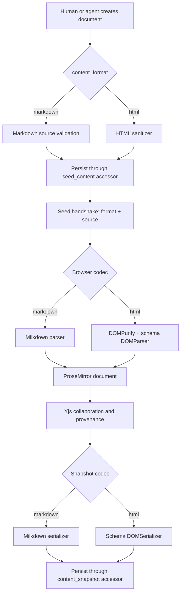
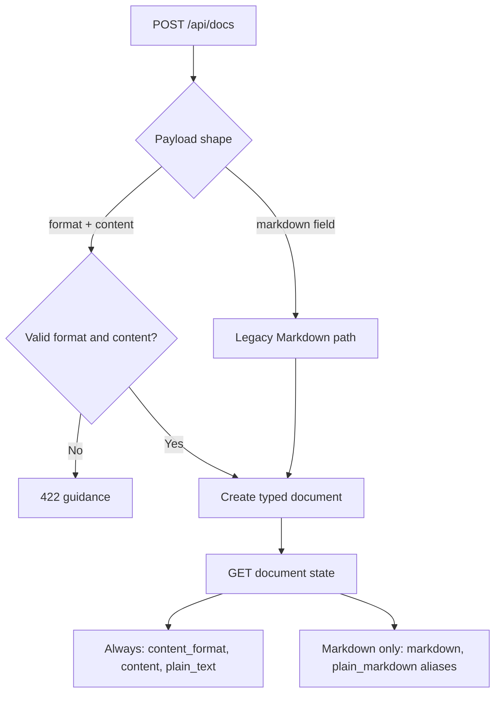

# feat: Add Collaborative HTML Documents

## Summary

Add HTML as a persisted document format alongside Markdown. The editor and collaboration model remain shared, while persistence accessors, source codecs, seed synchronization, snapshots, suggestion parsing, agent contracts, and format-identification UI become format-aware.

---

## Problem Frame

Pruf currently assumes every source payload is Markdown. The database columns, seed handshake, browser snapshot, suggestion parser, agent API, guide copy, and creation UI all encode that assumption even though collaboration and comments operate on a format-neutral ProseMirror document.

HTML support should reuse that shared document model rather than introduce a second editor. Imported HTML must be sanitized and normalized to the schema Pruf can edit. The product should not claim lossless round-tripping of arbitrary web pages, scripts, stylesheets, head metadata, or unsupported tags.

---

## Assumptions

- HTML documents contain editable semantic body content, not source-code editing or a full browser-page authoring environment.
- A document's `content_format` is immutable after creation. Format conversion is outside this change.
- HTML is normalized through Pruf's ProseMirror schema. Unsupported tags and attributes are removed or reduced to supported content.
- Existing documents and legacy API clients remain Markdown by default.
- The human creation UI offers Markdown and HTML document types with Markdown selected by default and clear copy that format cannot be changed later. It does not add file upload or paste-an-entire-document import UI.
- Comments remain anchored by rendered plain text, so their storage model is shared by both formats.
- Suggestion bodies use the target document's format. HTML document suggestions contain HTML; Markdown document suggestions contain Markdown.

---

## Requirements

**Document format and persistence**

- R1. Each document records `content_format` as `markdown` or `html`, defaulting existing and legacy-created documents to `markdown`.
- R2. Seed and snapshot storage expose format-neutral model accessors over the existing physical columns, preserving all existing document data and deployment compatibility.
- R3. The browser seed handshake carries source plus format, and an HTML seed enters the same Yjs document used by Markdown seeds.
- R4. HTML imports and snapshots are sanitized before persistence, with scripts, executable attributes, unsafe resource URLs, unsupported styles, and unsupported elements excluded.
- R5. HTML serialization preserves schema-supported structure plus Pruf provenance and tracked-suggestion attributes.

**Editing and collaboration**

- R6. HTML documents support live Yjs collaboration, reload persistence, provenance review, Edit/Suggest/Comment modes, comments, presence, ownership, and activity with the same behavior as Markdown documents.
- R7. Accepting an agent suggestion in an HTML document parses the suggestion body as HTML and applies replacement/anchor matching against rendered document text.
- R8. Comment creation, anchoring, resolution, and agent attribution work on HTML documents without a separate comment model.

**Creation and agent contract**

- R9. Humans can create either a Markdown or HTML document from the landing page, with a format-appropriate default seed.
- R10. Agents can create HTML documents through the existing create endpoint using an explicit format and generic content field; the legacy `markdown` request remains supported.
- R11. Agent state responses expose `content_format`, `content`, and `plain_text` for every document while retaining the existing Markdown aliases for Markdown clients.
- R12. Agent guide text and endpoint metadata describe the source format expected for suggestions and document creation.
- R13. HTML creation and suggestion responses report when normalization changed submitted source.

**Compatibility and observability**

- R14. Existing Markdown documents, API requests, sync behavior, snapshots, suggestions, comments, and browser tests remain unchanged.
- R15. The UI identifies HTML documents in document lists and the editor header without displacing the document-first layout.
- R16. Invalid format values and conflicting create payloads return instructive validation errors without creating a document.
- R17. Every public HTML payload is byte-limited before parsing or sanitization.

---

## Key Technical Decisions

1. **One editor model, two source codecs.** Both formats become the same ProseMirror document and Yjs fragment. Markdown uses Milkdown's parser/serializer; HTML uses ProseMirror's schema-derived `DOMParser` and `DOMSerializer`. This keeps collaboration and review features format-neutral.
2. **Normalized semantic HTML, not lossless arbitrary HTML.** Pruf stores the sanitized source produced by the supported schema. `<head>`, document-level metadata, scripts, styles, iframes, custom elements, and unsupported attributes are outside the editable contract.
3. **Use trust-specific sanitizer profiles.** External seeds and suggestion bodies lose all Pruf provenance and tracked-suggestion attributes; attribution is derived from request identity and suggestion records. Editor snapshots may preserve only validated, length-capped Pruf metadata. Rails sanitation protects server ingress, DOMPurify protects browser parsing and paste, and the schema parser remains the final structural allowlist.
4. **Format is immutable.** Converting a live Yjs document between Markdown and HTML introduces ambiguous serialization loss and concurrent-edit hazards. Creation selects the format once.
5. **Keep physical columns deployment-compatible.** Add `content_format`, but retain `seed_markdown` and `content_markdown` for this release. Expose format-neutral `seed_content` and `content_snapshot` model accessors and generic API fields. A physical column rename is deferred to a dedicated expand-and-contract migration.
6. **Introduce a generic API contract without breaking Markdown clients.** New clients send `{format, content}`. Existing `{markdown}` requests imply Markdown. Responses always include generic fields and include `markdown`/`plain_markdown` aliases only for Markdown documents.
7. **Suggestions inherit the document format.** No per-suggestion format column is needed because document format cannot change. Parsing, rendered-text matching, and insertion select the codec from the document prop.
8. **Rendered text remains the compatibility anchor, with ambiguity handled safely.** Client matching parses source before comparing rendered blocks. Replacements with multiple matches do not auto-apply; they remain pending with a target-not-unique state rather than modifying the first occurrence. Existing comment anchors retain first-match behavior in this release, and structural anchors are deferred explicitly.
9. **Resource loading is restricted.** HTML imports cannot introduce remote images. Image `src` values survive only for app-owned relative Active Storage URLs; HTTP(S), protocol-relative, data, blob, and private-network sources are removed. Links retain the sanitizer's safe navigation protocols. The only permitted style is canonical `text-align: left|center|right` on table cells.
10. **Normalization is observable.** Sanitization returns normalized source plus a changed flag. Agent create and suggestion responses include a warning when unsupported markup was removed or rewritten.

---

## High-Level Technical Design

The diagrams are directional. Implementation should follow local APIs and schema details discovered during execution.

### Source-to-collaboration flow

### Format and feature matrix

| Capability | Markdown | HTML |
|---|---|---|
| Source input | CommonMark/GFM | Sanitized semantic body HTML |
| Shared state | ProseMirror in Yjs | ProseMirror in Yjs |
| Snapshot | Markdown with Pruf mark HTML | HTML with Pruf mark attributes |
| Suggestions | Markdown body | HTML body |
| Anchor compatibility | Rendered plain text | Rendered plain text; ambiguous replacements do not auto-apply |
| Provenance | `data-provenance` mark | `data-provenance` mark |
| Tracked changes | `<ins>/<del>` in Markdown source | `<ins>/<del>` in HTML source |

### Agent create and read compatibility

---

## Implementation Units

### U1. Persist a document format with compatible source accessors

- **Goal:** Establish the server-side format contract and preserve existing data.
- **Requirements:** R1, R2, R14, R16
- **Files:**
  - `db/migrate/20260608*_add_document_content_format.rb`
  - `db/schema.rb`
  - `app/models/document.rb`
  - `test/models/document_test.rb`
  - `test/integration/document_create_test.rb`
- **Approach:** Add a non-null `content_format` defaulting to `markdown`, retain the existing physical source columns, add format-neutral model accessors, define allowed formats and format-specific default seeds, and centralize create-payload validation. Keep format immutable after persistence.
- **Patterns to follow:** Existing model vocabulary validation, readonly slug behavior, and seed authorship tests in `app/models/document.rb`.
- **Test scenarios:**
  - An existing row gains `content_format = markdown` without rewriting source columns.
  - Markdown and HTML documents accept their allowed format and reject unknown values.
  - Changing an existing document's format is rejected.
  - Human-created Markdown and HTML documents receive the correct default source and seed authorship.
  - Conflicting legacy Markdown and explicit HTML payloads fail without inserting a row.
- **Verification:** Schema, model tests, and creation tests show a stable default for existing callers and typed creation for new callers.

### U2. Sanitize HTML at every persisted ingress

- **Goal:** Prevent executable or unsupported HTML from entering seeds, suggestions, or snapshots.
- **Requirements:** R4, R5, R13, R16, R17
- **Files:**
  - `app/services/html_document_sanitizer.rb`
  - `app/models/document.rb`
  - `app/models/suggestion.rb`
  - `app/controllers/documents_controller.rb`
  - `app/controllers/api/docs_controller.rb`
  - `test/services/html_document_sanitizer_test.rb`
  - `test/integration/snapshot_test.rb`
  - `test/integration/agent_api_test.rb`
- **Approach:** Build Rails HTML5 sanitizer profiles aligned with the editor schema. External seeds and suggestion bodies preserve supported structure but strip all Pruf review metadata. Snapshot ingress preserves only validated provenance and suggestion attributes. Remove scripts, event handlers, iframes, remote image sources, unsafe protocols, and unsupported elements. Preserve only canonical `text-align: left|center|right` style on table cells. Enforce request byte caps before sanitizer invocation and return whether normalization changed the source.
- **Patterns to follow:** Payload caps and model-owned entry points in `Suggestion.propose!`; snapshot size enforcement in `DocumentsController`.
- **Test scenarios:**
  - Script, iframe, inline event attributes, arbitrary styles, and `javascript:` URLs are removed.
  - HTTP(S), protocol-relative, data, blob, and private-network image sources are removed; app-owned relative Active Storage images survive.
  - External provenance and tracked-change attributes are removed and cannot forge human or endorsed authorship.
  - Snapshot provenance and tracked-change attributes survive only when enums, ids, and lengths are valid.
  - Supported headings, paragraphs, lists, safe links, app-owned images, code, blockquotes, tables, and canonical table alignment survive.
  - Markdown source is not passed through the HTML sanitizer.
  - An oversized HTML snapshot is rejected before mutation.
  - Sanitized HTML suggestions retain safe content, lose caller-supplied Pruf metadata, and report normalization.
  - Oversized create, suggestion, and snapshot payloads are rejected before sanitizer execution or database mutation.
- **Verification:** Unsafe fixtures cannot survive any persisted HTML ingress, while editor-supported HTML round-trips.

### U3. Add format-aware browser codecs and seed synchronization

- **Goal:** Parse and serialize HTML documents through the existing collaborative editor.
- **Requirements:** R3, R5, R6, R14
- **Dependencies:** U1, U2
- **Files:**
  - `package.json`
  - `package-lock.json`
  - `app/frontend/editor/document_format.ts`
  - `app/frontend/editor/milkdown_editor.tsx`
  - `app/frontend/editor/cable_provider.ts`
  - `app/channels/sync_channel.rb`
  - `app/controllers/documents_controller.rb`
  - `test/channels/sync_channel_test.rb`
  - `test/integration/document_seed_claim_test.rb`
- **Approach:** Add DOMPurify and a format codec module. Convert sanitized HTML body source to Milkdown's HTML `DefaultValue`, serialize the live ProseMirror fragment with `DOMSerializer.fromSchema`, and retain only canonical table-cell alignment style. Compose the same DOMPurify policy into `transformPastedHTML`. Give tracked `<del data-suggestion-id>` parsing priority over ordinary GFM strikethrough. Carry `content_format` with seed grants and browser props. Snapshot the selected source format without changing Yjs persistence.
- **Patterns to follow:** One-shot seed consumption and StrictMode protections in `milkdown_editor.tsx`; format-neutral binary handling in `YjsPersistence`.
- **Execution note:** Characterize the Markdown seed/snapshot path before changing it, then add the HTML branch without altering the Markdown transaction order.
- **Test scenarios:**
  - HTML seed content renders supported headings, paragraphs, emphasis, links, lists, tables, and code.
  - Provenance and tracked-suggestion marks serialize with their data attributes.
  - Unsupported HTML is absent after parse and snapshot.
  - Pasted event handlers, unsafe links, remote images, arbitrary styles, and unsupported elements never enter Yjs state.
  - Tracked deletions remain tracked deletions after HTML snapshot and reload instead of becoming ordinary strikethrough.
  - Left, center, and right table alignment survive sanitize, snapshot, and reload through constrained style.
  - Two clients editing an HTML document converge and a late joiner receives the same Yjs state.
  - Fresh Markdown seeding, stale-claim reclaim, hydration, and snapshot behavior remain unchanged.
- **Verification:** Both formats bind to the same Yjs fragment, persist their selected source representation, and reload without content duplication.

### U4. Make suggestions and text anchoring format-aware

- **Goal:** Preserve agent suggestions, replacements, comments, and presence behavior on HTML documents.
- **Requirements:** R6, R7, R8, R14
- **Dependencies:** U3
- **Files:**
  - `app/frontend/editor/suggestions.ts`
  - `app/frontend/components/margin_suggestions.tsx`
  - `app/frontend/pages/documents/show.tsx`
  - `app/controllers/api/suggestions_controller.rb`
  - `test/integration/suggestion_flow_test.rb`
  - `test/integration/comment_flow_test.rb`
  - `test/integration/agent_api_test.rb`
  - `script/browser_check.mjs`
- **Approach:** Define one format-aware source parser used by suggestion acceptance, margin positioning, and quote matching. HTML suggestions parse through the HTML codec; Markdown suggestions retain the existing parser. Key parse caches by format and source. If a replacement quote resolves to multiple ranges, do not modify the document and expose a target-not-unique state. Keep comments and presence locations as plain rendered text, retaining the existing first-match comment limitation.
- **Patterns to follow:** Parser-aware block matching and replace semantics in `app/frontend/editor/suggestions.ts`; shared model entry points for comments and suggestions.
- **Test scenarios:**
  - An HTML suggestion replaces formatted HTML source exactly once instead of inserting a duplicate.
  - An HTML replacement matching multiple rendered blocks stays pending and does not modify the first match.
  - A multi-block HTML suggestion inserts after a matching rendered anchor.
  - Accepted HTML suggestion text retains agent provenance.
  - Human and agent comments anchor to text inside HTML paragraphs, headings, lists, and table cells.
  - Resolve, bulk accept, concurrent accept, and Markdown suggestion behavior remain unchanged.
- **Verification:** The full propose, render, accept, provenance, comment, and resolve loops work in both formats.

### U5. Expose typed creation and state contracts

- **Goal:** Let humans and agents create, identify, and read HTML documents without breaking legacy Markdown clients.
- **Requirements:** R9, R10, R11, R12, R13, R15, R16
- **Dependencies:** U1, U2
- **Files:**
  - `app/controllers/documents_controller.rb`
  - `app/controllers/api/docs_controller.rb`
  - `app/services/agent_guide.rb`
  - `app/services/document_plain_text.rb`
  - `Gemfile`
  - `Gemfile.lock`
  - `app/frontend/pages/documents/index.tsx`
  - `app/frontend/pages/documents/show.tsx`
  - `app/frontend/entrypoints/application.css`
  - `test/integration/agent_api_test.rb`
  - `test/integration/agent_discovery_test.rb`
  - `test/integration/document_create_test.rb`
  - `test/services/document_plain_text_test.rb`
- **Approach:** Add a labelled Markdown/HTML radio group to document creation with Markdown selected, keyboard operation, visible focus, and permanence helper text. Format indicators use visible and accessible text rather than color or icons alone. Accept `{format, content}` in the agent API while preserving `{markdown}`. Return generic state fields for all formats and legacy aliases for Markdown. Add a format-aware plain-text extraction service for cold seeds and snapshots. Generate format-specific guide examples, suggestion instructions, and normalization warnings.
- **Patterns to follow:** Existing Inertia `useForm` double-submit guard, document-list ownership props, and single-source agent guide generation.
- **Test scenarios:**
  - Human creation selects Markdown or HTML and redirects to a correctly typed document.
  - Legacy agent Markdown creation returns the same fields and behavior as before.
  - Explicit HTML creation returns `content_format`, sanitized `content`, `plain_text`, and a share URL.
  - Markdown and HTML cold seeds return rendered `plain_text`, not source syntax.
  - Unknown formats, missing explicit content, and conflicting payload fields return useful 422 responses.
  - HTML guide copy tells agents to submit HTML suggestions; Markdown guide copy remains Markdown-specific.
  - HTML create and suggestion responses report when source was normalized.
  - HTML labels are visible but do not replace ownership or title information.
  - The format radio group is keyboard-operable, visibly focused, labelled to assistive technology, defaults to Markdown, and states that format is permanent.
- **Verification:** Both audiences can discover the document format and participate using the same share URL.

### U6. Add end-to-end HTML document regression coverage

- **Goal:** Prove feature parity through real browser journeys and protect Markdown behavior.
- **Requirements:** R3-R15
- **Dependencies:** U3, U4, U5
- **Files:**
  - `script/browser_check.mjs`
  - `script/sync_check.mjs`
  - `README.md`
- **Approach:** Add an HTML journey to the browser check: create, render, collaborate, suggest, accept, comment, resolve, snapshot, reload, and inspect agent state. Extend sync coverage only where format metadata enters the seed path; Yjs binary convergence remains format-neutral. Document the new API contract and normalization limits.
- **Test scenarios:**
  - Human creates an HTML document and sees supported structure plus an HTML label.
  - A second browser receives live HTML-document edits and reload persistence.
  - Agent HTML suggestion appears, replaces its target, and retains AI provenance after acceptance.
  - Human and agent comments anchor and resolve on HTML content.
  - Agent state exposes safe HTML and plain text without executable markup.
  - Existing Markdown shortcut, frontmatter, soft-break, track-change, and collaboration checks still pass.
- **Verification:** The complete Rails, TypeScript, sync, and browser suites pass with both document formats.

---

## System-Wide Impact

- **Persistent data:** A migration adds an immutable format discriminator and keeps existing columns intact. Format-neutral model accessors prevent deployment-time column incompatibility.
- **Sync protocol:** Seed messages gain a format field; incremental Yjs updates do not change.
- **Security:** HTML becomes unauthenticated input on create, suggestion, and snapshot surfaces. Sanitization is a release blocker, not optional polish.
- **Agent API:** Generic content fields are additive, while legacy Markdown request/response names remain available to avoid breaking existing agents.
- **Client state:** The format prop is fixed for the editor session and selects codecs for seed, snapshots, suggestions, and labels.
- **Operations:** No backfill job is needed because the migration default classifies every existing row as Markdown.

---

## Acceptance Examples

- AE1. Given a legacy client posts `{markdown: "# Notes"}`, when the document is created, then it behaves as a Markdown document and the legacy response fields remain available.
- AE2. Given an agent posts `{format: "html", content: "<h1>Notes</h1>"}`, when the document is created and opened, then the heading is editable, the script is absent, the response warns that normalization occurred, and the state response identifies HTML.
- AE3. Given two browsers open the same HTML document, when one edits a paragraph, then the other receives the edit live and both reload to equivalent sanitized HTML snapshots.
- AE4. Given an HTML document contains `
The old line
`, when an agent proposes `
The new line
` with an HTML `replaces` quote and a human accepts it, then the old line occurs zero times and the new line carries agent provenance.
- AE5. Given a human selects text inside an HTML table cell, when they comment and later resolve the comment, then the existing comments UI and activity flow behave exactly as on Markdown.

---

## Scope Boundaries

### Deferred to Follow-Up Work

- Uploading `.html` files or importing from a URL.
- Converting an existing document between Markdown and HTML.
- Export/download buttons for either source format.
- Preserving arbitrary classes, inline styles, CSS, `<head>` metadata, scripts, forms, embeds, SVG, MathML, custom elements, or unsupported data attributes.
- Lossless round-trip fidelity for HTML constructs outside the current ProseMirror schema.
- Structural comment anchors and agent-supplied occurrence/path selectors for duplicated rendered text.
- Physically renaming `seed_markdown` and `content_markdown`; that requires a later expand-and-contract migration.

**Outside this product's identity:** browser-page execution, website building, visual CSS authoring, and raw HTML source-code editing.

---

## Risks & Dependencies

- **Stored XSS and metadata forgery:** HTML crosses public write endpoints. Mitigation: trust-specific server profiles, DOMPurify on seeds and paste, schema parsing, validated snapshot metadata, unsafe-protocol tests, and no raw HTML rendering outside the editor.
- **Silent normalization loss:** Arbitrary HTML cannot survive a constrained document schema. Mitigation: define semantic body HTML as the contract, return a normalization warning, document unsupported constructs, and test the supported matrix.
- **Remote resource loading:** Imported images could disclose viewer network information. Mitigation: permit only app-owned relative Active Storage image URLs.
- **Parser denial of service:** Public callers can submit pathological HTML. Mitigation: reject byte limits before parsing or sanitization on create, suggest, and snapshot surfaces.
- **Migration regression:** The new discriminator touches seed and API paths. Mitigation: additive migration only, no column renames, compatibility tests, and explicit existing-row verification.
- **Seed duplication or loss:** Format-aware seed application touches race-sensitive code. Mitigation: retain the one-shot grant and remote-empty guards and characterize Markdown behavior first.
- **Suggestion mismatch:** HTML source quotes differ from rendered text. Mitigation: parse quotes through the document codec before block matching, retaining the current raw-text fast path.
- **Serializer differences:** ProseMirror `DOMSerializer` follows schema `toDOM` rules rather than node views. Mitigation: verify every supported node and Pruf mark in browser snapshots.
- **Cross-runtime normalization drift:** Rails sanitation, DOMPurify, and ProseMirror must converge on canonical output. Mitigation: shared fixture coverage asserting normalization is idempotent across server and browser cycles.
- **Dependency maintenance:** DOMPurify becomes a security dependency. Keep its secure defaults, use the HTML profile, forbid arbitrary styles, and do not enable unknown protocols.

---

## Sources & Research

- `README.md` documents the existing Yjs, Milkdown, provenance, suggestion, and agent contracts.
- `app/frontend/editor/milkdown_editor.tsx` and `node_modules/@milkdown/core/src/internal-plugin/editor-state.ts` show Milkdown already accepts an HTML DOM as a `DefaultValue`.
- `app/frontend/editor/suggestions.ts` is the existing source-parser and rendered-text matching boundary.
- `app/services/agent_guide.rb` is the compatibility surface for agent discovery and state.
- [ProseMirror reference](https://prosemirror.net/docs/ref/) defines schema-derived `DOMParser` and `DOMSerializer`, which normalize supported DOM into the shared document model.
- [DOMPurify](https://github.com/cure53/DOMPurify) documents secure defaults, HTML-only profiles, data-attribute controls, and safe URL protocol handling.
