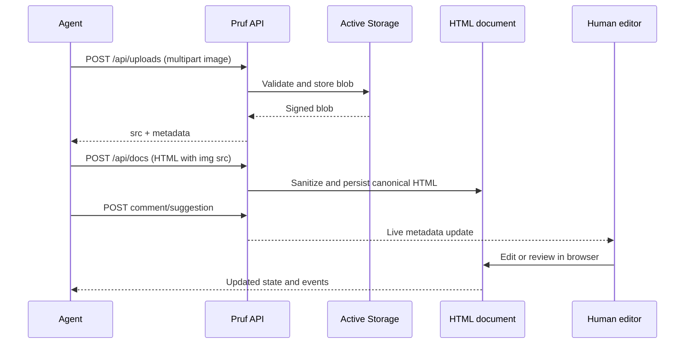

# Agent Rich HTML API

## Summary

Make Pruf's public agent API sufficient and self-explanatory for creating rich
HTML research documents with app-hosted images. Ship a safe image upload
endpoint, expose a machine-readable content contract, improve the text and
README guides, and verify the complete workflow in production.

## Problem Frame

HTML documents accept semantic rich content, but agents currently cannot
complete the documented image workflow. The sanitizer permits only Active
Storage image URLs while the existing direct-upload endpoint requires a browser
session and CSRF token. The API also reports normalization without clearly
enumerating supported elements, image rules, or the narrow CSS exception.

## Requirements

### Agent upload workflow

- R1. An identified agent can upload a supported image through a CSRF-free
  public API endpoint using a single multipart request.
- R2. The upload response returns the canonical same-origin `src` value that
  survives HTML sanitization, plus useful file metadata.
- R3. The endpoint rejects missing files, unsupported media types, oversized
  payloads, and missing agent identity with instructive JSON errors.

### Discoverability and documentation

- R4. Document creation and state responses expose a structured content
  contract covering canonical source, supported HTML elements, CSS limits,
  image upload, normalization, and immutable format behavior.
- R5. The plain-text share-link guide provides a complete agent sequence:
  upload an image, embed its returned `src`, create HTML, read state, propose
  edits, comment, poll events, and sign off.
- R6. The README documents the same workflow and states plainly that arbitrary
  CSS, `<style>` blocks, classes, scripts, remote images, and full-page metadata
  are not preserved.

### End-to-end behavior

- R7. A production HTML research document can include uploaded figures,
  headings, paragraphs, lists, links, blockquotes, code, rules, and tables with
  constrained cell alignment.
- R8. Browser verification confirms the document renders, can be edited and
  saved, supports anchored comments and suggestions, and persists after reload.
- R9. Dogfood coverage exercises happy paths, normalization behavior, malformed
  uploads, discoverability, and responsive browser behavior.

## Key Technical Decisions

- **Use a multipart agent endpoint:** `POST /api/uploads` accepts `file=@...`
  and creates the Active Storage blob server-side. This avoids exposing the
  browser direct-upload CSRF handshake to agents.
- **Require agent identity for uploads:** `X-Agent-Name` keeps the public write
  surface consistent and gives missing-identity errors a clear remediation.
- **Constrain files at the API boundary:** accept common raster image MIME
  types and enforce a fixed byte limit before persistence.
- **Return source-ready paths:** the response's `src` is a same-origin
  Active Storage redirect path accepted by both server and browser sanitizers.
- **Document CSS limits instead of broadening them:** arbitrary author CSS
  remains unsupported because it would require a larger editor-schema,
  sanitizer, and security design. The supported exception remains
  `text-align: left|center|right` on `th` and `td`.
- **Use one shared structured contract:** creation responses, state responses,
  endpoint metadata, and human-readable guides derive their claims from
  `AgentGuide` so the API does not drift across discovery surfaces.

## Implementation Units

### U1. Agent image upload endpoint

- **Goal:** Add a bounded, CSRF-free image upload API that returns a sanitizer-
  compatible source path.
- **Files:** `config/routes.rb`, `app/controllers/api/uploads_controller.rb`,
  `app/controllers/api/base_controller.rb`.
- **Patterns:** Follow the existing `Api::BaseController` identity/error
  contract and Active Storage's current local-service conventions.
- **Test scenarios:** successful PNG upload and retrieval; filename metadata;
  missing identity; missing file; unsupported type; MIME spoofing; oversized
  image; no blob persisted after rejected requests.
- **Tests:** `test/integration/agent_upload_test.rb`.

### U2. Structured content contract and guides

- **Goal:** Make supported HTML, CSS, images, normalization, and source semantics
  discoverable from both JSON and plain-text share links.
- **Files:** `app/services/agent_guide.rb`,
  `app/controllers/api/docs_controller.rb`.
- **Patterns:** Extend the existing `api`, `notes`, and guide generation rather
  than adding a separate documentation subsystem.
- **Test scenarios:** Markdown and HTML contract differences; upload endpoint
  metadata; supported-tags list; CSS restriction; image example; no claim that
  ProseMirror/Yjs is public source.
- **Tests:** `test/integration/agent_discovery_test.rb`,
  `test/integration/agent_api_test.rb`.

### U3. README agent workflow

- **Goal:** Provide a copyable rich HTML workflow and accurate limitations.
- **Files:** `README.md`.
- **Test scenarios:** examples use the generic `format`/`content` contract,
  upload response `src`, `X-Agent-Name`, and no unsupported CSS or remote image
  claims.
- **Verification:** README local links and command examples remain valid.

### U4. Production fixture and browser verification

- **Goal:** Create and exercise a substantial fake research report with three
  uploaded figures and rich semantic structure.
- **Files:** no tracked application files; the fixture is production data.
- **Test scenarios:** create through API; inspect JSON state; open in browser;
  edit prose; save/reload; add and resolve or retain a comment; create and
  accept/reject a suggestion; verify images load; inspect desktop and mobile
  layouts; verify activity and event state.
- **Verification:** production health, HTTP status/content types, persisted
  canonical HTML, and browser-visible outcomes.

## High-Level Technical Design

## Scope Boundaries

- Broad inline CSS, classes, IDs, `<style>`, custom layouts, SVG, embedded
  media, and remote images remain outside this change.
- Image deletion and blob garbage collection are not introduced here.
- Agent-side acceptance or rejection of suggestions remains out of scope;
  review stays human-gated.
- The existing browser paste/drop direct-upload flow remains unchanged.

## Risks And Dependencies

- Unattached Active Storage blobs can accumulate. The upload limit and
  image-only contract reduce abuse, while lifecycle cleanup remains future
  operational work.
- Declared content types are untrusted. Detection must inspect the uploaded
  bytes before accepting the file.
- Production uses persistent local disk on one host, so upload verification
  must confirm the returned redirect serves after deployment.
- Browser automation availability may differ by session. The preferred
  in-app browser should be used first, with an explicit fallback recorded if
  it is unavailable.

## Acceptance Examples

- AE1. Given an identified agent and a valid PNG, when it posts the file to
  `/api/uploads`, then it receives `201`, an image MIME type, byte size, and a
  same-origin `/rails/active_storage/blobs/redirect/...` `src`.
- AE2. Given that returned `src`, when the agent creates an HTML document with
  ``, then `normalized` remains false for the image and a browser
  renders the figure.
- AE3. Given HTML containing `<style>`, `class`, remote images, and arbitrary
  inline CSS, when it is created, then the response explains normalization and
  the content contract identifies those features as unsupported.
- AE4. Given the share URL with `Accept: application/json` or `?format=txt`,
  when an agent performs cold discovery, then it can complete the upload and
  rich-document workflow without reading repository source.
- AE5. Given the production research document, when a human edits, comments,
  and reviews a suggestion in the browser, then the resulting source and
  metadata survive reload.
