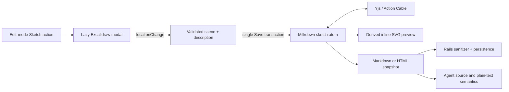

# Add inline Excalidraw sketches

## Summary

Add a focused sketch workflow to Thinkroom: insert an Excalidraw canvas at the current document position, draw with mouse, touch, or Apple Pencil, save it as an inline SVG preview, and reopen it for editing. The editable Excalidraw scene remains part of the collaborative document, while a concise description and extracted labels make the sketch understandable to agents through the existing document API.

## Problem frame

Thinkroom currently supports prose, tables, tasks, links, and uploaded raster images, but visual thinking requires leaving the document for a separate canvas and then pasting a flattened result back. That breaks flow and gives agents little useful context. A useful first version must feel native to the editor, survive Yjs collaboration and snapshot reloads, work on iPad without a native app, and avoid turning arbitrary SVG uploads into a new security surface.

## Requirements

- R1. In Edit mode, a person can insert a new sketch at the current block position and reopen an existing sketch by clicking its inline preview.
- R2. The sketch editor supports Excalidraw shapes, arrows, text, and freehand drawing with mouse, touch, and standards-based pen input, including Apple Pencil in iPad Safari.
- R3. Saving a sketch updates the document optimistically, synchronizes the complete editable scene through the existing Yjs channel, persists in snapshots, and survives reload without flattening the scene.
- R4. The document renders each saved sketch as a crisp inline SVG preview with an accessible caption; the full Excalidraw application is loaded only when a sketch is edited.
- R5. A saved sketch exposes an editable description plus deterministically extracted text labels and shape types in the Markdown/HTML source and plain-text API so agents can understand the artifact without interpreting pixels.
- R6. Read, Comment, and Suggest modes show the clean inline preview but do not open or mutate the sketch. Sketch insertion and editing are Edit-mode operations in this release.
- R7. The modal supports explicit Save and Cancel. Unsaved canvas changes remain local, and saving one sketch produces one collaborative document transaction rather than broadcasting every pointer movement.
- R8. Scene data is validated and size-bounded before insertion and at snapshot sanitization boundaries; arbitrary SVG markup, remote image URLs, scripts, and imported bitmap files cannot enter the document through the sketch contract.
- R9. A person can copy or download the derived SVG from the sketch editor for use outside Thinkroom.
- R10. Existing Markdown and HTML documents, clean-copy behavior, provenance tracking, task checkboxes, links, and collaboration continue to behave unchanged.

## Key technical decisions

- KTD1. **Use an atomic Milkdown block node:** Add a `thinkroomSketch` ProseMirror atom with `scene`, `description`, and format-version attributes. Atom semantics keep provenance and text-suggestion marks out of the scene payload while allowing Yjs to synchronize one intentional save.
- KTD2. **Keep scene JSON canonical and SVG derived:** Store normalized Excalidraw scene JSON so the sketch remains editable. Generate the inline/copy/download SVG with Excalidraw's `exportToSvg`; never accept or persist arbitrary user-supplied SVG markup.
- KTD3. **Open a modal instead of embedding a live canvas:** Inline nodes render a lightweight SVG preview and caption. A lazy-loaded Excalidraw modal handles creation and editing, which keeps document scrolling, selection, and initial bundle cost predictable.
- KTD4. **Commit on Save:** `onChange` updates modal-local state only. Save validates the scene and replaces/inserts the atom in one transaction; Cancel discards it. Concurrent editing inside the same sketch is intentionally last-save-wins in this version, while the saved node continues to synchronize live with the rest of the document.
- KTD5. **Use open, inspectable source representations:** Markdown snapshots serialize a fenced `excalidraw` block containing versioned JSON; HTML snapshots serialize a trusted `<figure data-thinkroom-sketch>` with escaped scene JSON and a visible `<figcaption>`. Both representations include description and extracted element text.
- KTD6. **Treat Pencil as Pointer Events input:** Rely on Excalidraw's browser pointer handling rather than PencilKit or a native bridge. Isolate `touch-action` inside the canvas and verify pressure/free-draw behavior on iPad Safari.
- KTD7. **Exclude embedded bitmap files initially:** Shapes, arrows, text, and strokes are in scope. Excalidraw image insertion/library files are disabled because base64 file blobs would rapidly consume the document's 2 MB content limit and complicate safe agent/API representation.
- KTD8. **Make agent semantics deterministic:** The modal offers a short description field and previews extracted text labels. `DocumentPlainText` emits description/labels instead of raw scene JSON, and `AgentGuide` documents the versioned sketch block contract.

## Scope boundaries

### Included

- Create, edit, save, cancel, copy SVG, and download SVG.
- Inline SVG preview, caption, keyboard access, responsive modal, and iPad/Pencil input.
- Markdown/HTML round-trip, Yjs synchronization, snapshot persistence, plain-text extraction, and agent guidance.
- Lazy loading, scene validation, payload limits, and focused regression/browser coverage.

### Outside this change

- Real-time multi-cursor co-editing within one open Excalidraw canvas.
- Bitmap/image insertion inside Excalidraw, Excalidraw libraries, cloud scene storage, or a separate sketch database table.
- Native PencilKit integration, handwriting recognition, or server-side image understanding.
- Agent-authored sketch mutation APIs beyond the documented source contract.

## Acceptance examples

- AE1. Given an Edit-mode cursor between two paragraphs, when the person chooses Sketch, draws with Apple Pencil, adds the description “Signup approval flow,” and saves, then a crisp inline preview appears at that position immediately and peers see it through the existing live connection.
- AE2. Given a saved sketch, when the document reloads or opens in a second browser, then the preview, description, element labels, and editable scene are unchanged.
- AE3. Given Read, Comment, or Suggest mode, when the person clicks a sketch, then no editor opens and no document transaction is produced.
- AE4. Given a saved sketch containing boxes labeled “Draft,” “Review,” and “Publish,” when an agent fetches the document source or plain text, then it receives the description and those labels without needing to decode SVG pixels.
- AE5. Given an open sketch with unsaved changes, when the person cancels, then the inline node and remote collaborators remain unchanged.
- AE6. Given an oversized, malformed, or externally supplied sketch payload, when it crosses a client or server sanitization boundary, then it is rejected or downgraded to safe visible text without executing markup.
- AE7. Given a saved sketch, when the person chooses Copy SVG or Download SVG, then the exported file is a valid scalable rendering of the current scene and contains no remote resources.

## Architecture

## Implementation units

### U1. Versioned sketch content contract

- **Goal:** Define one validated scene shape that round-trips through Milkdown, Markdown, HTML, Yjs, and Rails without accepting executable SVG.
- **Files:** `app/frontend/editor/sketch/schema.ts`, `app/frontend/editor/sketch/scene.ts`, `app/frontend/editor/document_format.ts`, `app/services/html_document_sanitizer.rb`, `app/services/document_plain_text.rb`, `app/services/agent_guide.rb`.
- **Patterns:** Follow the atomic-node and Markdown-extension pattern in `app/frontend/editor/frontmatter/index.ts`; extend trusted metadata separately from external HTML metadata; keep `Document::MAX_CONTENT_BYTES` as the final aggregate limit.
- **Test scenarios:** Valid Markdown fence and trusted HTML figure round-trip losslessly; external sketch attributes are stripped; malformed JSON, unknown versions, remote file references, overlong descriptions, excessive elements, and oversized scenes are rejected; plain text returns description/labels rather than raw JSON.
- **Verification:** Focused TypeScript checks plus sanitizer, plain-text, agent-guide, and snapshot tests for both document formats.

### U2. Lazy Excalidraw modal and SVG export

- **Goal:** Provide a responsive creation/editing surface with local draft state, Pencil-compatible drawing, explicit Save/Cancel, and SVG export.
- **Files:** `package.json`, `package-lock.json`, `app/frontend/editor/sketch/sketch_modal.tsx`, `app/frontend/editor/sketch/excalidraw_canvas.tsx`, `app/frontend/editor/sketch/export.ts`, `app/frontend/entrypoints/application.css`.
- **Patterns:** Pin `@excalidraw/excalidraw` to the current compatible 0.18 release; use `React.lazy`/dynamic import for the editor and its CSS; use `initialData`, `onChange`, and `exportToSvg`; preserve focus and close on Escape only after honoring unsaved-change confirmation.
- **Test scenarios:** New and existing scenes initialize correctly; Cancel is non-mutating; Save returns normalized scene data; mouse/touch/pen pointer paths work; image import is unavailable; Copy/Download SVG produces valid output; narrow iPad viewport remains usable.
- **Verification:** Type-check, production Vite build, component-level helpers, and Playwright at desktop and tablet viewports.

### U3. Inline node view and editor integration

- **Goal:** Insert and update sketches through the document editor while rendering a lightweight accessible preview in every mode.
- **Files:** `app/frontend/editor/sketch/index.ts`, `app/frontend/editor/sketch/node_view.ts`, `app/frontend/editor/milkdown_editor.tsx`, `app/frontend/pages/documents/show.tsx`, `app/frontend/entrypoints/application.css`.
- **Patterns:** Register the node plugin beside frontmatter; expose typed insert/update helpers through the existing `EditorHandle`; dispatch node-edit callbacks through an editor context; derive SVG asynchronously and ignore stale exports after node updates/unmount.
- **Test scenarios:** Insert at selection, reopen selected node, save replacement, keyboard activation, read-only behavior by mode, undo/redo, copy-clean behavior, remote peer update, reconnect, and reload all preserve the scene.
- **Verification:** Existing editor regressions plus a two-page Playwright collaboration scenario.

### U4. Agent parity and end-to-end release coverage

- **Goal:** Prove sketches remain useful and safe across human UI, agent API, production serialization, and existing editor features.
- **Files:** `test/services/html_document_sanitizer_test.rb`, `test/services/document_plain_text_test.rb`, `test/integration/agent_discovery_test.rb`, `test/integration/agent_api_test.rb`, `test/integration/snapshot_test.rb`, `script/browser_check.mjs`, `README.md` if the public feature list needs updating.
- **Patterns:** Extend the existing browser smoke document instead of creating a disconnected harness; assert the API contract in integration tests; keep tests deterministic by using a small fixture scene.
- **Test scenarios:** Human insert/edit/export, agent fetch, Markdown and HTML snapshots, two-client sync, refresh persistence, all four modes, malformed payload defense, content-size failure, title updates, links, tasks, and clean copy remain correct.
- **Verification:** Full Rails suite, `npm run check`, HTML/link checks, production asset build, browser pipeline, and a final scoped security review.

## System-wide impact

- **Data and persistence:** No migration or new table. Scene JSON increases Yjs and snapshot size, bounded per sketch and by the existing 2 MB document limit.
- **Collaboration:** Pointer movements remain local; Save produces one atom insert/replace that Yjs broadcasts. Two people saving the same sketch concurrently use last-save-wins semantics.
- **Agents:** Source responses contain an explicit, versioned sketch block; plain-text responses surface only human-readable semantics. The agent guide gains examples and limits.
- **Security:** SVG is generated from validated Excalidraw elements in the browser and is never trusted as source. HTML snapshot metadata is restored only through the trusted snapshot path.
- **Performance:** The editor schema and preview renderer add a small baseline cost; the large Excalidraw bundle loads only on first edit. Preview exports should be cached by scene hash within the node view.
- **Accessibility:** Figures have captions/labels, node controls are keyboard reachable in Edit mode, the modal traps/restores focus, and non-edit modes remain readable.

## Risks and dependencies

- Excalidraw scene JSON can grow quickly. Enforce byte, element, and point-count limits before save and test near the aggregate 2 MB snapshot boundary.
- Excalidraw is client-only and references browser globals. Keep all package imports behind the lazy client component so Vite/Inertia initialization and tests do not evaluate it eagerly.
- A JSON attribute in HTML must be escaped consistently by DOM serialization and Rails sanitization. Round-trip tests must include quotes, Unicode, newlines, and hostile strings.
- ProseMirror node views are not used by `DOMSerializer`; schema `toDOM` must emit the canonical HTML figure independently of the richer runtime preview.
- Apple Pencil support depends on iPad Safari Pointer Events. Automated tests can verify pen events and responsive behavior, but a short physical-device pass remains a release check.
- Existing suggestion machinery is text-mark based. Sketch mutation stays Edit-only until atomic-node suggestion semantics are designed explicitly.

## Release and verification notes

- Keep both `thinkroom.kieranklaassen.com` and the legacy `pruf.kieranklaassen.com` working; no deployment identifier or persistent volume rename is part of this feature.
- Verify initial document load does not fetch the Excalidraw application chunk; opening Sketch should fetch it once.
- On a physical iPad, verify Pencil free-draw, finger pan/zoom behavior, modal sizing, Save, reload, and SVG export before declaring the release complete.
- Deploy only after CI and the browser pipeline are green, then smoke-test one disposable document on the Thinkroom production hostname.

## Sources and research

- `STRATEGY.md` for the product requirement that Thinkroom support deliberate human thinking and agent-readable work without embedding an agent.
- `app/frontend/editor/frontmatter/index.ts` for the existing atomic Milkdown node and Markdown round-trip pattern.
- `app/frontend/editor/milkdown_editor.tsx` for Yjs binding, snapshot persistence, mode behavior, and editor callbacks.
- `app/services/html_document_sanitizer.rb` and `app/frontend/editor/document_format.ts` for the trusted/external content boundaries.
- Excalidraw integration documentation: https://docs.excalidraw.com/docs/@excalidraw/excalidraw/integration
- Excalidraw component props: https://docs.excalidraw.com/docs/@excalidraw/excalidraw/api/props
- Excalidraw utilities and `exportToSvg`: https://docs.excalidraw.com/docs/@excalidraw/excalidraw/api/utils
- Excalidraw repository and MIT package release history: https://github.com/excalidraw/excalidraw
