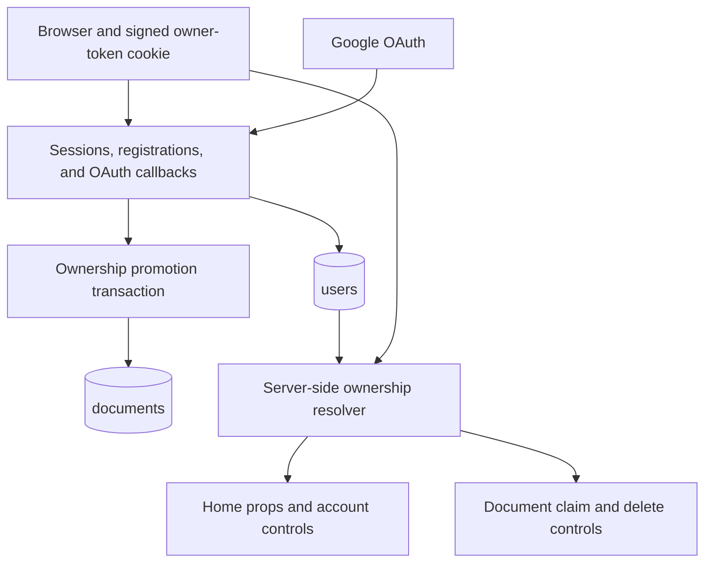
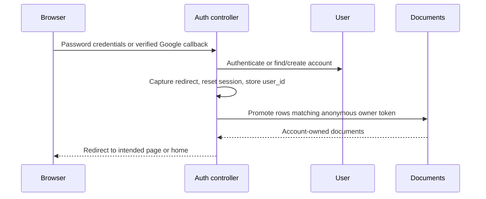
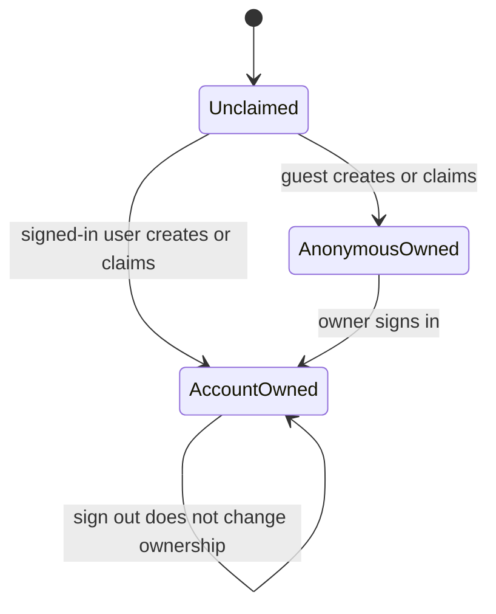

# feat: Add optional user authentication and durable document ownership

## Summary

Add optional Google OAuth and email/password accounts without removing Thinkroom's guest-first flow. Successful authentication upgrades documents claimed by the current anonymous browser into durable account ownership, while the homepage and README clearly present the product, its open-source status, and its richer document capabilities.

---

## Problem Frame

Thinkroom currently identifies people through a session display name and a permanent signed `owner_token` cookie. This preserves anonymous ownership on one browser, but it cannot restore documents on another device or survive lost browser state. Users need a minimal account path that preserves everything they already claimed before signing in.

The application must remain useful without an account. Authentication adds continuity, not a gate in front of shared documents, editing, agents, or claims.

---

## Requirements

### Account access

- R1. A person can create an account with name, email, password, and password confirmation.
- R2. A person can sign in with email and password or Google OAuth and can sign out from visible application chrome.
- R3. Google authentication stores only the stable Google subject identifier and verified profile fields needed for account identity; access and refresh tokens are not persisted.
- R4. Authentication errors use generic messages that do not reveal whether an email address exists.
- R5. Successful sign-in and sign-out rotate the Rails session to prevent session fixation.
- R6. Password registration and login are rate-limited by IP, and password failures perform equivalent credential work before returning the same generic response.

### Ownership continuity

- R7. On successful registration or sign-in, every document owned by the current signed browser token and not already attached to an account transfers to the authenticated user in one transaction.
- R8. Documents created or claimed while signed in attach directly to the user; anonymous browsers continue using the existing signed owner token.
- R9. Account-owned documents are available across browsers and are not treated as owned after sign-out merely because the old anonymous token cookie remains.

### Product surface

- R10. Browser-created documents are always Markdown; HTML creation remains available only through the agent API.
- R11. The homepage exposes sign-in state, a GitHub open-source/star badge, and the Southern California creator credit without displacing the existing primary actions.
- R12. The README includes a current product screenshot showing prose, agent work, tasks, an uploaded image, and an inline sketch.
- R13. Google credentials remain environment-only and absent from version control, with local and production setup documented using placeholders.

### Compatibility

- R14. Existing token-owned documents, share links, guest identities, agent APIs, and ownership race semantics continue to work.
- R15. The feature ships with model, integration, security, and browser coverage for both authentication methods and ownership transfer.

---

## Scope Boundaries

### Included

- Optional accounts backed by Rails sessions.
- Email/password registration and login with `has_secure_password`.
- Google OAuth through OmniAuth with CSRF-protected POST initiation.
- Automatic migration of the current browser's anonymous document ownership after authentication.
- Account state in shared Inertia props and focused account controls on the home and document surfaces.

### Deferred to Follow-Up Work

- Password reset and email verification, because this release intentionally has no email delivery provider.
- Account profile editing, account deletion, multi-provider account management, and explicit document transfer between existing users.
- Organization, team, role, invitation, or paid-account concepts.

### Outside this product's identity

- Requiring login to read or collaborate on a shared Thinkroom document.
- Authenticating external agents through human user accounts.

---

## Key Technical Decisions

- KTD1. **Use a small first-party `User` model and Rails cookie session:** `has_secure_password` plus `session[:user_id]` fits the existing Rails/Inertia architecture and avoids Devise features this product does not need.
- KTD2. **Keep authentication optional:** all existing pages remain public; server-side ownership checks use the current user when present and otherwise fall back to the signed anonymous token.
- KTD3. **Promote ownership instead of copying it:** authentication sets `documents.user_id`, clears `owner_token`, and updates `owner_name` to the account name for documents owned by the current token. A database check prevents both ownership identifiers from being present.
- KTD4. **Preserve race-safe claim semantics:** a claim succeeds only while both `user_id` and `owner_token` are empty, then records exactly one ownership mechanism.
- KTD5. **Never auto-link providers by email:** local email addresses are unverified in this no-email-provider release, so a Google callback resolves only by its unique Google subject. A verified Google email that collides with an existing local account receives a safe provider-mismatch response instead of linking credentials.
- KTD6. **Do not store Google bearer credentials:** Thinkroom needs identity, not ongoing Google API access, so persisting OAuth access or refresh tokens would add risk without product value.
- KTD7. **Use POST for the OmniAuth request phase:** a normal HTML form carries the Rails authenticity token and allows the browser to follow Google's external redirect. Local Inertia forms continue using the Inertia form flow.
- KTD8. **Rotate sessions after authentication:** capture only the post-authentication destination needed for continuity, call `reset_session`, then store the user ID and perform ownership promotion using the separate signed owner-token cookie.
- KTD9. **Normalize email before persistence:** store lowercase stripped email values behind a unique index so password and Google paths converge on the same account identity.
- KTD10. **Keep redirects local and authentication attempts bounded:** accept only same-origin relative return paths, apply Rails rate limits to password endpoints, and execute a dummy password hash check when no matching password account exists.

---

## High-Level Technical Design

### Authentication and ownership components

### Successful authentication sequence

### Document ownership states

---

## Acceptance Examples

- AE1. Given a guest browser has claimed three documents, when that person registers with email/password, then all three documents appear under the new account and none remain token-owned.
- AE2. Given a guest browser has claimed documents and an existing account signs in, when authentication succeeds, then the guest documents join the account's existing documents without duplication.
- AE3. Given an account-owned document and the same browser signs out, when the home page reloads, then the document is not listed as owned by the guest session.
- AE4. Given an unclaimed shared document, when a signed-in user claims it, then the row stores the user owner and a simultaneous competing claim loses cleanly.
- AE5. Given a local account and a verified Google callback with the same email, when Google sign-in completes, then no credential is linked and the person is directed to use the account's existing sign-in method.
- AE6. Given a Google-only account, when a password login is attempted, then authentication fails with the same generic error used for an unknown email.
- AE7. Given Google credentials are absent locally, when the sign-in page renders, then email/password remains usable and the UI does not present a broken Google action.
- AE8. Given the user selects New document on the homepage, when creation completes, then the document format is Markdown regardless of posted format parameters.

---

## Implementation Units

### U1. Account model and ownership promotion

- **Goal:** Persist users and make account ownership coexist safely with anonymous token ownership.
- **Requirements:** R1, R3, R7-R9, R14; AE1-AE6.
- **Dependencies:** None.
- **Files:** `Gemfile`, `Gemfile.lock`, `app/models/user.rb`, `app/models/document.rb`, `db/migrate/` (new user and document-owner migrations), `db/schema.rb`, `test/models/user_test.rb`, `test/models/document_test.rb`.
- **Approach:** Add bcrypt, normalized unique email, nullable password digest for Google-only users, unique nullable Google subject, and a nullable document foreign key. Add a database invariant that `user_id` and `owner_token` cannot coexist. Give `User` one transaction-backed ownership-promotion operation that clears the token and makes the account name canonical. Extend document ownership predicates, props, and atomic claim behavior to accept the current user without exposing either credential to clients.
- **Patterns to follow:** Existing `Document#claim!`, normalization helpers, SQLite foreign keys, and race-oriented ownership model tests.
- **Test scenarios:**
  - A local user requires normalized unique email, name, password length, and matching confirmation.
  - A Google-only user is valid with a verified subject and no password digest; password authentication returns false.
  - User ownership promotion moves every matching token-owned document, clears its token, leaves other tokens and already-account-owned rows unchanged, and is idempotent.
  - Account and anonymous claims both use the same single-winner condition under a simulated race.
  - Ownership props report `yours` only for the matching user when `user_id` exists, even if the browser still presents the former token.
- **Verification:** Models enforce one account per email/Google subject and one effective ownership mechanism per claimed document.

### U2. Session, registration, and Google OAuth controllers

- **Goal:** Provide secure authentication entry points and run ownership promotion after every successful authentication.
- **Requirements:** R1-R9, R13-R15; AE1-AE7.
- **Dependencies:** U1.
- **Files:** `config/routes.rb`, `config/initializers/omniauth.rb`, `config/initializers/filter_parameter_logging.rb`, `app/controllers/application_controller.rb`, `app/controllers/inertia_controller.rb`, `app/controllers/sessions_controller.rb`, `app/controllers/registrations_controller.rb`, `app/controllers/oauth_callbacks_controller.rb`, `app/controllers/concerns/authenticates_user.rb`, `test/integration/authentication_flow_test.rb`, `test/integration/google_oauth_flow_test.rb`, `test/integration/identity_flow_test.rb`.
- **Approach:** Resolve `current_user` from the session on every request and expose only id, name, and email through shared Inertia props. Use one authentication finalizer for local-only return-path validation, session rotation, user assignment, guest-name cleanup, and ownership promotion. Rate-limit local credential attempts and run a dummy bcrypt comparison for missing or Google-only password accounts. Configure Google only when both environment credentials exist, request minimal `email profile` scope with online access, validate verified email, and handle denial/failure with a generic redirect error.
- **Execution note:** Implement controller and security behavior test-first because session rotation, OAuth callbacks, and ownership promotion cross trust boundaries.
- **Patterns to follow:** Existing Inertia redirect errors, controller rate limits, Rails CSRF protection, and the official OmniAuth auth-hash contract.
- **Test scenarios:**
  - Registration signs in, rotates the prior session, promotes claimed docs, and rejects invalid or duplicate input without account enumeration.
  - Password login accepts normalized email, rejects wrong/unknown credentials identically, rotates the session, and promotes docs.
  - Repeated password attempts hit the IP rate limit, and missing-email and wrong-password paths both execute password verification work before the same response.
  - Logout clears authenticated session state and rotates history/session without deleting documents.
  - Google callback creates a user from a verified payload, reuses an existing subject, rejects missing/unverified email, and never links a colliding local email account.
  - OmniAuth request initiation is POST-only and the callback/failure routes do not leak provider details or credentials.
  - External, protocol-relative, and malformed `return_to` values are discarded; a safe local document path survives password and Google authentication.
  - Passwords, OAuth authorization codes, state values, and credential-shaped callback parameters are filtered from request logs.
  - Shared viewer props prefer the authenticated name and expose an authenticated account shape without password digest, Google subject, tokens, or owner token.
- **Verification:** Both authentication methods converge on one hardened finalization path and the full integration suite proves ownership transfer.

### U3. Account interface and authenticated identity behavior

- **Goal:** Make account entry, state, and sign-out clear without turning Thinkroom into an account-gated app.
- **Requirements:** R1, R2, R4, R11, R14; AE6, AE7.
- **Dependencies:** U2.
- **Files:** `app/frontend/pages/auth/show.tsx`, `app/frontend/components/account_control.tsx`, `app/frontend/components/identity_chip.tsx`, `app/frontend/pages/documents/index.tsx`, `app/frontend/pages/documents/show.tsx`, `app/frontend/entrypoints/application.css`, `test/integration/authentication_flow_test.rb`.
- **Approach:** Render login and registration modes from server-owned props. Use Inertia forms for local credentials and a normal CSRF-bearing POST form for Google. Show account controls on home and document pages; authenticated identity is server-owned and no longer editable through the guest display-name control.
- **Patterns to follow:** Existing landing typography, button tokens, Inertia error rendering, responsive header group constraints, and `IdentityChip` interaction states.
- **Test scenarios:**
  - Login and registration pages expose labeled, autofill-friendly inputs, inline server errors, a Google action only when configured, and links between modes.
  - Authenticated home and document views display the account name and a reachable sign-out action; guests see a sign-in action and retain display-name editing.
  - Mobile and desktop layouts preserve primary document controls without overflow.
- **Verification:** Browser testing completes password registration, login, logout, and guest-to-account ownership continuity at desktop and mobile widths.

### U4. Account-aware document actions and home queries

- **Goal:** Route every browser ownership decision through the authenticated-or-anonymous ownership resolver.
- **Requirements:** R7-R10, R14; AE1-AE4, AE8.
- **Dependencies:** U1, U2.
- **Files:** `app/controllers/documents_controller.rb`, `app/frontend/pages/documents/index.tsx`, `app/frontend/components/header_menu.tsx`, `test/integration/ownership_flow_test.rb`, `test/integration/home_claim_test.rb`, `test/integration/document_create_test.rb`.
- **Approach:** Query account-owned rows when signed in and token-owned rows otherwise. Pass the current user into create, claim, delete, and ownership-prop operations. Keep agent-created documents unclaimed. Make browser creation unconditionally Markdown and ignore client format attempts.
- **Patterns to follow:** Current owner-token query limits, deduped recent documents, atomic claim update, and owner-only delete behavior.
- **Test scenarios:**
  - Signed-in home lists account documents across a fresh cookie jar, while guests list only their token documents.
  - Signed-in create and claim store `user_id` without `owner_token`; guest create and claim retain current behavior.
  - Delete allows the account owner from another browser, rejects a logged-out former token browser, and preserves anonymous owner behavior.
  - Browser create produces Markdown for absent, HTML, and unknown format parameters; API HTML creation remains unchanged.
- **Verification:** Existing guest ownership tests stay green and new account variants cover every ownership-changing action.

### U5. OAuth deployment and contributor configuration

- **Goal:** Make Google sign-in configurable without committing credentials or breaking deployments that omit it.
- **Requirements:** R2, R3, R13, R15; AE7.
- **Dependencies:** U2.
- **Files:** `config/deploy.yml`, `.kamal/secrets.example`, `README.md`, `DEPLOYING.md`, `test/integration/authentication_flow_test.rb`.
- **Approach:** Add Google client ID and secret to Kamal's secret environment allowlist, document exact local and production callback URLs, and keep runtime configuration optional. Include no real values, generated secrets, or OAuth payloads in tracked files or logs.
- **Patterns to follow:** Environment-driven Kamal configuration and the repository's existing ignored `.kamal/secrets` convention.
- **Test scenarios:**
  - The application boots and email/password login renders when Google variables are absent.
  - Google UI and middleware are enabled only when both variables are present.
- **Verification:** Secret scanning and git diff contain variable names/placeholders only; production configuration documents the exact callback path.

### U6. Homepage and README product showcase

- **Goal:** Finish the in-progress product presentation work and capture a representative editor image.
- **Requirements:** R10-R13.
- **Dependencies:** U3, U4.
- **Files:** `app/frontend/pages/documents/index.tsx`, `app/frontend/entrypoints/application.css`, `README.md`, `docs/images/thinkroom-editor.png`, `test/integration/document_create_test.rb`.
- **Approach:** Keep New document as one-click Markdown creation. Add a compact linked GitHub badge and creator credit in the landing footer. Build a local showcase document with agent-authored prose, tasks, an uploaded visual, and an inline Excalidraw sketch, then capture the stable read view at README-friendly dimensions.
- **Patterns to follow:** Existing landing tokens, the committed README image link, local upload API, and stable sketch preview renderer.
- **Test scenarios:** Test expectation: browser coverage is appropriate for the presentation layer; U4 covers Markdown creation behavior at the server boundary.
- **Verification:** The homepage is balanced on mobile and desktop, external links are correct, and the README screenshot legibly demonstrates the requested capabilities.

---

## System-Wide Impact

- **Data lifecycle:** document ownership becomes account-restorable while legacy token rows remain valid until their owner authenticates.
- **Authorization:** all destructive document operations must evaluate account ownership before token ownership; React only renders the server's decision.
- **Identity:** authenticated account name supersedes the mutable guest session name for provenance and activity attribution.
- **Session lifecycle:** login and logout invalidate prior session state; only a validated local return path crosses the login rotation boundary.
- **Agents:** agent endpoints and self-asserted agent identity remain independent from human authentication.
- **Operations:** Google sign-in depends on two deployment secrets and exact callback URI configuration; password login remains available without them.

---

## Risks & Dependencies

- **OAuth account takeover through unsafe email linking:** never auto-link a Google subject to a password account because local emails are unverified; reject the collision and defer explicit account linking.
- **Session fixation:** reset the session at both authentication and logout boundaries, restoring only the intended user ID and redirect destination.
- **Credential stuffing and account enumeration:** rate-limit by IP, normalize input, return one failure message, and perform a dummy bcrypt comparison for accounts without a usable password.
- **Ownership regression:** centralize the authenticated-or-token predicate and retain all current token-based tests alongside account variants.
- **Concurrent ownership promotion or claim:** use database transactions and conditional updates; never overwrite a document already assigned to another account.
- **Open redirect after authentication:** retain only parsed same-origin relative paths and fall back to the homepage for every other value.
- **Missing production OAuth credentials:** treat Google as optional at boot and hide its action until configured.
- **Credential leakage:** never log auth hashes or persist Google bearer tokens; track only environment variable names and placeholders.

---

## Documentation and Operational Notes

- Google Cloud must authorize the exact callback URLs ending in `/auth/google_oauth2/callback` for localhost and each production hostname.
- No SMTP or transactional email service is added. Password reset and email verification remain unavailable until an explicit email-provider project.
- Switching an existing account between password and Google credentials requires a future authenticated linking flow; matching email alone never links providers.
- The rollout migration is additive and nullable. Existing documents require no backfill because ownership promotes when the owning browser next authenticates.

---

## Sources and Research

- Existing ownership contract: `app/models/document.rb`, `app/controllers/application_controller.rb`, `app/controllers/documents_controller.rb`, and `test/integration/ownership_flow_test.rb`.
- Existing Inertia identity contract: `app/controllers/inertia_controller.rb`, `app/controllers/identities_controller.rb`, and `app/frontend/components/identity_chip.tsx`.
- Rails security guidance on session fixation and `reset_session`: https://guides.rubyonrails.org/security.html#session-fixation-countermeasures
- Rails secure password requirements and bcrypt dependency: https://guides.rubyonrails.org/active_model_basics.html#securepassword
- OmniAuth Google strategy setup and verified auth-hash fields: https://github.com/zquestz/omniauth-google-oauth2
- OmniAuth Rails request-phase CSRF protection and POST requirement: https://github.com/cookpad/omniauth-rails_csrf_protection
- Google web-server OAuth redirect and state requirements: https://developers.google.com/identity/protocols/oauth2/web-server
