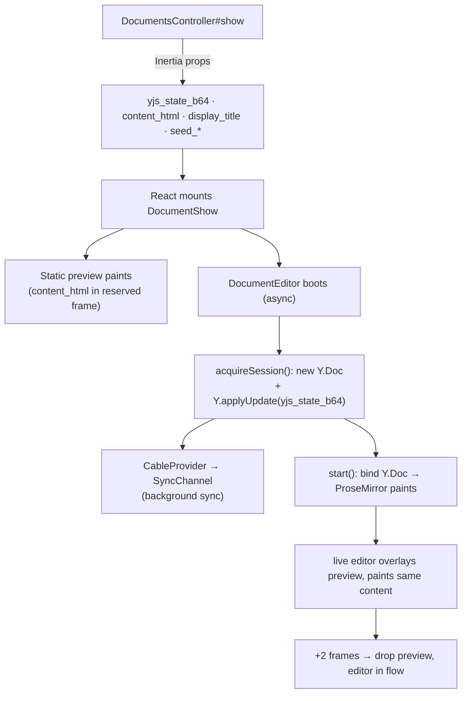
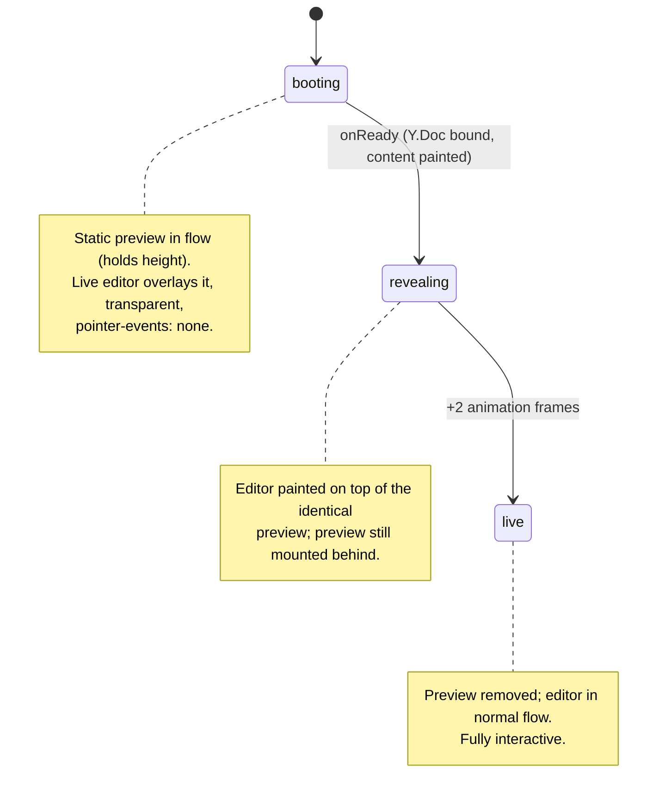

# Instant first paint for the document editor

## Summary

Remove the load flicker on `GET /d/:slug`. The document content already ships in the first HTTP response as the `yjs_state_b64` Inertia prop and hydrates the editor before the WebSocket connects — so the flicker was never the socket redrawing. It was the **async Milkdown boot** leaving the reserved editor frame blank until ProseMirror painted, compounded by the header title flashing the stored value and the connection dot flashing `connecting → live`.

The fix paints a sanitized, server-rendered copy of the current content into the reserved editor frame at React-mount time, derives the header title on the server, and runs a small three-phase swap so the live editor *replaces* the preview (never blanks it). It also removes two small sources of chrome flicker (the optimistic status dot and the redundant header Sketch button).

This plan is retrospective: the work is implemented on branch `fix/instant-first-paint` and is being routed through the LFG pipeline for review, browser verification, and shipping. Implementation units map to the change set already in the working tree.

---

## Problem frame

On load/refresh, a reader saw the document area sit blank inside its reserved 50vh frame, then pop in once Milkdown finished building (schema, plugins, Shiki, Yjs binding). Three things changed state at slightly different moments and read as a single flicker:

1. **Blank editor frame → content.** `content_html` did not exist; the only content source on the client was the binary `yjs_state_b64`, which is invisible until the async editor binds and paints.
2. **Header title flash.** The header rendered `document.title` (often the stored default, e.g. "Untitled") until the editor extracted the first H1 and called `onTitleChange`.
3. **Status dot flash.** The connection dot initialized to `connecting` and only flipped to `live` when the editor started — even though a hydrated doc is functionally live on first paint.

A naive first cut (remove the preview the instant `handle` arrived) reproduced a worse symptom the user described as "it deletes it instead of replacing": the preview was removed a frame or two before ProseMirror had actually painted the synced content, briefly blanking the column.

---

## Requirements

- R1. The document's current content is visible in the editor column on first paint, before Milkdown finishes its async boot.
- R2. The first paint is safe: server-rendered content is sanitized before reaching `dangerouslySetInnerHTML`.
- R3. The transition from server preview to live editor is seamless — content is replaced, never momentarily blank.
- R4. The header title (in-app `.doc-title` and the browser tab `<Head>`) reads the real document title on first paint.
- R5. Sketch-bearing documents reserve the correct height in the preview so the layout does not jump when the live canvas mounts.
- R6. No behavioral regressions: live collaboration, snapshots, seed claims, suggestions, and presence continue to work; sketches remain insertable.
- R7. Reduced chrome flicker: the connection dot does not flash `connecting → live` for a doc that is already hydrated; the redundant header Sketch button is removed.

---

## Key technical decisions

- **Reuse the existing render + sanitize stack.** `DocumentPreviewHtml` renders markdown via `Commonmarker` (mirroring `DocumentPlainText`) or passes through HTML, then routes everything through `HtmlDocumentSanitizer.snapshot` — the same trusted-metadata boundary used for snapshots. This keeps one sanitization policy rather than introducing a second. (R2)
- **Skeletonize sketches post-sanitize.** The preview can't run Excalidraw, and the sanitizer's tag allowlist excludes `div`/inline styles. So sketch replacement runs *after* sanitization (the injected height is trusted, not user input): HTML sketch figures and markdown ```excalidraw fences become a neutral `figure.doc-sketch-skeleton` with the sketch's height. Prevents both a raw-JSON flash (markdown) and a collapsed canvas (HTML). (R5)
- **Three-phase swap, gated on paint — not on `handle`.** The preview holds layout height in normal flow; the live editor overlays it (`position: absolute`, transparent) while booting so it paints *over* the identical preview, and the preview is removed two animation frames after `onReady`. The preview is always behind the live editor until then, so content is never blank. This is the core fix for the "deletes instead of replacing" symptom. (R3)
- **Derive title on the server.** `Document#display_title` extracts the first H1 via the existing `DocumentTitle` service (guarded against blank content, which `nil.to_s` makes US-ASCII and `Commonmarker` rejects). Shipped as `display_title` and used to initialize `documentTitle`. (R4)
- **Optimistic status.** Initialize `status` to `live` when `has_state || seed_granted`; the WebSocket still confirms in the background. Consistent with current behavior (the provider only ever emits `connecting → live`; there is no wired disconnect path). (R7)
- **Drop the header Sketch button.** It duplicated the `/` slash-menu "Sketch" entry and was a flicker source (`disabled` until `handle`). Removed with its orphaned CSS. (R7)

---

## High-level technical design

### Data flow on first load



### Editor swap state machine (`doc-editor-stack[data-phase]`)



---

## Implementation units

### U1. `DocumentPreviewHtml` service

**Goal:** Render sanitized HTML of a document's current content for first paint, with sketches reduced to height-reserving skeletons.
**Requirements:** R1, R2, R5
**Dependencies:** none
**Files:** `app/services/document_preview_html.rb` (new), `test/services/document_preview_html_test.rb` (new)
**Approach:** `call(format:, content:)` returns `""` for blank content; markdown → `Commonmarker.to_html` (same plugins as `DocumentPlainText`), HTML passed through; both routed through `HtmlDocumentSanitizer.snapshot`. Post-sanitize, replace HTML sketch figures (`figure[data-thinkroom-sketch]`, height from `data-sketch-height`) and markdown sketch fences (`pre > code` whose JSON has a `scene` key, height from payload) with `figure.doc-sketch-skeleton` carrying an inline `height`. Clamp height to `[180, 1200]`, default `448`.
**Patterns to follow:** `app/services/document_plain_text.rb` (Commonmarker invocation, Nokogiri sketch traversal), `app/services/html_document_sanitizer.rb` (`snapshot` boundary).
**Test scenarios:**
- Markdown renders to prose HTML (`<strong>`, `<p>`, heading text present).
- Blank/nil content returns `""` (both formats).
- `<script>` and unsafe markup are stripped.
- A markdown ```excalidraw fence becomes `figure.doc-sketch-skeleton` with the payload height; raw scene JSON (`formatVersion`) is absent.
- An out-of-range sketch height clamps to `MAX_SKETCH_HEIGHT`.
- A valid HTML sketch figure becomes a skeleton at its `data-sketch-height`.
**Verification:** New test passes; service returns sanitized HTML with skeletons for sketch content.

### U2. `Document#preview_html` and `#display_title`

**Goal:** Expose the preview HTML and a server-derived header title on the model.
**Requirements:** R1, R4
**Dependencies:** U1
**Files:** `app/models/document.rb`
**Approach:** `preview_html` delegates to `DocumentPreviewHtml.call(format: content_format, content: current_content)`. `display_title` returns `title` when `current_content` is blank (guards `Commonmarker`'s UTF-8 requirement against `nil.to_s` US-ASCII), else `DocumentTitle.call(...).presence || title`.
**Patterns to follow:** existing `plain_text` delegation on `Document`.
**Test scenarios:**
- `display_title` returns the first H1 of seeded content.
- `display_title` falls back to the stored `title` when content is blank (no `Commonmarker` UTF-8 error). *Covers the regression found in `document_seed_claim_test`.*
**Verification:** Model methods return expected values; `document_seed_claim_test` and `document_test` stay green.

### U3. Ship `content_html` and `display_title` props

**Goal:** Make the new data available to the page.
**Requirements:** R1, R4
**Dependencies:** U2
**Files:** `app/controllers/documents_controller.rb`
**Approach:** Add `content_html: document.preview_html` and `display_title: document.display_title` to the `documents/show` document prop. Initial-render path only (agent/JSON/txt branches return earlier).
**Patterns to follow:** the existing `document.slice(...).merge(...)` prop block.
**Test scenarios:** `Test expectation: none` — prop wiring; covered by the show-path integration tests (`document_seed_claim_test`, `snapshot_test`) staying green and U6's browser verification.
**Verification:** Show response includes both props (asserted via browser prop read in U6).

### U4. Seamless preview→editor swap

**Goal:** Paint the preview instantly and hand off to the live editor without a blank frame.
**Requirements:** R1, R3
**Dependencies:** U3
**Files:** `app/frontend/pages/documents/show.tsx`, `app/frontend/entrypoints/application.css`
**Approach:** Add `DocumentProps.document.content_html`. Wrap the editor in `div.doc-editor-stack` with `data-phase={editorSwapped ? 'live' : handle ? 'revealing' : 'booting'}`. Render the preview (`div.doc-static-preview.milkdown > div.ProseMirror` via `dangerouslySetInnerHTML`) while `!editorSwapped`. `onReady` sets `handle` then schedules `setEditorSwapped(true)` after two `requestAnimationFrame`s. CSS: `booting`/`revealing` make `.doc-live-editor` an absolute overlay (`inset: 0`); `booting` adds `pointer-events: none`; `.doc-editor-stack` reserves `min-height: 50vh`; `.doc-sketch-skeleton` is a neutral box.
**Technical design (directional):** the preview wrapper carries `.milkdown .ProseMirror` so it inherits the editor's prose styles; the live editor is transparent during overlay so the identical preview shows through any not-yet-painted region.
**Patterns to follow:** existing `.milkdown { min-height: 50vh }` reservation; `DocumentEditor` callback wiring.
**Test scenarios:**
- (browser, U6) No blank content frames between preview and live editor across the swap.
- (browser, U6) Booting preview is visually identical to the live editor.
**Verification:** Headless Playwright shows 0 blank frames; phases progress `booting → revealing → live`.

### U5. Optimistic status + remove header Sketch button

**Goal:** Eliminate the remaining chrome flicker.
**Requirements:** R7
**Dependencies:** U4
**Files:** `app/frontend/pages/documents/show.tsx`, `app/frontend/entrypoints/application.css`
**Approach:** Initialize `documentTitle` from `doc.display_title || doc.title`. Initialize `status` to `live` when `doc.has_state || doc.seed_granted`, else `connecting`. Remove the `mode === 'edit'` header Sketch button and its `.sketch-insert-button` CSS (the `/` slash-menu entry remains the insertion path; `handle.openSketch` stays on the handle).
**Patterns to follow:** existing `ConnectionStatus` usage and slash menu (`app/frontend/editor/slash_menu.ts`).
**Test scenarios:**
- (browser, U6) Header title reads the real title from the first painted frame, never "Untitled".
- (browser, U6) No `.sketch-insert-button` in the header; status dot is `live` on a doc with state.
- (manual/regression) The `/` slash menu still inserts a sketch.
**Verification:** Browser checks pass; sketch insertion via slash menu unaffected.

### U6. Verification harness

**Goal:** Prove the flicker is gone and nothing regressed.
**Requirements:** R1, R3, R4, R6
**Dependencies:** U4, U5
**Files:** none committed (throwaway Playwright scripts under `tmp/`, which is gitignored)
**Approach:** Headless Playwright under CPU throttle, sampling per animation frame: assert 0 blank content frames after first content; assert header `.doc-title` is correct from the first frame; capture booting vs. live screenshots for visual parity. Run `npm run check` (tsc) and the Ruby model/service/integration tests.
**Test scenarios:** see U4/U5 browser scenarios.
**Verification:** `npm run check` clean; `bin/rails test` for `document_preview_html_test`, `document_test`, `document_seed_claim_test`, `snapshot_test` green; Playwright reports 0 blank frames and correct first-frame title.

---

## Scope boundaries

**In scope:** server-rendered first-paint preview, server-derived title, the swap state machine, optimistic status, header Sketch button removal.

**Non-goals:**
- Inertia SSR — the app is client-rendered; the preview wins by painting at React-mount, no SSR required.
- Rendering ```mermaid fences as diagrams — Thinkroom shows them as code (convertible to sketches in-UI); unchanged here.
- Changing the Yjs/ActionCable sync protocol, persistence, seed-claim, or provenance behavior.

**Deferred to follow-up work:**
- A cross-fade transition on the swap (current handoff is an instant, content-identical replace; a fade is cosmetic polish).
- Reconsidering React `StrictMode` double-mount in dev (a dev-only amplifier; the swap is robust regardless, and production React does not double-invoke).

---

## Risks & dependencies

- **Preview/editor style drift.** If the preview's prose styling diverges from the live `.milkdown .ProseMirror`, the swap could shift. Mitigated by reusing the same `.milkdown .ProseMirror` selectors and verified pixel-identical in U6.
- **Sketch height accuracy.** Markdown sketch payloads may omit height; the skeleton falls back to the default (448) and can reflow slightly when the real canvas mounts. Acceptable; HTML figures carry exact height.
- **Page weight.** `content_html` roughly duplicates the document text already present as `yjs_state_b64`. Acceptable for the UX win on typical documents; revisit only if large documents show a regression.
- **Sanitization is load-bearing.** `content_html` reaches `dangerouslySetInnerHTML`; it must always pass through `HtmlDocumentSanitizer`. Covered by U1's XSS test.
