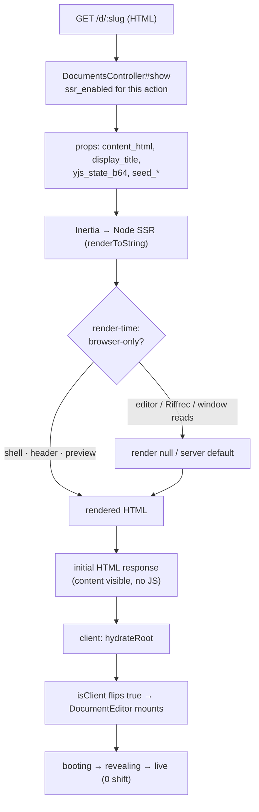

# Inertia SSR for the document page

## Summary

Render the document page's HTML on the server so the shell, header, and the server-rendered `content_html` preview are in the **initial HTTP response** — visible before any JavaScript loads. The browser-only editor (Milkdown/ProseMirror, Excalidraw, Yjs, the ActionCable `CableProvider`) renders nothing on the server and mounts only after client hydration, where the existing `booting → revealing → live` swap takes over.

This is the follow-up to the instant-first-paint work (`content_html`, `display_title`, the seamless swap on branch `fix/instant-first-paint`). Measurement showed the remaining blank window is **before React mounts** (~220ms on a warm load; ProseMirror then paints ~14ms later) — and a React-rendered preview can't fill a pre-React gap. Only SSR closes it. Ships in this branch.

---

## Problem frame

The instant-paint preview is rendered by React, so it appears only after the JS bundle downloads, parses, and React mounts — the ~220ms during which the page is the empty Inertia shell. SSR moves the first paint to the server: the same `content_html` + `display_title` already computed for props are rendered into the HTML response, so content is on screen at first byte. The hard part is that the document page is **browser-coupled** — the editor and several render-time reads (`localStorage`, `window`, a media query) would crash or mismatch under Node `renderToString`. The win is real but the work is making one large page SSR-safe without regressing the editor, the zero-shift swap, or the agent/txt/JSON response branches.

---

## Requirements

- R1. `GET /d/:slug` returns the rendered document content (title + prose) **in the initial HTML**, not only in the Inertia `data-page` JSON.
- R2. No React hydration mismatch warnings on load for the document page.
- R3. The live editor still mounts, binds the hydrated Yjs state, syncs over ActionCable, and the `booting → revealing → live` swap still yields **0 layout shift**.
- R4. Browser-only code (editor, Excalidraw, Yjs, `CableProvider`, `RiffrecProvider`, `localStorage`/`window`/media-query reads) never executes during the server render.
- R5. The non-HTML branches of `documents#show` (agent guide via `agent_user_agent?`, `.txt`, `.json`) are unaffected.
- R6. SSR failure falls back to client-side rendering gracefully (no 500 for a render error in production).
- R7. SSR runs in development with no extra process (Vite dev server) and is wired for production (SSR bundle + Node process under the existing Kamal/Docker deploy).
- R8. Blast radius is controlled: SSR is enabled for the document page first; other pages are not forced SSR-safe in the same change unless verified.

---

## Key technical decisions

- **Use the `@inertiajs/vite` plugin SSR path (v3).** It's already a dependency and the `inertia()` plugin is already in `vite.config.ts`. Dev SSR runs through the Vite dev server (no separate process); only production needs a built SSR bundle + Node process. Avoids a hand-rolled SSR entry. (R7)
- **`hydrateRoot`, not `createRoot`, on the client.** The client entry must hydrate the server HTML rather than re-render it, or React discards the SSR output and the benefit is lost. Keep `StrictMode` and `RiffrecProvider` in the tree. (R2)
- **Conditional SSR, document page first.** Enable SSR via `inertia_config(ssr_enabled: …)` scoped to `DocumentsController#show` (or a thin allowlist), not globally. The landing/auth pages aren't the latency target and shouldn't be forced SSR-safe in one shot. Revisit global SSR later. (R8)
- **The editor is a client-only island.** `DocumentEditor` renders `null` (the preview already covers first paint) on the server and mounts only after hydration via an `isClient` gate (`useSyncExternalStore` with a server snapshot of `false`, or a mount `useEffect`). The preview is plain server-rendered HTML and is identical on server and client's first render, so `editorSwapped` is `false` on both → no mismatch. (R3, R4)
- **Deterministic server defaults for browser-derived state.** Anything read from `localStorage`/`window`/media queries at render time (`mode`, `panelOpen`, `focusMode`, `isMobile`, `identity`) renders a fixed server default on first paint and applies the real client value in a post-hydration `useEffect`. First render must be identical server↔client. (R2)
- **Graceful degradation.** `ssr_raise_on_error = !Rails.env.production?` + `on_ssr_error` logging + `ssr_bundle` presence detection so a missing/failed SSR bundle falls back to CSR rather than erroring. (R6)

---

## High-level technical design

### Request → first paint (with SSR)



### Hydration-safe state pattern (directional)

The invariant: **first render is identical on server and client.** Browser values arrive after.

```
// directional — not implementation
const [mode, setMode] = useState(SERVER_DEFAULT)          // not readStoredMode() at init
useEffect(() => { setMode(readStoredMode(slug)) }, [])    // client-only, post-hydration

const isClient = useIsClient()                            // false on server + first client render
return isClient ? <DocumentEditor/> : null               // editor never renders on server
```

---

## Implementation units

### U1. SSR infrastructure: plugin SSR, `hydrateRoot`, Rails config

**Goal:** Turn SSR on end-to-end for the document page in development, with CSR fallback.
**Requirements:** R1, R6, R7, R8
**Dependencies:** none
**Files:** `app/frontend/entrypoints/inertia.tsx`, `config/initializers/inertia_rails.rb`, `config/vite.json`, `vite.config.ts` (verify `inertia()` SSR options), `app/controllers/documents_controller.rb`
**Approach:** Switch the client `setup` to `hydrateRoot` (keep `StrictMode` + `RiffrecProvider`). Configure the `@inertiajs/vite` plugin's SSR entry per the v3 docs. In the initializer set `ssr_enabled` (scoped — see U5), `ssr_url` nil for dev auto-detect, `ssr_raise_on_error = !Rails.env.production?`, `on_ssr_error` logging, and `ssr_bundle` detection. Add `inertia_config(ssr_enabled: …)` to `DocumentsController#show` only. Confirm `inertia_ssr_head` is already in the layout (it is).
**Patterns to follow:** the inertia-rails-ssr v3 Vite-plugin setup; existing `inertia.tsx` `setup` shape.
**Test scenarios:**
- Dev: `GET /d/:slug` (browser UA) returns HTML whose body contains the document title text and first paragraph (not just `data-page` JSON). *Covers R1.*
- With SSR disabled/bundle absent, the page still renders via CSR (no 500). *Covers R6.*
- Agent UA / `.txt` / `.json` branches return their existing non-Inertia responses unchanged. *Covers R5.*
**Verification:** curl with a browser UA shows rendered content in the HTML; agent/txt/json unaffected; toggling SSR off falls back to CSR.

### U2. Editor as a client-only island

**Goal:** Ensure the editor and its browser-only dependencies never render on the server.
**Requirements:** R3, R4
**Dependencies:** U1
**Files:** `app/frontend/pages/documents/show.tsx`, `app/frontend/editor/milkdown_editor.tsx`, a small `app/frontend/lib/use_is_client.ts` (new)
**Approach:** Add a `useIsClient` hook (server snapshot `false`). Gate `<DocumentEditor>` so the server renders `null` while the static preview (already present) carries first paint; the editor mounts after hydration. Verify nothing in the editor module graph (Milkdown `useEditor`, Excalidraw import, `CableProvider`, Yjs) executes at module-eval or render time on the server — defer browser-only imports if any run eagerly.
**Patterns to follow:** the existing `doc-editor-stack` phase gating; `editorSwapped`/`handle` state.
**Test scenarios:**
- Server HTML for `/d/:slug` contains `doc-static-preview` content but **no** `.milkdown`/ProseMirror editor DOM. *Covers R4.*
- After hydration the editor mounts, `data-phase` advances `booting → live`, and content stays stable (0 blank frames, 0 CLS). *Covers R3.*
- A doc with a sketch renders the skeleton on the server and the real Excalidraw canvas only after mount. *Covers R4.*
**Verification:** Playwright — server HTML has preview + no editor; post-hydration editor works and swap is zero-shift.

### U3. Hydration-safe browser-derived state

**Goal:** Remove every render-time browser-API read from the document page's first render.
**Requirements:** R2
**Dependencies:** U1
**Files:** `app/frontend/pages/documents/show.tsx` (and the `getStored*`/`readStoredMode`/`userIdentity` helpers it calls)
**Approach:** Initialize `mode`, `panelOpen`, `focusMode`, `isMobile`, and `identity` to deterministic server defaults; apply the `localStorage`/`window`/media-query values in a post-hydration `useEffect`. Audit `userIdentity(viewer.name)` and the `getStored*` helpers for `localStorage`/`window` access during init and guard them. Keep the optimistic `status` and server-derived `documentTitle` (already prop-derived, SSR-safe).
**Patterns to follow:** the existing initializer-only state comments in `show.tsx`.
**Test scenarios:**
- Console shows **no** hydration mismatch warning on load. *Covers R2.*
- Stored mode/panel/focus still apply after load (just one frame later). 
- Mobile viewport still collapses the gutter after hydration.
**Verification:** no React hydration warnings; stored prefs still take effect post-hydration.

### U4. SSR-safe provider/render-time wrappers

**Goal:** Confirm the always-mounted wrappers survive `renderToString`.
**Requirements:** R4, R6
**Dependencies:** U1
**Files:** `app/frontend/entrypoints/inertia.tsx`, any shared layout/provider components, `app/frontend/lib/use_is_client.ts`
**Approach:** Verify `RiffrecProvider` (screen/voice capture) does not touch `window`/`navigator`/media during SSR render; if it does, gate its browser-only effects behind `isClient` or render a passthrough on the server. Sweep shared layout/header components rendered on every page for render-time browser access.
**Patterns to follow:** U2's `useIsClient` gate.
**Test scenarios:**
- SSR render of the document page does not throw (no `window is not defined` / `document is not defined`). *Covers R4.*
- `on_ssr_error` is exercised by a deliberately-thrown SSR error in a test and the page still serves via CSR. *Covers R6.*
**Verification:** SSR render completes without browser-global errors; forced error degrades to CSR.

### U5. SSR scope decision and landing/auth verification

**Goal:** Keep SSR scoped to the document page and confirm nothing else broke.
**Requirements:** R8
**Dependencies:** U1
**Files:** `config/initializers/inertia_rails.rb`, `app/controllers/documents_controller.rb`, `app/controllers/*` for other Inertia pages
**Approach:** Lock SSR to `documents#show` via per-controller `inertia_config`. Confirm the landing page (`/`) and auth pages still render correctly under CSR (they remain CSR since SSR is scoped). Document the path to broaden SSR later.
**Patterns to follow:** Rails `inertia_config` conditional SSR from the inertia-rails docs.
**Test scenarios:**
- Landing and auth pages render and function (CSR). *Covers R8.*
- Only `documents#show` returns server-rendered content in HTML.
**Verification:** doc page is SSR; other pages are CSR and unbroken.
**Test expectation: none beyond the above** — this unit is configuration + verification of existing pages.

### U6. Production deploy wiring

**Goal:** Build the SSR bundle and run the Node SSR process in production.
**Requirements:** R7
**Dependencies:** U1–U4
**Files:** `Dockerfile`, `config/deploy.yml` (Kamal), `Procfile.dev` (dev needs no SSR process, but document it), build scripts / `package.json`
**Approach:** Add the SSR bundle build (`bin/vite build --ssr` or the plugin equivalent) to the production image build. Run the Node SSR server as a process Kamal manages (sidecar/accessory or a process in the container alongside Puma), with `ssr_url` pointing at it. Consider `ssr_cache` for the document page. Ensure graceful fallback if the SSR process is down (CSR).
**Patterns to follow:** existing `Dockerfile` node-install stage; `config/deploy.yml` structure.
**Test scenarios:** `Test expectation: none` — deploy/infra config; validated by U7's production-shaped smoke (SSR bundle builds; container serves SSR HTML; SSR process down → CSR fallback).
**Verification:** production image builds the SSR bundle; a built-bundle run serves SSR HTML; killing the SSR process degrades to CSR, not 500.

### U7. Verification harness

**Goal:** Prove SSR delivers content in the initial HTML without regressing anything.
**Requirements:** R1, R2, R3, R5
**Dependencies:** U2, U3, U4
**Files:** none committed (throwaway Playwright/curl scripts under `tmp/`, gitignored)
**Approach:** (a) curl `/d/:slug` with a browser UA → assert title + first paragraph present in HTML and `.milkdown` editor DOM absent; (b) Playwright load → assert no hydration mismatch console warning, editor mounts, `data-phase` reaches `live`, 0 blank frames, CLS 0.0000; (c) curl agent UA / `.txt` / `.json` → unchanged; (d) forced SSR error → CSR fallback.
**Test scenarios:** the four checks above (R1, R2/R3, R5, R6).
**Verification:** all four pass; `npm run check` clean; full Ruby suite green.

---

## Scope boundaries

**In scope:** SSR for `documents#show` (shell + header + preview in initial HTML), client-only editor island, hydration-safe state, graceful CSR fallback, dev + production wiring.

**Non-goals:**
- Global SSR for every page (landing, auth) — scoped to the doc page first.
- SSR-rendering the live editor / Yjs / Excalidraw — these stay client-only by design.
- Changing the swap state machine, persistence, sync protocol, or the `content_html`/`display_title` server rendering (already shipped in PR #48).

**Deferred to follow-up work:**
- Broadening SSR to landing/marketing pages for SEO once the doc page is proven.
- `ssr_cache` tuning and SSR render-latency monitoring for very large docs.
- Open-Graph/meta-tag SSR via `inertia_meta` (related but separate from first-paint).

---

## Risks & dependencies

- **Hydration mismatches (dominant risk).** Any server↔client first-render difference (a stored pref read at init, a `Date`, a random id, a `window` check) prints a warning and can discard SSR output. Mitigation: U3's deterministic-default pattern + U7's explicit no-warning assertion. This is where execution time will go.
- **Browser globals during `renderToString`.** A single eager `window`/`document` access anywhere in the document page's module graph crashes SSR. Mitigation: the `isClient` island (U2), provider sweep (U4), and `ssr_raise_on_error=false` in production as a safety net (U6).
- **StrictMode + `hydrateRoot`.** StrictMode double-invokes in dev; combined with hydration and the existing session-grace-period logic in `milkdown_editor.tsx`, watch for double-acquire. Mitigation: editor mounts post-hydration only (U2); verify session ref-count symmetry.
- **Deploy/process management.** Production now needs a Node SSR process Kamal manages alongside Puma. Mitigation: CSR fallback means an SSR-process outage degrades gracefully rather than taking the site down.
- **RiffrecProvider SSR-safety** is an unknown (third-party-ish capture provider in the render tree on every page) — U4 must verify or guard it.

---

## Operational / rollout notes

- Dev: no new process — `bin/vite dev` serves SSR. Keep `Procfile.dev` as-is; document the behavior.
- Production: SSR bundle build added to the image; Node SSR process managed by Kamal; `ssr_cache` optional. CSR fallback is the kill-switch — disabling `ssr_enabled` or stopping the SSR process reverts to today's behavior with no code change.
- Rollback: flip `ssr_enabled` off for `documents#show`.
