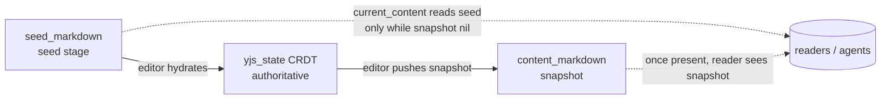

# feat: Add PATCH /api/docs/:slug for updating existing documents

## Summary

Agents can create a document (`POST /api/docs`) but cannot revise it — `PATCH /api/docs/:slug` 404s, so every revision spawns a new document with a new share URL, breaking the "open it and collaborate live" promise. This plan adds an update endpoint that overwrites a document's seed title/content **while it is still in its pre-collaboration seed stage**, and makes that capability discoverable to agents the way every other endpoint already is (the `api` block in the create response and live state payload, the `notes`, and the plain-text guide).

The load-bearing decision is what "update" means in a CRDT-backed editor. Once a human opens the share URL, the Yjs document (`yjs_state`) becomes authoritative and the seed is no longer read — so a seed overwrite at that point would be silently invisible. The endpoint therefore updates the seed only while no editor has taken over, and returns an instructive `409 Conflict` (pointing the agent at suggestions) once collaboration has begun. This keeps the API honest and consistent with the project's "agents propose, humans review — no side channel" philosophy.

---

## Problem Frame

**Who:** AI agents that author and iterate on Thinkroom documents over the plain-HTTP API.

**What's broken:** There is no update path. An agent that wants to fix a typo or regenerate a draft it just shared must `POST` a brand-new document, producing a duplicate share URL. The user who was handed the first URL never sees the revision.

**Why it matters:** The product's core loop is "agent creates a doc, shares one stable URL, human opens it and collaborates." Forcing a new document per revision breaks the stability of that URL and the collaborative loop (see origin issue).

**The constraint that shapes the solution:** A Thinkroom document has three content layers (see `app/models/document.rb`):
- `seed_markdown` (the seed the creator wrote),
- `content_markdown` (the latest editor-pushed snapshot),
- `yjs_state` (the authoritative binary CRDT once an editor session exists).

`Document#current_content` reads the snapshot if present, else the seed. `try_claim_seed` stops seeding once `yjs_state.present?`. So the seed is authoritative **only until the first editor hydrates the Yjs document**. After that, writing the seed changes nothing a human or agent will ever read. The update endpoint must respect this boundary rather than pretend a seed write is a live edit.

---

## Requirements

- **R1.** `PATCH /api/docs/:slug` updates an existing seed-stage document's `title` and/or `content` in place and returns the updated record (origin: "Expected" behavior).
- **R2.** The endpoint accepts the same JSON body shape as create (`title`, `content`, `format`) and the legacy top-level `markdown` field, for symmetry with `POST /api/docs`.
- **R3.** `content_format` is immutable: a `format` that differs from the document's stored format is rejected with a clear error; a matching or omitted `format` is accepted (enforced today by `attr_readonly :content_format` and `content_format_is_immutable`).
- **R4.** When the document has progressed past the seed stage (an editor has taken over — `yjs_state` present), the endpoint does **not** silently no-op or corrupt CRDT state; it returns an instructive `409 Conflict` telling the agent to propose a suggestion instead.
- **R5.** Updated content runs through the same normalization and sketch-audit signal as create, so the response reports `normalized`/`warning` identically (HTML sanitize for HTML docs; markdown sketch-fence audit for markdown docs).
- **R6.** The update is attributed: when an `X-Agent-Name` is present and content is supplied, seed authorship is re-recorded as that agent (consistent with create), and an `Activity` is logged.
- **R7.** Update writes are rate-limited per source IP, like every other write endpoint.
- **R8.** The update capability is discoverable to agents without out-of-band knowledge: it appears in `AgentGuide.endpoints` (so it surfaces in both the create response's `api` block and the live `GET` state payload), in `AgentGuide.notes`, and in the plain-text `AgentGuide.text` guide.
- **R9.** A `404` is returned for an unknown slug, matching the existing `BaseController` convention.

---

## Key Technical Decisions

### KTD-1 — Seed-stage update, not a live-content overwrite (the core decision)

PATCH overwrites the **seed** (`seed_markdown` + `title` + seed attribution) and is allowed **only while `yjs_state` is blank** (no editor has hydrated the CRDT). This is the only layer a write can safely change without a CRDT side channel.

- **Why:** `current_content` and every reader fall back to the seed only until an editor session exists; after that the Yjs CRDT is authoritative (`try_claim_seed` returns false once `yjs_state.present?`; `AgentGuide.notes` states "the Yjs CRDT state is always authoritative"). Writing the seed post-takeover would return `200` while changing nothing any human sees — a silent lie.
- **The issue's real use case is the pre-takeover window:** an agent revising the doc it *just* created and shared, before a human has opened it. That is exactly the seed stage, so seed-stage update fully resolves the reported pain.
- **Detection signal:** `document.yjs_state.blank?` is the gate. (Secondary signals — `content_markdown` present, `seed_state == "claimed"` — are downstream of an editor session; `yjs_state` is the cleanest single predicate and the same one `try_claim_seed` trusts.)
- **Alternative rejected:** Always overwrite `content_markdown`/`yjs_state`. This requires synthesizing or destroying CRDT state from the server, contradicts "there is no side channel: you propose, humans review," and risks clobbering live human edits. Out of scope and against the product's identity.

### KTD-2 — `409 Conflict` with a route-out to suggestions (not `200`, not `403`)

When `yjs_state` is present, return `409` with a body that names the reason and points to the suggestions endpoint (mirroring the instructive-error style of `BaseController#require_agent!`).

- **Why `409`:** the request is well-formed but conflicts with the resource's current state (collaboration has begun). `403` implies a permissions problem; `422` implies malformed input; `200` would hide the no-op. `409` is the honest status and teaches the correct next action.

### KTD-3 — Reuse create's normalization/attribution path rather than duplicate it

The content pipeline (mutual-exclusion of `content`/`markdown`, format check, byte-size cap, HTML sanitize vs. markdown sketch audit, seed re-attribution, `normalized`/`warning` response fields) is extracted from `#create` into shared private helpers (or a small PORO) so `#update` and `#create` stay in lockstep. The response shape for update mirrors the create response (`slug`, `title`, `share_url`, `content_format`, `content`, `plain_text`, `normalized`, `warning`, `content_contract`, `api`, and `markdown` alias for markdown docs).

- **Why:** the sketch-audit contract and HTML normalization are subtle and were recently hardened (see `MarkdownSketchAudit`, `HtmlDocumentSanitizer`, contract v2). Two divergent copies would drift. Update must report normalization the same way create does (R5).

### KTD-4 — Discoverability is mostly free via `AgentGuide.endpoints`

Because both the create response (`docs_controller.rb:84`) and the state payload (`AgentGuide.state`) render `AgentGuide.endpoints`, adding an `update_document` entry there surfaces it in both places automatically. The remaining edits are the human-facing `notes` array and the plain-text `text` guide.

- **Decision on `content_contract.version`:** adding an endpoint does **not** change the `content_contract` (the source/sketch/HTML rules are unchanged), so the `version: 2` field stays as-is. Endpoint discovery is not versioned by that field. Do not bump it.

### KTD-5 — Route both `PATCH` and `PUT`

Map the action to both verbs (`match ... via: [:patch, :put]` or Rails' `patch`+`put`), since the issue and REST convention both apply and agents may send either. The action is a full replace of the seed, which is idempotent — consistent with `PUT` semantics and fine under `PATCH`.

---

## High-Level Technical Design

Request lifecycle for `PATCH /api/docs/:slug` — the branching gate is the design's substance:

```mermaid
flowchart TD
    A[PATCH /api/docs/:slug] --> B{slug exists?}
    B -- no --> B404[404 No document with that slug]
    B -- yes --> C{yjs_state blank?<br/>still seed stage}
    C -- no, editor took over --> CFLICT[409 Conflict<br/>"This document is now collaborative.<br/>Propose a suggestion instead." + suggestions URL]
    C -- yes --> D{format given and<br/>differs from stored?}
    D -- yes --> D422[422 format is immutable]
    D -- no --> E{content + markdown<br/>both sent?}
    E -- yes --> E422[422 send one, not both]
    E -- no --> F{content within<br/>MAX_CONTENT_BYTES?}
    F -- no --> F413[413 content too long]
    F -- yes --> G[Normalize: HTML sanitize OR markdown sketch audit]
    G --> H[Update seed_markdown + title,<br/>re-attribute seed author if agent + content]
    H --> I[Log Activity: updated_document]
    I --> J[200 OK: create-shaped response<br/>with normalized / warning / api / content_contract]
```

Content-layer model (why the gate at C exists):



PATCH writes `seed_markdown`. It is meaningful only on the left edge (before the `editor hydrates` transition), which is exactly what gate C enforces.

---

## Implementation Units

### U1. Extract shared seed-content pipeline from `#create`

**Goal:** Factor the content-normalization, validation, attribution, and response-building logic out of `Api::DocsController#create` into reusable private helpers (or a small `app/services` PORO such as `AgentDocumentWrite`) so `#update` can reuse it without duplication. No behavior change to create.

**Requirements:** R5, R3 (shared), R6 (shared)

**Dependencies:** none

**Files:**
- `app/controllers/api/docs_controller.rb` (refactor `#create`)
- (optional) `app/services/agent_document_write.rb` (new, only if a PORO reads cleaner than private methods)
- `test/integration/agent_api_test.rb` (existing create tests are the characterization net)

**Approach:**
- Identify the shared steps in `#create`: content/markdown mutual-exclusion check, `requested_format` resolution + `CONTENT_FORMATS` validation, `MAX_CONTENT_BYTES` guard, `HtmlDocumentSanitizer.external` vs. `MarkdownSketchAudit.call` branch producing `normalized`/`warning`, agent-attribution gating (`Document.normalize_display_name`, `agent_authored`), and the create-shaped response hash builder (including the `markdown` alias and `content_contract`/`api` blocks).
- Keep create's create-specific bits (DEFAULT_SEED fallback, `DocumentAsset.claim_from_html!`, `status: :created`) in `#create`.
- Extract the rest so both actions call the same code. Prefer private controller methods unless a PORO is clearly cleaner.

**Patterns to follow:** Existing service POROs under `app/services/` (e.g., `AgentGuide`, `MarkdownSketchAudit`, `HtmlDocumentSanitizer`) — class methods, single responsibility.

**Execution note:** Characterization-first. Run the full `test/integration/agent_api_test.rb` suite before and after; the refactor is correct only if every existing create/normalization/sketch test stays green with no edits.

**Test scenarios:**
- Test expectation: covered by existing create suite — the refactor must leave all `agent_api_test.rb` create, normalization, sketch-audit, and attribution tests green unchanged. If a PORO is introduced, no new behavior tests are required at this unit (behavior is unchanged); behavior tests land in U2.

**Verification:** `bin/rails test test/integration/agent_api_test.rb` passes with zero edits to existing assertions.

---

### U2. Add `PATCH/PUT /api/docs/:slug` update action with seed-stage semantics

**Goal:** Implement the update endpoint: route, `Api::DocsController#update`, seed-stage gate, immutability enforcement, attribution, activity logging, rate limiting, and the create-shaped response.

**Requirements:** R1, R2, R3, R4, R5, R6, R7, R9

**Dependencies:** U1

**Files:**
- `config/routes.rb` (add `patch`/`put` `docs/:slug` → `docs#update`)
- `app/controllers/api/docs_controller.rb` (`#update`)
- `app/controllers/concerns/write_rate_limited.rb` (add an update/contribution rate-limit macro, or extend an existing one to cover `:update`)
- `test/integration/agent_api_test.rb` (new tests)

**Approach:**
- **Route:** add to the `namespace :api` block, e.g. `match "docs/:slug", to: "docs#update", via: [:patch, :put]` (or paired `patch`/`put`). Keep the existing `get docs/:slug` and `post docs` lines intact.
- **Gate order** (mirror the HTD flowchart): resolve `document` (the `find_by!` raises → `BaseController` renders the shared 404, satisfying R9) → check `yjs_state.blank?`; if not, render `409` with an instructive body and the suggestions URL (`AgentGuide.endpoints(document, base_url)[:propose_suggestion][:url]` or build it inline) → run the shared validation/normalization from U1 → assign `seed_content` + `title`, re-attribute seed author when `current_agent` + content present → `save!` → log `Activity` `updated_document` → render the create-shaped response with `status: :ok`.
- **Immutability (R3):** if a `format` is supplied that differs from `document.content_format`, return `422` with a clear message before writing. (Belt-and-suspenders: `content_format_is_immutable` + `attr_readonly` already block the column change, but the API should reject explicitly rather than silently ignore.)
- **Empty body:** a PATCH with neither `title` nor `content` should be a clean no-op success (`200`) or a `422` — choose `422 "Send a title or content to update."` for honesty; decide and test.
- **Rate limiting (R7):** add `rate_limit_document_update` (or reuse contribution limits) scoped `only: :update` and invoke the macro in `DocsController`. Pick limits consistent with `CONTRIBUTION_*` (an update is a contribution-class write, not a doc-creation event).
- **Attribution (R6):** reuse U1's agent-attribution logic; on update set `seed_author_kind`/`seed_author_name` to the agent when content is supplied, leaving them untouched on a title-only update.

**Patterns to follow:** `#create` for response shape and attribution; `BaseController#require_agent!` for instructive-error bodies; `Activity.log!` calls in `#create`; `claim!`'s transaction discipline if the activity + save should commit together.

**Execution note:** Start with a failing integration test for the happy-path seed update contract, then the 409 collaborative-state test, before implementing.

**Test scenarios (all in `test/integration/agent_api_test.rb`):**
- **Happy path (markdown):** create a doc, PATCH new `title` + `content`; expect `200`, response reflects new title/content, `current_content` updated, `share_url`/`slug` unchanged. *Covers R1.*
- **Happy path (title only):** PATCH only `title`; expect `200`, content unchanged, seed authorship untouched.
- **Happy path (content only):** PATCH only `content`; expect `200`, title unchanged.
- **Stable URL:** PATCH does not change `slug` or `share_url` (the whole point of the issue). *Covers R1.*
- **Immutable format rejected:** create markdown doc, PATCH with `format: "html"`; expect `422` with format-immutable message; document unchanged. *Covers R3.*
- **Matching format accepted:** PATCH with `format` equal to stored format; expect `200`.
- **Collaborative conflict:** set `yjs_state` on the doc (simulate editor takeover), PATCH content; expect `409` with a body that names the conflict and includes the suggestions URL; seed unchanged. *Covers R4.*
- **content + markdown both sent:** expect `422` "send one, not both" (parity with create). *Covers R2.*
- **Oversized content:** PATCH content over `MAX_CONTENT_BYTES`; expect `413` with `max_bytes`. *Covers R5 guard.*
- **HTML normalization signal:** PATCH an HTML doc with unsupported markup; expect `200` with `normalized: true` + warning, sanitized content stored. *Covers R5.*
- **Markdown unrecognized sketch:** PATCH markdown with a bad excalidraw fence; expect `200` with `normalized: true` + sketch warning (parity with create sketch-audit tests). *Covers R5.*
- **Attribution:** PATCH content with `X-Agent-Name: Scout`; expect seed authorship re-recorded as Scout and an `updated_document` activity logged. *Covers R6.*
- **No X-Agent-Name:** PATCH content without the header; decide policy — update permitted (like create) but records no agent attribution; assert behavior matches the chosen policy.
- **Empty update body:** PATCH with neither field; expect the chosen `422` (or no-op `200`) — assert the decided behavior.
- **Unknown slug:** PATCH a nonexistent slug; expect `404` "No document with that slug." *Covers R9.*
- **Rate limit:** exceed the update burst limit; expect `429` with the standard write-rate-limit body. *Covers R7.*

**Verification:** New tests pass; `current_content` returns the patched seed for a seed-stage doc and the 409 path leaves `seed_markdown` and `yjs_state` untouched.

---

### U3. Make `update_document` discoverable to agents

**Goal:** Advertise the update endpoint everywhere agents look, so no out-of-band knowledge is needed — the second half of the issue's intent ("make it more clear to the agent to update"). This is what stops agents from defaulting to "create a new doc."

**Requirements:** R8

**Dependencies:** U2

**Files:**
- `app/services/agent_guide.rb` (`endpoints`, `notes`, `text`)
- `test/integration/agent_api_test.rb` and/or `test/integration/agent_discovery_test.rb` (assert the endpoint is advertised)

**Approach:**
- **`endpoints`:** add an `update_document` entry (method `PATCH`, url `#{api_base}` i.e. `/api/docs/:slug`, headers `X-Agent-Name: recommended` + `Content-Type: application/json`, `success_status: 200`, `rate_limits`, `body: { title, format (must equal current), content }`, `limits: { content_max_bytes }`, and a `purpose` that states the seed-stage rule plainly: *"Revise the document you created in place — same slug, same share URL — while it is still seed-stage (no human has started editing). Once collaboration begins this returns 409; propose a suggestion instead."*). Because both the create response and `AgentGuide.state` render `endpoints`, this surfaces in both for free (R8, KTD-4).
- **`notes`:** add a one-line note explaining update semantics and the seed-stage boundary, near the create/source-contract notes — e.g. *"Updating: PATCH /api/docs/:slug rewrites your document's seed in place (same URL) until a human starts editing; after that, switch to suggestions (you'll get a 409)."*
- **`text` guide:** add a short "Update your document" step in the plain-text guide (the create-your-own-doc section is the natural home), with a `curl -X PATCH` example mirroring the create example.
- **Do not** bump `content_contract.version` (KTD-4) — the source/sketch/HTML contract is unchanged.

**Patterns to follow:** the existing `create_document` entry in `endpoints`, the existing `notes` voice, and the numbered `curl` steps in `text`.

**Test scenarios:**
- **Create response advertises update:** `POST /api/docs` response's `api` block includes `update_document` with method `PATCH` and the seed-stage purpose. *Covers R8.*
- **State payload advertises update:** `GET /api/docs/:slug` (`AgentGuide.state`) `api` block includes `update_document`. *Covers R8.*
- **Notes mention update:** the `notes` array contains the update/seed-stage guidance string.
- **Plain-text guide mentions update:** `AgentGuide.text` (served to non-browser fetchers of the share URL) includes a PATCH example. (If `agent_discovery_test.rb` already asserts guide shape, extend it there.)

**Verification:** Discovery tests pass; an agent reading only the create response or the state payload can find the update endpoint and its seed-stage rule without external docs.

---

## Scope Boundaries

**In scope:**
- `PATCH/PUT /api/docs/:slug` updating seed-stage documents (title + content), with normalization parity, attribution, rate limiting, immutability enforcement, and the 409 collaborative-state guard.
- Full agent discoverability of the new endpoint.

**Outside this product's identity (do not build):**
- Server-side mutation of live CRDT / `yjs_state` to "push" an agent edit into an open editor. The product is suggestion-based: agents propose, humans review. A direct live-content overwrite is a side channel the design deliberately forbids.

### Deferred to Follow-Up Work
- **Agent-authored edits to collaborative docs** beyond suggestions (e.g., an "agent revision proposed as a bulk suggestion"): if the 409 path proves too limiting in practice, a follow-up could let PATCH on a collaborative doc create a full-document replacement *suggestion* rather than erroring. Out of scope here; the 409 + suggestions route-out is the v1 answer.
- **`DELETE /api/docs/:slug`** for agents: deletion remains owner/browser-only by design; not part of this issue.
- **Optimistic concurrency** (`If-Match`/updated_at precondition) for racing PATCHes against the same seed: low value while seed-stage and single-author; revisit only if multi-agent seed editing becomes real.

---

## Risks & Dependencies

- **Risk — silent no-op if the seed-stage gate is wrong.** If `#update` writes the seed on a doc whose editor has already taken over, the agent gets `200` but nothing changes. *Mitigation:* gate strictly on `yjs_state.blank?` (the same predicate `try_claim_seed` trusts) and cover the 409 path with a test that sets `yjs_state` (U2). This is the highest-value test in the plan.
- **Risk — refactor regression in `#create` (U1).** Extracting shared logic could subtly change create's normalization or attribution. *Mitigation:* characterization-first — the existing `agent_api_test.rb` create/sketch/HTML suite must stay green unedited.
- **Risk — rate-limit macro miswiring.** Rails `rate_limit ... only:` filters must target `:update`; a copy-paste from the `:create` macro that leaves `only: :create` would leave update unthrottled. *Mitigation:* explicit `429` test in U2.
- **Risk — immutability bypass.** If `#update` permits-lists `format` into the model write, the `content_format_is_immutable` validation will reject it as a `RecordInvalid` (rendered `422` by `BaseController`) — acceptable, but the explicit pre-check gives a clearer message. *Mitigation:* explicit format-diff check (U2) plus the existing model guard as backstop.

**Dependencies / prerequisites:** none external. All touched code (`Api::DocsController`, `AgentGuide`, `WriteRateLimited`, `Document`) is in-repo. Tests run under `bin/rails test`.

---

## Sources & Research

- Origin issue: https://github.com/kieranklaassen/thinkroom/issues/57
- `app/controllers/api/docs_controller.rb` — `#create` (the pattern `#update` mirrors), response shape, normalization/sketch-audit usage.
- `app/controllers/api/base_controller.rb` — shared 404/422 rescues, `document` finder, `current_agent`, instructive-error style (`require_agent!`).
- `app/models/document.rb` — `current_content`, `seed_content`, `try_claim_seed` (the `yjs_state.present?` boundary), `content_format_is_immutable`, `attr_readonly :slug, :content_format`.
- `app/services/agent_guide.rb` — `endpoints`/`state`/`notes`/`text` (discovery surface; `endpoints` rendered in both create response and state).
- `app/controllers/concerns/write_rate_limited.rb` — rate-limit macros and limits.
- `db/schema.rb` — documents table (`yjs_state binary`, `seed_markdown`, `content_markdown`, `seed_state`).
- `test/integration/agent_api_test.rb`, `test/integration/agent_discovery_test.rb` — test patterns to mirror.
