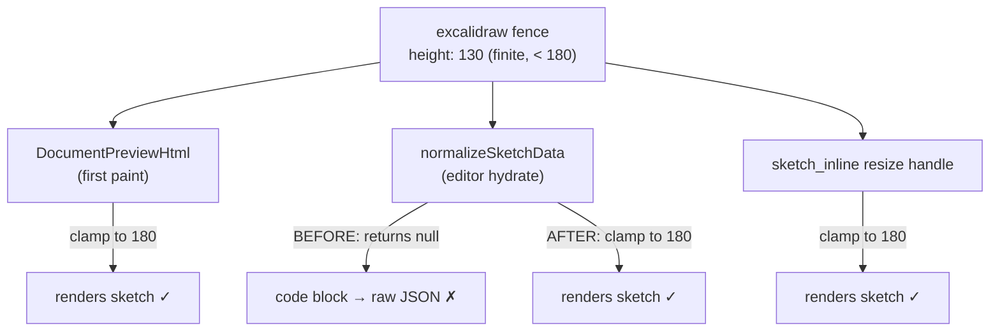
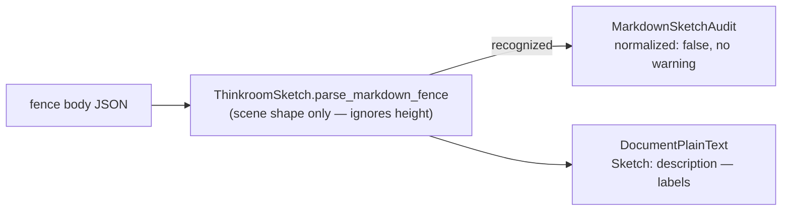

# fix: Clamp out-of-range sketch heights instead of silently rendering raw JSON

## Summary

An agent-authored Excalidraw sketch whose `height` is a finite value outside `[180, 1200]` (e.g. `130`) silently renders as raw JSON in the editor. The frontend `normalizeSketchData` returns `null` for an out-of-range height, so `transformSketchFences` leaves the fence as a plain `code` block instead of a `thinkroomSketch` node. There is no create-time error and no warning.

The fix is a one-line-of-logic alignment: the server already **clamps** sketch height to the allowed range (`DocumentPreviewHtml`, tested), and the inline resize handle clamps too (`sketch_inline.tsx`). Only the editor's `normalizeSketchData` rejects instead of clamping. Make it clamp — a render-hint height should degrade gracefully, never break an otherwise-valid scene into raw JSON. Then correct the agent contract docs, which currently describe out-of-range height as rejected/"Invalid sketch" rather than clamped.

---

## Problem Frame

**Who:** AI agents authoring Excalidraw sketches through the agent API, and the humans who open the resulting share URL.

**What's broken:** `app/frontend/editor/sketch/scene.ts` — `normalizeSketchData` (around line 144) returns `null` when a finite `height` is `< MIN_SKETCH_HEIGHT` (180) or `> MAX_SKETCH_HEIGHT` (1200). A `null` parse makes `transformSketchFences` (`app/frontend/editor/sketch/schema.ts`) keep the node as a `code` block, so the editor paints the raw scene JSON instead of a diagram.

**Why it's silent:** The server-side recognition path is height-agnostic by design — `ThinkroomSketch.parse_markdown_fence` validates the *scene shape* only and never inspects the top-level `height`, so `MarkdownSketchAudit` reports the fence as recognized (`normalized: false`, no warning) and `plain_text` renders `"Sketch: …"` correctly. The break only manifests in the editor, only when the URL is opened. So the create response looks clean while the visual result is broken.

**The inconsistency at the heart of it:** three places consume sketch height, and they disagree:
- `DocumentPreviewHtml` (`app/services/document_preview_html.rb:121`) — **clamps** to `[MIN_HEIGHT, MAX_HEIGHT]` for the first-paint skeleton (tested at `test/services/document_preview_html_test.rb:76`).
- `sketch_inline.tsx` resize handle — **clamps** via `Math.max(MIN_SKETCH_HEIGHT, …)`.
- `normalizeSketchData` — **rejects** (returns `null`). ← the outlier, and the bug.

---

## Requirements

- **R1.** A sketch fence whose only problem is a finite out-of-range `height` renders as a sketch (clamped), never as raw JSON.
- **R2.** Height clamping in the editor matches the server (`DocumentPreviewHtml`) and the resize handle: clamp to `[ThinkroomSketch::MIN_HEIGHT, ThinkroomSketch::MAX_HEIGHT]` = `[180, 1200]`.
- **R3.** A missing, null, or non-finite `height` resolves to `DEFAULT_SKETCH_HEIGHT` (448) and still renders — no valid scene breaks because of the height field.
- **R4.** Strictly-required, non-height fields stay strict: an invalid `id`, a malformed `scene`, or an over-long `description` still return `null` (only the height branch changes).
- **R5.** The agent contract (`AgentGuide` content_contract + plain-text guide) accurately describes the height behavior: valid range `180–1200`, default `448`, and that an out-of-range value is **clamped**, not rejected or rendered as "Invalid sketch".
- **R6.** A low-height sketch created through the agent API produces a clean create response (recognized, no spurious `normalized`/`warning`) and a height-independent `plain_text` rendering — documented by a regression test.

---

## Key Technical Decisions

### KTD-1 — Clamp, don't reject (align the editor with the server)

Change `normalizeSketchData` so a **finite** height is clamped to `[MIN_SKETCH_HEIGHT, MAX_SKETCH_HEIGHT]` and a **non-finite/missing** height falls back to `DEFAULT_SKETCH_HEIGHT`. The height branch never returns `null`.

- **Why:** Height is a render hint, not a correctness constraint on the scene. The server preview and the resize handle already clamp; the editor's reject is the lone inconsistency and the sole cause of the raw-JSON break. Clamping makes all three agree, so a sketch renders identically whether painted from the server skeleton or hydrated by the editor.
- **`ThinkroomSketch` (Ruby) is the single source of truth for the bounds** (`MIN_HEIGHT = 180`, `MAX_HEIGHT = 1200`, `DEFAULT_HEIGHT = 448`); the TS constants in `scene.ts` mirror them (`MIN_SKETCH_HEIGHT`, `MAX_SKETCH_HEIGHT`, `DEFAULT_SKETCH_HEIGHT`). No bound values change — only the reject→clamp behavior.

### KTD-2 — Do NOT add a create-time height rejection or `normalized` warning

The issue lists "validate sketch heights and return a descriptive error or warning" as an option. We deliberately do **not** do this.

- **Why:** Clamping (KTD-1) makes an out-of-range height non-fatal, so there is nothing to reject. A `normalized: true` + warning would overload the `normalized` signal, whose contract meaning is "unsupported/unsafe source was removed or rewritten, or a fence was not recognized as a sketch." A clamped render-hint is neither — the stored seed source is unchanged and the sketch *is* recognized. The recent sketch-audit work (origin: `docs/plans/2026-06-25-001-fix-agent-api-sketch-docs-silent-failure-plan.md`) explicitly warns against introducing a third meaning for `normalized`. Documenting the clamp (KTD-3) plus graceful rendering fully resolves the silent break without muddying the contract. See Deferred to Follow-Up Work for a clean way to add height feedback later.

### KTD-3 — Make the agent contract docs accurate

`AgentGuide.content_contract` currently documents the height range but its `enforcement` note frames out-of-range height as rejected/"Invalid sketch", which is wrong on two counts after KTD-1 (it was raw JSON before, and it's clamped after). Update the `height` schema description and the `enforcement`/`recognition` prose to state the clamp behavior, and mirror it in the plain-text guide if it mentions height.

- **Why:** The constraint being "easy to miss" is half the bug. Agents should read the valid range, the default, and that out-of-range clamps — so they can author correctly and understand the result.

---

## High-Level Technical Design

How the three height consumers relate, before and after:

The recognition/audit path is height-independent and stays unchanged:

---

## Implementation Units

### U1. Clamp height in `normalizeSketchData`

**Goal:** A finite out-of-range height is clamped to `[MIN_SKETCH_HEIGHT, MAX_SKETCH_HEIGHT]`; a missing/null/non-finite height falls back to `DEFAULT_SKETCH_HEIGHT`. The height branch never returns `null`.

**Requirements:** R1, R2, R3, R4

**Dependencies:** none

**Files:**
- `app/frontend/editor/sketch/scene.ts` (`normalizeSketchData`)

**Approach:**
- Replace the current resolve-then-reject block (the `const height = … ? DEFAULT : input.height` followed by the `if (!isFiniteNumber(height) || height < MIN || height > MAX) return null`) with: resolve to `DEFAULT_SKETCH_HEIGHT` when `input.height` is not a finite number; otherwise clamp the finite value to `[MIN_SKETCH_HEIGHT, MAX_SKETCH_HEIGHT]` (e.g. `Math.min(Math.max(value, MIN_SKETCH_HEIGHT), MAX_SKETCH_HEIGHT)`). Keep `Math.round` on the result.
- Leave every other guard untouched: `formatVersion`, `id` regex, `normalizeSketchScene`, and the `MAX_SKETCH_DESCRIPTION` check still return `null` (R4).

**Patterns to follow:** `app/services/document_preview_html.rb:121` (`value.clamp(MIN_SKETCH_HEIGHT, MAX_SKETCH_HEIGHT)`) and the `Math.max(MIN_SKETCH_HEIGHT, …)` clamps already in `app/frontend/editor/sketch/sketch_inline.tsx`. This unit makes the editor agree with both.

**Test scenarios:**
- Test expectation: none (no JS unit-test runner exists — the repo has no vitest/jest; `package.json` only ships `tsc` type-checks and an unwired Playwright dep). Verified by `npm run check` (TypeScript) and `bin/vite build --mode test` in CI, and by mirroring the already-tested server clamp. The agent-facing behavior is covered server-side in U3. **If introducing a JS test runner is later deemed worthwhile, the natural cases are: finite below-min → clamps to 180; finite above-max → clamps to 1200; in-range → unchanged; missing/null → 448; non-finite (NaN/string) → 448; invalid id still → null.** Flagged as a coverage gap, not silently skipped.

**Verification:** `npm run check` passes; a document containing a `height: 130` sketch renders the diagram (clamped) in the editor instead of raw JSON; in-range heights are unchanged.

---

### U2. Make the agent contract docs describe clamping, not rejection

**Goal:** `AgentGuide` accurately tells agents the height range (`180–1200`), the default (`448`), and that an out-of-range value is clamped — not rejected or shown as "Invalid sketch".

**Requirements:** R5

**Dependencies:** U1 (docs describe the post-clamp behavior)

**Files:**
- `app/services/agent_guide.rb` (content_contract `sketches.markdown_source.schema.height`, and the `enforcement` / `recognition` prose; the plain-text guide `text` if it states a height rule)
- `test/integration/agent_discovery_test.rb` (assertions on the height schema and enforcement text)

**Approach:**
- Update the `height` schema string so it states the valid range using `ThinkroomSketch::MIN_HEIGHT`/`MAX_HEIGHT`, the `DEFAULT_HEIGHT`, and that out-of-range finite values are clamped into range (no longer "rejected by the editor").
- Revise the `enforcement` note: keep the `id` guidance (it genuinely still rejects), but remove/replace the claim that out-of-range height yields "Invalid sketch". State that height clamps.
- Keep `content_contract.version` unchanged — this is a documentation correction, not a contract-shape change. (Consistent with the prior endpoint-addition decision; bumping the version on a doc fix would needlessly signal a breaking change.)

**Patterns to follow:** the existing content_contract entries in `app/services/agent_guide.rb`; the existing discovery assertions in `test/integration/agent_discovery_test.rb` (e.g. line ~63 asserts the height schema includes `DEFAULT_HEIGHT`; line ~67 asserts `enforcement` mentions `id`).

**Test scenarios (in `test/integration/agent_discovery_test.rb`):**
- **Height range documented:** the markdown_source height schema string includes `ThinkroomSketch::MIN_HEIGHT.to_s` and `ThinkroomSketch::MAX_HEIGHT.to_s` and `DEFAULT_HEIGHT.to_s`.
- **Clamp documented:** the height schema (or enforcement) text mentions clamping (e.g. includes "clamp").
- **Enforcement still covers id:** keep the existing assertion that `enforcement` mentions `id` (R4 boundary is unchanged).
- **No stale claim:** the contract text no longer asserts out-of-range height renders as "Invalid sketch" (assert the old phrase is absent if a test previously pinned it).

**Verification:** discovery tests pass; an agent reading the JSON or plain-text guide learns the range, default, and clamp behavior.

---

### U3. Regression test: low-height sketch creates clean and renders height-independently

**Goal:** Lock in that a below-min height is accepted server-side without a spurious warning and that recognition/`plain_text` is height-independent — the server contract the frontend clamp now matches.

**Requirements:** R6

**Dependencies:** none (independent of U1/U2; documents existing + intended server behavior)

**Files:**
- `test/integration/agent_api_test.rb` (new test)

**Approach:**
- Create a markdown document via `POST /api/docs` with a valid sketch fence whose `height` is below `ThinkroomSketch::MIN_HEIGHT` (e.g. `130`), using the existing `sketch_fence` / `valid_sketch_fence` test helpers as the pattern.
- Assert the response is `201`, `normalized` is `false`, and `warning` is nil (the fence is recognized — height is not a recognition criterion server-side).
- Assert `plain_text` contains the sketch's semantic text (`"Sketch: …"`), proving rendering is height-independent.

**Patterns to follow:** the markdown sketch tests already in `test/integration/agent_api_test.rb` (e.g. "markdown create with a valid sketch fence reports clean success") and `test/services/markdown_sketch_audit_test.rb`.

**Test scenarios:**
- Happy path — below-min height: `201`, `normalized: false`, `warning` nil, `plain_text` includes the semantic sketch text.
- (Optional) above-max height behaves the same server-side (recognized, no warning), guarding the symmetric case.

**Verification:** `bin/rails test test/integration/agent_api_test.rb` passes; the test fails if a future change makes height a server-side recognition criterion (which would re-introduce a divergence with the clamping editor).

---

## Scope Boundaries

**In scope:** Editor clamp parity (U1), agent contract doc accuracy (U2), and a server-side regression test (U3).

### Deferred to Follow-Up Work
- **Create-time "height was clamped" feedback to the agent.** If product wants to tell agents their height was adjusted, do it via a dedicated field or a height-specific note — **not** by overloading `normalized`/`warning` (KTD-2). This needs a small design decision about where height feedback lives in the response, so it is out of scope here.
- **Introducing a JS unit-test runner** (vitest) to cover `normalizeSketchData` directly. Valuable but a separate infrastructure change; U1's behavior is currently guarded by `tsc`, the build, and the server-side regression test.

---

## Risks & Dependencies

- **Risk — over-broadening the clamp to non-height fields.** If the edit accidentally relaxes the `id`/`scene`/`description` guards, malformed sketches would render instead of failing safe. *Mitigation:* U1 changes only the height branch; R4 and the discovery test pin the `id` boundary.
- **Risk — bound drift between Ruby and TS.** The clamp relies on `MIN_SKETCH_HEIGHT`/`MAX_SKETCH_HEIGHT` matching `ThinkroomSketch::MIN_HEIGHT`/`MAX_HEIGHT`. *Mitigation:* values are unchanged by this fix; `ThinkroomSketch` already documents itself as the single source of truth, and `DocumentPreviewHtml` derives its constants from it.
- **Risk — frontend change ships without a behavioral unit test.** *Mitigation:* honest coverage note in U1, server-side regression in U3, and `npm run check` in CI; the change is a 3-line clamp mirroring already-tested server behavior.

**Dependencies / prerequisites:** none external. All touched code is in-repo. CI runs `npm run check`, `bin/vite build --mode test`, and `bin/rails test`.

---

## Sources & Research

- Origin issue: https://github.com/kieranklaassen/thinkroom/issues/59
- `app/frontend/editor/sketch/scene.ts` — `normalizeSketchData` (the reject-on-out-of-range bug), `MIN_SKETCH_HEIGHT`/`MAX_SKETCH_HEIGHT`/`DEFAULT_SKETCH_HEIGHT`.
- `app/frontend/editor/sketch/schema.ts` — `transformSketchFences` (a `null` parse leaves the node a `code` block → raw JSON).
- `app/frontend/editor/sketch/sketch_inline.tsx` — resize handle already clamps via `Math.max(MIN_SKETCH_HEIGHT, …)`.
- `app/services/document_preview_html.rb:121` + `test/services/document_preview_html_test.rb:76` — server preview already **clamps** height (the reference behavior + its test).
- `app/services/thinkroom_sketch.rb` — `MIN_HEIGHT`/`MAX_HEIGHT`/`DEFAULT_HEIGHT` single source of truth; `parse` / `parse_markdown_fence` are height-agnostic by design.
- `app/services/markdown_sketch_audit.rb` — recognition audit; height-independent.
- `app/services/agent_guide.rb` — content_contract height schema + `enforcement` note to correct.
- `test/integration/agent_discovery_test.rb`, `test/integration/agent_api_test.rb`, `test/services/markdown_sketch_audit_test.rb` — test patterns to mirror.
- Related prior work: `docs/plans/2026-06-25-001-fix-agent-api-sketch-docs-silent-failure-plan.md` (the `normalized`/`warning` contract this plan deliberately avoids overloading).
