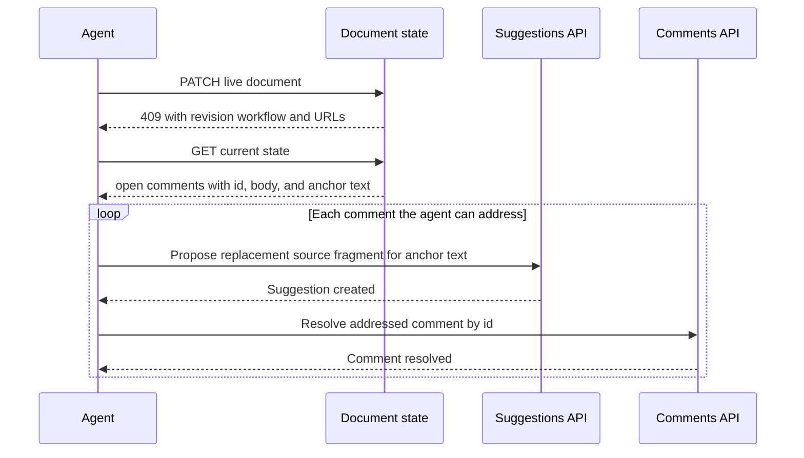

# fix: Make claimed-document revision workflow explicit

## Summary

Teach agents that a claimed or collaboratively edited document must be revised in place by reading open comments, proposing one targeted suggestion per addressed comment, and resolving those comment threads. Expose the same workflow through both the PATCH conflict response and the document state contract.

---

## Problem Frame

The existing `PATCH /api/docs/:slug` conflict correctly prevents an agent from overwriting a live document, but it only points at the suggestions endpoint. An agent can therefore understand that PATCH is unavailable while still missing the intended multi-endpoint workflow and creating replacement documents instead. Issue #61 records this failure across three attempts even though `open_comments`, `api.propose_suggestion`, and `api.resolve_comment` were already individually discoverable.

---

## Requirements

**Conflict guidance**

- R1. A claimed-document PATCH conflict must tell the agent to read `open_comments`, propose one suggestion per addressed comment, and resolve each addressed comment only after the suggestion is created.
- R2. The conflict response must provide document-specific URLs for reading state, proposing suggestions, and resolving a comment by ID.
- R3. The guidance must tell agents to use each comment's `anchor_text` as the suggestion's `replaces` target and the replacement source fragment as its `body`.

**State discovery**

- R4. A document state with open comments must expose the combined revision workflow alongside the existing endpoint contracts and notes.
- R5. A document state without open comments must not imply that comment resolution is required for an unrelated suggestion.

**Compatibility**

- R6. Existing suggestion and comment endpoint request shapes, attribution, rate limits, and human review behavior must remain unchanged.
- R7. Integration coverage must verify the workflow steps, document-specific URLs, and conditional state exposure.

---

## Assumptions

- The safest interpretation of issue #61 is to cover both error-driven agents and state-reading agents rather than choosing only one of the issue's proposed discovery surfaces.
- A structured `revision_workflow` object is preferable to prose alone because agents can inspect its ordered steps and endpoint URLs without parsing a long note.
- Open comments without usable `anchor_text` should remain open until the agent can create a correctly targeted suggestion; the workflow must not encourage resolving feedback that was not addressed.

---

## Key Technical Decisions

- **Use one workflow contract in `AgentGuide`:** Build the ordered revision guidance and URLs in one service method, then reuse it in the state payload and PATCH conflict response so wording and routes stay aligned.
- **Expose the state workflow only when relevant:** Add `revision_workflow` when `open_comments` is non-empty, while preserving the existing top-level endpoint catalog for all documents.
- **Keep the 409 response self-sufficient:** Return the expanded instruction and route fields directly because the observed agent stopped at the error instead of re-reading state.
- **Resolve after proposal creation, not after human acceptance:** Resolving records that the agent addressed the feedback; accepting or rejecting the resulting suggestion remains human-gated.
- **Do not add a new endpoint:** This is a discoverability and orchestration contract over existing APIs, not a bulk mutation operation.

---

## High-Level Technical Design

The external workflow is an ordered loop over the current document's open comments:

An agent must not resolve a comment when suggestion creation fails or when its replacement target is unusable.

---

## Implementation Units

### U1. Define and expose the claimed-document revision workflow

**Goal:** Add a shared, document-specific workflow contract and surface it in state only when open comments make the combined flow relevant.

**Requirements:** R3, R4, R5, R6

**Dependencies:** none

**Files:**

- `app/services/agent_guide.rb`
- `test/integration/agent_api_test.rb`
- `test/integration/agent_discovery_test.rb`

**Approach:**

- Add an `AgentGuide` workflow builder that returns the read-state, suggestion, and comment-resolution routes plus ordered instructions.
- Include the workflow as a top-level state field when `document.comments.open` contains feedback.
- When open comments exist, add a concise note that repeats the combined flow in the orientation channel agents already inspect, including the rule to leave untargetable or failed revisions unresolved.
- Keep `api.propose_suggestion` and `api.resolve_comment` unchanged; the workflow composes their existing contracts.

**Patterns to follow:** `AgentGuide.endpoints` for absolute document-specific URLs, `AgentGuide.state` for conditional format-specific fields, and existing integration assertions for machine-readable discovery metadata.

**Test scenarios:**

1. Given a document with an anchored open comment, GET state returns a `revision_workflow` whose steps direct the agent from `open_comments` to a suggestion using `replaces`, then to the matching resolve route.
2. The workflow's state, suggestion, and resolve URLs all contain the current document slug, and the resolve URL retains its comment-ID placeholder.
3. The notes array for a document with open comments describes the same ordered workflow and warns against resolving an unaddressed comment.
4. Given a document with no open comments, GET state omits `revision_workflow` while the existing suggestion and resolve endpoint contracts remain present.
5. Existing Markdown and HTML state payload tests remain green, proving the workflow is source-format agnostic and no discovery contract regressed.

**Verification:** An agent reading only document state can identify the exact ordered actions for every open comment without inferring how the existing endpoints fit together.

### U2. Make PATCH conflicts return the complete next action

**Goal:** Expand the conflict response so an agent that reads only the 409 can execute the correct revision workflow on the original document.

**Requirements:** R1, R2, R3, R6, R7

**Dependencies:** U1

**Files:**

- `app/controllers/api/docs_controller.rb`
- `test/integration/agent_api_test.rb`

**Approach:**

- Reuse the `AgentGuide` workflow contract from `render_update_conflict` instead of maintaining separate route strings and abbreviated prose.
- Preserve the existing error and `propose_suggestion` compatibility fields while adding `read_state`, `resolve_comment`, and the structured ordered workflow.
- State that each successfully addressed comment maps to one targeted suggestion and one resolve request; failed or ambiguous targets remain open.

**Patterns to follow:** The current instructive 409 response in `Api::DocsController` and the shared agent-contract generation already used for create and state responses.

**Test scenarios:**

1. A PATCH against a collaborative document returns 409 with the original conflict error plus read-state, suggestion, and comment-resolution URLs for the same slug.
2. The 409 workflow explicitly names `open_comments`, `anchor_text`, `replaces`, suggestion `body`, and resolving each addressed comment.
3. With an open comment present, the conflict workflow matches the workflow returned by state for the same document, preventing divergent route or step guidance.
4. The conflict leaves seed and collaborative state untouched, preserving the existing safety guarantee.
5. A conflict on a document with no open comments still directs a normal suggestion but does not falsely claim that comment resolution is required.

**Verification:** The 409 response alone makes creating a replacement document an unnecessary and contradictory next action; all existing agent API integration tests continue to pass.

---

## Scope Boundaries

**In scope:** Agent-facing response metadata, notes, and integration tests for orchestrating existing suggestion and comment-resolution endpoints.

**Out of scope:** Automatically generating suggestions from comments, accepting or rejecting suggestions, bulk-resolving comments, changing live CRDT content, or preventing document creation at the API level.

### Deferred to Follow-Up Work

- A bulk endpoint that turns every open comment into a suggestion is unnecessary unless improved guidance still proves unreliable in real agent sessions.
- Telemetry that detects replacement-document creation after a 409 would require a separate cross-request product signal.

---

## Risks & Dependencies

- **Guidance drift:** Duplicated prose or route construction could make the 409 and state payload disagree. Reusing one workflow builder and asserting equality in tests mitigates this.
- **Premature resolution:** An agent could resolve a comment even when suggestion targeting failed. The ordered contract must make successful proposal creation the precondition for resolution.
- **Payload noise:** A workflow shown on every document could distract agents doing unrelated edits. Conditional state exposure keeps it tied to open feedback, while the conflict remains self-sufficient.

There are no external dependencies or data migrations.

---

## Sources & Research

- GitHub issue #61: `https://github.com/kieranklaassen/thinkroom/issues/61`
- `app/controllers/api/docs_controller.rb` — existing conflict response and safety gate.
- `app/services/agent_guide.rb` — state, endpoint, notes, and plain-text discovery contracts.
- `test/integration/agent_api_test.rb` — PATCH conflict and state discovery coverage.
- `test/integration/comment_flow_test.rb` — agent comment-resolution behavior and attribution.
