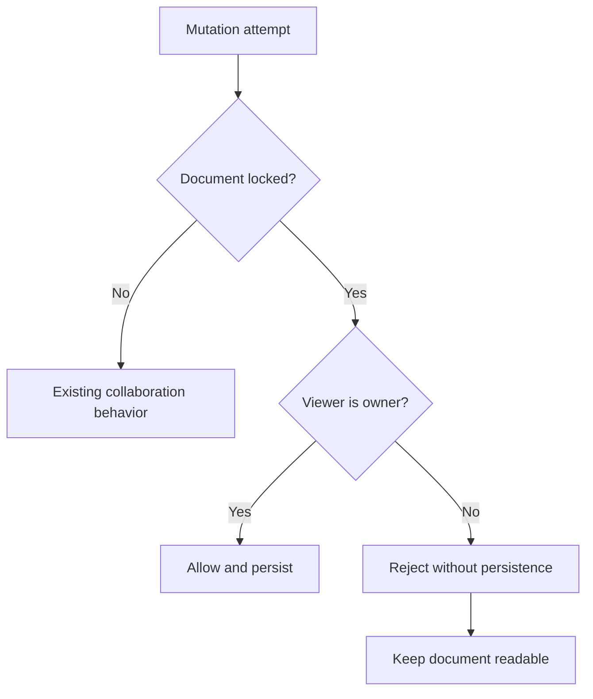
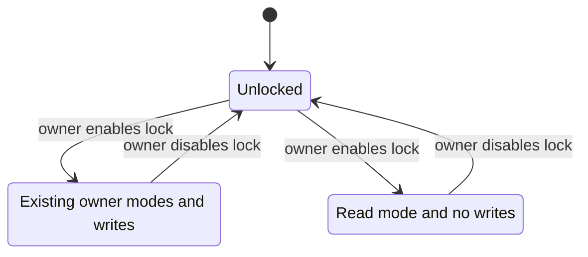

# feat: Add owner-controlled document editing lock

## Summary

Add a claimed-document setting in the header overflow menu that lets the owner make the document read-only for everyone else. Enforce the lock across the browser editor, collaborative transports, and agent write APIs while keeping the document readable and the owner fully editable.

---

## Problem Frame

Claiming establishes who owns a document, but it currently grants only deletion authority. Anyone with the share link can still edit the Yjs document or contribute through suggestions and comments. Owners need a deliberate way to preserve a document's current state without removing shared read access.

---

## Requirements

**Owner control**

- R1. Only the current document owner can enable or disable the editing lock, and the control appears in the header overflow menu only after the document is claimed by that owner.
- R2. Lock state persists on the document and remains unchanged across reloads, guest-to-account ownership promotion, and other browser sessions for the same signed-in owner.
- R3. The owner retains all existing edit, suggest, comment, review, and task-toggle capabilities while the lock is enabled.

**Read-only enforcement**

- R4. A locked document remains readable to non-owners, but non-owners cannot mutate its content, suggestions, comments, or review state through browser HTTP routes, Action Cable, fallback sync requests, or agent APIs.
- R5. Non-owner clients render in a locked Read mode, cannot select another editor mode, and do not emit document updates or durable snapshots.
- R6. Enabling the lock while non-owners are connected discards any rejected local divergence by reloading authoritative document state; unlocking restores their normal mode choices.
- R7. Presence, document reads, event polling, and other non-content participation remain available because they do not modify the shared document.

**Discovery and compatibility**

- R8. Browser props and agent state expose the lock without revealing owner credentials, and agent guidance explains that writes are unavailable until the owner unlocks the document.
- R9. Unclaimed and unlocked documents preserve the existing share-link collaboration behavior.
- R10. Lock changes notify connected clients promptly and record an attributable activity entry.

---

## Assumptions

- “Nobody else edit, only read” means the owner remains writable while all other humans and agents are read-only.
- Read-only blocks suggestions, comments, comment resolution, and suggestion review in addition to direct text editing; allowing those actions would contradict the requested read-only state.
- The setting is available only to an owner. Unclaimed documents must be claimed before they can be locked.
- Unlocking restores a visitor's previously selected editor mode rather than forcing Edit mode.

---

## Key Technical Decisions

- **Persist a document-level boolean:** Add a non-null `editing_locked` column defaulting to false. This preserves today's open collaboration behavior and makes the policy visible to every transport.
- **Centralize the authorization predicate and locked write boundary on `Document`:** A single policy answers whether a browser identity may write, using the existing account-or-owner-token rules. A row-locked guard rechecks that policy inside the same transaction as each mutation so a frame authorized before the lock commits cannot persist afterward.
- **Treat the owner identity as a server-side capability:** Action Cable resolves the signed owner cookie and the configured encrypted session cookie in `ApplicationCable::Connection`, following Rails' cookie-authentication pattern. The guest token is a private connection attribute rather than an `identified_by` value so connection identifiers, statistics, props, JavaScript, logs, and agent payloads never expose it.
- **Enforce at every persistence boundary:** UI read-only state is guidance. `SyncChannel`, Yjs merge and snapshot persistence, fallback-sync endpoints, browser contribution/review endpoints, and agent contribution endpoints all enter the same row-locked authorization boundary.
- **Keep awareness separate from document writes:** Locked visitors may remain present and receive live updates. Awareness frames and read-side presence/event bookkeeping remain allowed.
- **Resync on access changes:** A lock-change meta event reloads both access props and authoritative document state. The editor remounts only when the viewer's effective write permission changes, eliminating rejected local divergence without disrupting the owner.
- **Make the menu control optimistic but server-authoritative:** The owner sees a checked “Read only for others” menu item. A failed toggle rolls back through the Inertia error path, while the model transition owns activity logging and broadcasts.
- **Keep lock management human-only:** Agents receive context parity and deterministic locked errors but cannot toggle the lock because ownership itself is intentionally browser-only.

---

## High-Level Technical Design

The same document policy gates every mutation surface:

Lock changes move connected non-owners between normal collaboration and authoritative read-only state:

---

## Implementation Units

### U1. Persist lock state and define the write policy

**Goal:** Give documents a durable owner-controlled lock and one reusable authorization predicate.

**Requirements:** R1, R2, R3, R9, R10

**Dependencies:** none

**Files:**

- `db/migrate/20260626100000_add_editing_locked_to_documents.rb`
- `db/schema.rb`
- `app/models/document.rb`
- `app/controllers/documents_controller.rb`
- `config/routes.rb`
- `test/models/document_test.rb`
- `test/integration/ownership_flow_test.rb`

**Approach:**

- Add `editing_locked` with a database default and null constraint so existing documents remain unlocked.
- Add a document policy that permits writes when unlocked or when the supplied browser identity owns the document.
- Add an owner-only PATCH action for changing the lock. Parse the requested boolean strictly, reject non-owners without changing state, and keep repeated requests idempotent.
- Perform the transition in the model transaction, add one human-attributed activity for a real state change, and broadcast `activities` plus a dedicated editing-lock event after commit.

**Patterns to follow:** `Document#owned_by?` and `Document#claim!` for guest/account identity, transactional activity creation, and post-commit `DocumentMetaChannel` broadcasts; `DocumentsController#destroy` for owner-only redirects and Inertia errors.

**Test scenarios:**

1. A new and pre-migration document is unlocked and writable under the existing share-link policy.
2. A guest owner and an account owner can each enable and disable the lock from their valid session.
3. A non-owner, stale pre-promotion guest token, unclaimed visitor, and anonymous request cannot change lock state.
4. A forged lock request without a valid CSRF token is rejected even when it carries the owner's cookies.
5. Missing, blank, or non-boolean lock input is rejected without changing state.
6. Repeating the current state succeeds without duplicate activities or broadcasts.
7. A real state transition persists, records the owner's display name, and broadcasts activities plus the editing-lock event.
8. The write-policy predicate allows everyone when unlocked, allows only the owner when locked, and never treats a blank token as ownership.

**Verification:** Model and ownership integration tests prove durable state, owner authorization, idempotency, and broadcasts for both guest and account ownership.

### U2. Enforce the lock at collaborative and HTTP write boundaries

**Goal:** Make the server reject every non-owner document mutation even when the client UI is bypassed or stale.

**Requirements:** R3, R4, R6, R7, R9

**Dependencies:** U1

**Files:**

- `app/channels/application_cable/connection.rb`
- `app/channels/sync_channel.rb`
- `app/controllers/documents_controller.rb`
- `app/controllers/suggestions_controller.rb`
- `app/controllers/comments_controller.rb`
- `app/controllers/concerns/document_write_authorization.rb`
- `app/models/suggestion.rb`
- `app/models/comment.rb`
- `app/services/yjs_persistence.rb`
- `test/channels/application_cable/connection_test.rb`
- `test/channels/sync_channel_test.rb`
- `test/integration/ownership_flow_test.rb`
- `test/integration/suggestion_flow_test.rb`
- `test/integration/comment_flow_test.rb`

**Approach:**

- Identify each Action Cable connection from the existing signed owner cookie and the encrypted Rails session cookie named by `Rails.application.config.session_options[:key]`. Register only the account user as a connection identifier; retain the guest token as a private channel authorization attribute. Keep unauthenticated connections valid for reading, and consult the document policy on every update or sync-reply frame.
- Transmit a write-denied signal to stale non-owner clients instead of persisting or broadcasting their frame.
- Extend Yjs persistence entry points to recheck authorization while holding the document row lock. Gate `snapshot` and `sync_update` before expensive parsing, then recheck inside persistence so a forged or racing request cannot change Yjs state, snapshots, provenance, assets, or titles.
- Apply one browser-controller concern to suggestion creation and review plus comment creation and resolution. The concern enters the same document-row transaction used by lock transitions, preventing a contribution from committing after a concurrent lock wins.
- Defer contribution activity and meta-channel broadcasts with Rails' after-all-transactions-commit hook so the new outer authorization transaction never announces a suggestion, comment, or review state that later rolls back.
- Keep the lock order consistent: acquire the existing per-document Yjs mutex before the database row lock for CRDT operations, and use only the row lock for metadata mutations.

**Patterns to follow:** existing `SyncChannel` validation-before-persistence ordering, JSON error handling in `sync_update`, `DocumentsController#destroy` authorization, and the redirect conventions documented in `SuggestionsController` and `CommentsController`.

**Test scenarios:**

1. A locked non-owner channel update and sync-reply produce no persistence and no peer broadcast, while awareness still relays.
2. Connection setup recognizes guest and signed-in ownership, while connection identifiers and statistics never contain the guest owner token.
3. The locked owner can send the same channel update and it persists normally for guest-token and account ownership.
4. A visitor connected before the owner locks is denied on its next frame because authorization reads current database state.
5. A lock transition racing a non-owner Yjs merge, snapshot, suggestion, or comment has one serial outcome: the mutation commits before the lock, or the lock commits and the mutation is denied; no mutation crosses the committed boundary.
6. Locked non-owner snapshot and fallback-sync requests return a permission error without changing Yjs state, source snapshot, provenance, title, or assets.
7. Locked non-owners cannot create, accept, reject, reopen, or bulk-accept suggestions and cannot create or resolve comments.
8. A failed authorized contribution transaction emits no activity or meta-channel event; a committed transaction broadcasts only after commit.
9. The owner can perform every gated browser action while locked, and all actors retain existing behavior after unlock.

**Verification:** Channel and integration tests demonstrate that bypassing the UI cannot mutate a locked document and that non-write collaboration remains live.

### U3. Add the overflow-menu setting and authoritative read-only client state

**Goal:** Let owners manage the setting in the three-dot menu and make non-owner read-only behavior immediate and legible.

**Requirements:** R1, R3, R5, R6, R8, R9

**Dependencies:** U1, U2

**Files:**

- `app/controllers/documents_controller.rb`
- `app/frontend/components/header_menu.tsx`
- `app/frontend/components/mode_control.tsx`
- `app/frontend/pages/documents/show.tsx`
- `app/frontend/editor/milkdown_editor.tsx`
- `app/frontend/editor/cable_provider.ts`
- `app/frontend/lib/cable.ts`
- `app/frontend/lib/use_meta_channel.ts`
- `app/frontend/entrypoints/application.css`
- `test/integration/ownership_flow_test.rb`

**Approach:**

- Extend the ownership/access prop with lock state and viewer write permission without exposing credentials.
- Add an owner-only checked menu item labeled “Read only for others,” with pending and error states that work in desktop popover and mobile sheet layouts. Locked non-owners see a non-interactive “Read only — locked by owner” status in the same overflow menu.
- Derive an effective mode: locked non-owners render as Read, see the desktop mode control disabled with an accessible lock explanation, lose content/comment/review/task-toggle affordances, and keep their stored mode untouched for later restoration. Do not rely on a disabled button's tooltip as the only explanation.
- Give `DocumentEditor` and `CableProvider` a separate write-permission input. Suppress local CRDT frames, durable snapshot/fallback writes, and interactive task toggles for locked readers while continuing to apply remote updates and awareness.
- Handle the editing-lock meta event by reloading access and full document props. Key the editor by effective permission so a newly locked reader remounts from authoritative state; handle a channel write-denied signal with the same recovery path.
- Key the shared Action Cable consumer by coarse server-known identity (`guest` or account ID). Recreate the connection when authentication changes so guest-to-account promotion and logout cannot leave channels authorizing against stale handshake cookies.

**Patterns to follow:** `HeaderMenu` checkbox items, `OwnershipChip` Inertia mutation behavior, `ModeControl` locked state, `DocumentEditor`'s existing user-input-only editable gate, and `useMetaChannel` special handling for document deletion.

**Test scenarios:**

1. The show response marks an owner writable and a different visitor read-only when locked, with no owner token in the payload.
2. The setting is visible and interactive only for the owner of a claimed document; it is absent for non-owners and unclaimed documents.
3. A locked non-owner lands in Read regardless of their mode cookie, cannot change mode or toggle tasks, and does not emit snapshots or Yjs updates.
4. The owner retains their selected mode and all actions while the lock is enabled.
5. A connected non-owner receives a lock event, reloads authoritative state, and loses write affordances; an unlock event restores their stored mode.
6. Guest-to-account promotion, account switching, and logout recreate the cable connection before the next document subscription, preserving the owner's write permission without losing a first edit.
7. Desktop and mobile overflow menus expose the same owner toggle states, while locked non-owners get a visible and screen-reader-readable status.

**Verification:** TypeScript checks pass and a two-browser test shows the owner toggling read-only while the second browser transitions without preserving rejected local edits.

### U4. Expose lock policy to agents and gate agent contributions

**Goal:** Give agents context parity while preserving the human-only ownership control.

**Requirements:** R4, R7, R8, R9

**Dependencies:** U1, U2

**Files:**

- `app/controllers/api/base_controller.rb`
- `app/controllers/api/suggestions_controller.rb`
- `app/controllers/api/comments_controller.rb`
- `app/services/agent_guide.rb`
- `test/integration/agent_api_test.rb`
- `test/integration/agent_discovery_test.rb`

**Approach:**

- Include lock state in agent document state and plain-text guidance while keeping the owner token and viewer-specific capability absent.
- Add a shared API guard that rejects suggestion and comment mutations on locked documents with a deterministic locked response and a next action to wait for the owner to unlock.
- Preserve GET state, presence, and event polling/acknowledgement because they support reading and coordination without modifying document content.
- Keep lock toggling browser-owner-only and document that boundary in the agent guide.

**Patterns to follow:** `AgentGuide.state`, endpoint metadata, and notes for machine-readable context; `Api::BaseController#require_agent!` for teaching errors; claimed-document PATCH conflict guidance for owner-controlled workflow boundaries.

**Test scenarios:**

1. JSON and text state identify a locked document as read-only without leaking owner credentials.
2. Locked suggestion creation, comment creation, and comment resolution return the same deterministic locked contract and create no records, activities, assets, or broadcasts.
3. State reads, presence, pending-event reads, and acknowledgement remain available on a locked document.
4. Unlocking restores the existing agent suggestion and comment flows without changing their request or response shapes.
5. Agent guidance says only the browser owner can change the setting and does not advertise a lock-management endpoint.

**Verification:** Agent API and discovery integration tests prove context parity, mutation denial, credential privacy, and unlocked compatibility.

---

## Acceptance Examples

- AE1. Given Alice owns a claimed document and Bob has it open in Edit mode, when Alice enables “Read only for others,” then Alice keeps editing while Bob reloads authoritative content into locked Read mode and Bob's later updates are rejected.
- AE2. Given a locked document, when a non-owner forges a Yjs frame, snapshot request, suggestion request, or comment request, then the server persists nothing and the document remains readable.
- AE3. Given a locked account-owned document, when the same owner signs in from another browser, then the menu shows the setting checked and that browser remains writable.
- AE4. Given a locked document and an identified agent, when the agent reads state then it sees the lock; when it proposes a change then it receives the locked response and no contribution is created.
- AE5. Given the owner disables the lock, when a non-owner receives the change then their previously selected mode becomes available and existing open-collaboration behavior resumes.

---

## Scope Boundaries

**In scope:** one document-level owner setting; enforcement for direct edits, task toggles, snapshots, suggestions, comments, and review mutations; browser and agent discovery; live-client transitions.

**Out of scope:** ownership transfer, per-user allowlists, editor/viewer roles beyond owner versus everyone else, password-protected links, expiring locks, and audit-history UI beyond the existing activity feed.

### Deferred to Follow-Up Work

- Rich role-based sharing can build on the centralized write policy if Thinkroom later needs named collaborators who can edit a locked document.
- A dedicated lock badge outside the overflow menu can be considered if user testing shows the disabled Read mode is not discoverable enough.

---

## System-Wide Impact

- **Authorization:** Ownership becomes an active write boundary rather than deletion-only metadata. All future document mutation paths must consult the centralized policy.
- **Realtime collaboration:** Action Cable remains open for reads and awareness, but update persistence becomes identity-aware and state-dependent.
- **Agent parity:** Agents gain access-state visibility but intentionally do not gain the human owner's lock-management action.
- **Data lifecycle:** The migration is additive and defaults existing records to current behavior; no backfill or rollout flag is required.

---

## Risks & Dependencies

- **Missed mutation surface:** A route omitted from the policy would bypass read-only. The controller concern, explicit route inventory, and integration matrix mitigate this.
- **Stale collaborative state:** Rejecting a frame without client recovery leaves local content that will disappear later. Lock events and write-denied responses must trigger authoritative remounts.
- **Authorization time-of-check/time-of-use:** A policy check before a row lock can approve a mutation that persists after the lock commits. Every mutation must recheck under the same document lock as its write, with concurrency coverage for both serialization outcomes.
- **Action Cable identity drift:** Guest-to-account promotion changes the valid owner identity. Connection setup reads both signed cookies, but long-lived connections can still hold stale identifiers; channel authorization must compare them to freshly reloaded document ownership and promotion must cause existing cable consumers to reconnect or refresh their connection identity.
- **Premature realtime broadcasts:** Existing suggestion and comment model entry points broadcast immediately. Wrapping them in a new outer authorization transaction would expose uncommitted state unless those broadcasts are deferred until all transactions commit.
- **Programmatic editor writes:** ProseMirror `editable: false` gates user input but still accepts remote transactions. A separate permission flag is required to suppress outgoing persistence without blocking inbound collaboration.
- **Partial reload payload size:** Lock changes need the full document prop only when effective write permission changes; owner toggles should avoid remounting despite receiving refreshed props.

---

## Sources & Research

- `docs/plans/2026-06-05-003-feat-claim-doc-ownership-plan.md` — ownership boundaries, browser-only claiming, and live ownership events.
- `docs/plans/2026-06-25-004-fix-claimed-document-revision-workflow-plan.md` — current claimed-document agent workflow and discovery contract.
- `app/models/document.rb` and `app/controllers/documents_controller.rb` — account/guest ownership predicate and owner-only deletion pattern.
- `app/channels/sync_channel.rb` and `app/frontend/editor/cable_provider.ts` — authoritative Yjs persistence and live update protocol.
- `app/frontend/pages/documents/show.tsx`, `app/frontend/components/header_menu.tsx`, and `app/frontend/components/mode_control.tsx` — current overflow menu and per-visitor Read mode.
- `docs/solutions/architecture-patterns/server-first-instant-paint.md` — preserve server-authoritative first paint and remount from the current document projection.
- Rails Action Cable documentation — connections expose the initiating request's signed/encrypted cookies, identifiers delegate to channels, and long-lived channels must refresh database state before authorization: `https://guides.rubyonrails.org/v8.0.0/action_cable_overview.html` and `https://api.rubyonrails.org/v8.1/classes/ActionCable/Connection/Base.html`.
