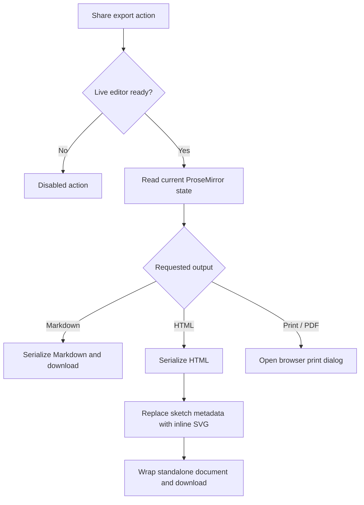

# feat: Add document and sketch export controls

## Summary

Add export actions to the existing Share surface and an image-download action to every rendered sketch. Exports use the current hydrated document, work for readers as well as editors, and keep Thinkroom's read mode visually clean.

---

## Problem Frame

Thinkroom can display and collaborate on documents and sketches, but readers cannot take a portable copy from the interface. Sketches already have an SVG export primitive that is not exposed, while whole-document export has no user-facing path.

---

## Requirements

### Document export

- R1. The Share popover exposes Markdown, standalone HTML, and Print / PDF actions without adding another permanent header control.
- R2. Markdown and HTML downloads serialize the latest hydrated editor state and use a safe filename derived from the document title.
- R3. Standalone HTML renders sketches as inline SVG and rewrites document-local links and images to usable absolute URLs.
- R4. Print / PDF produces a document-only layout that omits collaboration chrome, editing controls, sidebars, and export controls.

### Sketch export

- R5. Every valid rendered sketch can be downloaded as an SVG in read and write modes.
- R6. The sketch download action appears on hover or keyboard focus, remains discoverable with a minimum 44-by-44-pixel target on coarse-pointer devices, and does not open the sketch editor.

### Resilience and accessibility

- R7. Document export actions remain disabled until the live editor is ready and expose failures as status text instead of failing silently.
- R8. Export controls have explicit button labels, visible focus states, and permission-independent behavior.

---

## Assumptions

- "PDF export" uses the browser's Print / Save as PDF dialog rather than adding a PDF-generation dependency.
- SVG is the only per-sketch download format because it is lossless, already supported by `app/frontend/editor/sketch/export.ts`, and preserves the Excalidraw rendering.
- Whole-document export belongs in Share in every editor mode; print styling supplies the same clean output that read mode presents without forcing a mode change.

---

## Key Technical Decisions

- KTD1. Serialize from the live Milkdown editor: this includes unsaved collaborative changes already present in Yjs and avoids stale controller props.
- KTD2. Keep export generation client-side: existing editor serializers and Excalidraw SVG generation already contain the required state, so no endpoint or persistence change is needed.
- KTD3. Generate a self-contained HTML shell: semantic editor HTML is copied into a static document, sketch metadata is replaced by inline SVG, and minimal reading styles travel with the file.
- KTD4. Reuse browser printing for PDF: print-specific CSS keeps the result clean while preserving native page sizing, destination, and accessibility controls.

---

## High-Level Technical Design

---

## Implementation Units

### U1. Live document export helpers

- **Goal:** Produce safe Markdown and standalone HTML downloads from the current editor state.
- **Requirements:** R2, R3, R7
- **Dependencies:** None
- **Files:** `app/frontend/editor/document_export.ts`, `script/export_check.mjs`
- **Approach:** Share filename normalization and Blob download cleanup; serialize Markdown with Milkdown and HTML with the existing sanitizer-backed serializer; turn sketch figures into inline exported SVG before wrapping the HTML in a static reading document.
- **Patterns to follow:** `app/frontend/editor/milkdown_editor.tsx` for current-state serialization, `app/frontend/editor/sketch/export.ts` for SVG generation, and `app/frontend/editor/document_format.ts` for sanitized HTML.
- **Test scenarios:**
  - A live Markdown document downloaded after an edit contains the edited text and uses a title-derived `.md` filename.
  - An HTML download contains a complete document shell, the current prose, and an inline SVG instead of raw sketch scene metadata.
  - Relative document links and image URLs become absolute in the standalone HTML.
  - A requested export before editor readiness remains unavailable and does not create an empty file.
- **Verification:** Downloaded Markdown opens as source, downloaded HTML opens independently with prose and sketches visible, and object URLs are revoked after use.

### U2. Share export surface and clean printing

- **Goal:** Place document export in Share and make Print / PDF produce a document-only layout.
- **Requirements:** R1, R4, R7, R8
- **Dependencies:** U1
- **Files:** `app/frontend/components/share_popover.tsx`, `app/frontend/pages/documents/show.tsx`, `app/frontend/entrypoints/application.css`, `script/export_check.mjs`
- **Approach:** Pass export callbacks and readiness from the document page into a new Share section; keep actions available to readers and editors; use transient status copy for success/failure and a print media block for layout cleanup.
- **Patterns to follow:** Existing Share sections and button states in `app/frontend/components/share_popover.tsx`; existing read-mode layout gates in `app/frontend/pages/documents/show.tsx`.
- **Test scenarios:**
  - Opening Share after hydration reveals Markdown, HTML, and Print / PDF actions.
  - Triggering each download calls the corresponding current-state exporter and closes no unrelated UI.
  - An exporter rejection produces an accessible failure message and leaves the popover usable for retry.
  - Print / PDF invokes browser printing and the print stylesheet hides header, rails, gutters, editing mounts, and floating controls while retaining document content and sketch previews.
- **Verification:** The Share surface remains usable at desktop and mobile breakpoints, downloads complete, and print preview contains only the reading document.

### U3. Per-sketch SVG download action

- **Goal:** Let any reader download a sketch image directly from its rendered section.
- **Requirements:** R5, R6, R8
- **Dependencies:** None
- **Files:** `app/frontend/editor/sketch/node_view.ts`, `app/frontend/editor/sketch/export.ts`, `app/frontend/entrypoints/application.css`, `script/export_check.mjs`
- **Approach:** Add an always-enabled child button to the sketch node view, stop its event from reaching the edit affordance, and call the existing SVG exporter with the sketch title or fallback name; expose progress/failure state on the button.
- **Patterns to follow:** The existing hover/focus delete control in `app/frontend/editor/sketch/node_view.ts` and `.sketch-delete-tape` styling in `app/frontend/entrypoints/application.css`.
- **Test scenarios:**
  - Hovering or focusing a valid sketch exposes a labeled Download action and downloads a non-empty `.svg` file.
  - Clicking Download in Edit mode does not open the Excalidraw editor or delete/change the sketch.
  - A read-only viewer can download the same sketch even though edit and delete affordances are unavailable.
  - Touch/coarse-pointer styling keeps the action visible without hover and provides at least a 44-by-44-pixel target.
  - SVG generation failure changes the button to an accessible retryable error state.
- **Verification:** Downloaded SVG renders the whole sketch, the document remains unchanged, and keyboard and touch users can reach the action.

---

## Acceptance Examples

- AE1. Given a hydrated document with a newly received collaborator edit, when a reader chooses Download Markdown, then the file includes that edit.
- AE2. Given a document containing a sketch, when a reader chooses Download HTML, then the saved file opens with the sketch rendered and contains no raw scene JSON.
- AE3. Given a document in any mode, when a reader chooses Print / PDF, then the browser print dialog opens on a layout without application chrome.
- AE4. Given a read-only sketch, when a reader hovers, focuses, or uses a touch device, then Download is reachable and produces an SVG without entering edit mode.

---

## Risks & Dependencies

- Browser download and clipboard policies vary, so export actions must begin from direct user gestures and surface failures.
- Print rendering is browser-owned; verification should cover the print media DOM/CSS contract rather than pixel-identical PDF output.
- Excalidraw remains dynamically loaded for SVG generation, so buttons need an in-progress state and must tolerate import/export failure.

---

## Sources & Research

- `app/frontend/editor/sketch/export.ts` already implements SVG generation and download but has no caller.
- `app/frontend/components/share_popover.tsx` is the established grouped surface for link, agent, and reading-theme actions.
- `docs/solutions/architecture-patterns/server-first-instant-paint.md` requires preserving the existing static-preview-to-live-editor handoff; exports therefore attach to the live editor without changing first paint.
- `STRATEGY.md` names deliberate reading modes as an active product track; export is kept subordinate to reading instead of becoming permanent header chrome.
