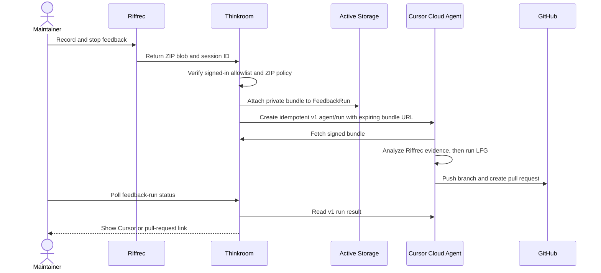
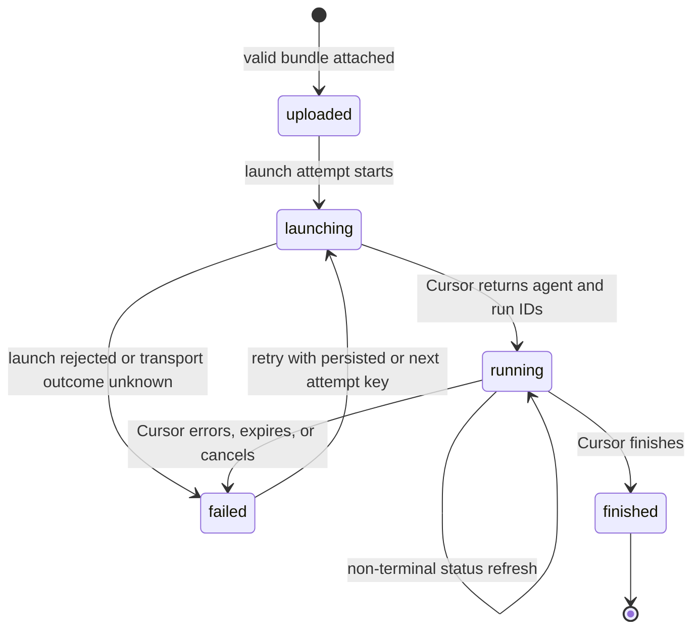

# feat: Turn approved Riffrec feedback into Cursor pull requests

## Summary

Extend Riffrec so a host application can receive a completed ZIP without downloading it, then add an allowlisted Thinkroom flow that stores the private bundle, launches a Cursor cloud agent to analyze it and run LFG, and surfaces the resulting run or pull request. Everyone outside the allowlist keeps the existing local-download behavior.

---

## Problem Frame

Thinkroom currently mounts Riffrec on every page, but completion always downloads a ZIP to the browser. That leaves the maintainer to move the archive into an agent manually, even though Thinkroom already knows the signed-in account and Cursor can run the repository's configured cloud environment.

The desired loop is deliberately narrow: an approved maintainer records feedback, Thinkroom passes the evidence to an external Cursor agent, and the agent returns a reviewable pull request. Thinkroom remains the human-facing judgment and status layer; it does not embed an agent or merge code automatically.

---

## Requirements

### Eligibility and capture

- R1. Only a signed-in account whose normalized email is in the server-configured allowlist may upload a Riffrec bundle or launch Cursor automation.
- R2. Ineligible and signed-out users retain the existing client-side ZIP download and see no automation-only controls.
- R3. Riffrec exposes the completed ZIP, filename, and stable session identifier to the host app while preserving automatic download as its backward-compatible default.

### Private handoff and durable state

- R4. Thinkroom persists one feedback run per user and Riffrec session, attaches only a valid ZIP within the configured size limit, and never exposes a generic direct-upload capability.
- R5. Cursor receives a purpose-scoped, expiring bundle URL; the API key and permanent Active Storage identifiers never reach the browser or agent prompt.
- R6. A feedback run records upload, launch attempt, Cursor agent/run identifiers, bounded and redacted terminal result, branch, pull request URL, and a sanitized failure summary; raw result text is never returned to the browser.
- R7. Retrying a failed launch is idempotent: ambiguous transport failures reuse the persisted attempt key, while a new key is created only after a definitive failed attempt.

### External execution and feedback

- R8. Thinkroom launches the current Cursor v1 Cloud Agents API against `kieranklaassen/thinkroom` on `main`, using the repository's configured cloud environment and automatic PR creation as a fallback.
- R9. The agent prompt treats the archive as untrusted evidence, runs the Compound Engineering Riffrec analysis skill, passes its findings into LFG, and forbids automatic merging.
- R10. The feedback control announces upload, launch, running, failure, and completion states accessibly; it links to the Cursor agent while active and to the pull request when Cursor returns one.
- R11. The browser can resume the most recent run display after navigation or reload without placing archive access tokens in client storage.
- R12. If an eligible upload fails before the bundle is durable, the browser retains the archive for an explicit upload retry or local-download fallback until the user dismisses it or leaves the page.

### Operations and verification

- R13. Production deployment passes `CURSOR_API_KEY` and the allowlist only through server environment configuration, and accepts the bounded Riffrec request size at the proxy.
- R14. Automated tests cover authorization, archive validation, signed download access, launch idempotency, Cursor response mapping, UI type safety, and Riffrec's download/no-download compatibility.

---

## Assumptions

- The first production allowlist contains the maintainer's configured email; an empty allowlist disables automation safely.
- Cursor resolves the private Thinkroom cloud environment by repository when the v1 request omits an explicit environment name. The verified test run already proved that environment can clone Thinkroom and decrypt Rails credentials.
- Launch and status synchronization can happen in bounded HTTP requests for this maintainer-only first version. Durable background jobs and webhooks are deferred until volume or latency requires them.
- A 60 MiB application limit and a slightly larger proxy limit are sufficient because Riffrec already excludes screen recordings larger than 50 MiB from ZIP output.
- Cursor's `autoCreatePR` is enabled as a fallback even though LFG also attempts PR creation; Cursor is expected to reconcile the run's branch with a single PR.

---

## Key Technical Decisions

- **Keep output policy session-scoped in Riffrec:** Recorder options are captured when recording starts so the provider's global stop control follows the same download and completion behavior as the recorder button.
- **Return the ZIP as a browser `Blob`:** The archive is already assembled in memory; exposing it avoids intercepting browser downloads or duplicating capture logic in Thinkroom.
- **Use a dedicated `FeedbackRun` boundary:** A durable record owns the archive and external identifiers, giving retries and UI polling one source of truth without turning documents into automation records.
- **Keep uploads on an authenticated application endpoint:** The current generic Active Storage direct-upload route remains disabled. The dedicated endpoint can enforce account eligibility, CSRF, file signature, filename, size, and idempotency before attachment.
- **Use Cursor v1 over raw HTTPS from Ruby:** The v1 agent/run contract is current and small enough to wrap with `Net::HTTP`; this avoids adding the Node SDK to the Rails runtime while retaining its request and response semantics. Types from the official SDK remain the compatibility reference.
- **Use signed Active Record access for the bundle:** A short-lived, purpose-scoped token resolves the feedback run and redirects to a fresh expiring Active Storage service URL. The Cursor API never receives a permanent blob URL.
- **Poll through Thinkroom, not Cursor from the browser:** Thinkroom refreshes the v1 run, redacts the bundle URL from returned result text, and persists a minimal projection. Transient polling failures leave the last known run state intact so the UI can back off and recover.
- **Persist the idempotency key before launch:** A timeout can happen after Cursor accepted the request. Retrying an ambiguous failure with the same key recovers that agent instead of spending twice; only a definitive failed attempt may advance the key.
- **Treat the recording as data, never instructions:** The orchestration prompt establishes the trust boundary before invoking analysis and LFG, limiting prompt-injection risk from captured page text or narration.

---

## High-Level Technical Design

### Capture-to-PR sequence

### Feedback-run lifecycle

---

## Implementation Units

### U1. Add host-managed Riffrec output

- **Target repo:** `riffrec`
- **Goal:** Let a recorder session return its ZIP to the host and suppress the automatic download without changing the default experience.
- **Requirements:** R2, R3, R14
- **Dependencies:** None
- **Files:**
  - `src/types.ts`
  - `src/output/zip.ts`
  - `src/output/session.ts`
  - `src/RiffrecProvider.tsx`
  - `src/RiffrecRecorder.tsx`
  - `src/output/zip.test.ts`
  - `src/output/session.test.ts`
  - `src/RiffrecProvider.test.ts`
  - `src/RiffrecRecorder.test.tsx`
  - `README.md`
  - `CHANGELOG.md`
- **Approach:** Extend the session result with archive, filename, and session identity. Add an opt-out download flag and make completion callbacks session-scoped so completion fires for both stop surfaces. Keep default download and notice behavior unchanged.
- **Patterns to follow:** Existing capture outputs and `SessionWriter` remain the source of session metadata; `ZipWriter` remains the only archive implementation.
- **Test scenarios:**
  - Default recorder completion downloads exactly once and returns the archive metadata.
  - A no-download session returns the same ZIP and files list without clicking a download anchor or showing a download notice.
  - The provider-level stop control invokes the session completion callback once.
  - An asynchronous completion callback is awaited; rejection flows through `onError` and leaves the provider in an error state without a false success notice.
  - Existing oversized-screen filtering still determines both archive contents and `filesPresent`.
- **Verification:** Package tests and type checking pass, and the documented default remains a local ZIP download.

### U2. Persist and authorize feedback runs

- **Target repo:** `thinkroom`
- **Goal:** Create the private, idempotent server boundary for maintainer feedback bundles.
- **Requirements:** R1, R4-R7, R13, R14
- **Dependencies:** U1 defines the client payload contract.
- **Files:**
  - `db/migrate/*_create_feedback_runs.rb`
  - `db/schema.rb`
  - `app/models/feedback_run.rb`
  - `app/models/user.rb`
  - `app/services/feedback_automation.rb`
  - `app/services/feedback_bundle_policy.rb`
  - `app/controllers/feedback_runs_controller.rb`
  - `app/controllers/feedback_bundles_controller.rb`
  - `config/routes.rb`
  - `test/models/feedback_run_test.rb`
  - `test/services/feedback_bundle_policy_test.rb`
  - `test/integration/feedback_run_flow_test.rb`
- **Approach:** Store lifecycle and Cursor metadata on `FeedbackRun`, attach one ZIP through Active Storage, enforce the normalized email allowlist on every mutation/read, and use user-plus-session uniqueness as the browser retry boundary. Serve archives only through purpose-scoped expiring tokens.
- **Execution note:** Start with integration tests for denied users, malformed archives, duplicate sessions, and signed bundle access before adding the controller behavior.
- **Patterns to follow:** Account ownership checks in `DocumentsController`, Active Storage ownership in `DocumentAsset`, and JSON fetch conventions in `app/frontend/lib/csrf.ts`.
- **Test scenarios:**
  - A signed-out request and a signed-in non-allowlisted request cannot create or inspect a run.
  - An allowlisted user can attach a valid ZIP under the size limit and receives one durable run.
  - Repeating the same user/session upload returns the existing run and does not attach or launch twice.
  - Wrong extension, wrong magic bytes, empty archive, and oversized upload fail without leaving a blob or run behind.
  - A valid, unexpired bundle token redirects to an expiring service URL; tampered or wrong-purpose tokens return not found.
  - One user cannot inspect or retry another user's feedback run even if both are allowlisted.
- **Verification:** The database enforces session uniqueness, generic direct uploads remain disabled, and controller responses expose no blob key or signed bundle token.

### U3. Launch and synchronize Cursor v1 runs

- **Target repo:** `thinkroom`
- **Goal:** Turn a persisted feedback bundle into one observable Cursor cloud run and map its terminal output back to Thinkroom.
- **Requirements:** R5-R10, R14
- **Dependencies:** U2
- **Files:**
  - `app/services/cursor/client.rb`
  - `app/services/cursor/feedback_prompt.rb`
  - `app/services/feedback_run_launcher.rb`
  - `app/services/feedback_run_sync.rb`
  - `app/models/feedback_run.rb`
  - `app/controllers/feedback_runs_controller.rb`
  - `test/services/cursor/client_test.rb`
  - `test/services/cursor/feedback_prompt_test.rb`
  - `test/services/feedback_run_launcher_test.rb`
  - `test/services/feedback_run_sync_test.rb`
  - `test/integration/feedback_run_flow_test.rb`
- **Approach:** Wrap `POST /v1/agents` and `GET /v1/agents/:agent_id/runs/:run_id` behind an injectable transport. Persist the attempt and idempotency key before launch, classify failures as ambiguous or definitive, and store returned identifiers before exposing success. Synchronization maps Cursor statuses, redacted result text, branch, and PR URL into the run without turning transient read failures into terminal states.
- **Patterns to follow:** Small service objects under `app/services/`, normalized public payloads rather than raw third-party JSON, and server-owned secret access.
- **Test scenarios:**
  - Launch uses `main`, the Thinkroom repository, automatic PR fallback, the expiring bundle link, and an idempotency key unique to the attempt.
  - Prompt text names Riffrec analysis then LFG, marks evidence untrusted, and forbids automatic merge without embedding secrets.
  - A successful create stores agent and run IDs atomically and returns a safe agent URL.
  - Network timeout, unauthorized key, rate limit, malformed JSON, and server error become bounded ambiguous/definitive failure summaries without leaking response secrets.
  - Retrying after a timeout reuses the same idempotency key; retrying after a definitive failed attempt advances the attempt key once.
  - Status synchronization maps every documented v1 terminal state, stores bounded result text, and prefers Cursor's returned PR URL over parsing prose.
  - Bundle URLs echoed by Cursor are redacted before result text is persisted; raw result text is never returned to the browser.
  - A transient status timeout or rate limit preserves the last known running state and returns a retryable refresh error.
- **Verification:** Service tests use fake transports, no test contacts Cursor, and a local read-only smoke probe can parse the current v1 agent/run shapes.

### U4. Upload and monitor from the feedback control

- **Target repo:** `thinkroom`
- **Goal:** Give eligible maintainers a clear upload-to-PR experience while preserving downloads for everyone else.
- **Requirements:** R1-R3, R10-R12, R14
- **Dependencies:** U1-U3
- **Files:**
  - `package.json`
  - `package-lock.json`
  - `app/frontend/components/feedback_button.tsx`
  - `app/frontend/components/header_menu.tsx`
  - `app/frontend/pages/documents/index.tsx`
  - `app/frontend/types/viewer.ts`
  - `app/controllers/inertia_controller.rb`
  - `app/frontend/entrypoints/application.css`
  - `test/integration/authentication_flow_test.rb`
  - `test/integration/feedback_run_flow_test.rb`
- **Approach:** Pin the compatible Riffrec revision, expose only an eligibility boolean in shared viewer props, and choose upload versus download at recording start. Upload with CSRF, retain the in-memory archive until persistence succeeds, persist the last safe run ID locally, poll Thinkroom with bounded backoff, and render accessible terminal links and retry state beside the existing control.
- **Execution note:** Keep the recorder SSR-safe; all Blob, storage, and polling work begins only after a user gesture or client mount.
- **Patterns to follow:** Hydration-safe viewer props in `InertiaController`, `useIsClient`, and the existing feedback-button visual treatment.
- **Test scenarios:**
  - Eligible viewer props are true only for configured signed-in accounts and never expose the allowlist or Cursor key.
  - Eligible completion suppresses download, uploads one archive, and transitions through upload and running copy.
  - Ineligible completion keeps the original local download and performs no feedback-run request.
  - An upload failure retains the archive and offers both retry upload and local download; a later successful retry clears the retained Blob.
  - A remembered run ID restores status after reload; malformed or inaccessible IDs are cleared without exposing an error loop.
  - Polling stops on terminal status and links to the PR when present, otherwise to the Cursor run.
  - A transient status error backs off without changing a running task into failed or starting overlapping poll requests.
  - Upload, launch, polling, and retry failures produce actionable UI states without discarding the local ability to record again.
  - State changes are exposed through a polite live region, failure actions are keyboard reachable, and polling does not steal focus.
- **Verification:** TypeScript passes, server-rendered pages hydrate cleanly for eligible and ineligible viewers, and browser testing covers both branches.

### U5. Wire deployment limits and operator configuration

- **Target repo:** `thinkroom`
- **Goal:** Make the maintainer-only flow deployable without committing credentials or opening a broad upload surface.
- **Requirements:** R13, R14
- **Dependencies:** U2-U4
- **Files:**
  - `config/deploy.yml`
  - `.kamal/secrets.example`
  - `.kamal/deploy.env.example`
  - `DEPLOYING.md`
  - `README.md`
  - `test/integration/direct_upload_test.rb`
- **Approach:** Add server-only Cursor secret wiring, environment-driven allowlist wiring, and a proxy body limit just above the application cap. Document setup and failure-safe disablement while preserving the disabled generic direct-upload route.
- **Patterns to follow:** Existing environment-driven Kamal configuration and secret-reference files.
- **Test scenarios:**
  - Rendered deployment configuration includes named variables but no literal secret values.
  - Missing API key or empty allowlist disables automation without affecting ordinary Riffrec downloads.
  - Generic Active Storage direct upload remains unavailable after the new endpoint ships.
- **Verification:** Kamal config rendering succeeds with placeholder values and the deployment guide names every required operator action.

---

## Acceptance Examples

- AE1. Given Kieran is signed in with the configured email, when he stops a recording, then no ZIP downloads locally; Thinkroom uploads it, launches one Cursor run, and shows the Cursor link.
- AE2. Given the Cursor run finishes with a pull request, when Thinkroom refreshes the run, then the status becomes finished and the feedback control links to that PR.
- AE3. Given an anonymous or non-allowlisted user records feedback, when the recording stops, then the ZIP downloads exactly as it does today and no server feedback run exists.
- AE4. Given an upload succeeds but Cursor launch times out, when Kieran retries, then Thinkroom reuses the stored bundle, creates one new idempotent launch attempt, and preserves the failure history.
- AE5. Given a bundle URL is tampered with or expired, when any caller requests it, then no archive metadata or bytes are returned.
- AE6. Given an eligible recording finishes but its upload fails, when Kieran chooses retry or download, then the same in-memory archive is reused and no second recording is required.

---

## System-Wide Impact

- **Authentication:** Email allowlisting augments account authentication only for this privileged action; it does not introduce a general admin role.
- **Data lifecycle:** Riffrec archives become private Active Storage data associated with a user and feedback run. Terminal-run cleanup is opportunistic in v1; guaranteed scheduled retention is deferred.
- **External agents:** Thinkroom creates and observes external Cursor work but does not host the agent loop. The recorded evidence and Cursor result meet on the durable feedback-run record.
- **Public API:** No anonymous agent endpoint is added. The only unauthenticated read is an expiring, purpose-scoped bundle token intended for the selected Cursor run.
- **Cost and abuse:** Eligibility, CSRF, upload limits, session idempotency, and launch-attempt idempotency bound accidental duplicate spend.
- **Cross-repo delivery:** Thinkroom must pin a pushed Riffrec commit containing U1 before its CI can install the dependency.

---

## Scope Boundaries

### Included

- React-package Riffrec capture inside Thinkroom.
- The initial configured maintainer account and repository.
- Private ZIP storage, Cursor v1 launch/status, failure retry, and PR handoff.

### Deferred to Follow-Up Work

- Durable background queues, Cursor SSE streaming, webhooks, and notifications.
- Scheduled archive retention enforcement and a full feedback-run history screen.
- A generalized role/permission system, per-user repositories, spend budgets, or multi-tenant automation settings.
- Riffrec Desktop uploads and non-Thinkroom host integrations.
- Migrating the raw Ruby client to the Cursor SDK if a Ruby SDK or stronger SDK-only feature becomes necessary.

### Outside This Product's Identity

- Automatically merging or deploying generated changes.
- Treating recordings as trusted commands.
- Turning Thinkroom into an embedded coding-agent chat interface.

---

## Risks and Dependencies

- **Cursor v1 remains beta:** Isolate the contract and persist raw external identifiers so endpoint changes are localized. The current API and account were probed successfully before planning.
- **Cloud GitHub permissions can vary:** Enable Cursor's automatic PR fallback and surface the agent/branch even when no PR URL is returned, so the run is still recoverable.
- **Large uploads increase request cost:** Enforce both proxy and application limits, stream through the existing proxy/disk stack, and reject before agent launch.
- **Signed bundle links are bearer credentials:** Keep them out of client responses and persisted result text, scope them by purpose, and expire them after the agent's expected run window.
- **Cursor retains prompts and run data:** The prompt necessarily contains the expiring bundle URL and Cursor processes the recording in its cloud environment. Keep the URL short-lived, avoid other secrets in prompt text, and reflect this transfer in the consent copy.
- **Synchronous launch can be slow:** Bound open/read timeouts, persist the bundle before calling Cursor, and make a failed launch explicitly retryable.
- **Ambiguous launch failures can duplicate spend:** Persist and reuse the same v1 `Idempotency-Key` after timeouts or 5xx responses; advance it only for a new definitive attempt.
- **Package sequencing can block Thinkroom CI:** Land and push the compatible Riffrec commit before updating the Git dependency and lockfile.

---

## Documentation and Operational Notes

- Add `CURSOR_API_KEY` to the local-only Kamal secret references and `RIFFREC_AUTOMATION_EMAILS` to deployment configuration.
- Document that Cursor's Thinkroom cloud environment must exist and contain `RAILS_MASTER_KEY`; the verified environment probe is the operator smoke test.
- Document that an empty allowlist or missing Cursor key leaves Riffrec in download-only mode.
- Ship the Riffrec change first, verify the pushed commit is installable, then deploy the Thinkroom migration and configuration with automation disabled until both server variables are present.
- After deployment, record a short non-sensitive session, confirm one feedback run and one Cursor run are created, and disable the allowlist if upload, launch, or PR handoff fails.
- Do not deploy automatically after merge; Thinkroom's repository instructions require an explicit Kamal deployment.

---

## Sources and Research

- `app/frontend/components/feedback_button.tsx` and `app/frontend/entrypoints/inertia.tsx` establish the current Riffrec integration.
- `app/controllers/api/direct_uploads_controller.rb`, `app/models/document_asset.rb`, and `config/deploy.yml` define the existing upload and deployment security boundaries.
- `app/controllers/inertia_controller.rb` and `app/models/user.rb` provide the signed-in account shape and normalized email behavior.
- `docs/solutions/architecture-patterns/server-first-instant-paint.md` reinforces server-owned projections and agent-readable state without weakening SSR.
- [Cursor SDK announcement](https://cursor.com/blog/typescript-sdk) documents durable cloud agents, configured environments, runs, and returned PR metadata.
- `@cursor/sdk` 1.0.22 type declarations define the v1 create-agent request, idempotency header, run statuses, result, branch, and PR URL used by the Ruby wrapper.
- [Cursor cloud environment guidance](https://docs.cursor.com/background-agent) documents repository environments, encrypted secrets, and the security implications of autonomous commands.
