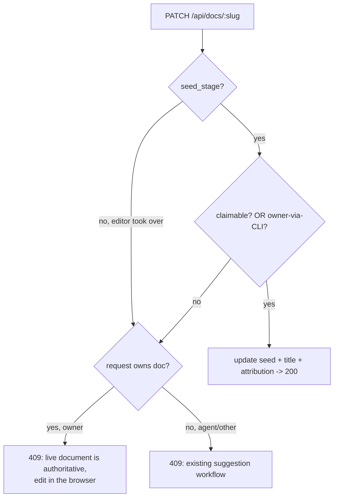

# fix: Let an authenticated CLI owner update their own claimed seed-stage document

## Summary

`PATCH /api/docs/:slug` (the `thinkroom update` CLI command) gates on
`document.seed_stage? && document.claimable?`. Because an authenticated
`thinkroom new` immediately sets `user_id` (ownership), the document is no
longer `claimable?`, so the very next `thinkroom update` returns `409 Conflict`
— the owner is locked out of their own draft. This fix recognizes the
authenticated CLI account as the owner and lets it revise its own document in
place while the document is still seed-stage, even though the document is
claimed.

The fix deliberately keeps the existing `seed_stage?` boundary: once a human
has opened the document in a browser and the live Yjs/CRDT state has taken
over, the seed is no longer what readers see and a server-side overwrite of
live CRDT state is explicitly outside the product's identity (see origin plan
`docs/plans/2026-06-25-002-feat-patch-api-docs-update-plan.md`, "Outside this
product's identity"). For that case the suggestion workflow remains, but the
conflict message is made ownership-aware so the owner is told to edit in the
browser rather than being told "a human has claimed it" (which is themselves).

---

## Problem Frame

**Who:** A person using the `thinkroom` CLI while authenticated (`thinkroom login`).

**What's broken:** After `thinkroom new` (which claims the document to the
account) the owner cannot `thinkroom update` it — the endpoint rejects the
update because the document is no longer `claimable?`. The only offered path is
`thinkroom suggest`, which makes the owner propose and then accept a suggestion
to themselves.

**Why it matters:** Owners should not be locked out of revising their own
unopened drafts. The suggestion workflow is for collaborative documents others
have edited, not for an owner revising their own seed.

**The constraint that shapes the solution:** `Api::DocsController#update` uses
two orthogonal gates:
- `claimable?` (`!claimed? && slug not in UNCLAIMABLE_SLUGS`) — an *ownership*
  gate. This is what wrongly blocks the owner.
- `seed_stage?` (`content_snapshot.nil? && yjs_state.blank?`) — a *CRDT-safety*
  gate. A seed write once an editor has taken over is a silent no-op, so this
  must stay. Server-side mutation of live CRDT state is out of scope by design.

Authentication already exists: `Api::BaseController#authenticate_cli_bearer`
sets `current_api_user` from the Bearer token. `Document#owned_by?(token, user:)`
already encodes account ownership. The update action simply never consults them.

---

## Requirements

- **R1.** When the request carries a valid CLI Bearer token whose account owns
  the document (`document.owned_by?(nil, user: current_api_user)`), and the
  document is still `seed_stage?`, `PATCH /api/docs/:slug` performs the normal
  in-place seed update and returns `200`, even though the document is claimed
  (`claimable?` is false).
- **R2.** All existing behavior is preserved: an anonymous/agent request
  (no Bearer) on a claimed document still returns `409`; a Bearer request from
  an account that does *not* own the document still returns `409`; any request
  on a past-seed-stage document (`yjs_state` or `content_snapshot` present)
  still returns `409`.
- **R3.** `UNCLAIMABLE_SLUGS` (the demo) can never be updated through this path —
  the demo is unowned, so the ownership branch must not accidentally permit it.
- **R4.** When an owner does hit the `409` (their document has progressed past
  seed stage), the conflict response is ownership-aware: it explains the live
  document is authoritative and points the owner at editing in the browser,
  instead of telling them "a human has claimed it."
- **R5.** Owner-update attribution and side effects match the existing update
  path (seed re-attribution when `X-Agent-Name` is sent, `updated_document`
  activity, rate limiting, format-immutability, byte cap).
- **R6.** Agent-facing discovery (`AgentGuide`) and the CLI skill doc are
  updated so the new capability is accurate and discoverable, without claiming
  server-side live-CRDT replacement.
- **R7.** Integration coverage proves R1–R4.

---

## Key Technical Decisions

- **KTD-1 — Relax only the ownership gate, never the seed-stage gate.** The fix
  adds an "owner OR claimable" branch while keeping `seed_stage?` mandatory.
  This resolves the lock-out (the reported bug) without touching live CRDT
  state, honoring the documented product identity.
- **KTD-2 — Ownership is account-based via the Bearer token.** Use
  `current_api_user.present? && document.owned_by?(nil, user: current_api_user)`.
  Guest (`owner_token` cookie) ownership is intentionally not matched: the CLI
  authenticates as an account, and a guest-owned doc is not owned by that
  account. This also keeps the demo (`UNCLAIMABLE_SLUGS`, unowned) protected.
- **KTD-3 — No CLI code change.** `thinkroom update` already attaches the Bearer
  token (`request(..., useToken: true)`), so an authenticated owner's update
  already sends identity; only the server must honor it.
- **KTD-4 — Ownership-aware conflict, not a new endpoint or status.** When the
  owner hits the seed-stage boundary, keep `409` but branch the body to explain
  the live-document situation and point at the browser editor (the owner has
  full edit access there). Non-owner/agent conflicts are unchanged.

---

## High-Level Technical Design

Updated gate for `PATCH /api/docs/:slug`:

Ownership predicate used at both branch points:
`current_api_user.present? && document.owned_by?(nil, user: current_api_user)`.

---

## Implementation Units

### U1. Recognize the authenticated owner in the update gate

**Goal:** Let an authenticated owner update their own seed-stage document.

**Requirements:** R1, R2, R3, R5

**Dependencies:** none

**Files:**
- `app/controllers/api/docs_controller.rb`
- `test/integration/agent_api_test.rb`

**Approach:**
- Add a private predicate (e.g. `owner_via_cli_token?`) returning
  `current_api_user.present? && document.owned_by?(nil, user: current_api_user)`.
- Change the gate from `document.seed_stage? && document.claimable?` to
  `document.seed_stage? && (document.claimable? || owner_via_cli_token?)`.
- Leave the rest of `#update` (format immutability, byte cap, normalization,
  attribution, activity, response) untouched — owners flow through the same
  path so attribution and side effects match (R5).

**Patterns to follow:** `Document#owned_by?`, the browser controller's
ownership checks (`DocumentsController#update_tags`, `#destroy`), and
`current_api_user` from `Api::BaseController`.

**Test scenarios (in `test/integration/agent_api_test.rb`):**
1. Authenticated owner PATCHes their own claimed seed-stage doc with new content
   → `200`, `current_content` updated, slug/share_url unchanged. *Covers R1.*
2. Authenticated owner title-only update on their claimed doc → `200`, content
   untouched. *Covers R1.*
3. Owner update re-attributes the seed to the sent `X-Agent-Name` and logs an
   `updated_document` activity. *Covers R5.*
4. Bearer token from a *different* account on a claimed doc → `409`, seed
   untouched. *Covers R2.*
5. Authenticated owner on a doc with `yjs_state` present → `409`, seed
   untouched (seed-stage gate still applies to owners). *Covers R2.*
6. Authenticated owner on a doc with `content_snapshot` present (yjs blank) →
   `409`. *Covers R2.*
7. Existing "update returns 409 once a human has claimed the document"
   (owner_token + agent header, no Bearer) stays green. *Covers R2.*
8. Demo / unclaimable slug is not updatable even with a Bearer token (no owner
   match). *Covers R3.*

**Verification:** New tests pass; the seed for a past-seed-stage doc is never
written; only the owning account unlocks the claimed-but-seed-stage update.

### U2. Make the update conflict ownership-aware

**Goal:** When an owner hits the seed-stage boundary, return a `409` that
explains the live document is authoritative and to edit it in the browser,
rather than "a human has claimed it."

**Requirements:** R4

**Dependencies:** U1

**Files:**
- `app/controllers/api/docs_controller.rb`
- `test/integration/agent_api_test.rb`

**Approach:**
- In `render_update_conflict`, branch on `owner_via_cli_token?`. For the owner,
  return a concise body: error stating the live collaborative document is
  authoritative, the `share_url` to edit in the browser, and the suggestions
  URL as a secondary option. For non-owners, keep the existing
  `AgentGuide.revision_workflow`-based body verbatim (no regression).
- Keep the HTTP status `409` in both cases.

**Patterns to follow:** existing `render_update_conflict`,
`AgentGuide.endpoints`/`revision_workflow`, `document_page_url`.

**Test scenarios:**
1. Authenticated owner PATCHing their past-seed-stage doc → `409` whose body
   names the live-document situation and includes the browser share URL.
   *Covers R4.*
2. Non-owner/agent conflict body is unchanged (still includes
   `revision_workflow`, `propose_suggestion`, `read_state`). *Covers R2/R4.*

**Verification:** Owner sees actionable, accurate guidance; the agent contract
is byte-for-byte unchanged for non-owners.

### U3. Update agent-guide and CLI skill documentation

**Goal:** Keep the discoverable contract honest: an authenticated owner can
revise their own claimed seed-stage document; live documents still route to
suggestions; no server-side live-CRDT replacement is promised.

**Requirements:** R6

**Dependencies:** U1

**Files:**
- `app/services/agent_guide.rb` (the `update_document` endpoint `purpose`, and
  the update note if needed)
- `cli/skill/thinkroom/SKILL.md`
- `test/integration/agent_api_test.rb` and/or `test/integration/agent_discovery_test.rb`
  only if an existing assertion pins the exact wording

**Approach:**
- Lightly extend the `update_document` `purpose` to note that an authenticated
  owner may revise their own claimed document while it is seed-stage; the
  seed-stage boundary and 409-to-suggestions behavior are unchanged.
- Update `cli/skill/thinkroom/SKILL.md` so the "Work with an existing document"
  section reflects that the owner can update their own document directly while
  it is seed-stage (no human has opened it), and that suggestions are for
  collaborative documents others have edited.
- Adjust any test that asserts the exact endpoint `purpose` string.

**Patterns to follow:** existing `AgentGuide` voice; the existing SKILL.md
"update vs suggest" guidance.

**Test scenarios:**
- Test expectation: covered by existing discovery tests — if a test pins the
  `update_document` purpose substring, update that assertion to match; no new
  behavior test required for doc text.

**Verification:** `bin/rails test` discovery tests pass; the CLI skill no longer
tells an owner to avoid updating their own claimed document.

---

## Scope Boundaries

**In scope:** Server-side recognition of the authenticated CLI owner for
seed-stage in-place updates; ownership-aware conflict messaging; doc/contract
text.

**Outside this product's identity (do not build):** Server-side mutation or
reset of live `yjs_state` / `content_markdown` to push a CLI "full replacement"
into an open collaborative editor. This is explicitly forbidden by
`docs/plans/2026-06-25-002` and risks clobbering live edits in connected
browsers. The owner edits live documents in the browser (they have full edit
access) or proposes suggestions.

### Deferred to Follow-Up Work
- A safe owner-initiated "reset this live document to new content" flow (would
  require an epoch/generation guard in the Yjs sync path plus a forced
  client reload). Only worth building if owners report the browser-edit and
  suggestion paths are insufficient.

---

## Risks & Dependencies

- **Risk — accidentally permitting non-owners or the demo.** Mitigation: gate
  strictly on `current_api_user` + `owned_by?(nil, user:)`; the demo is unowned
  so it cannot match. Explicit negative tests (different account, demo).
- **Risk — wording-pinned discovery tests break.** Mitigation: search for
  assertions on the `update_document` purpose / notes and update them in U3.
- **Risk — conflict-message regression for agents.** Mitigation: branch only
  for owners; assert the non-owner body is unchanged.

No external dependencies or migrations. All touched code is in-repo and covered
by `bin/rails test`.

---

## Sources & Research

- Origin issue: https://github.com/kieranklaassen/thinkroom/issues/112
- `app/controllers/api/docs_controller.rb` — `#update`, `render_update_conflict`.
- `app/controllers/api/base_controller.rb` — `authenticate_cli_bearer`, `current_api_user`.
- `app/models/document.rb` — `seed_stage?`, `claimable?`, `claimed?`, `owned_by?`.
- `app/models/cli_access_token.rb` — Bearer token issue/authenticate.
- `app/services/agent_guide.rb` — endpoint/notes/text discovery surface.
- `docs/plans/2026-06-25-002-feat-patch-api-docs-update-plan.md` — seed-stage update + "do not mutate live CRDT" identity.
- `docs/plans/2026-06-25-004-fix-claimed-document-revision-workflow-plan.md` — claimed-document revision workflow / conflict contract.
- `test/integration/agent_api_test.rb`, `test/integration/cli_authentication_flow_test.rb` — test patterns.
