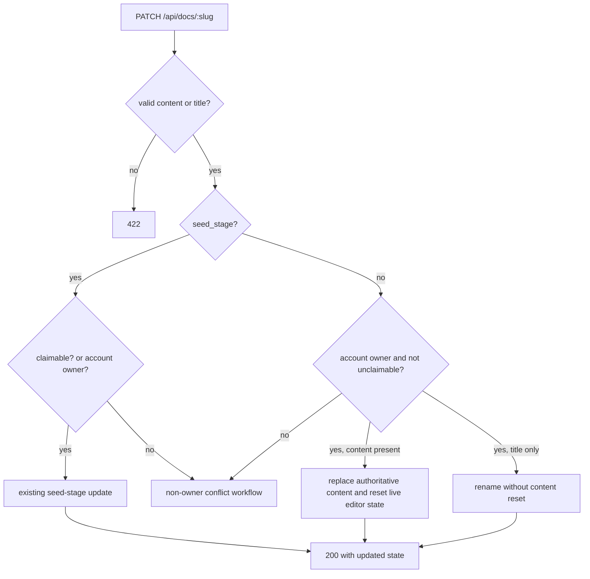
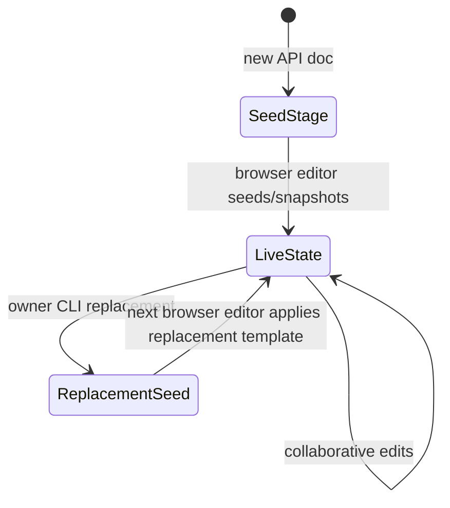

# fix: Allow CLI owners to replace live documents

## Summary

`thinkroom update` currently returns `409 Conflict` when an authenticated owner tries to replace a document after the browser editor has created Yjs/CRDT state. Issue #116 asks for owner authority to be enough for full replacement: the same slug and share URL should keep working, but the live document state should be reset to the new source instead of rejecting the write.

This plan keeps non-owner behavior unchanged. Only the authenticated account that owns the document can perform a destructive replacement past seed stage; everyone else still gets the suggestion workflow.

---

## Problem Frame

The current `Api::DocsController#update` path was built for seed-stage updates. That protected callers from a silent no-op: once `content_snapshot` or `yjs_state` exists, updating `seed_content` alone no longer changes what readers see. The owner-aware conflict added for the earlier owner update fix is accurate for that design, but it blocks the intended agent workflow: an agent drafts a document, the user claims and edits it in the browser, and the agent later needs to publish a full revised version into the same Thinkroom.

The replacement must operate on the authoritative read model and CRDT lifecycle, not merely bypass the error. A successful owner update needs subsequent API reads and browser opens to show the replacement content.

---

## Requirements

- R1. An authenticated CLI Bearer token whose account owns the document can `PATCH /api/docs/:slug` with replacement content even when `yjs_state` or `content_snapshot` is present.
- R2. Owner replacement keeps the document slug, share URL, ownership, immutable `content_format`, rate limits, byte limits, normalization, and agent attribution behavior from the existing update path.
- R3. Replacement resets the authoritative live-editor state so readers and future browser editors see the new content, not the previous CRDT/snapshot state.
- R4. Title-only owner updates past seed stage can still rename the document without resetting content.
- R5. Non-owners, other authenticated accounts, guest-cookie owners without the account owner, and unclaimable documents still cannot replace live content through the API.
- R6. Existing suggestion workflow guidance remains the conflict path for callers who do not own the document.
- R7. CLI and agent-facing docs describe that authenticated owners may replace live documents, while non-owners should propose suggestions.

---

## Key Technical Decisions

- **KTD-1 - Treat owner replacement as a destructive owner action.** The account owner already has browser edit/delete authority. The API should honor the same authority for full replacement, but only through the authenticated account owner predicate already used by owner update tests.
- **KTD-2 - Reset the authoritative document state, not just the seed.** Past seed stage, `current_content` reads `content_snapshot`, and the editor hydrates from `yjs_state_b64` when present. The replacement path must clear or rebuild the stale live state and persist the new source where API reads and first paint consume it.
- **KTD-3 - Prefer a server-owned reset boundary over a `--force` CLI flag for the first implementation.** The CLI already sends the Bearer token and content. Authorization and behavior belong on the server; adding a flag would not solve the stale CRDT state by itself.
- **KTD-4 - Preserve non-owner conflict semantics.** The existing revision workflow is still correct for non-owners and agents editing someone else's live document. Issue #116 changes the owner path only.
- **KTD-5 - Do not hand-roll ProseMirror/Yjs structure casually.** The browser editor uses `y-prosemirror` with Milkdown, not the plain `Y.Text` helpers used by older service tests. If the implementation rebuilds `yjs_state`, it must use a proven compatible builder; otherwise it should reset the persisted CRDT state and force the normal seed/template path to create fresh editor state from the replacement source.

---

## High-Level Technical Design

The key state transition is from a live document back to a replacement source:

---

## Implementation Units

### U1. Extract owner replacement state handling

**Goal:** Add a single server-side operation that replaces an owned document's source and resets stale live-editor state safely.

**Requirements:** R1, R2, R3

**Dependencies:** none

**Files:**
- `app/models/document.rb`
- `app/services/yjs_persistence.rb`
- `test/models/document_test.rb`
- `test/services/yjs_persistence_test.rb`

**Approach:** Implement the replacement as a model/service-owned transition under a document lock. It should persist the normalized replacement source, clear stale `content_snapshot`/provenance data, and reset `yjs_state`/seed lifecycle so the next editor session hydrates from the replacement source rather than merging the old CRDT state. If the implementation instead builds a fresh Yjs document server-side, add compatibility tests that prove the browser/editor binding can read that state; plain `Y.Text` tests alone are not sufficient.

**Patterns to follow:** `Document#with_write_access`, `Document#seed_stage?`, `YjsPersistence.merge`, `YjsPersistence.persist_snapshot`, and the seed-claim tests in `test/integration/document_seed_claim_test.rb`.

**Test scenarios:**
- A live document with both `yjs_state` and `content_snapshot` is replaced by its account owner; after reload, `current_content` is the new source and stale provenance spans are gone.
- A replacement resets seed lifecycle fields so a future browser session can seed the new source without waiting for the stale-claim timeout.
- Invalid or oversized replacement content leaves the old live state untouched.
- If a fresh Yjs state is generated server-side, `YjsPersistence.state_b64` round-trips into a fresh Y doc with the replacement content using the same structure the editor expects.

**Verification:** Unit tests prove the transition is atomic and stale live state cannot shadow the replacement.

### U2. Update `PATCH /api/docs/:slug` owner behavior

**Goal:** Route owner PATCH requests past seed stage into the replacement operation while preserving existing seed-stage and conflict paths.

**Requirements:** R1, R2, R4, R5, R6

**Dependencies:** U1

**Files:**
- `app/controllers/api/docs_controller.rb`
- `test/integration/agent_api_test.rb`

**Approach:** Keep `owner_via_cli_token?` as the account-owner gate. For seed-stage documents, preserve the existing update path. For non-seed-stage documents, branch only account owners into the replacement path when `content` is present; title-only owner updates should update `title` and return the normal response without resetting content. Non-owners should continue through `render_update_conflict`.

**Patterns to follow:** Existing owner update tests around `owner_via_cli_token?`, format immutability checks, `reject_oversized_content`, `normalized_source_and_signal`, `agent_seed_attribution`, and `Activity.log!`.

**Test scenarios:**
- Authenticated owner replaces a document with `yjs_state` present and receives `200`; response content and persisted `current_content` include the replacement.
- Authenticated owner replaces a document with only `content_snapshot` present and receives `200`.
- Owner title-only update on a live document renames it and leaves existing content state untouched.
- Bearer token from a different account still receives `409` and the original content remains unchanged.
- Anonymous/agent request on a claimed live document still receives the existing revision workflow response.
- Guest-cookie ownership is not enough for account-token owner replacement.
- Demo/unclaimable document remains protected even if a future bug assigns it an owner.
- Format mismatch, empty PATCH, and byte cap behavior match the existing update path.

**Verification:** `test/integration/agent_api_test.rb` covers owner, non-owner, title-only, validation, and conflict branches.

### U3. Broadcast or otherwise invalidate open editor sessions after replacement

**Goal:** Prevent currently open browser editors from continuing to display or later re-persist the pre-replacement CRDT state.

**Requirements:** R3

**Dependencies:** U1, U2

**Files:**
- `app/channels/document_meta_channel.rb`
- `app/frontend/lib/use_meta_channel.ts`
- `app/frontend/pages/documents/show.tsx`
- `app/frontend/editor/milkdown_editor.tsx`
- `test/channels/document_meta_channel_test.rb`

**Approach:** Add a document-level reset signal if clearing persisted CRDT state is not enough for connected clients. The signal should cause open editors to discard the current Yjs session and reload the document props, similar to how delete and metadata changes already route through `DocumentMetaChannel`. The client must not merge the old local Y doc back into the freshly reset document.

**Patterns to follow:** `DocumentMetaChannel.broadcast_event`, `useMetaChannel`'s special handling for `document_deleted`, editor session teardown in `milkdown_editor.tsx`, and `editorSessionKey` handling in `documents/show.tsx`.

**Test scenarios:**
- Owner replacement broadcasts a reset/content event after commit.
- A client receiving the reset event recreates the editor session rather than applying the replacement as a normal partial prop reload over the old Y doc.
- Deletion, title, ownership, activities, and suggestions meta events keep their existing behavior.

**Verification:** Channel tests cover the broadcast contract. Browser verification in the work phase should open a live document in one tab, run the owner update through the API/CLI, and confirm the tab shows the replacement after the reset.

### U4. Update CLI fixtures and user-facing guidance

**Goal:** Make `thinkroom update` tests and documentation reflect that account owners can replace live documents.

**Requirements:** R7

**Dependencies:** U2

**Files:**
- `cli/test/thinkroom.test.js`
- `cli/skill/thinkroom/SKILL.md`
- `app/services/agent_guide.rb`
- `test/integration/agent_api_test.rb`

**Approach:** The CLI command probably needs no transport change, because it already sends the configured Bearer token and PATCH body. Update tests that currently expect a `409` for live update to distinguish non-owner conflicts from owner success. Update the skill and agent guide to say authenticated owners may replace their own live documents; non-owners and agents without ownership should still propose suggestions.

**Patterns to follow:** Existing CLI update test fixture, `AgentGuide.endpoints`, `AgentGuide.notes`, and plain-text share guide tests.

**Test scenarios:**
- CLI fixture for owner-style update returns a successful share URL.
- CLI fixture for a non-owner `409` still surfaces the server's suggestion guidance.
- JSON state payload advertises the updated owner capability without promising non-owner overwrite.
- Plain-text guide and `cli/skill/thinkroom/SKILL.md` no longer tell owners that live documents can only be edited in the browser.

**Verification:** `npm --prefix cli test` or the repo's CLI test command passes, and API guide tests assert the new copy.

---

## Scope Boundaries

- This plan does not add a `thinkroom update --force` flag. The first implementation should make the authenticated owner path work without new CLI syntax.
- This plan does not let non-owners overwrite collaborative documents. Suggestions remain the collaboration-safe path.
- This plan does not change document ownership acquisition. CLI replacement depends on the account owner created by login/authenticated creation or account ownership promotion.
- This plan does not make CRDT merging smarter. A full replacement is destructive by design and should reset or rebuild the live state.

---

## System-Wide Impact

This changes an external HTTP API contract used by the installed CLI and agent workflows. It also changes a live-collaboration lifecycle: a server-side owner action can invalidate existing editor sessions. The implementation should therefore keep authorization checks narrow, make the state transition explicit, and verify both API reads and browser editor behavior.

---

## Risks & Dependencies

- **Stale client re-persistence:** An open editor with the old Y doc could push old state back after the server clears it. U3 exists to close this risk.
- **Yjs structure mismatch:** Ruby-side `Y.Text` helpers may not represent the same structure produced by Milkdown/y-prosemirror. Avoid claiming success from a plain text round-trip unless the browser editor can hydrate it.
- **Over-broad authorization:** Owner replacement must use account ownership, not any Bearer token or guest token association.
- **Documentation drift:** The Thinkroom CLI skill and `AgentGuide` currently describe live CRDT state as a hard stop. They must change with the behavior.

---

## Sources & Research

- GitHub issue #116: `https://github.com/kieranklaassen/thinkroom/issues/116`
- Existing owner seed-stage fix plan: `docs/plans/2026-06-27-002-fix-cli-owner-update-claimed-docs-plan.md`
- API update path and conflict behavior: `app/controllers/api/docs_controller.rb`
- Live state persistence: `app/services/yjs_persistence.rb`
- Document state predicates: `app/models/document.rb`
- API regression tests: `test/integration/agent_api_test.rb`
- Editor Yjs binding and seed flow: `app/frontend/editor/milkdown_editor.tsx`, `app/frontend/editor/cable_provider.ts`
- Meta-channel reload pattern: `app/frontend/lib/use_meta_channel.ts`, `app/channels/document_meta_channel.rb`
