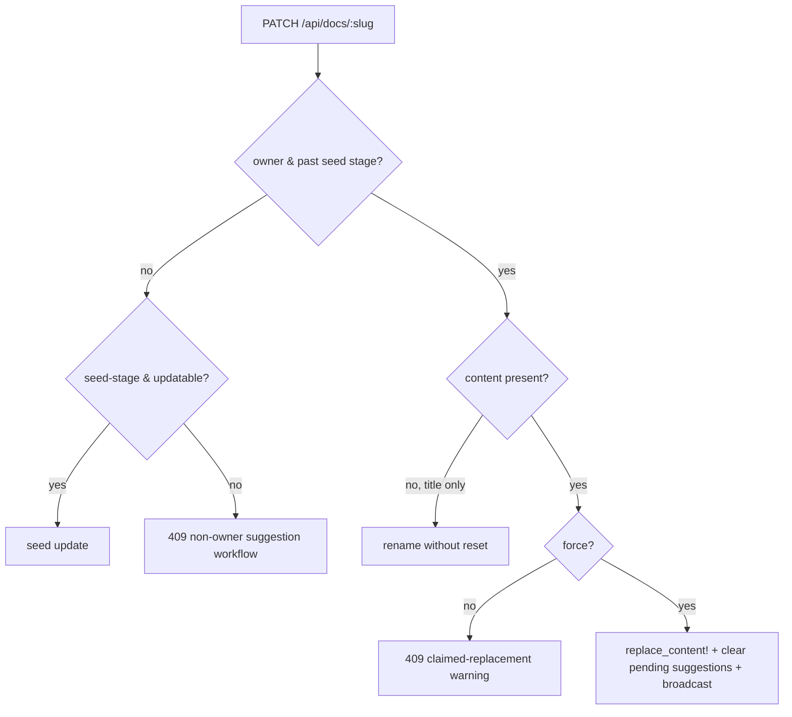

# fix: Block or warn `thinkroom update` on a claimed document

## Summary

After #114/#117/#118 let an authenticated owner replace their own live document
through `thinkroom update`, issue #121 reports that doing so on a claimed,
human-edited document is a footgun. The update returns a share URL with exit
code 0 (looks like success) but:

1. The browser never reflects the new content (#119/#120 — separate agents).
2. Subsequent `thinkroom suggest --replaces` calls fail with "target missing,
   ambiguous, or empty" because the replacement shifted the underlying content.
3. Pending suggestions are orphaned and need manual dismissal.

#121 asks for the destructive overwrite to stop being silent: either return an
error pointing at `thinkroom suggest`, or warn before proceeding.

This plan reconciles #116 (owners *want* to be able to replace) with #121
(the silent overwrite is dangerous) by gating the destructive live replacement
behind an explicit `--force` / `force: true` opt-in — the exact mechanism the
reporter proposed in #116 — and by clearing now-orphaned pending suggestions
when a forced replacement happens.

Scope note: the browser-reflection bugs (#119, #120) are owned by other agents.
This change deliberately does NOT touch the editor reseed/`content_reset`
frontend wiring; it fixes the silent-success and suggestion-corruption symptoms
at the API/model/CLI layer.

---

## Problem Frame

`Api::DocsController#update` currently treats an authenticated owner past the
seed stage as `live_owner_replacement` and immediately calls
`Document#replace_content!`, which wipes `content_snapshot`/`yjs_state` and resets
the seed lifecycle. There is no confirmation step, so a routine `thinkroom update`
silently discards the human's browser edits and leaves pending suggestions that
target text which no longer exists.

The fix must keep:
- Unclaimed-draft seed updates working (anonymous + owner).
- Owner *seed-stage* updates of their own claimed-but-not-yet-edited doc working.
- Owner *title-only* updates of a live doc working (non-destructive rename).
- Non-owner conflicts returning the existing 409 suggestion workflow.

…while requiring an explicit opt-in for the one destructive case: replacing the
*content* of a claimed, live document.

---

## Requirements

- R1. A bare `thinkroom update` (no force) that would replace a claimed, live
  document's content must NOT succeed silently. It returns a clear conflict
  explaining the doc is claimed and how to proceed (suggest, or `--force`).
- R2. `thinkroom update --force` (API `force: true`) lets the authenticated
  account owner replace their own live document, preserving the #116 capability.
- R3. A forced replacement clears the document's pending suggestions, so the
  review queue is not corrupted and subsequent `suggest` calls match fresh content.
- R4. Owner title-only updates and owner seed-stage updates keep working WITHOUT
  `--force` (they are not destructive of live human edits).
- R5. Non-owners, other accounts, guest-cookie owners, and unclaimable docs keep
  their existing behavior; `force` never substitutes for ownership.
- R6. CLI and agent-facing guidance describe the `--force` requirement and that
  the default path is safe (suggest).

---

## High-Level Technical Design

---

## Implementation Units

### U1. Gate destructive live replacement behind `force` (API)

**Files:** `app/controllers/api/docs_controller.rb`, `test/integration/agent_api_test.rb`

- Parse `force = ActiveModel::Type::Boolean.new.cast(params[:force])`.
- When `live_owner_replacement && content.present? && !force`, render a focused
  409 warning (`error` + `next_action` + `propose_suggestion` URL) instead of
  replacing. Keep `render_update_conflict` for non-owners.
- When forced, proceed with the existing `replace_content!` path and broadcast
  `:content_reset` plus `:suggestions` (so open panels clear).

### U2. Clear orphaned pending suggestions on replacement (model)

**Files:** `app/models/document.rb`, `test/models/document_test.rb`

- In `Document#replace_content!`, after the destructive `update!`, destroy
  `suggestions.pending` (their `replaces`/`anchor_text` targets are gone).

### U3. `--force` flag (CLI)

**Files:** `cli/bin/thinkroom.js`, `cli/test/thinkroom.test.js`

- Add `force` to the boolean flags; when set, include `force: true` in the PATCH
  body. The existing `ApiError` already prints `error` + `next_action`, so the
  default warning surfaces cleanly.

### U4. Guidance

**Files:** `app/services/agent_guide.rb`, `cli/skill/thinkroom/SKILL.md`

- Document that replacing a claimed/live owned document requires `--force` and
  that non-owners (and owners who don't want to overwrite) should use `suggest`.

---

## Scope Boundaries

- Does not change the browser reseed / `content_reset` rendering path (#119/#120).
- Does not let non-owners overwrite anything.
- Does not remove the owner replacement capability — it makes it explicit.

---

## Test Scenarios

- Owner content replacement on a live doc WITHOUT force → 409 warning; content,
  snapshot, yjs_state, and pending suggestions all unchanged.
- Owner content replacement on a live doc WITH force → 200; content replaced,
  live state reset, pending suggestions cleared, `content_reset` broadcast.
- Owner title-only update on a live doc → 200 without force, content untouched.
- Owner seed-stage update → 200 without force (unchanged).
- Non-owner / other account / guest-cookie / unclaimable → 409 (unchanged); force
  does not help.
- `Document#replace_content!` destroys pending suggestions.
- CLI `update --force` sends `force: true`; CLI surfaces the default warning.

---

## Verification

- `bin/rails test` (Minitest), `bin/rubocop`, `npm run check`, `npm --prefix cli test`.
- End-to-end with the real `thinkroom` CLI against a `bin/dev` server: claim a
  doc in the browser, confirm bare `update` is refused with guidance, confirm
  `--force` replaces and leaves no orphaned pending suggestions.
