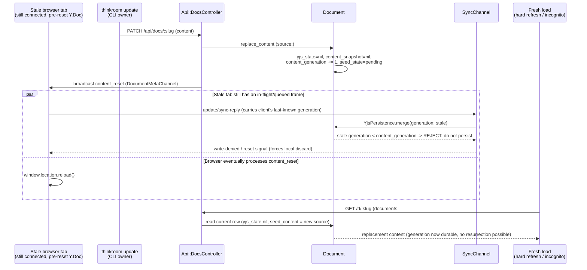

# fix: Close the stale-CRDT race after owner CLI replacement and clean up orphaned suggestions

## Summary

`thinkroom update` (`PATCH /api/docs/:slug`) already lets an authenticated CLI
owner replace a live (claimed) document — that capability shipped in #116/#118
and is intentional, not a bug to remove. `Document#replace_content!` correctly
wipes `yjs_state`/`content_snapshot` and resets the seed lifecycle so the
**next fresh page load** reseeds from the new source. The remaining bug is a
race: nothing stops a **still-connected browser tab's in-flight Yjs sync
frame** from re-merging its old, pre-replacement CRDT state back into
`yjs_state` immediately after the reset. `SyncChannel#receive` →
`YjsPersistence.merge` blindly merges any incoming update into whatever is
currently in the `yjs_state` column, with no check for whether the document
was replaced since that client last synced. This silently resurrects the old
content server-side — which is why even a brand-new incognito hard refresh can
still observe stale content moments later (#120): the resurrection happens
**after** the CLI write succeeded, asynchronously, from a connection the CLI
caller never sees.

This plan adds a generation guard so a stale client's Yjs frames are rejected
(not merged) once the document has been replaced past their last known
generation, forces the stale tab to discard its session via the existing
`content_reset` broadcast more robustly (covering reconnect/race timing, not
just the synchronous case), and closes the secondary symptom from #121: a
content reset auto-resolves suggestions that targeted the now-gone content
instead of leaving them silently unmatchable in the queue. It does **not**
add a CLI-side block/warning in front of replacement — the owner-replacement
feature (#116) was an explicit, recent, deliberate design decision, and #121's
own evidence (silent corruption) is the generation-guard bug, not a missing
confirmation prompt. See Key Technical Decisions for why warning was rejected
in favor of fixing the underlying race.

---

## Problem Frame

**Who:** An authenticated CLI account owner (e.g. `thinkroom new` then
`thinkroom update` as the same logged-in identity) replacing their own
document after a human has opened it in the browser and started editing
(claimed, live CRDT state present).

**What's broken:** `Api::DocsController#update` → `Document#replace_content!`
correctly resets the canonical row, but:

1. The connected browser tab's local Yjs doc still holds the pre-replacement
   state. `SyncChannel#receive` has no way to know the document was replaced
   out from under it, so the very next frame that tab sends (an edit,
   awareness ping carried `update`, or a reconnect's `sync-reply`) merges the
   stale CRDT back into `yjs_state` via `YjsPersistence.merge`, undoing the
   reset server-side. (#119, #120)
2. A **second, independent fresh client** (incognito hard refresh) reads
   whatever is in the row at request time. If step 1 has already resurrected
   the old state by the time that second client loads, it legitimately reads
   stale data — there is no caching bug, the data itself was corrupted back.
   (#120)
3. `Suggestion` rows created against the pre-replacement content are never
   reconciled when the content is replaced. They remain `status: "pending"`
   forever, the client-side `suggestionApplicability` check reports
   `missing`/`ambiguous` against the new content, and nothing in the UI
   explains why or offers to clear them. (#121)

**Why it matters:** The owner-replacement feature is silently unreliable —
its outcome depends on whether a stale tab happens to re-sync before the next
reader loads the page, which is exactly the kind of race a user (or agent)
cannot predict or work around. The corrupted suggestion queue compounds the
confusion: subsequent agent suggestions fail for a reason invisible to the
caller.

**The constraint that shapes the solution:** the existing replace-on-claimed
capability (#116/#118), its authorization boundary (`owner_via_cli_token?`),
and its broadcast contract (`content_reset` event) are correct and stay as-is
(see `docs/plans/2026-06-28-001-fix-owner-live-cli-replacement-plan.md`).
This plan closes the race in the merge/sync path and the suggestion-queue
gap; it does not rebuild the replacement feature or add new CLI flags.

---

## Requirements

- **R1.** Once `Document#replace_content!` resets a document's live state, the
  server must reject (not merge) any incoming `SyncChannel` Yjs update frame
  from a client whose local state predates that reset, so a stale tab cannot
  resurrect the old `yjs_state` after the replacement commits.
- **R2.** A document carries a persisted, monotonically increasing generation
  marker that `replace_content!` advances. `YjsPersistence.merge` (and the
  subscribe handshake) compare against it rather than relying on in-memory
  timing.
- **R3.** A stale client that gets a rejected/out-of-generation merge is told
  to discard its session and resync from the new generation — the same
  `content_reset` signal already broadcast, made reliable for a client that
  is mid-reconnect or whose `content_reset` frame raced with its own
  outgoing update (i.e., R3 is a belt-and-suspenders client correctness fix
  layered on the server-side R1/R2 guard, not a replacement for it).
- **R4.** A fresh page load (HTTP `documents#show`, any browser, any session,
  including incognito) after a completed replacement always reflects the
  replacement content — this is the acceptance bar for #119/#120 and falls
  out of R1/R2 once stale merges can no longer resurrect old state.
  Verification reproduces the original repro shape (claim → CLI update →
  hard refresh / new incognito context) end-to-end.
- **R5.** Existing pending `Suggestion` rows whose `replaces`/anchor target
  text no longer exists in the document are auto-resolved (rejected) at the
  moment of replacement, with an activity entry explaining why, instead of
  being left silently orphaned. (#121, item 3)
- **R6.** `thinkroom update`'s JSON response and the agent-facing contract
  (`AgentGuide`) note when a replacement auto-rejected pending suggestions,
  so an agent calling `update` understands the side effect rather than
  discovering it later via a confusing `suggest` failure. (#121, items 2–3)
- **R7.** All existing owner-replacement behavior from #116/#118 is
  preserved byte-for-byte for non-stale clients and non-owners: format
  immutability, byte caps, attribution, rate limiting, the `409` conflict for
  non-owners, and the existing `content_reset` broadcast contract.
- **R8.** Integration/channel coverage proves the race is closed: a
  still-connected stale client's post-reset frame is rejected, not merged,
  and a subsequent fresh read shows the replacement content regardless of
  what the stale client does afterward.

---

## Key Technical Decisions

- **KTD-1 — Fix the race, do not add a CLI-side block or confirmation
  prompt.** Issue #121 asks for an error or warning before replacement. The
  investigation found the actual defect is server-side data corruption (a
  stale merge undoing the reset), not a missing confirmation — the owner
  explicitly chose to replace their own live document, which is the exact
  capability #116 shipped two days prior. Blocking or warning on every
  owner-replacement call would regress that feature for the overwhelming
  majority of calls where no stale tab exists. Once R1–R4 make the
  replacement actually durable and visible, "silent success that breaks
  the browser" (the core complaint in #121) no longer applies — the success
  is no longer silent-and-wrong, it is real. R5/R6 separately close the
  suggestion-queue confusion #121 also raised. This is a one-paragraph,
  load-bearing decision: a reviewer should not expect a new `409`/warning
  path for the owner-replacement case past seed stage.
- **KTD-2 — A persisted generation counter on `Document`, not a timestamp
  comparison.** `updated_at` already changes on nearly every write (titles,
  attribution, activities touch the row indirectly), so comparing
  `updated_at` would produce false-positive staleness. A dedicated
  `content_generation` integer column, incremented only by
  `replace_content!`, is the precise signal: "has this document's live
  content been reset since you last saw it." `SyncChannel` threads the
  generation the client last synced through its connection state (set at
  `subscribed`, the same place it currently reads `yjs_state`/state vector),
  and `YjsPersistence.merge` takes and checks that generation under the
  existing per-document lock so the check and the write stay atomic.
- **KTD-3 — Reject stale frames at the merge boundary, not the channel
  subscribe boundary.** A client connected *before* a replacement is still
  validly subscribed (ActionCable doesn't know content changed) — the
  failure mode is specifically its outgoing **update/sync-reply frames**
  reaching `YjsPersistence.merge` after the generation has moved. Gate
  `merge` itself: if the caller's known generation is behind
  `document.content_generation`, drop the frame (do not persist it) and
  signal the client to reset, mirroring the existing
  `Document::EditingLockedError` → `write-denied` pattern already in
  `SyncChannel#persist_and_broadcast`.
- **KTD-4 — Reuse `content_reset`, don't invent a second event.** The
  broadcast contract added in #118 (`DocumentMetaChannel.broadcast_event(...,
  :content_reset)` → client `window.location.reload()`) is the correct
  client recovery action for "your local CRDT is no longer valid here."
  R3's gap is timing/reliability (a frame in flight when the broadcast
  lands, or a client that reconnects after missing the broadcast entirely),
  not the event's existence. The channel-level rejection in KTD-3 is the
  belt; the existing broadcast is the suspenders — a stale client that
  somehow still doesn't get the broadcast (e.g., briefly disconnected) will
  have its next merge attempt rejected anyway and can be told to reload via
  the channel's own response frame, independent of the meta-channel
  broadcast.
- **KTD-5 — Auto-resolve stale suggestions using the same text-matching
  logic already used to detect "missing"/"ambiguous," not a new heuristic.**
  `suggestionApplicability`/`matchQuotedText` (client) is the existing
  authority on whether a suggestion's `replaces` text exists in the current
  document. Reimplementing that matching server-side in Ruby for R5 would
  fork the matching logic across two languages and two implementations that
  could disagree. Instead, give `replace_content!` a server-side text
  containment check only (does `suggestion.replaces` appear verbatim in the
  new `current_content`?) — simpler than full fuzzy matching, intentionally
  conservative (a false "still matches" is harmless; it just leaves a
  suggestion pending that the existing client-side check will then report
  as missing/ambiguous on its own, same as today). This keeps R5 a
  narrowly-scoped cleanup pass, not a second source of truth for
  applicability.

---

## High-Level Technical Design

The key invariant this closes: **no Yjs frame can be persisted into
`yjs_state` unless its sender's known generation matches the document's
current `content_generation`.** That single check at the merge boundary makes
every downstream read (HTTP show, SyncChannel subscribe, agent API)
trustworthy without needing to reason about tab lifecycles or broadcast
timing.

---

## Implementation Units

### U1. Add a persisted content generation to `Document`

**Goal:** Give `replace_content!` a durable, monotonic marker that downstream
sync code can compare against, replacing reliance on in-memory timing.

**Requirements:** R2

**Dependencies:** none

**Files:**
- `db/migrate/<timestamp>_add_content_generation_to_documents.rb`
- `db/schema.rb`
- `app/models/document.rb`
- `test/models/document_test.rb`

**Approach:** Add `content_generation` (integer, `null: false, default: 0`)
to `documents`. `replace_content!` increments it as part of the same
`attributes` hash it already builds (`content_generation: content_generation
+ 1`) inside the existing `with_lock`/`reload` transaction — no new locking
primitive, just one more column in an existing atomic update. Expose a
read-only `content_generation` accessor (already free via ActiveRecord).
Existing rows default to `0`; first replacement on any document moves it to
`1`.

**Patterns to follow:** the existing `attributes` hash construction in
`Document#replace_content!` (`app/models/document.rb:160-179`); the
migration conventions already in `db/migrate/`.

**Test scenarios:**
1. A new document defaults `content_generation` to `0`.
2. `replace_content!` increments `content_generation` by exactly 1 per call,
   verified across two successive replacements (`0 → 1 → 2`). *Covers R2.*
3. A non-replacement update (title-only seed-stage edit, snapshot persist via
   `YjsPersistence.persist_snapshot`) does **not** change
   `content_generation`. *Covers R2 boundary.*

**Verification:** `bin/rails test test/models/document_test.rb` passes;
schema diff shows only the additive column.

### U2. Thread the generation through the sync handshake and reject stale merges

**Goal:** Close the actual race — make `YjsPersistence.merge` refuse to
persist a Yjs frame from a client whose known generation is behind the
document's current one, instead of silently merging it.

**Requirements:** R1, R3 (server half), R7, R8

**Dependencies:** U1

**Files:**
- `app/channels/sync_channel.rb`
- `app/services/yjs_persistence.rb`
- `app/models/document.rb` (new `StaleGenerationError`, mirroring
  `EditingLockedError`)
- `test/channels/sync_channel_test.rb`
- `test/services/yjs_persistence_test.rb`

**Approach:**
- `SyncChannel#subscribed` does not currently send `content_generation`; add
  it to the initial `sync` message payload so the client can carry it on
  every outgoing frame (`update`/`sync-reply` messages already pass a
  free-form hash — add `generation` alongside the existing `cid`/`seq`).
- `SyncChannel#receive` reads `data["generation"]` for `update`/`sync-reply`
  frames and passes it through to `YjsPersistence.merge(document, update,
  generation:, token:, user:)`.
- `YjsPersistence.merge`, inside the existing `lock_for(document.id)` +
  `with_lock`/`reload`, checks `generation.nil? || generation ==
  document.content_generation` before merging. `nil` is treated as "trust it"
  only for rollout compatibility with not-yet-updated clients in flight
  during a deploy — mirrors the existing `seq`-less rollout-compatibility
  branch already in `SyncChannel#receive`. A mismatch raises
  `Document::StaleGenerationError` instead of merging; the update is dropped,
  never persisted.
- `SyncChannel#persist_and_broadcast` rescues `StaleGenerationError` the same
  way it already rescues `EditingLockedError`: `transmit({ type:
  "write-denied", locked: false, stale: true })` — distinct `stale: true` so
  the client can tell "you're locked out" from "you're out of date" apart
  (R3 client wiring is U3).
- No change to the lock granularity or transaction boundaries already in
  `YjsPersistence.merge` — the generation check sits inside the same
  `with_lock`/`reload` that already guards the read-then-write.

**Patterns to follow:** `Document::EditingLockedError` /
`SyncChannel#persist_and_broadcast`'s existing `rescue` branch
(`app/channels/sync_channel.rb`); the existing rollout-compatibility branch
for clients without `seq` (`app/channels/sync_channel.rb:51-58`).

**Test scenarios:**
1. A client that subscribes, learns generation `0`, then after the document
   is replaced (`content_generation` becomes `1`) sends an `update` frame
   carrying `generation: 0` — the frame is rejected, `yjs_state` remains nil
   (the replacement's reset value), and the channel transmits `write-denied,
   stale: true`. *Covers R1, R8.*
2. A client sending a frame with `generation: 1` (current) after the same
   replacement succeeds and persists normally. *Covers R1 boundary.*
3. A client sending no `generation` key (rollout-compatibility) still merges
   (matches today's behavior, not a regression). *Covers R7.*
4. `YjsPersistence.merge` raising `StaleGenerationError` for an explicit
   mismatched generation, leaving the stored `yjs_state` byte-for-byte
   unchanged. *Covers R1.*
5. The existing non-owner `409`, owner-replacement success, byte cap, and
   format-immutability tests in `agent_api_test.rb` are unaffected (no
   change needed if U1/U2 are additive — run as regression, not new
   assertions). *Covers R7.*

**Verification:** `bin/rails test test/channels/sync_channel_test.rb
test/services/yjs_persistence_test.rb test/integration/agent_api_test.rb`.
Manually reproduce: open a doc in two terminal-driven SyncChannel test
subscriptions at different generations and confirm only the current-gen one
persists.

### U3. Make stale-client recovery reliable on the frontend

**Goal:** A client told `write-denied, stale: true` (U2) or that receives the
existing `content_reset` broadcast discards its local Yjs session and
reloads, covering the case where the broadcast and an in-flight outgoing
frame race.

**Requirements:** R3 (client half), R4

**Dependencies:** U2

**Files:**
- `app/frontend/editor/cable_provider.ts`
- `app/frontend/editor/milkdown_editor.tsx`
- `app/frontend/pages/documents/show.tsx`
- `test/integration/document_seed_claim_test.rb` (extend the existing
  "seed version changes after source replacement" coverage to a connected
  client, not just a fresh load)

**Approach:**
- `CableProvider`'s `write-denied` handler currently exists for
  `EditingLockedError` (`locked: true`); extend it to also recognize `stale:
  true` and emit a distinct event (e.g. `'stale'`) on the provider's existing
  `listeners` map, alongside the existing `'write-denied'` event.
- `show.tsx` already wires `provider.on('write-denied', recoverDeniedWrite)`
  (`app/frontend/pages/documents/show.tsx:587`); add a sibling
  `provider.on('stale', reloadAfterContentReset)`, reusing the existing
  `reloadAfterContentReset` callback (`window.location.reload()`) that
  `content_reset` already triggers — same recovery action, second trigger
  path, so a client recovers whether it hears the meta-channel broadcast
  first or discovers staleness via a rejected frame first.
- No new state machine: this is wiring an existing recovery action to a
  second signal path, per KTD-4.

**Patterns to follow:** the existing `provider.on('write-denied',
recoverDeniedWrite)` wiring (`app/frontend/pages/documents/show.tsx:587`);
`reloadAfterContentReset` (`app/frontend/pages/documents/show.tsx:568`).

**Test scenarios:**
1. Integration: a document claimed and live-edited (real `yjs_state`
   present, simulated via the existing seed-claim test harness), then
   `replace_content!`'d while a second subscription is held open at the old
   generation; the held subscription's next frame is rejected and the test
   asserts the document's `current_content` (read fresh) still equals the
   replacement, never the stale client's content. *Covers R4 — this is the
   true end-to-end #120 repro.*
2. `Test expectation: none -- the 'stale' event wiring is a thin client
   callback hookup with no branching logic; covered by the integration
   scenario above, not a dedicated frontend unit test.`

**Verification:** The extended `document_seed_claim_test.rb` scenario passes,
proving a stale connected client cannot cause a fresh read to see old
content — the literal #120 repro (hard refresh / incognito after update on a
claimed doc) reduced to an integration assertion.

### U4. Auto-resolve suggestions that no longer target existing content

**Goal:** When `replace_content!` runs, pending suggestions whose `replaces`
text is no longer present in the new content are rejected automatically with
an explanatory activity entry, instead of sitting in the queue unmatchable.

**Requirements:** R5, R6

**Dependencies:** U1 (uses the same `replace_content!` transaction)

**Files:**
- `app/models/document.rb`
- `app/models/suggestion.rb`
- `app/controllers/api/docs_controller.rb`
- `app/services/agent_guide.rb`
- `test/models/document_test.rb`
- `test/integration/agent_api_test.rb`

**Approach:**
- Inside `replace_content!`'s existing `with_lock` block, after building
  `attributes` but using the **new** `source` (not the stale
  `current_content`), iterate `suggestions.pending` and reject (via the
  existing `Suggestion#transition!` pattern, `app/models/suggestion.rb:115`)
  any whose `replaces.present?` and `source.exclude?(replaces)` — a plain
  substring containment check per KTD-5, not a reimplementation of
  `matchQuotedText`. Suggestions without a `replaces` (pure additions/general
  comments) are left untouched — they have no target to lose.
  - Note `with_replaces` suggestions only — anchor-only or replaces-blank
    suggestions are out of scope for auto-rejection (nothing to detect as
    "gone").
- Each auto-rejected suggestion logs one `Activity` (`action:
  "auto_rejected_suggestion"`, detail naming the replaced document event) so
  the activity feed explains the disappearance instead of leaving it silent
  — this directly answers #121 item 3 ("no clear UI affordance").
- `Api::DocsController#update`'s response (`agent_document_response`) gains
  an `auto_rejected_suggestions` count (0 when none) in the JSON body when
  `content_reset` is true, so a CLI/agent caller sees the side effect
  immediately (R6) rather than discovering it via a later failed `suggest`
  call.
- `AgentGuide` notes (or the `revision_workflow`/update-endpoint purpose
  text) gain one sentence: replacing a live document auto-rejects
  suggestions that targeted text no longer present.

**Patterns to follow:** `Suggestion#transition!`
(`app/models/suggestion.rb:115-119`), the existing `Activity.log!` call
sites in `docs_controller.rb`, `agent_document_response`'s existing payload
shape.

**Test scenarios:**
1. A pending suggestion whose `replaces` text exists in the new content
   survives the replacement untouched (still `pending`). *Covers R5
   boundary — don't over-reject.*
2. A pending suggestion whose `replaces` text is absent from the new content
   is auto-rejected (`status: "rejected"`) and an `auto_rejected_suggestion`
   activity is created. *Covers R5.*
3. A pending suggestion with no `replaces` (general/anchor-only) is left
   pending after replacement. *Covers R5 boundary.*
4. `PATCH /api/docs/:slug` owner replacement response includes
   `auto_rejected_suggestions: 1` when one suggestion was rejected, and `0`
   (or omitted) when none were. *Covers R6.*
5. A seed-stage (non-replacement) update never touches suggestions — there
   are none possible pre-claim, but assert the code path is gated on
   `live_owner_replacement`/`content_reset`, not run unconditionally.
   *Covers R7 boundary.*

**Verification:** `bin/rails test test/models/document_test.rb
test/integration/agent_api_test.rb`; manually confirm the activity feed
shows the auto-rejection reason after a replacement in a doc with stale
suggestions.

---

## Scope Boundaries

**In scope:** the generation-guard race fix (server `SyncChannel`/
`YjsPersistence`, client `CableProvider`/`show.tsx` recovery wiring), and
suggestion auto-rejection + agent-facing visibility on replacement.

**Outside this product's identity (do not build):** CRDT merging of the
owner's replacement with the human's concurrent live edits. Replacement is,
and remains, destructive-by-design (per #116) — this plan makes that
destruction reliable and visible, not smarter or mergeable.

### Deferred to Follow-Up Work

- A CLI-side `--force`/confirmation flag or pre-flight "this doc is
  currently claimed, continue?" prompt. Per KTD-1, the root cause was
  corruption, not a missing confirmation; if owners report wanting an
  explicit heads-up even once the race is fixed, that's new, separable
  product work, not a fix for #119/#120/#121.
- Surfacing `auto_rejected_suggestions` in the browser suggestions panel UI
  (e.g., a toast/banner naming which suggestions were cleared and why). This
  plan makes the rejection durable and explains it in the activity feed and
  agent API response (R6); a dedicated in-panel UI affordance is a UX
  follow-up, not required to close the silent-corruption bug.
- Fuzzy/partial-match suggestion-applicability reconciliation server-side.
  KTD-5 deliberately keeps R5's check to exact substring containment.

---

## Risks & Dependencies

- **Risk — rollout window with mixed-generation clients.** Clients connected
  during a deploy that ships U2 won't send a `generation` field until they
  reload. Mitigated by treating a missing `generation` as "trust it" (same
  rollout-compatibility precedent as the existing `seq`-less branch) — this
  preserves current behavior for not-yet-updated clients rather than
  breaking them, at the (pre-existing, unchanged) cost that such a client
  could still race a fresh replacement during the rollout window itself.
  Acceptable: this is strictly not worse than today, and resolves itself
  once all clients are on the new build.
- **Risk — over-aggressive suggestion auto-rejection.** A `replaces` string
  that happens to still be a substring of the new content (coincidentally)
  is correctly left pending by the exact-match check; a `replaces` that
  moved but is still semantically valid gets rejected conservatively. This
  mirrors the client's own existing missing/ambiguous logic's conservatism
  and was an explicit KTD-5 trade-off, not an oversight.
- **No external dependencies or new infrastructure.** One additive
  migration; all other changes are in-repo Ruby/TypeScript.

---

## Sources & Research

- Origin issues: `https://github.com/kieranklaassen/thinkroom/issues/119`,
  `https://github.com/kieranklaassen/thinkroom/issues/120`,
  `https://github.com/kieranklaassen/thinkroom/issues/121`
- Prior plans (read in full as direct context for this fix):
  `docs/plans/2026-06-27-002-fix-cli-owner-update-claimed-docs-plan.md`
  (introduced `owner_via_cli_token?` for seed-stage updates),
  `docs/plans/2026-06-28-001-fix-owner-live-cli-replacement-plan.md`
  (introduced live-document replacement, `replace_content!`,
  `content_reset` broadcast — this plan's direct predecessor and the
  feature whose race this plan closes).
- Already-merged partial fix: commit `19acb4c` / PR #118
  ("reseed documents after CLI replacement") — added `seed_version` keyed
  off `updated_at` to let a fresh load re-seed after replacement; this plan
  replaces reliance on that ad hoc `updated_at`-derived version for the
  sync/merge race specifically with a dedicated `content_generation` counter
  (KTD-2), while leaving the existing `seed_version` prop (used only for the
  client's `sessionStorage` seed-already-applied guard) as-is.
- Read end-to-end: `app/controllers/api/docs_controller.rb#update`,
  `app/models/document.rb` (`replace_content!`, `seed_stage?`, `claimed?`,
  `owned_by?`, `try_claim_seed`), `app/services/yjs_persistence.rb`
  (`merge`, `persist_snapshot`, `state_b64`), `app/channels/sync_channel.rb`
  (`subscribed`, `receive`, `persist_and_broadcast`),
  `app/channels/document_meta_channel.rb`, `app/frontend/lib/use_meta_channel.ts`,
  `app/frontend/editor/cable_provider.ts`, `app/frontend/editor/milkdown_editor.tsx`
  (`acquireSession`, seed-applied sessionStorage keying), `app/frontend/pages/documents/show.tsx`
  (`reloadAfterContentReset`, `useMetaChannel` wiring), `app/models/suggestion.rb`,
  `app/frontend/editor/suggestions.ts` (`suggestionApplicability`,
  `matchQuotedText` — client-side target-matching this plan deliberately
  does not reimplement server-side, per KTD-5).
- Existing test patterns followed: `test/models/document_test.rb`
  ("replace content resets stale live state back to a seedable source"),
  `test/integration/agent_api_test.rb` ("owner update past the seed stage
  replaces live content and broadcasts reset"), `test/channels/sync_channel_test.rb`,
  `test/integration/document_seed_claim_test.rb` ("seed version changes
  after source replacement at the same slug").
