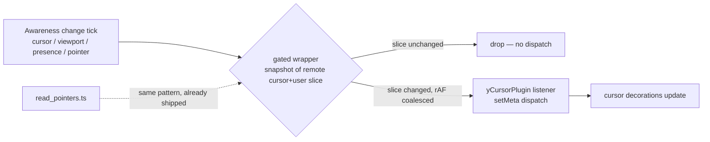

# fix: Instant-paint residuals — single boot, stable selections, full CI coverage

## Summary

PR #133 made the static preview pixel-identical to the editor (CLS 0, zero element movement). Three residual findings keep the document page from being fully "instant, in one go":

1. **The Inertia app boots twice on every dev/CI page load.** `entrypoints/inertia.tsx` executes as two module instances (the plain URL from the script tag, plus a `?t=<timestamp>` self-import injected by the react-refresh footer after the SSR warmup invalidates the module node). The second `createInertiaApp` → `hydrateRoot` throws React's "container already passed to createRoot" warning, doubles boot work, and forced every browser check to allowlist the noise.
2. **Comment/read-mode text selections are stomped under multi-tab awareness traffic.** y-prosemirror's `yCursorPlugin` dispatches a transaction on *every* awareness tick (any peer cursor/viewport/presence update); each dispatch re-imposes ProseMirror's state selection over an in-flight native drag. This is the documented open escalation from the 2026-07-01 dogfood report and the reason `script/browser_check.mjs` is excluded from CI.
3. **`script/browser_check.mjs` is excluded from the CI browser-check loop**, so the page's largest regression suite doesn't run on pushes.

Additionally, the PR #133 preview changes have never been built through the production Vite client + SSR bundles — verify that path before calling instant paint production-ready.

---

## Problem Frame

The user's goal is "instant paint, fast": one paint, no flicker, no jumping, and no wasted work at boot. The remaining waste/instability is not in the preview markup (fixed in PR #133) but in the boot path (double module execution) and in selection stability while collaborating (awareness-driven dispatch storms). Both are measured, reproducible, and app-fixable. CI must then cover the full check suite so these can't rot.

## Requirements

- R1. `entrypoints/inertia.tsx` executes once per page load; no "already been passed to createRoot" warning on fresh loads or reloads, dev or CI.
- R2. A comment-role (or read-mode) viewer's mouse-drag text selection survives while a second tab produces awareness traffic; the selection toolbar places reliably.
- R3. Remote collaborator carets (y-prosemirror cursor decorations) still render and update when peers move their cursors.
- R4. `script/browser_check.mjs` passes end-to-end and joins the CI `browser_checks` loop.
- R5. The `expectedBrowserNoise` allowlists for the createRoot warning are removed from check scripts so a regression fails checks again.
- R6. `bin/vite build` and the SSR bundle build succeed with the PR #133 preview changes; the production SSR render of a document page emits the new preview markup.

---

## Key Technical Decisions

- KTD1. **Fix the double boot at the source, not by guarding the symptom.** Exclude `entrypoints/inertia.tsx` from `@vitejs/plugin-react`'s refresh transform (the footer's timestamped self-import is what creates the second module instance). Vite core still compiles the TSX. Fallback if exclusion proves unreliable: reuse a root stored on the container (`root.render(tree)` on re-execution), which is React's own advice — but that leaves `createInertiaApp`'s router re-init in place, so it is the fallback, not the primary.
- KTD2. **Gate the cursor plugin's awareness events with a filtered wrapper, mirroring `read_pointers.ts`.** Milkdown's `CollabService.setAwareness()` feeds *only* `yCursorPlugin` (verified in `@milkdown/plugin-collab` source). Pass a wrapper object that delegates everything to the real `Awareness` but intercepts `on('change')`/`off('change')`, snapshot-gating on the cursor-relevant slice (remote `cursor` field + `user` name/color) and coalescing to one animation frame — the exact pattern that fixed the app's own read-pointer plugin (`b0e1295`). The app's other awareness consumers (presence bar, read pointers, viewport follow) keep the raw awareness.
- KTD3. **Re-enable `browser_check` in CI only after the comment leg passes locally**, and delete the createRoot entries from the `expectedBrowserNoise` allowlists in the same change so CI would catch either regression.
- KTD4. **Production build verification is a gate, not a code change.** Build the client and SSR bundles and render a document page through the SSR bundle path; fix forward only if something breaks.

## High-Level Technical Design

---

## Implementation Units

### U1. Single-execution Inertia boot

**Goal:** `inertia.tsx` runs once; the createRoot warning disappears at the root cause.

**Requirements:** R1, R5

**Dependencies:** none

**Files:**
- `vite.config.ts` (exclude the entrypoint from plugin-react's refresh transform)
- `app/frontend/entrypoints/inertia.tsx` (only if the fallback guard is needed)
- `script/rich_block_width_check.mjs`, `script/export_check.mjs`, `script/html_document_check.mjs`, and any other scripts with the createRoot allowlist entry

**Approach:** Configure `react({ exclude: ... })` for the entrypoint so no refresh footer (and no timestamped self-import) is emitted. Verify with a network trace that only one `inertia.tsx` request occurs and `setup` runs once. Then remove the `already been passed to createRoot()` allowlist lines. Keep the hydration-noise allowlist entries (documented automation artifact, distinct cause).

**Test scenarios:**
- Fresh load and reload of `/d/<slug>`: exactly one `inertia.tsx` module request; zero console errors.
- Page HMR still works: editing a page component hot-updates without a full reload (manual dev check).
- Check scripts fail if a createRoot warning re-appears (allowlist removed).

**Verification:** Playwright network + console trace on dev; `npm run check`; affected check scripts green.

### U2. Gated cursor awareness for y-prosemirror

**Goal:** Cursor decorations update only when the cursor slice changes, so awareness storms can't stomp native selections in non-editable modes.

**Requirements:** R2, R3

**Dependencies:** none

**Files:**
- `app/frontend/editor/cursor_awareness.ts` (new — gated wrapper)
- `app/frontend/editor/milkdown_editor.tsx` (pass wrapper to `service.setAwareness`)

**Approach:** Wrapper delegates all `Awareness` members; `on('change', f)` registers a gate that, per real change event, schedules one rAF, recomputes a snapshot string of remote states' `cursor` + `user` fields, and invokes the wrapped listeners only when it differs. `off` unmaps. Local-state writes (`setLocalStateField('cursor', …)` from `updateCursorInfo`) go straight through. Mirror `read_pointers.ts`'s snapshot-gate comments and destroy-safety.

**Test scenarios:**
- Two tabs on one document, tab B in comment mode: drag-selecting a paragraph in tab B places the selection toolbar while tab A moves its cursor/scrolls (this is `browser_check.mjs`'s comment-role leg).
- Remote caret still appears/moves in tab A when tab B's editable-mode cursor moves.
- No dispatch storm: with only presence/viewport ticks (no cursor change), the editor state version stays put.

**Verification:** `script/browser_check.mjs` passes locally, including the comment-role leg.

### U3. Restore full browser-check coverage in CI

**Goal:** The complete check suite (including `browser_check`) runs on every push/PR.

**Requirements:** R4

**Dependencies:** U1, U2

**Files:**
- `.github/workflows/ci.yml` (add `browser_check` to the loop, update the exclusion comment)

**Test scenarios:** Test expectation: none — CI config; verified by the PR's own CI run.

**Verification:** PR CI `browser_checks` job green with the expanded loop.

### U4. Production client + SSR bundle verification

**Goal:** Prove the instant-paint path builds and renders in production form.

**Requirements:** R6

**Dependencies:** U1 (build config change must be exercised)

**Files:** none expected; fix forward if the build or SSR render surfaces an issue.

**Approach:** Build the client and SSR bundles, then exercise the SSR bundle against a document page and confirm the response carries the new preview markup (sketch figure, mermaid loading figure, provenance attributes).

**Test scenarios:**
- Client build and SSR build complete without errors.
- SSR-rendered document HTML contains `.thinkroom-sketch` and `.mermaid-diagram` preview markup.

**Verification:** Build outputs exist; a served/SSR-rendered page shows the preview markup without JS.

---

## Scope Boundaries

**In scope:** the four units above.

**Deferred to follow-up work:**
- First-ever Mermaid render growth (before any snapshot has persisted a height hint) — by design of the hint system; converges after one render anywhere.
- "Hydration failed" console noise under instrumented/automation sessions — documented automation artifact (dogfood report, lesson 178); clean contexts show zero hydration errors.
- Editor time-to-interactive tuning (module preloading of the code-split show chunk) — separate performance track; first paint is already server-rendered.

## Risks

- Excluding the entrypoint from plugin-react could interact with the `@inertiajs/vite` SSR transform (both operate on the same file). Mitigation: verify dev SSR endpoint, dev client, and both production builds; fall back to the root-reuse guard if exclusion misbehaves.
- The awareness wrapper must not break y-prosemirror's local-cursor publication (`updateCursorInfo`), which uses the same object for reads/writes. Mitigation: delegate everything except `change`-listener registration; two-tab manual verification.
