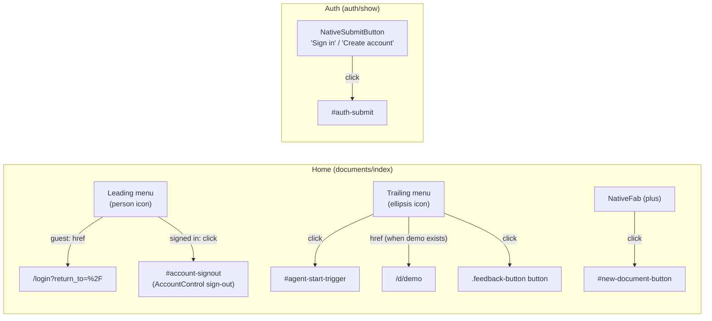

# Native Navigation Menus, FAB, and Native Login Polish - Plan

## Goal Capsule

Extend the Ruby Native iOS shell (landed in PR #132) with the navigation affordances the gem provides but Thinkroom does not yet use: a native dropdown menu on the top-left (leading) and top-right (trailing) of the home nav bar, a native floating action button (FAB) that creates a new document, and a more native login experience (nav-bar submit button, no pull-to-refresh on the form). All native chrome is signal-element based — hidden `data-native-*` divs rendered by `@ruby-native/react` components — and inert on the open web.

Authority: this plan; then `docs/plans/2026-07-02-004-feat-ruby-native-ios-app-plan.md` (the #132 decisions this extends); then the installed `ruby_native` 0.10.11 gem and `@ruby-native/react` 0.10.11 package sources, which are the authoritative signal-element contract.

Stop conditions: stop if the `@ruby-native/react` package lacks a component this plan names (it does not — verified against `node_modules/@ruby-native/react/index.js`); stop if making a menu item work requires changing web-visible behavior (native chrome must never alter the web UI).

---

## Product Contract

### Summary

The home page nav bar gains two native dropdown menus — leading (account: sign in / sign out) and trailing (actions: agent start, demo, feedback) — and a native FAB replaces the current nav-bar plus button for creating a document. The login page becomes more native: a nav-bar submit button, pull-to-refresh disabled so a half-filled form can't be accidentally wiped, and autofill-friendly field hints. The document page keeps its web header (a #132 decision this plan preserves).

### Problem Frame

PR #132 wired the shell but used only a fraction of the gem's navigation surface: one plus button on home, a bare navbar on auth. The FAB was explicitly deferred in that plan. Meanwhile the home page's real navigation (account control, agent start, demo, feedback) is web-only chrome that feels foreign inside the native app, and the login form still behaves like a web page (pull-to-refresh can discard input, submit lives only below the fold of the form).

### Requirements

**Home navigation**

- R1. In the native shell, the home nav bar shows a leading (top-left) dropdown menu with account actions: "Sign in" for guests (navigates to `/login?return_to=%2F`), "Sign out" for signed-in users (triggers the existing web sign-out).
- R2. In the native shell, the home nav bar shows a trailing (top-right) dropdown menu with: "Have an agent start one" (triggers the existing `#agent-start-trigger`), "Open the demo" (navigates to `/d/demo`, only when the demo document exists in the list), and "Send feedback" (triggers the existing feedback button).
- R3. A native FAB with a plus icon creates a new document by clicking the existing `#new-document-button`, reusing the exact web submission path. The previous nav-bar plus button is removed (the FAB replaces it, not duplicates it).

**Native login**

- R4. The auth nav bar shows a native submit button titled "Sign in" (or "Create account" when registering) that submits the credentials form via a click selector scoped to the form's own submit button — never the Google OAuth submit button that appears earlier in the DOM.
- R5. Pull-to-refresh is disabled on the auth page so a drag inside the form cannot reload and discard input.
- R6. The login email field carries `autoComplete="username"` so iOS credential autofill pairs it with the password field; the register flow keeps `name`/`email`/`new-password` hints.

**Invariants**

- R7. No web-visible behavior changes: all new chrome is hidden signal elements plus stable `id` attributes on existing web controls; the web UI renders and behaves identically outside the native shell.
- R8. `npm run check`, `bin/rubocop`, `bin/rails test`, and `script/native_shell_check.mjs` pass; the native shell check asserts every new signal element that renders in its unauthenticated session. The signed-in account-menu variant (`#account-signout`) and actual native rendering of menus/FAB are verified by a manual device pass (`bundle exec ruby_native preview`), not by the browser check.

### Scope Boundaries

Out of scope: web UI redesign; Android-specific icons beyond the gem's `icons:` fallback behavior; any server-side auth changes (native remember-me landed in #130/#132).

#### Deferred to Follow-Up Work

- Native navbar on the document page (native share sheet via `NativeShareButton`, native menu mirroring `HeaderMenu`). #132's KTD keeps the doc page's web header because mode control, presence, and Accept-all have no native-navbar equivalent; revisiting that is its own piece of work.
- Hiding the web submit button on auth inside the native shell (`native-hidden`). Kept visible this round so submission never depends on the shell rendering the nav-bar button.
- Push notifications, badges, IAP, App Store submission config — carried forward from #132's deferred list.

### Assumptions

Recorded because this plan was scoped headlessly (pipeline run):

- The FAB replaces the nav-bar plus button rather than coexisting with it — one affordance per action, per iOS convention.
- Menu contents are inferred from the existing home-page web chrome: leading = account, trailing = secondary actions. Nothing new is invented; every item maps to an existing web control or route.
- The document page keeps its web header, preserving #132's recorded decision.

---

## Planning Contract

### Key Technical Decisions

- **Use `NativeMenuItem` children inside `NativeButton` for dropdowns.** The gem contract (`ruby_native-0.10.11` helper + `@ruby-native/react` `index.js`) turns a `NativeButton` with children into a native dropdown menu. `href` items navigate; `click` items click a DOM selector. No new bridge code.
- **`NativeFab` with `click: '#new-document-button'`.** Same delegation pattern #132 established for the nav-bar plus: native affordances trigger the existing web control so there is exactly one submission path. The web button keeps its `nativeHaptic('impact')`.
- **Sign-out via click selector, sign-in via href.** Sign-out is a DELETE (Inertia `Link method="delete"` rendered as a button) — a menu `href` would issue a GET. Give the existing `AccountControl` sign-out button a stable `id` and use `click:`. Sign-in is a plain GET link, so `href` is correct.
- **Scope the auth submit selector.** `NativeSubmitButton`'s default `click` selector is `[type='submit']`, which on the auth page would match the Google OAuth form's submit button first. Give the credentials submit button `id="auth-submit"` and pass `click: '#auth-submit'` explicitly.
- **Stable selectors are the native-bridge contract with the web UI.** New ids (`#account-signout`, `#auth-submit`) join the existing `#new-document-button` / `#agent-start-trigger` as click targets; they are inert attributes on the web. The feedback trigger cannot take an id — `feedback_button.tsx` delegates to the third-party `RiffrecRecorder`, whose props accept only `className` (forwarded to a wrapper, not the inner button) — so the feedback menu item uses the scoped CSS selector `.feedback-button button` instead.
- **Type the new components in the local `.d.ts`.** `@ruby-native/react` ships untyped JS; `app/frontend/types/ruby_native.d.ts` deliberately types only the surface Thinkroom uses. Extend it with `NativeMenuItem`, `NativeFab`, and `NativeSubmitButton` (props exactly as implemented in the package's `index.js`).
- **Verification lives in the browser check, not Rails integration tests.** Signal elements are client-rendered React; server-side tests cannot see them. `script/native_shell_check.mjs` (already in CI's `browser_checks` job) is the contract test surface and gets assertions for every new element.

### High-Level Technical Design

Native affordance → web target mapping (all signal elements are hidden divs the shell reads; nothing renders visibly on the web):

### Execution direction

This is signal-element wiring with no server-side logic: verify smoke-first by running the app and the native shell check rather than writing unit tests first. The browser check proves the DOM signal contract (the elements the shell reads exist with the right attributes); it cannot prove native rendering — whether the shell actually draws a dropdown from `NativeMenuItem` children, or where the FAB floats. That is only observable on a device via `bundle exec ruby_native preview`, which is the required final pass before deploy (same limitation #132 recorded).

---

## Implementation Units

### U1. Home nav-bar dropdown menus

**Goal:** Leading account menu and trailing actions menu on the home page's native nav bar.

**Requirements:** R1, R2, R7.

**Dependencies:** none.

**Files:**
- `app/frontend/pages/documents/index.tsx` — add `NativeMenuItem` children under two new `NativeButton`s (leading + trailing) inside the existing `NativeNavbar`.
- `app/frontend/components/account_control.tsx` — stable `id="account-signout"` on the signed-in sign-out button (Inertia `Link method="delete" as="button"` forwards `id` onto the rendered button).
- `app/frontend/types/ruby_native.d.ts` — declare `NativeMenuItem`.

**Approach:** The leading button (icon `person.crop.circle`, `position: 'leading'`) renders one menu item chosen by the `viewer` prop already on the page: guest → "Sign in" with `href`, signed-in → "Sign out" with `click: '#account-signout'`. The trailing button (icon `ellipsis.circle`, default trailing position) carries "Have an agent start one" (`click: '#agent-start-trigger'`), "Open the demo" (`href: '/d/demo'`, rendered only under the same `recent.some(slug === 'demo')` condition the web link uses), and "Send feedback" (`click: '.feedback-button button'` — the RiffrecRecorder wrapper's inner trigger; rendered under the same `isClient` condition as the web button). Menu contents are static per page load — sign-in state is server-known at render, matching how the shell reads signal elements.

**Patterns to follow:** the existing `NativeNavbar`/`NativeButton` usage in `documents/index.tsx`; comment style from #132's "Ruby Native chrome" block.

**Test scenarios:** covered by U4's browser check (menus present with expected items and targets in native context; ids present but chrome absent in web context). Test expectation here: none beyond U4 — pure signal-element markup.

**Verification:** `npm run check` passes; U4 assertions pass.

### U2. Native FAB for new document

**Goal:** A floating action button creates a document; the nav-bar plus is removed.

**Requirements:** R3, R7.

**Dependencies:** none (parallel with U1; touches the same `NativeNavbar` block, so land after U1 to avoid churn).

**Files:**
- `app/frontend/pages/documents/index.tsx` — add `NativeFab icon="plus" click="#new-document-button"`; remove the `NativeButton icon="plus"` from the navbar.
- `app/frontend/types/ruby_native.d.ts` — declare `NativeFab` (note: it throws without an icon; type `icon`/`icons` accordingly).

**Approach:** direct swap; the FAB delegates to the same web button, so processing/disabled state and haptics stay in one place. Place `NativeFab` as a sibling of `NativeNavbar`, not nested inside it — it is its own signal element. Accepted in-flight behavior for this round: while a create is processing, the only feedback is the web hero button's "Creating…" state (which may be off-screen when tapping a bottom FAB); the disabled web button makes repeat taps no-ops.

**Test scenarios:** covered by U4 (FAB signal present with icon + click target in native context; exactly zero nav-bar plus buttons remain). Test expectation here: none beyond U4.

**Verification:** `npm run check` passes; U4 assertions pass.

### U3. Native login polish

**Goal:** Auth page submits from the native nav bar, can't be wiped by pull-to-refresh, and pairs with iOS credential autofill.

**Requirements:** R4, R5, R6, R7.

**Dependencies:** none.

**Files:**
- `app/frontend/pages/auth/show.tsx` — `id="auth-submit"` on the credentials submit button; `NativeSubmitButton` with mode-dependent title and `click: '#auth-submit'`; `pullToRefresh={false}` on the existing `NativeNavbar`; `autoComplete="username"` on the login-mode email input (register keeps `email`).
- `app/frontend/types/ruby_native.d.ts` — declare `NativeSubmitButton`.

**Approach:** the web submit button stays visible (see Scope Boundaries) — the native button is additive. The submit button's disabled state during `processing` still guards double-submit because the native button clicks the same DOM element.

**Test scenarios (via U4 plus one manual check):**
- Native context, `/login`: `data-native-submit-button` present with `data-native-title="Sign in"` and `data-native-click="#auth-submit"`; navbar signal carries `data-native-pull-to-refresh="false"`; email input has `autocomplete="username"`.
- Native context, `/signup`: submit title is "Create account"; email autocomplete remains `email`.
- Native context: the Google form's submit button does NOT carry `id="auth-submit"` (selector-scoping guard).
- Web context: no `data-native-submit-button` behavior change — element may exist but is hidden/inert; the visible form still submits.

**Verification:** `npm run check` passes; U4 assertions pass.

### U4. Extend the native shell contract check

**Goal:** `script/native_shell_check.mjs` proves every new signal element in native context and proves non-leakage in web context.

**Requirements:** R8 (and mechanically verifies R1–R7).

**Dependencies:** U1, U2, U3.

**Files:**
- `script/native_shell_check.mjs` — new assertions following the existing `check(locator.count(), msg)` style.

**Approach:** In the native context: home has a leading `data-native-button` containing `data-native-menu-item` children with the expected titles/targets, a trailing menu likewise, exactly one `data-native-fab` with `data-native-icon="plus"` and `data-native-click="#new-document-button"`, and zero nav-bar plus buttons; `/login` has the scoped native submit button and `data-native-pull-to-refresh="false"`. In the web (non-native UA) context: the page still renders the stable click targets (`#new-document-button`, `#agent-start-trigger`, `.feedback-button button`, `#auth-submit`, and `#account-signout` or the sign-in link) and no visible native chrome. Update the existing "native plus button targets #new-document-button" assertion, which U2 removes.

**Test scenarios:** the check IS the test; also update any assertion the removal in U2 breaks. Guest vs signed-in menu variants: assert the guest variant (the check runs unauthenticated); assert the signed-in variant only if the check already has a sign-in leg — do not build auth plumbing into the check for this.

**Verification:** `BASE_URL=http://localhost:3005 SLUG=demo node script/native_shell_check.mjs` green locally (run the app with `PORT=3005 bin/dev`; 3000/3001 are taken by other local apps); the CI `browser_checks` job stays green.

---

## Verification Contract

- `npm run check` — TypeScript, including the extended `ruby_native.d.ts`.
- `bin/rubocop` — no Ruby changes expected, but the gate runs regardless.
- `bin/rails test` — full Minitest suite (~600 runs); nothing here should change server behavior.
- `PORT=3005 bin/dev` + `BASE_URL=http://localhost:3005 SLUG=demo node script/native_shell_check.mjs` — the native contract check, extended in U4.
- CI (`.github/workflows/ci.yml` `browser_checks` job) runs `native_shell_check` and the rest of the browser suite on the PR.
- Manual device pass before deploy: `bundle exec ruby_native preview` — confirm the leading/trailing dropdowns actually render as native menus, the FAB floats without obscuring the footer or the "Show N more" control, the signed-in menu shows Sign out and it works, and the auth nav-bar submit button submits the credentials form.

## Definition of Done

- R1–R8 implemented and traced through U1–U4.
- All Verification Contract gates green locally and in CI.
- No web-visible diff: a non-native browser renders the same UI and behavior as `main`.
- No leftover experiments: the nav-bar plus button is gone (not commented out), and the `.d.ts` types match exactly what `@ruby-native/react@0.10.11` implements.
- PR merged to `main` after CI passes; production deploy via Kamal follows the merge (manual step, per `DEPLOYING.md`). The `ruby_native preview` device pass is the post-deploy acceptance check for the native-rendering behavior the browser check cannot see.
