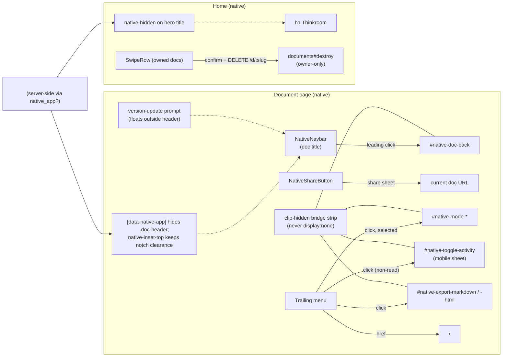

# Native Editor Menu, Native Home Chrome, and Swipe-to-Delete - Plan

## Goal Capsule

Deepen the Ruby Native iOS experience shipped in PR #132/#140: the document editor gets a native nav bar (title, back, native share sheet, dropdown menu) while its web header hides in the native shell; the home page drops the redundant "Thinkroom" hero title in native with correct top spacing; and owned document rows on home gain iOS-style swipe-to-delete in the native app. The web experience is untouched — forks are keyed on the server-known `nativeApp` prop and the gem's `[data-native-app] .native-hidden` CSS utility.

Authority: this plan; then `docs/plans/2026-07-02-009-feat-native-navigation-menus-fab-plan.md` and `docs/plans/2026-07-02-004-feat-ruby-native-ios-app-plan.md` (prior decisions this extends); then the installed `ruby_native` 0.10.11 gem and `@ruby-native/react` 0.10.11 sources (authoritative signal-element contract).

Stop conditions: stop if hiding the web doc header in native would remove a control that has no native-menu, mobile-dock, or bridge-button replacement for a workflow the app depends on (enumerate before hiding); stop if the swipe interaction cannot be made native-only without touching web behavior.

---

## Product Contract

### Summary

In the native app, the document editor shows a native nav bar — document title, back chevron, a native share-sheet button, and a trailing dropdown (editor modes with checkmarks, focus mode, activity panel, Home) — and the web `doc-header` is hidden via CSS while staying in the DOM as the click-target layer. The home page hides the "Thinkroom" hero title (the nav bar already carries the name) and keeps safe-area spacing below the native bar. Owned documents in the home list can be swipe-revealed and deleted in the native app, with a confirmation dialog, using the existing owner-only `DELETE /d/:slug` endpoint.

### Problem Frame

PR #140 made home and auth feel native, but the editor — where users spend their time — still shows the full web header inside the native shell, duplicating chrome the nav bar should own. The home page reads "Thinkroom" twice (native nav bar + hero H1). And the document list has no touch-native affordances: deleting from the list isn't possible — the owner-only endpoint exists and is already exposed on the document page (`ownership_chip.tsx`, confirm + `router.delete`), but the home list offers no delete at all. The user asked for swipe gestures via "Silk"; that library is not installed (see Assumptions).

### Requirements

**Document editor (native)**

- R1. In the native shell, the document page shows a native nav bar: document title, a leading back button (delegating to the existing shell-back control), a native share button (platform share sheet for the document URL), and a trailing dropdown menu.
- R2. The trailing menu contains: the editor modes available to the viewer (Read / Suggest / Comment / Edit) with the active one marked selected (omitted entirely on mode-locked docs like the demo), "Activity" (non-read modes only, opening the mobile activity sheet), "Export Markdown", "Export HTML", and "Home". Menu items delegate to an always-mounted bridge-control strip. No "Focus mode" item — focus is already force-enabled at phone width, so the toggle would be inert in the shell.
- R3. In the native shell, the web `doc-header` is hidden via CSS; suggestion/comment workflows remain available through the existing mobile dock. On the web, the header renders exactly as today. The hide honors the control inventory below (R3a) — every header control is re-homed, explicitly deferred, or an accepted loss; nothing disappears silently.
- R3a. **Doc-header control inventory** (the Goal Capsule stop condition's enumeration):
  - Re-homed to native chrome: document title (nav bar), back (leading button -> bridge), share URL (native share sheet), editor modes (menu -> bridge), activity sheet (menu -> bridge, non-read), export Markdown/HTML (menu -> bridge to the existing `exportMarkdown`/`exportHtml` handlers), Home (menu `href`).
  - Re-homed outside the header: the "New version — Update" prompt is load-bearing (it is the only trigger for reloading an owner-reset or newly deployed document); in native it renders as a small floating control outside the hidden header, reusing the same handler.
  - Accepted native losses this round (recorded, deferred): presence bar + follow, identity chip (guest rename), connection-status dot, provenance summary, owner link-access control, print, copy-agent-invite. Owners and collaborators retain all of these on the web.

**Home page (native)**

- R4. In the native shell, the "Thinkroom" hero title is hidden (the native nav bar already names the app); the page keeps correct top spacing below the native bar using the gem's safe-area utilities. The hero action buttons stay visible.
- R5. The hiding is CSS-based via the gem's `.native-hidden` utility, enabled by rendering `data-native-app` on the `<html>` element server-side (`native_app?` helper), so the fork is SSR-correct with no flash on either surface.

**Swipe-to-delete (native)**

- R6. In the native app, rows in "Your documents" (owned docs only) support iOS-style swipe: dragging left reveals a red Delete action; tapping it asks for confirmation, then issues the existing `DELETE /d/:slug`. The action shows a pending state while in flight; on failure the row re-closes and an error is surfaced (the document stays listed); only a confirmed success removes the row.
- R7. Swipe affordances do not exist on the open web and never appear for non-owned rows; the server's owner-only authorization remains the enforcement point.
- R8. Delete carries haptic feedback in the shell, and the interaction does not break normal tap/scroll on the list. Row titles are Inertia links: once horizontal movement passes the slop threshold, the trailing click on the link is suppressed (no accidental navigation), and tapping an open row closes it instead of navigating.

**Invariants**

- R9. Zero web-visible changes: a non-native browser renders and behaves identically to `main`.
- R10. `npm run check`, `bin/rubocop`, `bin/rails test`, and `script/native_shell_check.mjs` pass; the shell check asserts each new signal element and the native-hidden forks in both native and web contexts. Native rendering (menus drawing, share sheet, swipe feel) is verified by the `bundle exec ruby_native preview` device pass.

### Scope Boundaries

Out of scope: Advanced Mode (native push/pop transitions); swipe actions other than delete (archive, tag); web-side delete affordances; deleting from the document page itself; changes to the destroy endpoint.

#### Deferred to Follow-Up Work

- Swipe actions on the "Recent" list (non-owned docs have no deletable action; a "remove from recents" action would need a new endpoint).
- Live-updating the native nav-bar title when the document is renamed mid-session, and the editor-mode checkmark when the mode switches without a page load (both depend on the shell's signal re-read cadence, unverifiable locally — check on-device, then decide).
- Native surfaces for the accepted R3a losses: presence/follow, guest rename, connection status, owner link-access, print, copy-agent-invite.
- Undo after delete.

### Assumptions

Recorded because this plan was scoped headlessly (pipeline run):

- **Silk is not installed.** The user believed a swipe library ("Silk") was already in the project; `package.json` has no such dependency. The npm `@silk-hq/components` is proprietary-licensed ("SEE LICENSE FILE") and centers on sheet/dialog primitives, not list-row swipe. The plan implements a small dependency-free pointer-event swipe row instead. If the user prefers Silk, swapping the row internals later is contained to one component.
- Delete confirms via `window.confirm` — WKWebView presents JS confirm as a native alert dialog, which is the cheapest native-feeling guard for a destructive action.
- The hero action buttons ("New document", "Have an agent start one") stay visible in native; only the title hides. The user named the title specifically.
- Editor-mode menu items may show a stale checkmark after switching modes without a page load (the shell's re-read cadence for signal elements is not locally verifiable); switching itself always works because items click live bridge buttons.

---

## Planning Contract

### Key Technical Decisions

- **Set `data-native-app` on `<html>` server-side.** The gem ships `[data-native-app] .native-hidden { display:none !important }` but nothing in the app or gem sets the attribute today. `native_app?` is exposed as a view helper (`RubyNative::NativeDetection`), so the layout can render the attribute on first paint — SSR-correct, no flash, and it unlocks the gem's own utility plus any custom `[data-native-app]` CSS. Harmless if the shell also sets it.
- **All native click targets live in one clip-hidden bridge strip — never inside the hidden header.** The shell's click dispatch against `display:none` targets is not locally verifiable (it may synthesize coordinate-based events rather than `HTMLElement.click()`). So the doc page renders one always-mounted strip, visually hidden by clipping (`position:absolute; width/height:1px; clip-path`, never `display:none` or the `hidden` attribute), containing every control the native chrome clicks: `#native-doc-back` (posts the shell back message), `#native-mode-read|suggest|comment|edit` (call `changeMode`), `#native-toggle-activity` (opens the **mobile activity sheet** via `setActiveSheet('activity')` — NOT `setPanelOpen`, whose desktop rail never renders at phone width), `#native-export-markdown`, `#native-export-html` (the existing handlers). `aria-hidden` + `tabIndex={-1}` keep it invisible to web users and screen readers. The `doc-header` itself can then hide by any mechanism with zero native dependencies on it.
- **Native share via `NativeShareButton`.** The share sheet needs no URL argument — it defaults to the current page. It replaces only URL sharing; export/print/agent-invite are handled per the R3a inventory, not by the share sheet.
- **The version-update prompt escapes the hidden header.** When native and a new version is available, render the update control outside `doc-header` (floating, reusing the same handler) so stale native clients can always reload — this is the one header control whose loss would strand users (it is the sole `onVersionAvailable` trigger).
- **Custom swipe row, no new dependency.** A `SwipeRow` component wrapping owned rows: pointer events translate the row horizontally, past a threshold it snaps open to reveal a Delete button; vertical movement cancels (scroll wins); only one row open at a time; `router.delete('/d/'+slug)` on confirm. Rendered only when `nativeApp` (server-known prop), so the web DOM is unchanged.
- **Haptics per #132's declarative pattern** — `nativeHaptic('warning')` data attribute on the Delete button; no imperative bridge calls.

### High-Level Technical Design

### Execution direction

Same as #140: signal-element and CSS wiring verified smoke-first through the extended `script/native_shell_check.mjs` (write assertions, observe red, implement, observe green). The swipe row is the one piece with real client logic — exercise it in the browser check with synthesized pointer events for the reveal, and verify the delete round-trip once (creating a throwaway doc in the check session). Native feel (gesture physics, share sheet, menus) is on-device only.

---

## Implementation Units

### U1. Native-app CSS foundation and home chrome

**Goal:** `data-native-app` rendered server-side; home hero title hidden in native with correct top spacing.

**Requirements:** R4, R5, R9.

**Dependencies:** none.

**Files:**
- `app/views/layouts/application.html.erb` — `data-native-app` attribute on `<html>` when `native_app?`.
- `app/frontend/pages/documents/index.tsx` — `native-hidden` class on the hero wordmark heading; safe-area/top-spacing class on the landing container for native.
- `app/frontend/entrypoints/application.css` — any `[data-native-app]` spacing rule the landing needs beyond the gem's `native-inset-top`.

**Approach:** the layout change is one ERB conditional attribute. Hide only the `h1.landing-wordmark`; the tagline under it is small — hide it too only if it reads orphaned without the title (implementer judgment, note the choice). Top spacing: prefer the gem's `native-inset-top` utility over hand-rolled padding.

**Patterns to follow:** #132's layout comments style; the gem stylesheet's utility classes.

**Test scenarios:** via U4 — native context: `html[data-native-app]` present, wordmark not visible, landing top padding ≥ safe-area variable when set; web context: no `data-native-app` attribute, wordmark visible.

**Verification:** U4 assertions; `npm run check`.

### U2. Document editor native nav bar, menu, and hidden web header

**Goal:** Native chrome owns the doc page top in the shell; web header hides but keeps serving as the click-target layer.

**Requirements:** R1, R2, R3, R9.

**Dependencies:** U1 (needs `data-native-app` for the CSS hide).

**Files:**
- `app/frontend/pages/documents/show.tsx` — `NativeNavbar` (doc title) with leading back `NativeButton`, `NativeShareButton`, trailing menu of `NativeMenuItem`s; the clip-hidden bridge strip (back, modes, activity, exports); the native-floating version-update control; `native-hidden` on the `doc-header`.
- `app/frontend/pages/documents/show.css` (or the page's existing style home) — bridge-strip clip styling; `native-inset-top` (or equivalent) on the doc body so content clears the notch/nav bar once the header — today the page's only safe-area inset carrier (`.doc-header` padding-top rule in `application.css`) — is hidden.
- `app/frontend/types/ruby_native.d.ts` — declare `NativeShareButton` (props per `@ruby-native/react` `index.js`).

**Approach:** menu items per R2 — modes filtered by `availableModes` with `selected` on the current mode and omitted on mode-locked docs; "Activity" only in non-read modes, wired to the mobile sheet; exports; Home (`href: '/'`). Bridge handlers call the live setters/handlers directly (`changeMode`, `setActiveSheet`, `exportMarkdown`, `exportHtml`) — no duplicated logic. Keep `pullToRefresh` default on the doc page. The document title feeding the navbar is the same prop the web header shows; a mid-session rename may leave the native bar stale until reload (recorded in Deferred).

**Patterns to follow:** the home-page `NativeNavbar` block from #140; the shell-back `postMessage` from #132.

**Test scenarios:** via U4 — native context on `/d/demo` (structural): navbar signal with the doc title, leading button targeting `#native-doc-back`, share signal (`data-native-share`), no mode menu items (demo is mode-locked), export/home items, doc-header not visible, doc body top inset ≥ the shell safe-area variable when set, bridge strip present and clip-hidden (not `display:none`); native context on the throwaway doc U3 creates (behavioral): mode menu items present with exactly one `data-native-selected`, clicking `#native-mode-read` via JS switches the mode control's state (the demo doc is mode-locked, so this assertion must not target it); web context: doc-header visible, bridge strip not visible, page renders as on `main`.

**Verification:** U4 assertions; `npm run check`.

### U3. Swipe-to-delete on owned home rows

**Goal:** iOS-style swipe-reveal-delete for owned documents in the native app.

**Requirements:** R6, R7, R8, R9.

**Dependencies:** U1 (uses the `nativeApp` fork conventions).

**Files:**
- `app/frontend/components/swipe_row.tsx` — new; pointer-event swipe container (translate, threshold snap, scroll-cancel, single-open, reveal slot).
- `app/frontend/pages/documents/index.tsx` — wrap owned (`yours`) rows in `SwipeRow` when `nativeApp`; Delete action → `window.confirm` → `router.delete('/d/'+slug, { preserveScroll: true })`.
- `app/frontend/entrypoints/application.css` — swipe-row styles (rendered only in native, but plain classes are fine since the component itself is native-gated).

**Approach:** pointer events (`pointerdown/move/up` + `setPointerCapture`); horizontal intent detected after a small slop; vertical movement cancels so scrolling wins; open state max-translate reveals a fixed-width Delete button with `nativeHaptic('warning')`; tapping elsewhere closes. Row titles are Inertia `Link`s: once the slop threshold is crossed, suppress the trailing click (capture-phase) so releasing a swipe never navigates; a tap on an already-open row closes it without navigating. Delete flow: confirm -> pending state on the button -> `router.delete` (the controller 303-redirects to root, which Inertia follows, refreshing the list) -> on error, snap the row closed and surface the existing inline error pattern; the row is removed only by the refreshed props. The existing owner delete affordance in `ownership_chip.tsx` (confirm + `router.delete` on the same endpoint) is the client pattern to mirror. No full-swipe-commits-delete this round — reveal + confirm only. Non-owned recent rows and all web rows render exactly as today.

**Test scenarios:** via U4 — native context: owned row wrapped with the swipe container attribute/class, Delete button present with haptic data and correct target slug; synthesized pointer sequence reveals the button (element gains the open state); swipe-then-release does not navigate to the document (URL unchanged); delete round-trip: create a doc in the check session, swipe-reveal, accept the dialog (`page.on('dialog')`), assert the row disappears and `GET /d/:slug` no longer 200s; web context: no swipe container in DOM.
- Edge: vertical drag on a row does not open it (list scrolls).
- Edge: opening a second row closes the first.

**Verification:** U4 assertions; `npm run check`.

### U4. Extend the native shell contract check

**Goal:** Every new signal element, CSS fork, and the swipe round-trip proven in the browser check.

**Requirements:** R10 (mechanically verifies R1–R9).

**Dependencies:** U1, U2, U3.

**Files:**
- `script/native_shell_check.mjs` — assertions per the unit scenarios above, following the existing `check()` style; the delete round-trip uses a doc created inside the check (never the demo doc).

**Approach:** native context gains doc-page chrome assertions and the swipe scenario; web context gains non-leak assertions (`data-native-app` absent, doc-header visible, no swipe container, wordmark visible). Keep the existing 32 assertions green — except the "header padding-top honors the shell safe-area variable" assertion, which after U2 would measure a `display:none` element; repoint it at the doc body's new inset (the thing that actually clears the notch now). Flake guard: if synthesized pointer sequences prove unreliable in headless CI, keep the structural assertions and drive the row's open state through a programmatic path (e.g. dispatching the component's own handlers via evaluate) rather than deleting the scenario or retrying blind — record which path the check uses.

**Test scenarios:** the check is the test; keep runtime reasonable (one extra doc create + delete).

**Verification:** `BASE_URL=http://localhost:3005 SLUG=demo node script/native_shell_check.mjs` green locally (`PORT=3005 bin/dev`; 3000/3001 are taken); CI `browser_checks` green.

---

## Verification Contract

- `npm run check` — TypeScript including the extended `ruby_native.d.ts`.
- `bin/rubocop` — the layout ERB change is the only Ruby-adjacent edit; gate runs regardless.
- `bin/rails test` — full suite; destroy behavior is already covered server-side, nothing server-side changes.
- `PORT=3005 bin/dev` + `BASE_URL=http://localhost:3005 SLUG=demo node script/native_shell_check.mjs` — extended in U4.
- CI `browser_checks` job on the PR.
- Manual device pass before/after deploy: `bundle exec ruby_native preview` — **first**: a nav-bar menu item tap actually fires its clip-hidden bridge target (the shell's click-dispatch mechanism is the assumption everything rests on), and `window.confirm` presents a native alert whose acceptance completes the delete round-trip (a WKWebView without a confirm-panel delegate silently returns false). Then: doc-page nav bar renders with working back/share/menu, mode switching works from the menu, content clears the notch with the header hidden, the version-update control appears and reloads when a new version broadcasts, home shows no double title and correct spacing, swipe reveal feels right, delete removes the doc, scroll is not hijacked.

## Definition of Done

- R1–R10 implemented and traced through U1–U4.
- All Verification Contract gates green locally and in CI.
- No web-visible diff anywhere: web context assertions in the shell check plus a manual browser pass on `/` and `/d/demo`.
- No leftover experiments; the bridge-button strip exists only on the doc page and only the controls the menu needs.
- PR merged to `main` after CI passes; Kamal deploy follows; the device pass is the post-deploy acceptance check.
