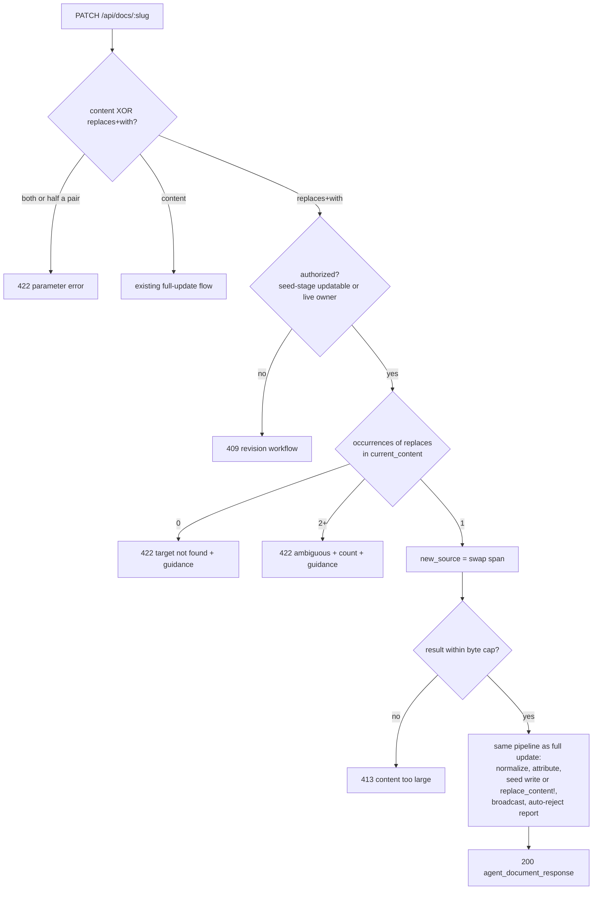

# feat: CLI targeted text replacement that applies directly for owners

## Summary

`thinkroom update` (issues #112/#116) lets a caller who owns a document push a full replacement directly, but full replace is the only direct-apply option. `thinkroom suggest --replaces` targets an exact span but always creates a pending suggestion that a human must accept in the browser — even when the caller owns the document. For long agent-editing sessions, most edits are small targeted changes inside a large document; each currently requires re-sending the entire file.

This plan extends `thinkroom update` with find/replace targeting:

```
thinkroom update SLUG --replaces "exact old text" --with "new text" --agent NAME
```

The server computes the new source from the document's canonical source and applies it through the exact same authorization gates and state machinery as a full owner update. It also updates the skill, CLI help, README, and agent guide so targeted replacement is documented as the **preferred** owner edit, with full replace reserved for genuine rewrites.

Shape decision: the issue offered two shapes (extend `update`, or add `suggest --apply`). This plan extends `update` because `update` already owns the direct-apply authorization gate; adding an `--apply` bypass to `suggest` would create a second ownership-bypass surface and blur the "suggest = propose, update = act" verb split the CLI teaches.

---

## Problem Frame

The ownership principle established by #112/#116: owning a document is enough to act directly, not propose-and-wait-for-yourself-to-accept. That principle currently only covers whole-document replacement. Targeted replacement exists only as a pending suggestion whose application logic lives entirely client-side (`app/frontend/editor/suggestions.ts` — ProseMirror/Milkdown matching, applied by the accepting browser). There is no server-side apply path for a targeted edit.

The gap: owner + precise `--replaces` target should equal apply-now, with no full-file resend and no pending-suggestion detour.

---

## Requirements

- R1. `PATCH /api/docs/:slug` accepts `replaces` + `with` parameters as an alternative to `content`; the server computes the new source by replacing the unique occurrence of `replaces` in the document's canonical source (`current_content`) with `with`.
- R2. Targeted replacement uses exactly the same authorization as full-content update: seed-stage in-place update for unclaimed drafts or the account owner, live replacement (`replace_content!`) only for the authenticated account owner. Non-owners on claimed/live docs still get the 409 suggestion workflow.
- R3. A `replaces` value not found in the canonical source returns 422 with actionable guidance (fetch state, quote the source verbatim); a `replaces` value occurring more than once returns 422 with the occurrence count and guidance to include more surrounding context. Neither modifies the document.
- R4. Parameter validation: `content` and `replaces` are mutually exclusive (422); `replaces` requires `with` and vice versa (422); blank `replaces` is invalid (422); an empty-string `with` is valid and deletes the target text.
- R5. The computed source flows through the existing update pipeline unchanged: format immutability, byte cap on the resulting document, normalization signal, agent seed attribution, activity log, `content_reset` broadcast, and `auto_rejected_suggestions` reporting on live replacement.
- R6. `thinkroom update` gains `--replaces TEXT --with TEXT` flags, refuses to combine them with file/stdin content, and does not read stdin when targeting flags are present.
- R7. The skill (`cli/skill/thinkroom/SKILL.md`), CLI help text, `cli/README.md`, and `AgentGuide` (endpoints, notes, plain-text guide) all document targeted replacement as the preferred way to edit an owned document; full replace is positioned as the fallback for wholesale rewrites only.
- R8. CLI version bumps to 0.2.0 (new user-facing capability).

---

## Key Technical Decisions

- **KTD-1 — Match against the canonical source, not rendered plain text.** `thinkroom show` prints `current_content` (raw source, including any provenance-span markup); an agent quoting from what it just read gets an exact match. Suggestion `replaces` canonically matches `plain_text` because a human's browser applies it with ProseMirror-aware matching — that machinery does not exist server-side and porting it (KTD-4) is out of scope. Verbatim-source matching is simpler, deterministic, and the same mental model as `str_replace`-style editing tools agents already use.
- **KTD-2 — Require a unique exact match; refuse otherwise.** Zero or multiple occurrences are 422 errors, mirroring the suggestion contract's "a missing or ambiguous replaces target changes nothing" and the client matcher's `missing`/`ambiguous` outcomes. Never guess.
- **KTD-3 — Reuse the whole existing update path after computing the new source.** Server-side the operation is: `new_source = current_content with one substring swapped`, then exactly the code path a full-content PATCH takes (seed-stage assignment or `replace_content!` with CRDT reset, generation bump, archives, auto-reject, broadcast). No new state transition, no new authorization predicate, no partial/CRDT patching.
- **KTD-4 — No server-side port of the client suggestion matcher.** `matchQuotedText`'s markdown/HTML-parsing fallbacks exist to survive humans editing around a pending suggestion. The owner-direct path reads then immediately writes, so verbatim matching is sufficient; a Ruby port would be high-risk duplication.
- **KTD-5 — Extend `update`, not `suggest --apply`.** One verb keeps one authorization story. The 409 conflict payload and revision workflow already route non-owners to `suggest`; owner tooling routes to `update`.
- **KTD-6 — Accept the same read-modify-write race the full update already has.** The caller reads state, then PATCHes; a concurrent editor change between read and write can be clobbered by full replace today. Targeted replace is strictly narrower (only the matched span plus the whole-doc reset semantics on live docs), and the unique-match requirement acts as a weak precondition: if the target text changed, the request fails 422 instead of applying against unexpected content.

---

## High-Level Technical Design



Authorization is evaluated before matching so a non-owner probing a claimed document learns nothing about its content from 422-vs-409 differences.

---

## Implementation Units

### U1. Server: targeted replacement on `PATCH /api/docs/:slug`

**Goal:** The API computes and applies a targeted source replacement for callers who may update the document, with strict validation.

**Requirements:** R1, R2, R3, R4, R5

**Dependencies:** none

**Files:**
- `app/controllers/api/docs_controller.rb`
- `test/integration/agent_api_test.rb`

**Approach:** In `update`, detect the targeted-replace parameter shape before the existing content handling. Validate mutual exclusion and pairing (R4) first — parameter-shape errors should not depend on document state. Keep the existing authorization gate (`live_owner_replacement || (seed_stage? && updatable_in_place?)`) evaluated before target matching. Count occurrences of `replaces` in `document.current_content` with plain string scanning; on exactly one, build the new source and assign it to the same local the full-content path uses, so everything downstream (`normalized_source_and_signal`, `agent_seed_attribution`, seed-stage write vs `replace_content!`, `reject_oversized_content` on the computed result, `content_reset` broadcast, `auto_rejected_suggestions`) is shared, not duplicated. Error payloads follow the existing teaching style: `error` plus a next-action hint pointing at `GET /api/docs/:slug` and quoting the source `content` field verbatim.

**Patterns to follow:** the existing branch structure in `Api::DocsController#update`; error-shape conventions in `render_update_conflict` and `reject_oversized_content`.

**Test scenarios:**
- Anonymous agent targeted-replaces text in an unclaimed seed-stage document → 200, seed updated, activity logged, slug/share URL stable.
- Authenticated owner targeted-replaces text in a live document (`yjs_state` + `content_snapshot` present) → 200, `content_reset` broadcast, CRDT/snapshot reset, `current_content` shows the swap with the rest of the document byte-identical, `auto_rejected_suggestions` reported.
- Owner targeted replace whose removed text was targeted by someone else's pending suggestion → that suggestion auto-rejects and the count reflects it.
- `replaces` not present in source → 422, document untouched, error names the problem and points at fetching state.
- `replaces` occurring twice → 422 with occurrence count, document untouched.
- `content` and `replaces` together → 422; `replaces` without `with` → 422; `with` without `replaces` → 422; blank `replaces` → 422.
- Empty-string `with` deletes the matched text → 200.
- Replacement that would push the document over `MAX_CONTENT_BYTES` → 413, document untouched.
- Non-owner (anonymous or other account's Bearer token) targeted replace on a claimed/live document → 409 with the existing revision workflow, document untouched.
- Targeted replace combined with `title` updates both.
- HTML-format document: replacement result is re-sanitized and the normalization signal reports changes.

**Verification:** `bin/rails test test/integration/agent_api_test.rb` passes with the new scenarios; existing update tests unchanged.

### U2. CLI: `update --replaces/--with` flags

**Goal:** `thinkroom update SLUG --replaces TEXT --with TEXT` sends the targeted PATCH without reading a file or stdin.

**Requirements:** R6, R8

**Dependencies:** U1

**Files:**
- `cli/bin/thinkroom.js`
- `cli/package.json`
- `cli/test/thinkroom.test.js`

**Approach:** In `updateDocument`, when `--replaces` or `--with` is present: require both, refuse a file argument/stdin content in the same invocation, skip `readContent`, and send `{ replaces, with }` (plus optional `title`) in the PATCH body. Keep the existing output contract (share URL on stdout, `auto_rejected_suggestions` warning on stderr in default mode). Update `help()` usage lines. Bump `VERSION` and `package.json` to 0.2.0.

**Patterns to follow:** existing flag handling in `updateDocument`/`suggest`; the `parseArgs` value-flag convention (no parser change needed — `--with ""` already parses).

**Test scenarios:**
- `update slug --replaces "Old" --with "New" --agent Codex` → PATCH body `{ replaces: 'Old', with: 'New' }`, no stdin read, share URL printed.
- Targeted update whose response carries `auto_rejected_suggestions > 0` warns on stderr (same contract as full replace).
- `--replaces` without `--with` (and vice versa) → exit 1 with a message naming both flags, no request sent.
- `--replaces` combined with a file argument or piped stdin → exit 1, no request sent.
- Server 422 (missing/ambiguous target) surfaces the API error and hint on stderr with exit 1.
- Version output reflects 0.2.0 (existing version test updated).

**Verification:** `npm --prefix cli test` passes.

### U3. Guidance: make targeted replacement the preferred owner edit

**Goal:** Every surface that teaches agents how to edit — skill, CLI help/README, agent guide JSON and plain-text — presents `update --replaces/--with` as the default for owned documents, full replace as the fallback for wholesale rewrites, and `suggest` for non-owners.

**Requirements:** R7

**Dependencies:** U1, U2

**Files:**
- `cli/skill/thinkroom/SKILL.md`
- `cli/README.md`
- `cli/bin/thinkroom.js` (help text — covered by U2, listed for traceability)
- `app/services/agent_guide.rb`
- `test/integration/agent_api_test.rb` (guide copy assertions, if any exist for update_document)

**Approach:** SKILL.md's "Work with an existing document" section reorders to: (1) read state, (2) **preferred:** targeted `update --replaces/--with` for owned documents — small precise edits, no full resend, less accidental-diff risk; (3) full-file `update` only when rewriting most of the document; (4) `suggest` when you do not own it. State explicitly that `--replaces` must quote the canonical `content` source verbatim and match exactly once. `AgentGuide.endpoints[:update_document]` documents the `replaces`/`with` body fields, their unique-verbatim-match contract, and the preference ordering; the "Updating:" note and the plain-text "Revise a document you created" section gain the targeted example ahead of the full-replace example.

**Patterns to follow:** existing SKILL.md voice (imperative, short rationale per rule); `AgentGuide` field-description style.

**Test scenarios:**
- Guide JSON (`api.update_document.body`) includes `replaces` and `with` descriptions (assert in the existing agent API state test if guide copy is asserted there).
- Plain-text guide mentions the targeted form. Test expectation otherwise: none — remaining changes are documentation copy verified by reading.

**Verification:** Skill/README/help render correctly; `bin/rails test` still green.

---

## Scope Boundaries

- No `suggest --apply` flag — one direct-apply verb (`update`), per KTD-5.
- No server-side port of the client ProseMirror matcher; no plain-text-to-source mapping. Matching is verbatim source substring only.
- No multi-target or regex replacement; exactly one `--replaces/--with` pair per invocation. Multiple edits are multiple invocations.
- No change to suggestion semantics for non-owners; the pending-review workflow is untouched.
- No CRDT-level partial patching: a live-document targeted replace still resets the CRDT via `replace_content!`, same as a full owner replacement. (Deferred as a possible future optimization; the reset semantics are already the accepted owner-replacement contract from #116.)

### Deferred to Follow-Up Work

- Incremental CRDT patching so a targeted owner edit doesn't reset live editor sessions.
- `--replaces-all` or occurrence-index selection for intentionally repeated text.

---

## System-Wide Impact

This extends an external HTTP API contract (`PATCH /api/docs/:slug`) and the published CLI/skill. The parameter shape is additive — existing full-content callers are unaffected. The live-replacement blast radius (CRDT reset, stale-tab frame rejection via `content_generation`, auto-rejected suggestions) is identical to the already-shipped owner full replace; the only new server logic is parameter validation and substring matching.

---

## Risks & Dependencies

- **Provenance-span markup in `current_content`:** on live markdown docs the source may embed `<span data-provenance …>` marks; an agent quoting from `plain_markdown` instead of `content` will get a 422 miss. Mitigation: skill/guide copy explicitly says quote `content` verbatim, and the not-found error hint repeats it.
- **Doc-shape drift between read and write:** covered by KTD-6 — unique-match acts as a precondition and a changed target fails closed (422).
- **Guide copy drift:** U3 exists precisely because #112/#116 flagged documentation drift as a recurring risk; all four surfaces change in one unit.

---

## Sources & Research

- PR/issue context: "CLI: targeted text replacement that applies directly for owners" (this branch's PR body); prior art issues #112, #116.
- Prior plans: `docs/plans/2026-06-27-002-fix-cli-owner-update-claimed-docs-plan.md`, `docs/plans/2026-06-28-001-fix-owner-live-cli-replacement-plan.md`, `docs/plans/2026-06-30-001-fix-cli-replacement-stale-crdt-race-plan.md`.
- Update path and ownership gates: `app/controllers/api/docs_controller.rb`, `app/models/document.rb` (`replace_content!`, `seed_stage?`, `owned_by?`).
- Suggestion targeting contract: `app/models/suggestion.rb`, `app/services/agent_guide.rb`, `app/frontend/editor/suggestions.ts` (client matcher — deliberately not ported).
- CLI + tests: `cli/bin/thinkroom.js`, `cli/test/thinkroom.test.js`; API tests: `test/integration/agent_api_test.rb`.
