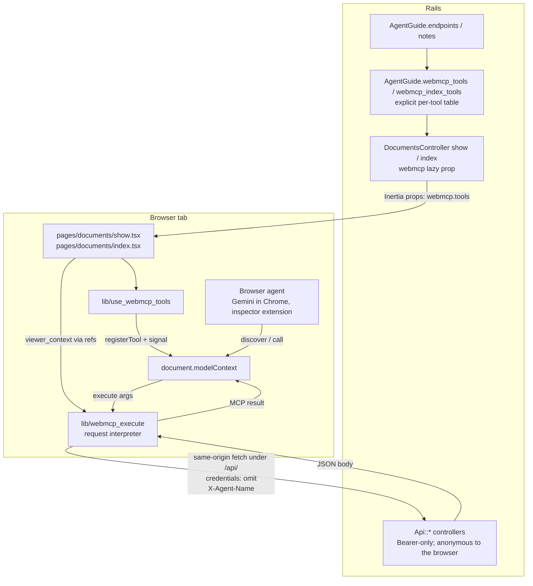
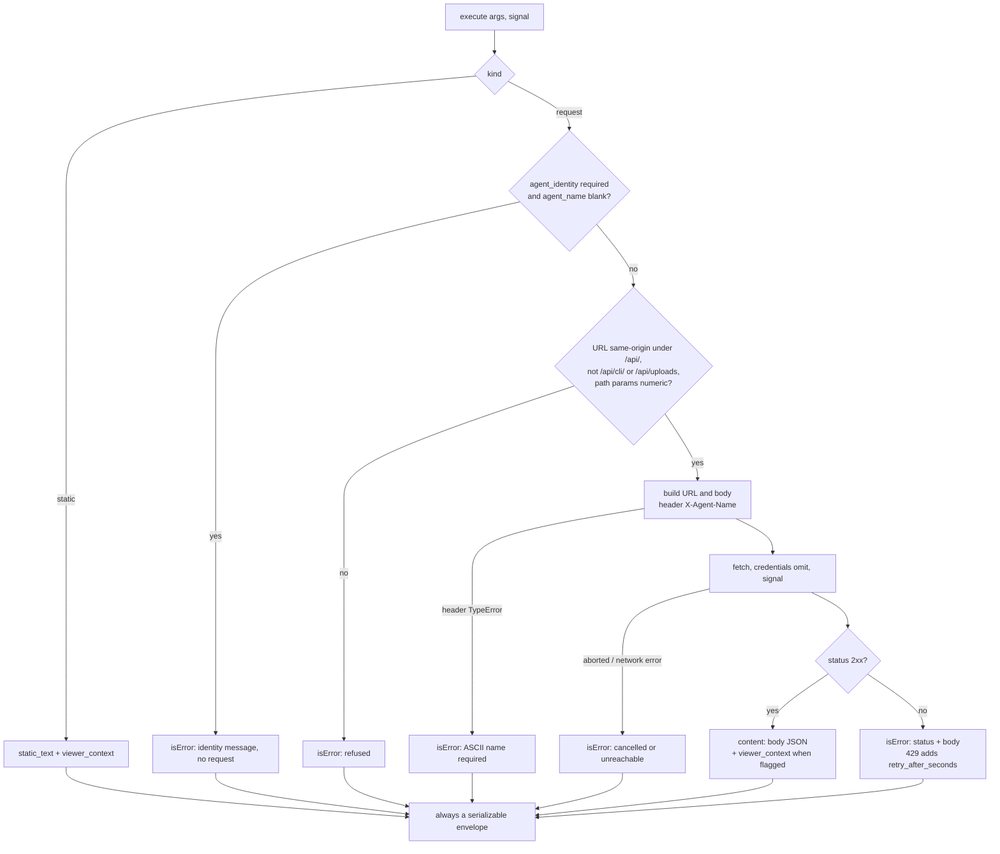
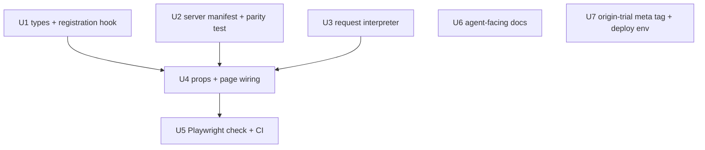

# WebMCP Browser Tools - Plan

## Goal Capsule

- **Objective:** An agent driving a WebMCP-capable browser on a Thinkroom page can, at anonymous link-holder privilege and with no token setup, read a document, create an unclaimed draft, propose suggestions, comment, resolve comments, announce presence, and poll/ack events — and humans see every one of those writes attributed to the agent, never to themselves. Content changes, retitling, and judgment/ownership actions stay with the credentialed CLI/API and with humans.
- **Means:** Register page-scoped WebMCP tools that call the existing `/api/*` agent surface from the visitor's tab (KTD2, KTD3).
- **Authority:** This plan, then `STRATEGY.md` (agents propose, humans judge), then `AGENTS.md`/`CLAUDE.md`, then existing code conventions.
- **Execution profile:** `ce-work`; units U1, U2, U3, U6, U7 run in parallel; U4 integrates; U5 verifies.
- **Stop conditions:** Stop if implementation requires cookie/session authentication on `Api::BaseController` (KTD2 forbids it), if a tool would let a browser request mint `author_kind: "human"` for agent text, or if a browser tool would send document `content` or `title` writes (KTD6).
- **Tail ownership:** After U4, the implementer runs the Verification Contract, then U5 against a live `bin/dev` server.

---

## Product Contract

### Summary

Thinkroom pages register WebMCP tools (`document.modelContext.registerTool`) on the document page and the documents index. The tools make the existing anonymous agent API discoverable and invocable as typed tools from the visitor's tab. Tool descriptions and request shapes come from an explicit per-tool table in `AgentGuide` that references the published `endpoints`, so CLI help, the HTTP agent guide, and WebMCP descriptions share one source. Tools execute against `/api/*` with an explicit agent identity and no cookies, returning the API's JSON (with its `next_action` guidance) inside an MCP-style result. Browsers without WebMCP see no change.

### Problem Frame

Thinkroom already serves agents over HTTP (`app/controllers/api/`, identity via `X-Agent-Name`, optional Bearer token from `thinkroom login`) and over the Node CLI (`cli/bin/thinkroom.js`). A browser agent on a Thinkroom page today has two paths: click the UI, which produces human-attributed edits and bypasses the provenance model, or hand-assemble `/api/*` calls from the agent guide the page embeds. WebMCP (W3C Web Machine Learning CG draft; Chrome origin trial 149–156, stable targeted for 157) lets the page hand the agent those same anonymous API calls as discoverable, typed tools with the API's own guidance in every result. This is a forward-looking platform bet made ahead of measured demand: no incident of browser-agent UI fallback has been recorded; the bet is that agent-driven browsers arrive and Thinkroom's "agents propose, humans judge" model should be the path of least resistance when they do. Cloudflare's announcement (<https://blog.cloudflare.com/webmcp/>) shows the same pattern: a same-origin bridge registers tools that proxy an existing API.

### Key Decisions

- **Human judgment and ownership actions are not WebMCP tools in this release** — accept/reject/reopen suggestions, review-state changes, claim, link access, editing lock, delete. `STRATEGY.md` keeps judgment human; the activity feed and success metrics assume agent-triggered accepts never read as human. Withholding the tools does not stop a browser agent from clicking Accept in the UI; it avoids offering judgment as a first-class agent action until a "human via agent" attribution shape exists (Deferred). Governs R6, R7, R16.
- **The WebMCP tool set is the anonymous subset of the CLI/API capability set** — read, create, suggest, comment, resolve, presence, events. A browser agent holds no credential, so it has the capabilities of an anonymous link-holder, never the viewer's: `thinkroom_create_document` yields an unclaimed draft (CLI `new` yields an account-owned one), an owner on a comment-only link cannot suggest through the tool, and the account-scoped document list (`GET /api/docs` with a Bearer token) has no anonymous equivalent and is not a tool. Governs R6, R7, R21.
- **`thinkroom_update_document` is not a browser tool** — from a writable tab the anonymous `PATCH /api/docs/:slug` always answers 409: opening the draft grants that tab the seed and the editor's first Yjs updates end seed stage before any tool can run. From a read-only tab the same PATCH could overwrite an unclaimed draft's source, the one destructive write reachable without a credential. A tool that fails on every page it is registered on, and succeeds only where it is dangerous, earns nothing; the raw API path is unchanged for credentialed callers. Governs R6.
- **Writes are attributed to a named agent, never to the viewer** — the browser session grants no authorship; every write carries `X-Agent-Name` and the API records `author_kind: "agent"`. Governs R9, R10, R11.

### Requirements

**Registration and availability**

- R1. Pages feature-detect `document.modelContext` with a working `registerTool` and do nothing otherwise; no polyfill is loaded.
- R2. The document page (`/d/:slug` and its `/edit|/suggest|/comment` URLs) registers its tools once per document slug after hydration and unregisters them when the page unmounts.
- R3. The documents index (`/`) registers its tools after hydration and unregisters them on unmount.
- R4. Registration never runs during server rendering or the first client render, so SSR output and hydration are unchanged.
- R5. Registration survives React StrictMode double-invocation without duplicate-name errors or unhandled rejections.

**Tool set**

- R6. The document page registers: `thinkroom_guide`, `thinkroom_read_document`, `thinkroom_propose_suggestion`, `thinkroom_comment`, `thinkroom_resolve_comment`, `thinkroom_announce_presence`, `thinkroom_poll_events`, `thinkroom_ack_events`, `thinkroom_create_document`.
- R7. The index registers: `thinkroom_guide`, `thinkroom_create_document`.
- R8. Each tool's description and input schema states the same purpose, body fields, and caps that `AgentGuide.endpoints` publishes for the matching endpoint, within Chrome's guardrails (description ≤ 500 chars, parameter description ≤ 150, name ≤ 30).
- R21. Each write tool's description names the link-access level the server requires for it (`edit` for suggestions; `comment` or `edit` for comments and resolving; none for reads, presence, events, and creation) and tells the agent to expect a 423 body with `next_action` otherwise.

**Identity and attribution**

- R9. Every write tool takes a required `agent_name` argument (1–255 chars, trimmed) and sends it as `X-Agent-Name`; a call without it returns an error result with the CLI's identity message and makes no network request.
- R10. Read tools (`thinkroom_read_document`, `thinkroom_guide`) send no agent identity and create no presence.
- R11. Tools send requests only to same-origin URLs under `/api/` whose path is not under `/api/cli/` and is not `/api/uploads`, with no cookies and no `Authorization` header; the interpreter refuses any other URL before fetching.

**Results**

- R12. Every tool returns a JSON-serializable MCP-style result `{ content: [{ type: "text", text }], isError? }`; `execute` never throws and never returns `undefined`, including on network failure, abort, and response-parse failure.
- R13. On a 2xx response the `text` is the API's JSON body; on any other response `isError: true` and the `text` carries the status and the body (`error`, `next_action`, `link_access`, `revision_workflow` when present).
- R14. On the document page, `thinkroom_read_document` and `thinkroom_guide` results add a `viewer_context` object — the viewer's `ownership` props (`yours`, `can_write`, `can_comment`, `link_access`), current `mode`, and `share_url` — with a `note` that these are the human viewer's capabilities, distinct from the agent's `ownership` in the API body. On the index, `thinkroom_guide`'s `viewer_context` is `{ viewer: { name, guest }, note }`.
- R15. A 429 response maps to an error result with `retry_after_seconds` given as an upper bound from the endpoint's published `rate_limits.burst.within_seconds`; the next call surfaces the server's answer again.

**Single source of truth and documentation**

- R16. The tool manifest is produced server-side by `AgentGuide` and shipped as an Inertia prop; a test asserts every `AgentGuide.endpoints` key is either a manifest tool or in an explicit exclusion list with a reason, and that manifest text never embeds document content.
- R17. `cli/skill/thinkroom/SKILL.md`, `cli/README.md`, `README.md`, and `AgentGuide.notes` mention WebMCP: what a browser agent can do on a page and that content changes, review, and ownership stay with the CLI/API and humans.
- R18. `CHANGELOG.md` Unreleased records the feature.

**Rollout**

- R19. When `WEBMCP_ORIGIN_TRIAL_TOKEN` is set to a well-formed token, the layout emits `<meta http-equiv="origin-trial" content="...">`; when unset or malformed, no tag is emitted.

### Success Criteria

- In Chrome 149+ with `chrome://flags/#enable-webmcp-testing`, the DevTools Application → WebMCP pane lists the R6 tools on `/d/demo` and the R7 tools on `/`.
- Invoking `thinkroom_propose_suggestion` from that pane with `agent_name: "Scout"` produces a pending suggestion card attributed to Scout in the same tab, and its accepted text later carries `data-kind="ai" data-author="Scout"`.
- `script/webmcp_check.mjs` exercises every R6 and R7 tool, asserts agent attribution for suggestions, comments, and created documents, and asserts no tool request carries a cookie or `Authorization` header.
- On `https://thinkroom.kieranklaassen.com/d/demo` with `WEBMCP_ORIGIN_TRIAL_TOKEN` set and the origin registered, Chrome 149–156 stable without any flag lists the R6 tools in the DevTools WebMCP pane.

### Scope Boundaries

- Tools never call web controllers (R11); the browser cannot mint human attribution for agent text.
- `Api::BaseController` keeps Bearer-only authentication; no cookie or session auth is added (KTD2).
- No credential of any kind is placed in page props for tools to use (rejected alternative in KTD2).
- No browser tool writes document `content` or `title` (Key Decisions, KTD6).
- No declarative (`<form toolname>`) tools; imperative registration only.
- No `provideContext`, `unregisterTool`, `exposedTo`, or `navigator.modelContext` usage.
- No user-confirmation gate before mutating tools: the WebMCP spec exposes none, the built-in agent owns consent UX, and the mutators that remain (suggest, comment, resolve, presence, events, unclaimed create) are all reversible or human-reviewed by design.

#### Deferred to Follow-Up Work

- Human-judgment tools (`accept_suggestion`, `reject_suggestion`, review-state advance) and ownership tools (`claim`, `set_link_access`, `delete_document`) — require a product decision and a "human via agent" attribution shape in `Activity`.
- Owner-privileged browser tools (list my documents, retitle, content replacement) — would need a page-scoped credential design; see KTD2's rejected alternative.
- In-page document replacement through the Yjs editor (a `replaceDocumentSource` helper beside `applySuggestion`).
- `thinkroom_upload_image` (binary through JSON arguments).
- `thinkroom_switch_mode`, `focus_suggestion`/`focus_comment` navigation helpers.
- A surface marker (for example `X-Thinkroom-Client: webmcp` logged into `Activity.detail`) so humans and metrics can tell browser agents from CLI agents; until it lands, WebMCP usage is not separately measurable.
- Rejecting an `agent_name` equal to the document's `owner_name`.
- A `docs/solutions/` entry on the browser-side agent auth split once this ships.

### Acceptance Examples

- AE1. **Covers R9, R13.** Given `/d/demo` in a WebMCP browser, when `thinkroom_propose_suggestion` is invoked with `{ body: "Better text", replaces: "A paragraph about provenance." }` and no `agent_name`, then the result is `isError: true` with text containing "agent identity" and no request reaches the server.
- AE2. **Covers R9, R13.** Given the same page, when the same call includes `agent_name: "Scout"`, then the result text is the 201 JSON body (`suggestion`, `status: "pending_human_review"`, `normalized`, `warning`) and a pending suggestion by Scout appears in the editor.
- AE3. **Covers R13, R21.** Given a document whose `link_access` is `view`, when `thinkroom_comment` is invoked with an `agent_name`, then the result is `isError: true` whose text includes the 423 body's `error`, `link_access`, and `next_action`.
- AE4. **Covers R9, R13.** Given any page, when `thinkroom_create_document` is invoked with `agent_name: "Scout"` and markdown `content`, then the result text is the 201 body with `share_url`, and the created document records `seed_author_kind: "agent"` and `seed_author_name: "Scout"` and is unclaimed.
- AE5. **Covers R2.** Given a tab on `/` that navigates via Inertia to a document, when `getTools()` is read after navigation, then `toolchange` has fired and the registered set is exactly the R6 set.
- AE6. **Covers R1, R4.** Given a browser without `modelContext`, when `/d/demo` loads, then no console error appears and the page behaves as before.
- AE7. **Covers R14.** Given an owner (guest or signed-in) on `/d/:slug/edit`, when `thinkroom_read_document` is invoked, then the result JSON contains `viewer_context.ownership.yours: true` and `viewer_context.mode: "edit"` alongside `AgentGuide.state` fields.
- AE8. **Covers R11.** Given any write tool call, when the request is observed, then it carries no `Cookie` and no `Authorization` header and its URL is same-origin under `/api/`.
- AE9. **Covers R9.** Given `thinkroom_comment` invoked with `agent_name: "Scout"` and a `body`, then a comment card attributed to Scout with the agent chip appears in the same tab, and `thinkroom_resolve_comment` with its `id` resolves it.

---

## Planning Contract

### Key Technical Decisions

- KTD1. **Target the current WebMCP spec surface only: `document.modelContext.registerTool(tool, { signal })`, with hand-written ambient types and no polyfill.** The spec (editor's draft 2026-08-26) removed `provideContext`, `clearContext`, `unregisterTool`, and `navigator.modelContext`; unregistration is AbortSignal-only; duplicate names reject with `InvalidStateError`; only `readOnlyHint` and `untrustedContentHint` annotations exist. A ~60-line ambient declaration of `Document.modelContext?` avoids a transitive `@modelcontextprotocol/server` dependency and keeps migration cheap while the spec churns. Polyfills only help when an extension consumes them; a no-op keeps the bundle unchanged for every other browser. `exposedTo` is never passed, so tools stay invisible to cross-origin frames.
- KTD2. **All tool network calls go to `/api/*` on the page origin with `X-Agent-Name` and `credentials: "omit"`; `Api::BaseController` stays Bearer-only.** The API already attributes writes as `author_kind: "agent"`, touches presence, logs activity, and returns teaching error bodies. The web write controllers force human attribution and answer with Inertia redirects. The anonymous API is already reachable cross-site by simple POSTs and is harmless only because no identity rides along; cookie auth on `ActionController::API` (no CSRF) would upgrade that to authenticated CSRF. Omitting cookies makes the boundary explicit and testable (AE8), and the interpreter enforces R11 at runtime. Consequence accepted: a browser agent has anonymous link-holder privilege (Key Decisions). Rejected: (a) a cookie-authenticated JSON write surface — attributes agent text to the viewer and needs a "human via agent" `Activity` shape; (b) minting a page-scoped `CliAccessToken` into props so the agent acts as the signed-in owner — exposes a credential to the DOM and every extension; it is the candidate design if owner tools are wanted later (Deferred).
- KTD3. **An explicit per-tool table in `AgentGuide` drives a generic frontend registrar.** `AgentGuide.webmcp_tools(document, base_url)` and `AgentGuide.webmcp_index_tools(base_url)` build each tool from a hand-written entry keyed by `endpoints` key that declares `input_schema`, `path_params`, `body_params`, `agent_identity`, and annotations, and pulls `method`, `url`, `rate_limits`, and the leading `purpose` sentence from the referenced endpoint. Deriving schemas by parsing the prose `body` strings was rejected: the "(required)" markers are inconsistent (`announce_presence.status` and `create_document.format` carry none; `create_document.content` is marked required but is optional without `format`) and `resolve_comment` has no `body` at all. The Minitest parity test pins coverage and drift (U2). Manifest shape (pinned so U1, U2, U3 proceed in parallel):

  ```text
  webmcp: {
    share_url: string,                      // document manifests only
    tools: [
      {
        name: "thinkroom_propose_suggestion",
        description: string,                 // ≤ 500 chars, starts with endpoint purpose
        input_schema: { type: "object", properties: {...}, required: [...], additionalProperties: false },
        annotations: { read_only_hint: bool, untrusted_content_hint: bool },
        kind: "request" | "static",
        request?: {                          // present iff kind == "request"
          method: "GET" | "POST",
          url: absolute same-origin URL under /api/, may contain ":id",
          path_params: ["id"],               // args moved into the URL; each validated as /^\d+$/
          body_params: ["body", "intent", "anchor_text", "replaces"],
          agent_identity: "required" | "omit",
          rate_limit_window_seconds?: integer // from rate_limits.burst.within_seconds
        },
        static_text?: string,                // present iff kind == "static"
        include_viewer_context: bool
      }
    ]
  }
  ```

  Rules: `agent_identity` is `"required"` for every non-read-only tool (including `create_document`, whose endpoint header is only "recommended") and `"omit"` for reads; `agent_name` is never a `body_param` — the interpreter lifts it to the header; no `query_params` field exists because no endpoint takes any; in TypeScript `kind` is a discriminated union shared by U1 and U3 in `app/frontend/lib/webmcp.ts`.
- KTD4. **Results are data, never exceptions.** Spec execution failures surface to the agent as a bare `UnknownError`, and returning `undefined` fails JSON serialization. Every tool returns the MCP envelope from R12/R13 from inside one catch-all boundary that covers identity refusal, allowlist refusal, header construction (a non-ISO-8859-1 `agent_name` makes `fetch` throw `TypeError`), the fetch itself (network failure, abort), and response parsing (non-JSON bodies from proxies or HTML error pages are wrapped as text with the status). For `include_viewer_context` tools the text is the body merged with `viewer_context` (R14). The API's own 429 is JSON; R15 reports its window as an upper bound and keeps no client-side lockout, because the server uses fixed windows per IP and a lockout would over-block for up to ten minutes after one 429.
- KTD5. **Registration lifecycle: one `useEffect` per page keyed on the page identity (`doc.slug` or `"index"`), a fresh `AbortController` per run whose signal is passed to `registerTool` and to every `fetch` inside `execute`, latest page state and the `tools` array read through refs.** Inertia keys the page element with `Date.now()` on non-`preserveState` visits and reuses the key otherwise (`@inertiajs/react` `swapComponent`), so cross-document visits remount and mode switches (`router.push({ preserveState: true })`) and partial reloads do not; the slug key is defensive only. Abort-on-cleanup is the sole wrong-document guard: the signal cancels in-flight fetches and removes the tools, and each tool's URL is fixed at registration. StrictMode's dev-only mount→cleanup→mount aborts the first registration synchronously, so the second does not hit the duplicate-name error; `registerTool` is wrapped for both a synchronous throw and a rejection, `AbortError` is swallowed, and `InvalidStateError` is logged and skipped. In development (`import.meta.env.DEV`) the hook also exposes `window.__thinkroomWebmcp.execute(tool, args)` so the browser check can push hand-built manifest entries through the real interpreter.
- KTD6. **`update_document` is excluded from the browser manifest with a recorded reason.** `WEBMCP_EXCLUDED_ENDPOINTS` lists it: a writable tab always receives 409 because `Document#seed_stage?` (`content_snapshot.nil? && !live_crdt?`) is already false once the opening tab's editor has applied the seed and `SyncChannel` has persisted the first Yjs updates, and a read-only tab could overwrite an unclaimed draft anonymously. `Document#replace_content!` and its `content_reset` reload are unreachable without a Bearer token either way. Implements the Key Decision; no in-page replacement is built (Deferred).
- KTD7. **Units are structured for parallel execution: U1, U2, U3, U6, U7 depend only on the contracts pinned in KTD3 and KTD5; U4 integrates; U5 verifies.** Requested by the user during planning. The cost accepted is that the manifest shape and tool names are fixed in this plan before any code exists; a later change to them touches U1–U5 together. Two shared-file seams are named so parallel executors expect them: U1 owns `app/frontend/lib/webmcp.ts` and U3 consumes it (U3 may add interpreter-only types there; U4 reconciles), and U2 and U6 both edit `app/services/agent_guide.rb` in disjoint regions (new methods vs. the tail of the `notes` array).
- KTD8. **Verification uses a Playwright check with an injected `document.modelContext` stub plus Minitest and `tsc`.** CI's Playwright Chromium does not run the WebMCP origin trial, so `script/webmcp_check.mjs` installs a stub via `page.addInitScript` that records `registerTool` calls, honors the abort signal, and exposes `invoke(name, args)`; it runs in the existing `script/*_check.mjs` CI loop against `/d/demo` and `/`. It reads request headers with `request.allHeaders()` — Playwright's `request.headers()` omits `Cookie` and other security headers, so only `allHeaders()` can prove their absence — and first confirms the context holds a session cookie so the negative is not vacuous. Interpreter refusal scenarios go through the KTD5 development seam. The stub honors abort synchronously by construction, so a Chrome mismatch there is caught only by the manual real-browser check (Success Criteria).

### Tool Authorization Matrix

Every tool's server-side gate, derived from `Api::*` controllers and `Document#with_write_access` / `with_comment_access`; each write tool's description carries its row (R21). "Anonymous" means the browser tab: no cookie, no Bearer.

| Tool | Endpoint | Link `edit` | Link `comment` | Link `view` | Notes |
|---|---|---|---|---|---|
| `thinkroom_guide` | static | allowed | allowed | allowed | no request |
| `thinkroom_read_document` | `GET /api/docs/:slug` | allowed | allowed | allowed | no `X-Agent-Name`, no presence |
| `thinkroom_propose_suggestion` | `POST .../suggestions` | allowed | 423 | 423 | `X-Agent-Name` required |
| `thinkroom_comment` | `POST .../comments` | allowed | allowed | 423 | `X-Agent-Name` required |
| `thinkroom_resolve_comment` | `POST .../comments/:id/resolve` | allowed | allowed | 423 | `id` must be an open comment on this document, else 404 |
| `thinkroom_announce_presence` | `POST .../presence` | allowed | allowed | allowed | `X-Agent-Name` required |
| `thinkroom_poll_events` | `GET .../events/pending` | allowed | allowed | allowed | `X-Agent-Name` required |
| `thinkroom_ack_events` | `POST .../events/ack` | allowed | allowed | allowed | `X-Agent-Name` required |
| `thinkroom_create_document` | `POST /api/docs` | n/a | n/a | n/a | creates an unclaimed draft; rate-limited 20/10 min per IP |

Deleted documents answer 404 on every row; the demo document (`unclaimable`, link `edit`) behaves as the `edit` column.

### High-Level Technical Design

Component topology — one manifest, one registrar, one API, no credential:



Tool call lifecycle — one catch-all boundary around identity gate, allowlist, request, envelope:



Unit dependency graph (KTD7):



### Assumptions

Inferred during planning without a synchronous user; correct in the plan if wrong.

- The parity target is the anonymous subset of the CLI/API capability set; UI-only actions (accept, reject, claim, link access, delete, export) and credentialed actions (owner update, account document list) are out of this release.
- `thinkroom_create_document` is offered on both pages, like `thinkroom new`; it returns `share_url` with the API's ownership note and does not navigate.
- `agent_name` is required per call rather than set once by an "introduce" tool; this matches the CLI's stateless `--agent`.
- Reads use `GET /api/docs/:slug` without a header (no presence side effect); `/d/:slug?format=json` returns the same payload and is not used so every tool request shares one allowlist.
- Tool names use the `thinkroom_` prefix and snake_case verbs matching CLI commands.
- `share_url` comes from the manifest root (server knows `base_url`); the frontend never derives it from `window.location`.
- Shipping the manifest as an Inertia prop on every render (roughly ten small descriptions and schemas) is accepted over fetching it after feature detection; the prop keeps one render path and no new endpoint.
- The origin-trial token is deployed through `config/deploy.yml` clear env (tokens are public, origin-bound, and signed by Google), and registering both production origins (`thinkroom.kieranklaassen.com`, `pruf.kieranklaassen.com`) at <https://developer.chrome.com/origintrials/#/register_trial/4163014905550602241> is a manual operator step.
- No `Permissions-Policy` or `Origin-Agent-Cluster` header in this app disables the `tools` feature (the CSP initializer is fully commented out; no permissions-policy initializer exists). Rails' default `X-Frame-Options: SAMEORIGIN` stays in place so no embedder can delegate `tools` to a Thinkroom frame.
- Frontend files stay flat under `app/frontend/lib/` (the directory has no subdirectories today).
- Chrome 149+ exposes `document.modelContext` (not only the deprecated `navigator.modelContext`); U1 confirms this in a real build before landing.

### System-Wide Impact

- **Auth boundary:** unchanged on the server. The browser gains a discoverable path to the anonymous agent API it could already reach; rate limits are per IP, so a browser agent consumes the viewer's own contribution budget (R15 surfaces it).
- **Agent/tool parity:** the share URL now serves a third audience (WebMCP agents) besides browsers and HTTP agents; `AgentGuide.notes` and the skill file describe the split (R17). Tool results expose two `can_write` values with different meanings; R14's `note` disambiguates them.
- **Presence:** every write tool call touches `AgentPresence` for `agent_name`, so the agent appears as a labeled cursor in the tab it drives and as "joined via the agent API" in the feed, indistinguishable from a CLI agent until the deferred surface marker lands; `thinkroom_announce_presence` with `status: done` signs it off.
- **Bundle:** the registrar and interpreter are small modules imported by the two pages; no new npm dependency.

### Risks & Dependencies

- **Spec churn.** `executeTool` input type and `RegisteredTool.inputSchema` type changed in Aug 2026; Chrome 149–153 still return `inputSchema` as a string. The app only calls `registerTool`, stable since June; the Playwright stub isolates CI from browser builds.
- **Origin trial expiry.** The trial ends with Chrome 156; stable is targeted for 157. R19 keeps the token in env so it rotates without a code change.
- **Agent name collisions and spoofing.** `X-Agent-Name` is free text; a browser agent using another agent's or the owner's name shares a presence row and event cursor and shows that name in the feed, though `author_kind` stays `agent`. Tool descriptions recommend a distinct operator-given name (for example `"Claude (browser)"`); rejecting names equal to `owner_name` is deferred.
- **Stale props after writes.** Suggestion/comment state in page props updates over the meta channel a beat after a write; tools return the server body, not props, so results are never stale.
- **Published limit the server does not enforce.** `AgentGuide.endpoints` advertises `rate_limits` on `resolve_comment`, but `Api::CommentsController` rate-limits only `create`; the manifest inherits the published value. Pre-existing drift, harmless here.

#### Threat model

- **Output injection (R6, R8, KTD3).** Document text, comments, suggestions, activity `detail`, presence names, and titles are attacker-writable and flow back to the agent. Every tool whose result can carry such text sets `untrusted_content_hint: true` — `read_document`, `poll_events`, `resolve_comment`, `comment`, `propose_suggestion`, `create_document`; only `guide`, `announce_presence`, and `ack_events` omit it. Descriptions tell the agent to treat document text as data and take `agent_name` from its operator, never from the page. No browser tool writes document `content` or `title`, so an injected agent can at most add proposals, comments, presence, or an unclaimed draft — every one reversible or human-reviewed. The spec offers no confirmation API; consent UX belongs to the browser's agent (Scope Boundaries).
- **Description poisoning (R8, R16).** Manifest strings derive only from `AgentGuide` constants and `content_format`; U2's test asserts no description, schema string, or `static_text` contains the document title, `plain_text`, a comment body, or a suggestion body.
- **Same-origin scripts and extensions (KTD2).** Any same-origin script or extension can already `fetch('/api/...')`; `executeTool` grants no new capability. Accepted.
- **Cross-origin exposure (KTD1).** No `exposedTo`; `tools` Permissions-Policy defaults to `self`; `X-Frame-Options: SAMEORIGIN` is relied upon (Assumptions).
- **Viewer IP budget exhaustion (R15).** Contribution limits are 60/10 min and 500/day per IP, document creation 20/10 min. A looping agent shares the viewer's budget; the server's 429 stops each call and R15 reports the window. Accepted.
- **Path parameter injection (R11, U3).** `id` in `comments/:id/resolve` is validated as digits and URL-encoded so an agent-supplied value cannot retarget the request to another same-origin route; `/api/cli/` and `/api/uploads` are refused even if a manifest entry names them.
- **Viewer data in results (R14, U5).** `viewer_context` is limited to the four `ownership` flags, `mode`, `share_url`, and `note`; it never carries document slugs other than the current page's, the CSRF token, `owner_token`, a Bearer token, or `Set-Cookie`. U5 asserts this. The origin-trial token in the meta tag is public by design.

### Documentation / Operational Notes

- Local testing: Chrome 149+ → `chrome://flags/#enable-webmcp-testing` → relaunch → open `http://localhost:3005/d/demo` (port per local convention) → DevTools → Application → WebMCP, or install the "WebMCP - Model Context Tool Inspector" extension. `localhost` is a secure context; a Cloudflare tunnel origin is HTTPS.
- Console check: `await document.modelContext.getTools()` lists tools; `await document.modelContext.executeTool(tool, {...})` (object on spec builds; JSON string on Chrome ≤153).
- Deploy: register both production origins, set `WEBMCP_ORIGIN_TRIAL_TOKEN` in `.kamal/deploy.env`, and pass it through `config/deploy.yml` `env.clear`; document in `DEPLOYING.md`.

### Sources

- WebMCP spec (ED 2026-08-26): <https://webmachinelearning.github.io/webmcp/>; explainer: <https://github.com/webmachinelearning/webmcp>
- Chrome docs: <https://developer.chrome.com/docs/ai/webmcp>, imperative API <https://developer.chrome.com/docs/ai/webmcp/imperative-api>, secure tools <https://developer.chrome.com/docs/ai/webmcp/secure-tools>, DevTools pane <https://developer.chrome.com/docs/devtools/application/webmcp>, origin trial <https://developer.chrome.com/blog/ai-webmcp-origin-trial>
- Cloudflare announcement: <https://blog.cloudflare.com/webmcp/>
- React prior art: <https://github.com/GoogleChromeLabs/use-webmcp-tool>
- Playwright: `request.allHeaders()` vs `request.headers()` — <https://playwright.dev/docs/api/class-request#request-all-headers>
- Repo: `app/controllers/api/base_controller.rb` (Bearer-only auth, `require_agent!` wording, JSON 429), `app/controllers/api/docs_controller.rb` (`update` gates), `app/models/document.rb` (`seed_stage?`, `with_write_access`, `with_comment_access`), `app/services/agent_guide.rb` (`endpoints`, `notes` with positional inserts, `text`), `app/frontend/lib/use_meta_channel.ts` (hook-with-refs pattern), `app/frontend/types/ruby_native.d.ts` (ambient global declaration pattern; `globals.d.ts` is a module and must not be copied), `script/lib/check_helpers.mjs` and `.github/workflows/ci.yml` (Playwright check loop on port 3000), `cli/bin/thinkroom.js` `requireAgent` (identity refusal text), `test/integration/document_seed_claim_test.rb` (partial-reload header pattern), `config/initializers/omniauth.rb` (`config.x` flag pattern), `config/deploy.yml` (Kamal env passthrough)
- Prior plans: `docs/plans/2026-06-28-002-fix-cli-omit-generic-agent-identity-plan.md`, `docs/plans/2026-06-30-001-fix-cli-replacement-stale-crdt-race-plan.md`, `docs/plans/2026-06-27-001-fix-api-docs-index-plan.md`; learning `docs/solutions/architecture-patterns/server-first-instant-paint.md`

---

## Implementation Units

### U1. Ambient WebMCP types and the registration hook

- **Goal:** A typed, SSR-safe, StrictMode-safe hook that registers a list of tools on `document.modelContext`, unregisters them on cleanup, and exposes a development-only seam for the browser check.
- **Requirements:** R1, R2, R3, R4, R5, R12 (KTD1, KTD5)
- **Dependencies:** none
- **Files:**
  - `app/frontend/types/webmcp.d.ts` (create; global script file, no top-level import/export)
  - `app/frontend/lib/webmcp.ts` (create: `getModelContext()`, manifest and tool types per KTD3 as a discriminated union, annotation mapping; consumed by U3)
  - `app/frontend/lib/use_webmcp_tools.ts` (create)
- **Approach:**
  1. Declare the spec IDL in `webmcp.d.ts`: `ModelContext` (`registerTool`, `getTools`, `executeTool`, `ontoolchange`), `ModelContextTool`, `ToolAnnotations`, `ModelContextRegisterToolOptions`, `RegisteredTool`, and `interface Document { readonly modelContext?: ModelContext }`.
  2. `webmcp.ts` exports `getModelContext()` returning the object or `null` (guards `typeof document`, `typeof registerTool === 'function'`), the manifest types, and a dev-only name validator for `/^[A-Za-z0-9_.-]{1,128}$/`.
  3. `use_webmcp_tools.ts` takes `{ key, tools, execute }`; `tools` and `execute` are read through refs so the effect depends on `key` only (a partial reload re-sends a new `tools` array and must not re-register). Per run: new `AbortController`; register each tool with `{ signal }`; wrap each `registerTool` in try/catch and `.catch`, swallowing `AbortError` and logging `InvalidStateError`; the registered `execute` delegates to the page executor and converts a throw or `undefined` into an error result (KTD4). Cleanup aborts.
  4. When `import.meta.env.DEV`, set `window.__thinkroomWebmcp = { execute }` inside the effect and delete it in cleanup (KTD5 seam).
  5. Map manifest `annotations.read_only_hint`/`untrusted_content_hint` to spec `readOnlyHint`/`untrustedContentHint`.
- **Patterns to follow:** `app/frontend/lib/use_meta_channel.ts` (effect keyed on identity, refs for latest callbacks, returned unsubscribe); `app/frontend/types/ruby_native.d.ts`; `app/frontend/editor/milkdown_editor.tsx` comment on surviving StrictMode mount→unmount→mount.
- **Test scenarios:**
  - `npm run check` passes with the new ambient types and no `any` leaks.
  - Covered by U5's stub: mount registers N tools with a signal; unmount aborts the signal; remount registers again without `InvalidStateError`.
  - Covered by U5: with no `document.modelContext`, the hook returns early and logs nothing.
  - Covered by U5: an `execute` that throws resolves to an `isError` result rather than rejecting.
  - Covered by U5: `window.__thinkroomWebmcp` exists on a dev-server page and is removed after Inertia navigation away.
- **Verification:** TypeScript check passes; U5 scenarios for registration pass once U4 wires the hook.

### U2. Server-side tool manifest and parity test

- **Goal:** `AgentGuide` publishes the WebMCP manifest for a document and for the index from an explicit per-tool table referencing `endpoints`, with a test pinning coverage, drift, content hygiene, and the authorization rows.
- **Requirements:** R6, R7, R8, R16, R21 (KTD3, KTD6)
- **Dependencies:** none
- **Files:**
  - `app/services/agent_guide.rb` (modify: add `WEBMCP_TOOLS`, `WEBMCP_EXCLUDED_ENDPOINTS`, `webmcp_tools`, `webmcp_index_tools`; do not touch `notes`, which U6 owns)
  - `test/services/agent_guide_webmcp_test.rb` (create)
- **Approach:**
  1. `WEBMCP_TOOLS` is a hash keyed by `endpoints` key (`state`, `propose_suggestion`, `comment`, `resolve_comment`, `announce_presence`, `poll_events`, `ack_events`, `create_document`) whose values declare `name`, `input_schema` (properties with ≤150-char descriptions, `required`, `additionalProperties: false`), `path_params`, `body_params`, `agent_identity`, annotations, and the R21 access sentence. `webmcp_tools` merges in `method`, `url`, and `rate_limit_window_seconds` (`rate_limits[:burst][:within_seconds]`, absent when the endpoint has no `rate_limits`) from the referenced `endpoints(document, base_url)` entry and builds `description` as the endpoint `purpose` trimmed to the first sentence(s) within 500 chars plus the access sentence.
  2. Byte caps come from constants, not `endpoints`: `Suggestion::MAX_BODY_BYTES`, `MAX_ANCHOR_BYTES`, `MAX_INTENT_BYTES` for suggestion fields; `Document::MAX_CONTENT_BYTES` for `create_document.content`. Each capped property states its cap "in UTF-8 bytes" in its description and uses the same number as `maxLength` (a character ceiling that is never looser than the byte cap); the interpreter enforces the byte count (U3).
  3. `agent_name` (string, `minLength: 1`, `maxLength: 255`, description from the identity rule in `notes`) is required on every `agent_identity: "required"` tool; `state` is `"omit"`. `untrusted_content_hint` follows the Threat model list; `read_only_hint: true` on `state` and `guide`.
  4. `thinkroom_guide` is `kind: "static"` with `static_text` from `notes(document)` joined plus one WebMCP line; `thinkroom_read_document` and `thinkroom_guide` set `include_viewer_context: true`. The manifest root carries `share_url`.
  5. `webmcp_index_tools` returns `thinkroom_guide` (static; index-flavored notes; `include_viewer_context: true`, which the index page fills with the R14 index shape) and `thinkroom_create_document` (from `create_document_endpoint`).
  6. `WEBMCP_EXCLUDED_ENDPOINTS = { "upload_image" => "binary upload; deferred", "update_document" => "always 409 from a writable tab; would overwrite unclaimed drafts from a read-only tab (KTD6)" }`; any new endpoint must be added to one side or the test fails.
- **Patterns to follow:** `AgentGuide.endpoints`, `create_document_endpoint`, `content_contract`; `test/services/document_title_test.rb` style (`ActiveSupport::TestCase`, `Document.create!(title:, seed_markdown:)`); rubocop-rails-omakase spacing.
- **Test scenarios:**
  - Every key of `endpoints(doc, base)` is a `WEBMCP_TOOLS` key or a `WEBMCP_EXCLUDED_ENDPOINTS` key with a non-empty reason.
  - Each request tool's `request.method` and `request.url` equal its endpoint's; each `body_params` entry is a key of the endpoint `body` hash; each `description` starts with the endpoint `purpose`'s first sentence.
  - Tool names match `/^[A-Za-z0-9_.-]{1,128}$/`, are ≤30 chars, and are unique per manifest; descriptions ≤500 chars; property descriptions ≤150 chars.
  - `thinkroom_propose_suggestion` requires `agent_name` and `body`, has `agent_identity: "required"`, `body.maxLength` equals `Suggestion::MAX_BODY_BYTES`, and its description names `edit` link access.
  - `thinkroom_comment`'s description names `comment` link access; `thinkroom_read_document` has `read_only_hint: true`, `untrusted_content_hint: true`, `agent_identity: "omit"`, `include_viewer_context: true`.
  - `untrusted_content_hint` is true for every tool in the Threat model list and false for `guide`, `announce_presence`, `ack_events`.
  - `thinkroom_resolve_comment` has `path_params: ["id"]` and a URL containing `:id`.
  - Every `request.url` starts with `"#{base_url}/api/"` and none starts with `"#{base_url}/api/cli"` or equals `"#{base_url}/api/uploads"`; no tool named `thinkroom_update_document` or `thinkroom_list_documents` exists.
  - For a document titled `"INJECT <script>"` with `plain_text` containing a marker string and an open comment containing another marker, no description, `static_text`, or schema string contains either marker or the title.
  - For an HTML document the suggestion description names HTML; for markdown it names Markdown.
  - Index manifest contains exactly `thinkroom_guide` and `thinkroom_create_document`, and no `share_url`.
- **Verification:** `bin/rails test test/services/agent_guide_webmcp_test.rb` passes; `bin/rubocop` clean.

### U3. Request interpreter and result envelope

- **Goal:** One function that turns a manifest tool plus arguments into a same-origin, cookie-less fetch and an MCP result, inside one catch-all boundary covering identity, allowlist, path/body params, headers, abort, network, and parse failures.
- **Requirements:** R9, R10, R11, R12, R13, R14, R15 (KTD2, KTD4)
- **Dependencies:** none (types from `app/frontend/lib/webmcp.ts`; if U1 has not landed, add the interpreter-only types there and let U4 reconcile)
- **Files:**
  - `app/frontend/lib/webmcp_execute.ts` (create)
  - `app/frontend/lib/webmcp.ts` (consume; U1 owns)
- **Approach:**
  1. `executeManifestTool(tool, args, { signal, viewerContext })` wraps everything below in one try/catch whose fallback returns `{ content: [{ type: "text", text: JSON.stringify({ error }) }], isError: true }`.
  2. `kind: "static"` → `static_text` plus `viewer_context` when flagged.
  3. `kind: "request"`: if `agent_identity === "required"` and trimmed `args.agent_name` is blank, return the identity error without fetching (text adapted from `cli/bin/thinkroom.js` `requireAgent`, naming `agent_name`). Refuse (error result) any URL whose origin differs from `location.origin`, whose path does not start with `/api/`, whose path starts with `/api/cli/`, or whose path equals `/api/uploads`. Validate each `path_params` value as `/^\d+$/` before substitution.
  4. Build the JSON body from `body_params` present in args (POST only); for every property whose schema carries `maxLength`, measure the value with `TextEncoder` and return an error result naming the field and its UTF-8 byte cap when exceeded, before any request. Headers: `X-Agent-Name` (required tools), `Content-Type: application/json`, `Accept: application/json`; `credentials: "omit"`; never `Authorization`. A `TypeError` from header construction (non-Latin1 name) becomes an error result asking for an ASCII name.
  5. Parse JSON, falling back to text. 2xx → `{ content: [{ type: "text", text: JSON.stringify(body) }] }`, merging `viewer_context` when flagged. Other → `isError: true`, text `JSON.stringify({ status, ...body })` when the body parsed to an object, else `JSON.stringify({ status, body: <text> })` so a non-JSON body is never spread character by character; on 429 add `retry_after_seconds: rate_limit_window_seconds` as an upper bound. Abort → "cancelled: page navigated"; network failure → "unreachable".
- **Patterns to follow:** `app/frontend/lib/csrf.ts` for the small fetch-wrapper style (no CSRF token here); error wording from `app/controllers/api/base_controller.rb` `require_agent!`.
- **Test scenarios:**
  - Covered by U5: `thinkroom_propose_suggestion` without `agent_name` returns `isError` and Playwright's request listener sees no `/api` request (AE1).
  - Covered by U5: with `agent_name: "Scout"` the result text parses to JSON with `status: "pending_human_review"` (AE2); the observed request's `allHeaders()` has no `cookie` or `authorization` (AE8).
  - Covered by U5: `thinkroom_resolve_comment` with the `id` of an open comment substitutes the path and returns the comment JSON; with `id: "../docs"` returns `isError` without a request.
  - Covered by U5 through the dev seam: hand-built tools with URLs `https://evil.example/api/x`, `/documents`, `/api/cli/tokens`, and `/api/uploads` are each refused without a request.
  - Covered by U5: `thinkroom_read_document` result includes `viewer_context.mode`, `viewer_context.note`, and `plain_text`.
  - Covered by U5: a 404 slug returns `isError` with status 404 and "No document with that slug.".
  - Covered by U5: an `agent_name` containing an emoji returns an error result asking for an ASCII name, with no request.
  - Covered by U5 through the dev seam: a tool whose URL points at a closed port returns `isError` "unreachable" rather than rejecting.
  - Covered by U5: a suggestion `body` of multibyte characters whose character count is under `Suggestion::MAX_BODY_BYTES` but whose UTF-8 byte count exceeds it returns `isError` naming `body` and the cap, with no request.
  - Covered by U5 through the dev seam: a tool whose URL returns an HTML 404 page yields `isError` whose parsed text has `status: 404` and a string `body`, not character-indexed keys.
- **Verification:** `npm run check` passes; U5 scenarios pass after U4.

### U4. Inertia props and page wiring

- **Goal:** Both pages receive the manifest as a lazy Inertia prop and mount the hook with a page-specific executor and viewer context.
- **Requirements:** R2, R3, R4, R14 (KTD3, KTD5)
- **Dependencies:** U1, U2, U3
- **Files:**
  - `app/controllers/documents_controller.rb` (modify `show` and `index` props)
  - `app/frontend/pages/documents/show.tsx` (modify; `DocumentProps` lives here)
  - `app/frontend/pages/documents/index.tsx` (modify; `Props` lives here)
  - `test/integration/webmcp_props_test.rb` (create)
- **Approach:**
  1. `show`: add `webmcp: -> { AgentGuide.webmcp_tools(document, request.base_url) }`; `index`: add `webmcp: -> { AgentGuide.webmcp_index_tools(request.base_url) }`, matching the existing lambda props so partial reloads skip it.
  2. `show.tsx`: add `webmcp` to `DocumentProps`; keep `ownership`, `effectiveMode`, and `webmcp` in refs (pattern of `modeRef`); call `useWebmcpTools({ key: doc.slug, tools, execute })` where `execute` delegates to `executeManifestTool` with `viewerContext: { ownership, mode, share_url: webmcp.share_url, note }`.
  3. `index.tsx`: same with `key: "index"` and `viewerContext: { viewer: { name, guest } }`.
- **Patterns to follow:** lambda props in `documents#show`; ref pattern `modeRef`/`handleRef` in `show.tsx`; `useIsClient` usage in `index.tsx`.
- **Test scenarios:**
  - `GET /d/:slug` with a Mozilla `User-Agent` passes `assert_inertia_props` with `webmcp[:tools]` names equal to the R6 set and `webmcp[:share_url]` ending in `/d/:slug`.
  - `GET /` passes `assert_inertia_props` with `webmcp[:tools]` names equal to the R7 set.
  - A partial reload with `X-Inertia`, `X-Inertia-Partial-Component: documents/show`, `X-Inertia-Partial-Data: suggestions` returns props without a `webmcp` key.
  - Covered by U5: a clean Playwright context loading `/d/demo` and `/` logs no `Hydration failed` error.
- **Verification:** `bin/rails test test/integration/webmcp_props_test.rb` passes; `npm run check` passes.

### U5. Playwright check and CI wiring

- **Goal:** A repeatable browser check proving registration lifecycle, the no-credential boundary, authorization rows, attribution, and tool behavior without a WebMCP-enabled browser.
- **Requirements:** R1, R2, R5, R9, R11, R13, R14, R21 (KTD8)
- **Dependencies:** U4 (to pass); authorable in parallel against the pinned names
- **Files:**
  - `script/webmcp_check.mjs` (create)
  - `.github/workflows/ci.yml` (modify: add `webmcp_check` to the check loop)
  - `package.json` (modify: add `check:webmcp` script beside `check:html`)
- **Approach:**
  1. `page.addInitScript` defines `document.modelContext` as an `EventTarget` with `registerTool(tool, { signal })` that stores the tool, rejects duplicates with `InvalidStateError`, removes on `signal.abort`, dispatches `toolchange`; `getTools()`; and a test-only `window.__webmcpInvoke(name, args)` that runs the stored `execute`. Interpreter refusal scenarios call `window.__thinkroomWebmcp.execute(tool, args)` (KTD5 seam) with hand-built entries.
  2. Create a fresh markdown document via `POST /api/docs` with an `X-Agent-Name` (as other check scripts do) so the demo stays untouched; open `/d/:slug/edit`, `waitForLive`, run document scenarios; claim it through the header claim button (the guest context becomes owner) for AE7, then set link access to "Can view" through the share popover for AE3; open `/`, run index scenarios; navigate to the created document through the UI for AE5.
  3. Use `page.on('request')` with `await request.allHeaders()`; first assert the page navigation request carries a `cookie`, then assert every `/api/` request issued by a tool has neither `cookie` nor `authorization`.
  4. Pass the expected fetch-failure noise (`'status of 404'`, `'status of 409'`, `'status of 423'`) as `expectedBrowserNoise` extras.
- **Patterns to follow:** `script/browser_check.mjs`, `script/html_document_check.mjs` (noise extras), `script/lib/check_helpers.mjs`; suggestion card selector `.margin-card[data-suggestion-id]` with `.author-chip--agent`; comment selectors `.comment-card`, `.author-chip--agent`, `.comment-resolve`, `.comment-card.is-resolved`.
- **Test scenarios:**
  - After load, `getTools()` on the document page returns exactly the R6 names, each with a non-empty description and `type: "object"` schema.
  - On `/`, `getTools()` returns exactly the R7 names.
  - AE1: refusal without `agent_name`, zero `/api` requests.
  - AE2 + AE8: suggestion created with `agent_name: "Scout"`; `page.locator('.margin-card', { hasText: 'Scout' })` with `.author-chip--agent` appears; the request carried no `cookie`/`authorization`.
  - Accepted attribution: clicking that card's `.btn-accept` (the viewer can write on the fresh draft) merges the text and the editor contains `[data-provenance][data-kind="ai"][data-author="Scout"]` wrapping the proposed text.
  - AE9: `thinkroom_comment` with `agent_name: "Scout"` shows a `.comment-card` with `.author-chip--agent` and "Scout"; `thinkroom_resolve_comment` with the returned id yields `.comment-card.is-resolved`.
  - AE4: `thinkroom_create_document` returns 201 with `share_url`; `GET /api/docs/:slug` for the new slug shows `provenance.seed_author_kind: "agent"` and `ownership.claimed: false`.
  - AE7: after the guest claims the draft, `thinkroom_read_document` has `viewer_context.ownership.yours === true`, `viewer_context.mode` equal to the page mode, and a `note`.
  - AE3: after link access is set to "Can view", `thinkroom_comment` returns `isError` with status 423, `link_access: "view"`, and `next_action`; `thinkroom_read_document` still succeeds.
  - Refusals through the seam: `path_params` `"../docs"`, emoji `agent_name`, URLs `https://evil.example/api/x`, `/documents`, `/api/cli/tokens`, `/api/uploads`, and a closed-port URL each return `isError` with zero `/api` requests.
  - Secret-free results: `thinkroom_read_document` and `thinkroom_guide` texts contain neither the page's `meta[name=csrf-token]` content nor any cookie value from `context.cookies()`, and `viewer_context` keys are exactly `ownership`, `mode`, `share_url`, `note`.
  - AE5: after navigating `/` → document, `toolchange` fired and `getTools()` names equal the R6 set.
  - A throwing execute (seam-injected) yields an `isError` result.
  - A second context without `addInitScript`: pages load with no console errors (AE6) and no `Hydration failed` message.
- **Verification:** `node script/webmcp_check.mjs` exits 0 against `PORT=3005 bin/dev` with `BASE_URL=http://localhost:3005`; CI loop (port 3000) includes it.

### U6. Agent-facing documentation

- **Goal:** Agents and humans learn that WebMCP tools exist, what they cover, and what stays with the CLI/API and humans.
- **Requirements:** R17, R18
- **Dependencies:** none
- **Files:**
  - `cli/skill/thinkroom/SKILL.md` (modify)
  - `cli/README.md` (modify)
  - `README.md` (modify)
  - `app/services/agent_guide.rb` (modify only the `notes` array: append one WebMCP line at the end, after the positional `insert(6, …)` and `insert(9, …)` calls so their indices stay valid)
  - `CHANGELOG.md` (modify)
  - `DEPLOYING.md` (modify: origin-trial env var and origin registration)
- **Approach:**
  1. SKILL.md: an "In a WebMCP browser" section — if `document.modelContext` tools named `thinkroom_*` are present, prefer them over curl; always pass `agent_name`; content changes, retitling, review, and ownership need the CLI or a human.
  2. `notes`: "WebMCP: in a supporting browser the share URL registers `thinkroom_*` tools that call these same endpoints anonymously with your `agent_name`; the notes above apply unchanged, and document updates are not offered as browser tools."
  3. README/CLI README: one paragraph each; CHANGELOG Unreleased entry; DEPLOYING: `WEBMCP_ORIGIN_TRIAL_TOKEN` and registering both origins.
- **Test scenarios:** Test expectation: none -- documentation only; `test/integration/agent_discovery_test.rb` and `agent_api_test.rb` match `notes` by `include?`, not position, and keep passing.
- **Verification:** `bin/rails test test/integration/agent_discovery_test.rb test/integration/agent_api_test.rb` passes.

### U7. Origin-trial meta tag and deploy env

- **Goal:** Production can join the Chrome origin trial without a code change per token rotation.
- **Requirements:** R19
- **Dependencies:** none
- **Files:**
  - `app/services/webmcp_origin_trial.rb` (create: `WebmcpOriginTrial.token_from(env)` returns the value only when it matches `/\A[A-Za-z0-9+\/=]+\z/`, else nil)
  - `config/initializers/webmcp.rb` (create: `config.x.webmcp_origin_trial_token = WebmcpOriginTrial.token_from(ENV)`)
  - `app/views/layouts/application.html.erb` (modify: `tag.meta "http-equiv": "origin-trial", content:` beside `csp_meta_tag` when present)
  - `config/deploy.yml` (modify: `env.clear` passthrough with an empty default, like `RIFFREC_AUTOMATION_EMAILS`)
  - `.kamal/deploy.env.example` (modify: commented entry)
  - `test/services/webmcp_origin_trial_test.rb` (create)
  - `test/integration/webmcp_origin_trial_test.rb` (create)
- **Patterns to follow:** `config/initializers/omniauth.rb` (`config.x.google_oauth_enabled` from ENV); `test/integration/feedback_runs_test.rb` swapping `config.x` in `setup`/`teardown`; `test/integration/inertia_ssr_timeout_test.rb` (testing the module an initializer wires in).
- **Test scenarios:**
  - Unit: `token_from({ "WEBMCP_ORIGIN_TRIAL_TOKEN" => "AbC123+/=" })` returns the token; a value containing `"><script>` returns nil; a missing key returns nil.
  - Integration: with `config.x.webmcp_origin_trial_token` set, `GET /d/:slug` (Mozilla UA) HTML contains the `origin-trial` meta with the token.
  - Integration: with it nil, the HTML contains no `origin-trial` meta.
- **Verification:** `bin/rails test test/services/webmcp_origin_trial_test.rb test/integration/webmcp_origin_trial_test.rb` passes.

---

## Verification Contract

| Check | Command | Proves |
|---|---|---|
| TypeScript + CLI tests | `npm run check` | U1, U3, U4 compile under strict TS; CLI unchanged |
| Ruby style | `bin/rubocop` | U2, U4, U6, U7 |
| Manifest parity and hygiene | `bin/rails test test/services/agent_guide_webmcp_test.rb` | R6, R7, R8, R16, R21 |
| Props, meta, notes | `bin/rails test test/integration/webmcp_props_test.rb test/integration/webmcp_origin_trial_test.rb test/services/webmcp_origin_trial_test.rb test/integration/agent_discovery_test.rb test/integration/agent_api_test.rb` | R2, R3, R17, R19 |
| Full suite | `bin/vite build --mode test && bin/rails test` (the Vite build is required in a fresh worktree) | No regressions |
| Browser check | `PORT=3005 bin/dev` (seeded: `bin/rails db:seed`) then `BASE_URL=http://localhost:3005 npm run check:webmcp` | R1, R2, R5, R9, R11, R13, R14, R21, AE1–AE9 |
| Manual real-browser | Chrome 149+ with `chrome://flags/#enable-webmcp-testing`, DevTools → Application → WebMCP on `/d/demo` | Success Criteria (flag path); the production origin-trial criterion after deploy |

---

## Definition of Done

- All Verification Contract commands pass locally; CI's check loop includes `webmcp_check`.
- Every R6/R7 tool is registered on its page and exercised at least once by `script/webmcp_check.mjs`, with attribution asserted for suggestions, comments, and created documents.
- No tool request carries cookies or `Authorization` (proven with `allHeaders()` after confirming the context holds a cookie), and none targets a URL outside same-origin `/api/` or inside `/api/cli/`, `/api/uploads`; `Api::BaseController` authentication is unchanged.
- No browser tool sends document `content` or `title`.
- Browsers without `document.modelContext` show no behavior or console change on `/` and `/d/:slug`.
- Documentation (R17, R18) and the origin-trial hook (R19, deploy passthrough) are in the same PR.
- Abandoned experiments (alternate hook shapes, polyfill trials) are removed from the diff.
- Per unit: U1 `npm run check`; U2 parity test; U3 U5 scenarios; U4 props test + clean hydration; U5 script exits 0; U6 docs reviewed; U7 unit + meta tests.
