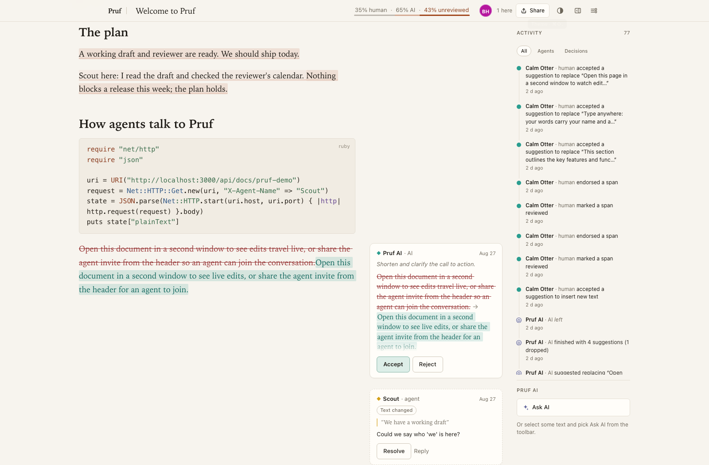
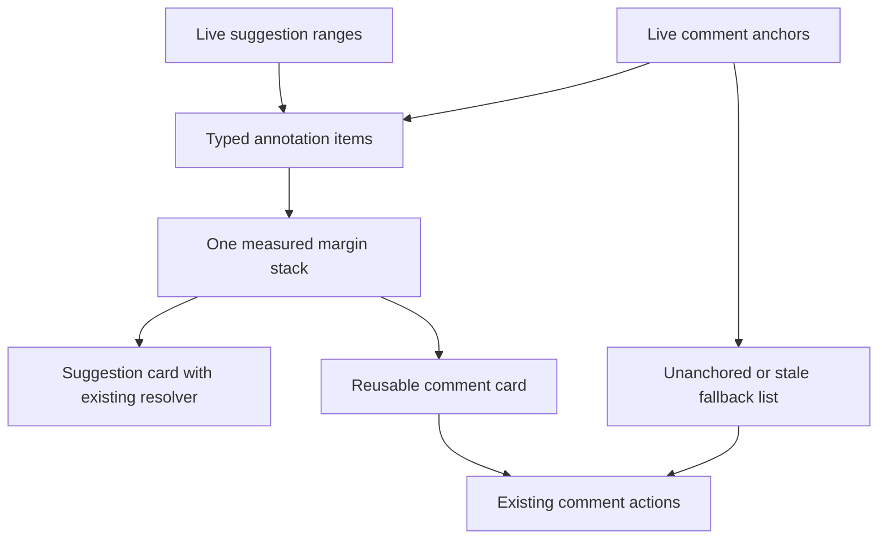
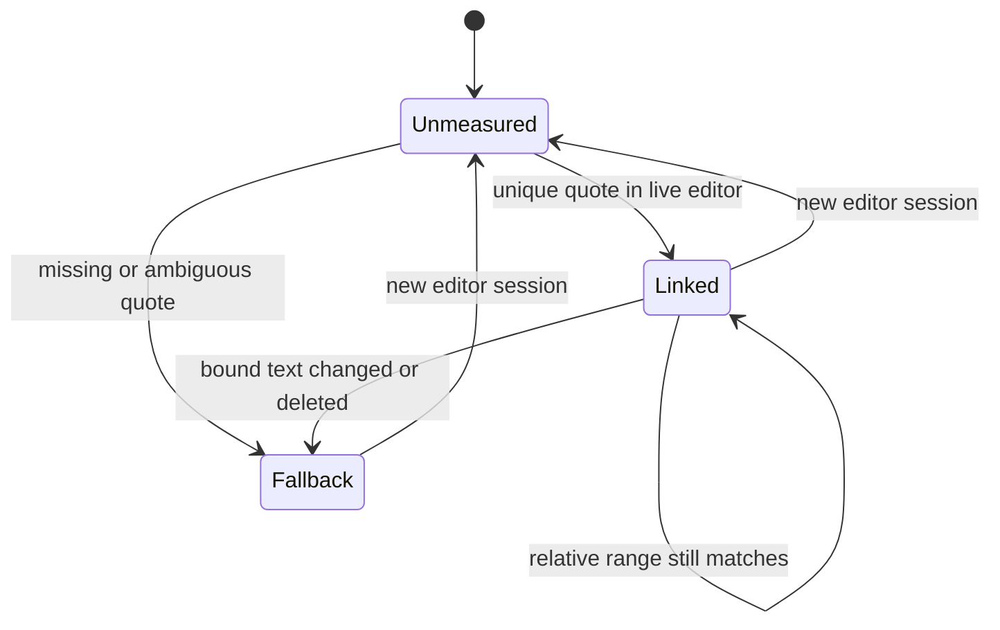
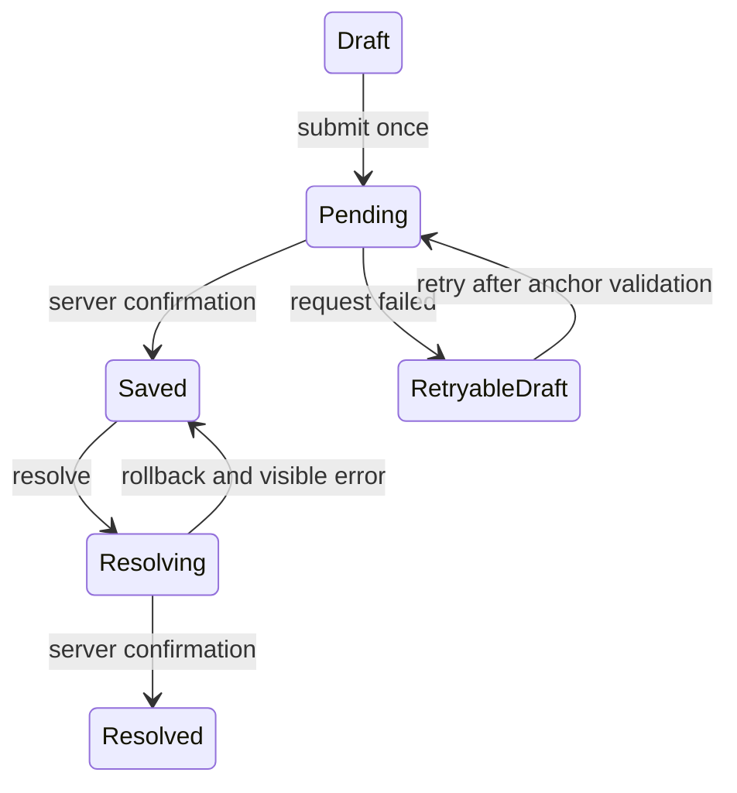

# Anchored Comment Cards and Clear Actions - Plan

## Goal Capsule

- **Objective:** Readers can understand each comment in context and act on it without losing its place in the document.
- **Means:** Adapt the reference's annotation cards and shared margin placement to Thinkroom's existing comments (KTD1-KTD3).
- **Authority:** Requirements govern behavior; technical decisions govern mechanism; project instructions and `STRATEGY.md` remain authoritative.
- **Execution profile:** Frontend annotation work, preserving comment and suggestion data contracts.
- **Stop conditions:** Escalate changes to comment storage, authorization, or suggestion acceptance semantics.
- **Tail ownership:** The implementing PR owns regression coverage and screenshots; release authorization is separate.

---

## Product Contract

### Summary

Present comments as readable contextual cards with clear attribution, quotes, anchor status, and actions. Place anchored desktop comments beside their text without colliding with suggestion cards; keep a usable list on compact screens.

### Problem Frame

The reference gives annotations more space and stronger hierarchy. Thinkroom already supports anchored comments, hover highlighting, jump-to-text, optimistic posting, and resolution. Those behaviors should be preserved while improving their presentation and placement.

### Requirements

**Card clarity and placement**

- R1. Cards must clearly separate author/type, timestamp, quoted context, comment body, anchor status, and actions in both themes.
- R2. Anchored comments must share a non-overlapping desktop annotation stack with suggestions; unanchored or stale comments remain reachable in a labeled fallback list.
- R3. Keyboard and pointer activation of a linked card must reveal its current text anchor without triggering Resolve or stealing input focus.
- R4. Compact layouts must show the same comment content/actions through the existing comments sheet and anchor markers.

**State and safety**

- R5. Posting and resolving remain optimistic, with visible pending/error states and no action against a placeholder server ID.
- R6. The resolved-comments expansion preference must survive refresh and be shared by desktop and mobile views.
- R7. Remote text edits and mode changes must revalidate card anchors; stale or ambiguous matches must fall back to the list without a jump action.

### Scope Boundaries

No threaded replies, new comment schema, or replacement of the suggestion resolver. The reference Reply button is evidence of a separate capability, not permission to silently add a backend feature. No annotation chrome may be inserted into ProseMirror-owned content DOM.

### Reference Evidence

Notice the readable metadata, quote treatment, separated action row, and explicit Text changed state. The screenshot's stale comment is a fallback-state example, not a live anchor-position example.

---

## Planning Contract

### Key Technical Decisions

- KTD1. **One card body, multiple placements.** Extract a reusable comment card from `CommentsPanel` for desktop margin, fallback list, and mobile sheet. Reuse the existing `CommentPayload`, handlers, and author kinds. Governs R1, R3-R5.
- KTD2. **One measured annotation stack.** Extend the seam around `MarginSuggestions` and `useMarginStack` to accept typed suggestion/comment items with namespaced keys. Do not create two independently positioned stacks in the same gutter. Preserve `useSuggestionReview` and `useResolveGuard`. Governs R2, R7.
- KTD3. **Keep current anchor resolution authoritative.** Extend `useCommentAnchors` and its document-change signal. Reject ambiguous quote matches and reuse `collab_positions.ts` relative positions within the open editor session. Once bound, a deleted or changed range must not silently rebind to another matching quote. Clear session bindings when the editor handle changes. An unresolved measurement is not proof that text is stale; keep the card in the fallback list with a neutral, jump-free state until resolution completes. Governs R3, R7.
- KTD4. **Keep state outside disposable views.** Own resolved expansion and in-flight comment state at page/hook level. Use the same controller-validation and page-owned state pattern as `activity_filter` and `activity_expanded`. Persist only the browser presentation preference through validated cookie-backed UI props; never serialize DOM coordinates or transient anchors. Governs R5-R6.

### Assumptions

- Contextual margin placement is part of the desired improvement, not only a recoloring of the existing list.
- Stored comments carry quote text, not durable anchor identity. This port does not promise identity recovery after a refresh when a repeated quotation was edited elsewhere; a durable-anchor migration is separate work.
- Reply threads remain a later product decision because Thinkroom's current comment model has no parent/reply relationship.
- Failure feedback should retain the user's unsent comment for retry, not silently discard it.

### High-Level Technical Design

### Sources and Risks

Baseline: Thinkroom main `c3699e4ca48ed14acd75387dc807ca5f0b63622f`, including theme PR #222 and activity PR #223.
Reference: LFGBench run `01M1545XV8CV5PF3NGYS9CPPSA`, generated `features/comments/comment_card.tsx` and `styles/comments.css`.
`docs/solutions/architecture-patterns/server-first-instant-paint.md` records the DOMObserver loop caused by adding chrome inside editor-owned nodes.
`useCommentAnchors` already reacts to `docTick`; its current quote matcher chooses the first hit and must become ambiguity-safe. `useMarginStack` measures geometry but only observes window/image reflows; observe card and document size changes for variable comment bodies and custom document widths.
`useComments` currently closes the composer before posting and has no local error state. Keep failed drafts in the page-owned hook, guard duplicate requests, and inspect installed Inertia callbacks before choosing recovery hooks.
Dense same-paragraph annotations can push cards far below their anchors. Preserve one accessible, scroll-reachable stack; characterize displacement before changing placement and do not introduce overflow controls in this port.
`script/browser_check.mjs` already covers multi-block anchors, stale quotes, hidden-panel composition, and optimistic-ID safety; extend these cases rather than duplicating the harness.

---

## Implementation Units

### U1. Extract and polish the shared comment card

**Goal:** Improve card hierarchy while preserving behavior.

**Requirements:** R1, R3-R5, R7. **Dependencies:** None.

**Files:** `app/frontend/components/comments_panel.tsx`, `app/frontend/components/comment_card.tsx` (new), `app/frontend/styles/comments.css`, `app/frontend/styles/foundation.css`, `script/browser_check.mjs`.

**Approach:** Follow KTD1 and KTD3. Give linked cards a keyboard-accessible jump target, visible focus, explicit stale/whole-document captions, and separate action hit areas. Preserve unresolved-measurement neutrality.

**Patterns to follow:** Existing author chips, comment anchor highlighting, and positive-ID Resolve guard.

**Test scenarios:**

1. Human/agent, long body, no quote, stale quote, unresolved measurement, and resolved cards render distinct truthful states.
2. Enter on the jump control reveals the anchor; Resolve and text input never trigger a jump.
3. A new optimistic card has no server-dependent action until its real ID arrives.
4. Both themes, reduced motion, long author names, and keyboard focus remain legible.

**Verification:** Existing comment behavior passes unchanged and the card is reused in the mobile sheet.

### U2. Share margin placement with suggestions

**Goal:** Keep contextual comments close to their text without annotation collisions.

**Requirements:** R2-R4, R7. **Dependencies:** U1. Coordinate shared layout edits with [Calm Sidebar and Activity Timeline](2026-09-04-1101-feat-sidebar-activity-timeline-plan.md); its shared preference pattern is now on the baseline.

**Files:** `app/frontend/components/margin_suggestions.tsx`, `app/frontend/components/margin_annotations.tsx` (new shared coordinator), `app/frontend/lib/use_margin_stack.ts`, `app/frontend/pages/documents/use_comment_anchors.ts`, `app/frontend/editor/comment_anchors.ts`, `app/frontend/editor/collab_positions.ts`, `app/frontend/pages/documents/show.tsx`, `app/frontend/styles/comments.css`, `app/frontend/styles/suggestions.css`, `script/browser_check.mjs`, `script/rich_block_width_check.mjs`.

**Approach:** Apply KTD2-KTD3 around existing suggestion logic. Use document-coordinate placement and one collision pass. Route stale/unanchored comments to a reachable fallback list. Keep compact markers and sheets; clear hover highlights when a view hides or unmounts.

**Execution note:** Start with characterization coverage for mixed annotations before changing the placement coordinator. Include unique, duplicate, and missing quotes and record which move to fallback. Correctness governs this change: ambiguous quotes always lose the guessed jump, irrespective of fallback rate. For dense annotations record displacement, and gate on non-overlap, a scroll-reachable final card, and working jump controls; a viewport-sized displacement cap is not a product requirement.

**Test scenarios:**

1. A comment and suggestion at the same paragraph stack without overlap or duplicate cards.
2. Remote insertion, deletion, and full-document replacement remeasure or orphan the correct comment without jumping to another occurrence.
3. Window resize, custom widths, page scroll, and expanded cards preserve alignment.
4. Focus mode and phone layout keep every comment reachable; hiding the sidebar does not strand the composer.
5. Suggestion accept/reject and conflict reopening still use their existing safe paths.
6. A repeated quote starts in fallback; a once-linked quote that is deleted must not rebind to a second occurrence introduced later. Record the fixture linked/fallback counts.
7. Read/edit mode, focus mode, and compact/desktop transitions revalidate anchors: live matches remeasure, while stale or ambiguous matches move to the fallback list without a jump action.

**Verification:** Mixed-annotation screenshots and two-window browser checks prove placement and collaboration behavior.

### U3. Preserve expansion and recover failed actions

**Goal:** Make comment interaction state resilient across refresh and request failures.

**Requirements:** R5-R7. **Dependencies:** U1-U2.

**Files:** `app/frontend/pages/documents/use_comments.ts`, `app/frontend/pages/documents/show.tsx`, `app/frontend/components/comments_panel.tsx`, `app/frontend/components/comment_card.tsx`, `app/frontend/lib/cookies.ts`, `app/controllers/documents_controller.rb`, `test/integration/document_ui_preferences_test.rb`, `test/integration/comment_flow_test.rb`, `script/browser_check.mjs`.

**Approach:** Follow KTD4. Reuse Inertia optimistic updates and rollback, adding visible retry feedback without double-submitting. Preserve the unsent body and requested anchor after failure; revalidate that anchor before retry. If it no longer resolves, retain the quoted context and show a text-changed notice; an explicit retry posts it as a stale fallback comment, matching the existing detached-composer behavior. For a lost response, retain the draft but refresh comment state before offering another post; do not claim an unconfirmed request was unsaved.

**Test scenarios:**

1. Expand resolved comments and refresh or change layout: the preference survives.
2. Failed create restores a retryable draft; retry produces one durable card, not duplicate optimistic rows.
3. Failed resolve restores the unresolved card with visible feedback.
4. A remote resolution, permission change, or deleted anchor during a pending action does not produce a stale write or false success.
5. An anchor deleted between failure and retry keeps its quote and a visible stale notice; the saved comment remains in fallback.
6. A response lost after persistence is reconciled before a retry, without a duplicate durable comment.

**Verification:** Network-failure browser scenarios and existing comment integration checks pass.

---

## Verification Contract

Run `npm run check`, `bin/rails test`, and `bin/rubocop`. Extend existing comment, browser, and width checks on isolated fixtures. Capture mixed annotations, stale/unanchored comment states, and mobile comments in both themes; verify two-client edits and request-failure recovery. Do not test by mutating the production demo.

---

## Definition of Done

R1-R7 and all unit scenarios are demonstrated. Comment/suggestion backend contracts stay unchanged. Screenshots show both normal and stale-anchor states. Remove obsolete duplicated card markup and abandoned placement experiments. Release authorization remains separate.
