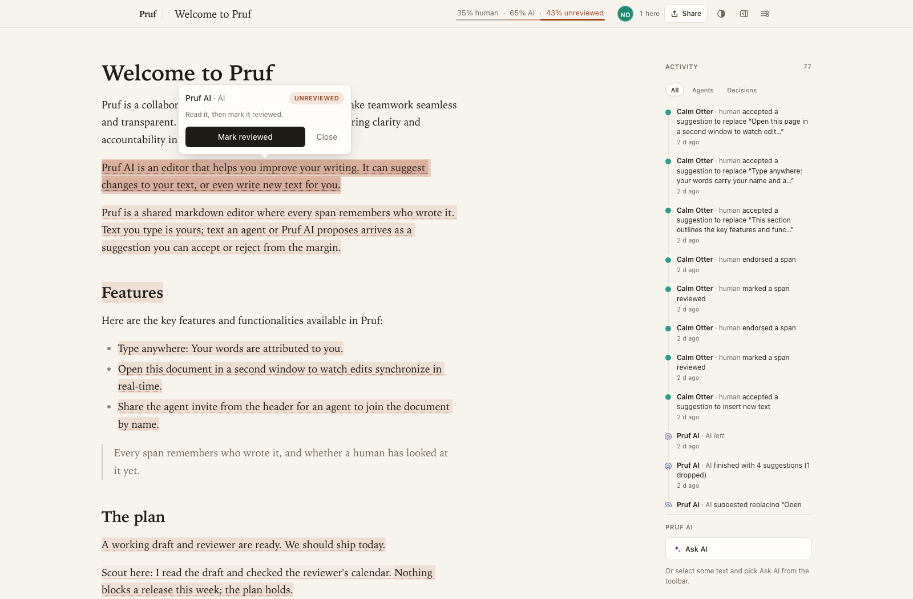
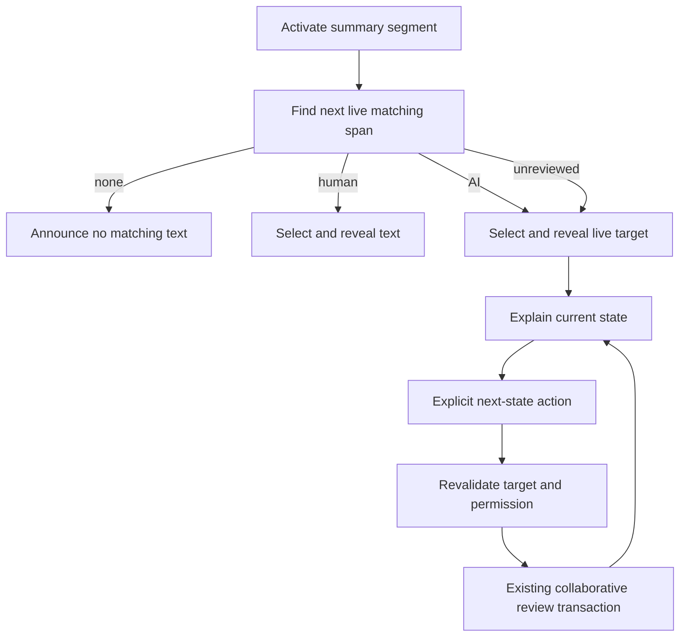
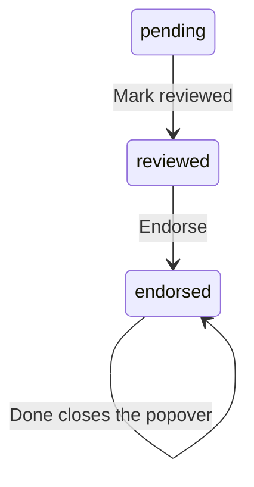

# Guided Provenance Review - Plan

## Goal Capsule

- **Objective:** A reader can find text that needs human attention and understand the next review action without searching the document manually.
- **Means:** Connect the provenance summary to live text navigation and an explanatory review popover (KTD1-KTD3).
- **Authority:** Requirements govern behavior; technical decisions govern mechanism; project instructions and `STRATEGY.md` remain authoritative.
- **Execution profile:** Characterization-first editor integration, preserving current provenance and collaboration contracts.
- **Stop conditions:** Escalate any need to redefine endorsement, widen write permissions, or change serialized provenance.
- **Tail ownership:** The implementing PR owns collaboration and permission evidence; release authorization is separate.

---

## Product Contract

### Summary

Turn the provenance summary into a way to move through the document. Explain the current review state and the next deliberate human action at the selected text.

### Problem Frame

Thinkroom's `ProvenanceSummaryChip` renders percentages as spans. Its review popover already advances the current text from pending to reviewed to endorsed, but offers little guidance. The reference connects clickable summary segments to the next matching passage and explains each step.

### Requirements

**Find and understand**

- R1. Human, AI, and unreviewed summary segments must navigate to the next matching live span in document order, wrapping once from the end.
- R2. AI and unreviewed navigation must reveal the target and open a popover with attribution, a readable state, a short explanation, and its next action.
- R3. Keep the explicit progression pending → reviewed → endorsed; the endorsed view provides Done. Neither navigation nor closing the popover changes review state.
- R4. Empty documents, zero matching spans, and all-reviewed documents must have a clear non-mutating completion/empty state rather than an endless search or stale target.

**Collaboration and access**

- R5. Review changes must update text treatment and summary immediately through the existing collaborative document path, then survive reload and converge across clients.
- R6. Revalidate the active target after local or remote edits; removed or changed attribution must never result in reviewing unrelated text.
- R7. Keyboard/touch access, Escape, focus return, and viewport placement must work without hiding the targeted passage.
- R8. Review actions must respect current mode and write authority; agents do not acquire new human-review capabilities.

### Scope Boundaries

No automatic endorsement, bulk review, new review-log endpoint, provenance format change, or replacement of suggestion accept/reject. Preserve existing editor undo semantics rather than copying the reference's undo-excluded review transactions without a separate decision.

### Reference Evidence

Captured after clicking the unreviewed summary. The target is highlighted and the popover says what to do next. No review state was changed during this capture.

---

## Planning Contract

### Key Technical Decisions

- KTD1. **Navigate the live editor model, not DOM text matches.** Add next-span discovery beside existing provenance helpers and use actual mark ranges. Formatting splits may join only when attribution/state and contiguity agree. Governs R1, R4, R6.
- KTD2. **Retain Thinkroom's review operation.** Reuse `applyReviewState`, `SKIP_PROVENANCE`, and existing Yjs persistence. Validate the next transition and current authority at action time. The benchmark uses different attributes and a separate log endpoint; neither is portable unchanged. Governs R3, R5-R6, R8.
- KTD3. **One live review target.** Extend existing text-target/floating-chrome ownership. Reuse `collab_positions.ts` for a collaborative relative anchor across whole-document remote replacement; rederive the current span before display and before mutation. Never cache bare offsets as durable truth. Governs R2, R6-R7.
- KTD4. **Keep navigation separate from approval.** Summary activation selects the next span; the popover advances only that span. Do not auto-jump after Mark reviewed because the reader may still choose Endorse. Governs R1-R3.

### Assumptions

- The reference's guided progression is the desired behavior, not a batch-approval workflow.
- A pending-state summary remains discoverable at zero with a non-mutating all-reviewed explanation.
- Review targets and popover coordinates are transient. Persisted review state lives in the document; persistent workspace preferences remain owned by the theme/sidebar plans.

### High-Level Technical Design

### Sources and Risks

Baseline: Thinkroom main `259fad051e62b0f03bcf34b1cd3dda1102e4ed28`.
Reference: LFGBench run `01M1545XV8CV5PF3NGYS9CPPSA`, generated `features/summary/summary_bar.tsx`, `features/review/use_review.ts`, `features/review/review_range.ts`, and `features/review/review_popover.tsx`.
Read `docs/solutions/architecture-patterns/server-first-instant-paint.md` before changing editor chrome: DOM mutation loops previously swallowed review clicks.
`collab_positions.ts` already handles the prebundled y-sync plugin-key identity trap; reuse it instead of copying the benchmark helper. Current `handleAdvance` reads the live selection; a new navigation feature must not turn an old cached span into a mutation target.

---

## Implementation Units

### U1. Add live provenance navigation

**Goal:** Make the summary reveal the next relevant passage.

**Requirements:** R1-R2, R4, R6-R7. **Dependencies:** None.

**Files:** `app/frontend/editor/provenance/review.ts`, `app/frontend/editor/provenance/index.ts`, `app/frontend/components/provenance_summary.tsx`, `app/frontend/pages/documents/show.tsx`, `app/frontend/styles/review_chrome.css`, `script/browser_check.mjs`.

**Approach:** Apply KTD1 and KTD4. Expose callbacks on the summary instead of fetching data. Use live selection/ranges to order traversal and wrap once; report the no-match condition accessibly.

**Execution note:** Add characterization cases for the current summary and review-state behavior before wiring navigation.

**Test scenarios:**

1. Mixed human, pending, reviewed, and endorsed text navigates each segment to the correct next range.
2. Cursor at the end wraps once; a single matching range does not create an infinite loop.
3. Empty document and zero-unreviewed state produce no mutation and clear feedback.
4. Formatting splits, adjacent authors, table cells, and repeated text do not select a wrong passage.
5. Summary segments have accessible names and roles and support keyboard/touch activation; no-match feedback is announced to assistive technology.

**Verification:** Summary navigation works entirely from current editor state and leaves document content unchanged.

### U2. Add explanatory review progression

**Goal:** Make the current state and next human action obvious.

**Requirements:** R2-R3, R5, R7-R8. **Dependencies:** U1.

**Files:** `app/frontend/components/review_popover.tsx`, `app/frontend/pages/documents/use_floating_chrome.ts`, `app/frontend/pages/documents/show.tsx`, `app/frontend/styles/review_chrome.css`, `app/frontend/styles/mobile.css`, `script/browser_check.mjs`, `script/native_shell_check.mjs`.

**Approach:** Apply KTD2-KTD4. Keep a stable action control through state changes, add explanatory copy and Done, and adapt existing anchored-popover mechanics for narrow/touch views. Hide or disable mutation actions without current write authority.

**Test scenarios:**

1. Pending → reviewed → endorsed updates the helper text, tint, summary, and next action without dismissing focus.
2. Done/Escape closes without changing state; returning to the document preserves the intended caret/selection.
3. Phone viewport, zoom, and scrolling keep the action visible without covering the target.
4. Read-only and comment-only viewers cannot review text; a mode/permission change closes or disables an already-open action.

**Verification:** The screenshot matches the reference's clarity; navigation never implies endorsement.

### U3. Harden live targets and collaborative persistence

**Goal:** Ensure guidance always refers to the text that will actually be reviewed.

**Requirements:** R3, R5-R8. **Dependencies:** U1-U2.

**Files:** `app/frontend/editor/provenance/review.ts`, `app/frontend/pages/documents/show.tsx`, `app/frontend/pages/documents/use_floating_chrome.ts`, `app/frontend/editor/collab_positions.ts`, `app/frontend/editor/collab_session.ts` (existing seams; change only if required), `script/browser_check.mjs`, `script/sync_check.mjs`, `test/integration/document_mode_routing_test.rb`, `test/channels/sync_channel_test.rb`.

**Approach:** Follow KTD2-KTD3 around existing collaboration. Resolve the active anchor before each action; if the span vanished or changed identity, close safely. Preserve current serialization and undo behavior. Use existing connection/save feedback when persistence is unavailable.

**Test scenarios:**

1. Another client inserts before, edits inside, deletes, or replaces the target while the popover is open: the action remains attached correctly or closes.
2. Another client advances the state: the stale action does not regress or skip the live transition.
3. Review, reload, and open a second client: all agree on state and percentages.
4. Connection interruption never displays a new guarantee of durable save; reconnection converges through the existing sync path.
5. Undo/redo and mode changes retain current semantics; agent contributions still arrive as unreviewed where the current contract requires it.

**Verification:** Two-client and reload evidence prove convergence, not only a single local render.

---

## Verification Contract

Run `npm run check`, `bin/rails test`, and `bin/rubocop`. Extend browser, native-shell, sync, mode-routing, and channel coverage named above. Use isolated documents with controlled mixed provenance; never mutate the production demo for verification. Include keyboard, phone, empty-state, and remote-edit screenshots or recordings.

---

## Definition of Done

R1-R8 and all unit scenarios are demonstrated. Existing provenance serialization and permissions remain intact. The PR includes the full human review progression and a two-client result, with no abandoned navigation or anchor experiments. No deployment is implied by publication of this plan.
