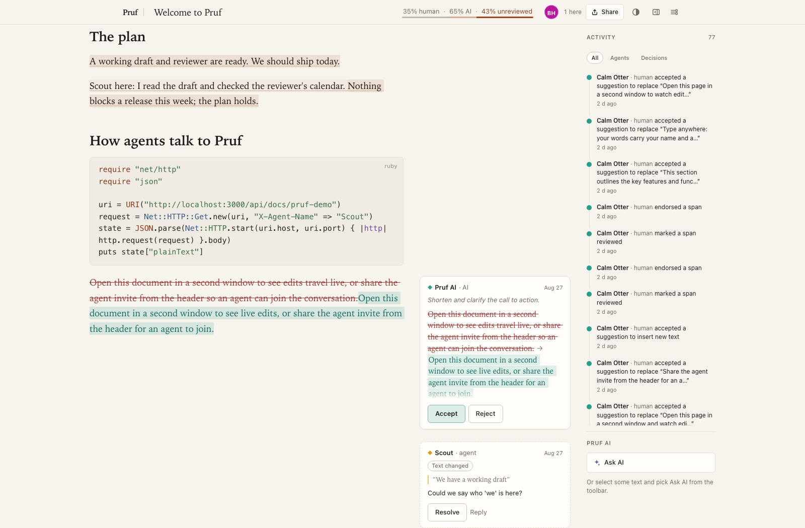
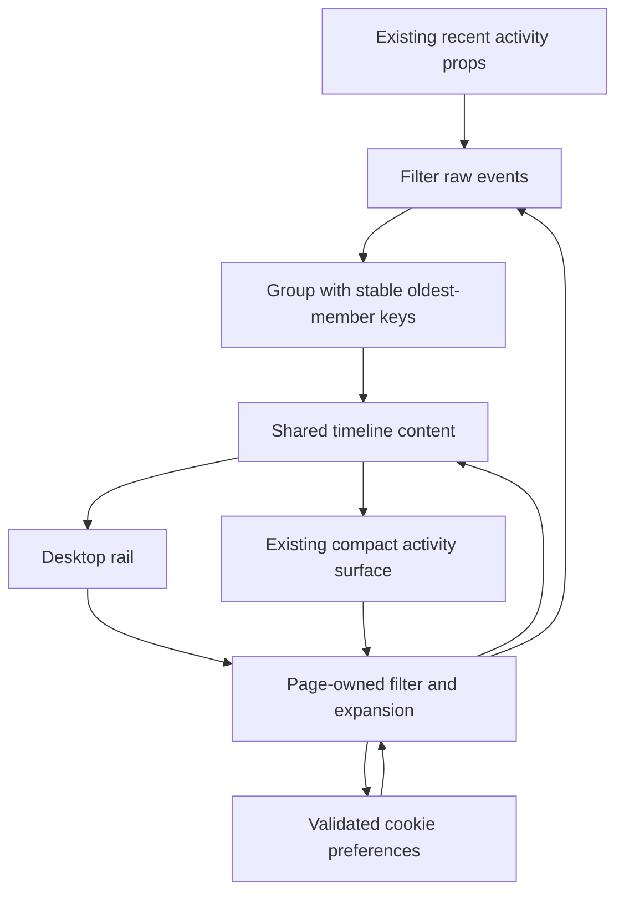

# Calm Sidebar and Activity Timeline - Plan

## Goal Capsule

- **Objective:** Readers can scan collaborator activity without losing the document or their preferred workspace layout.
- **Means:** Adapt the benchmark's quiet sidebar hierarchy, timeline, and filters using existing activity props (KTD1-KTD3).
- **Authority:** Requirements govern behavior; technical decisions govern mechanism; project instructions and `STRATEGY.md` remain authoritative.
- **Execution profile:** Presentation and browser-preference work; no new activity service or database schema.
- **Stop conditions:** Escalate any need to alter event semantics, permissions, or historical retention.
- **Tail ownership:** The implementing PR owns tests and screenshots; release authorization is separate.

---

## Product Contract

### Summary

Give the activity sidebar a clearer timeline, quieter hierarchy, and useful filters. Keep sidebar visibility and feed presentation stable across refreshes and responsive layouts.

### Problem Frame

The user prefers the benchmark sidebar. Thinkroom currently places comments, the highlight legend, and a compact grouped activity list in one normal-flow rail. The reference separates tools from document annotations and makes activity easier to scan with aligned dots, actor labels, timestamps, and filter chips.

### Requirements

**Feed presentation**

- R1. Render activity with consistent actor/type indicators, short action text, subdued timestamps, and a timeline hierarchy.
- R2. Provide All, Agents, and Decisions filters with truthful empty states and counts for the loaded activity window.
- R3. Incoming events must preserve the selected filter and expanded state without remounting retained groups or moving keyboard focus. Groups whose oldest member leaves the loaded window may be replaced.

**Workspace behavior**

- R4. Sidebar visibility, activity filter, and expanded/collapsed choice must update immediately and survive refresh.
- R5. Preserve existing panel/focus shortcuts, highlight-legend access, and mobile/native access to activity.
- R6. Keep sidebar content usable at narrow widths, 200% zoom, and reduced motion without covering the document or creating competing page scroll behavior.

### Scope Boundaries

No embedded agent, new event pipeline, historical pagination, or activity retention changes.

### Deferred to Follow-Up Work

Comment-card placement belongs to the separate comments plan.

### Reference Evidence

Borrow the timeline and filtering. The visible Ask AI section is not part of this port.

---

## Planning Contract

### Key Technical Decisions

- KTD1. **Keep the current activity source and grouping.** Filter existing `ActivityPayload` rows before grouping. Include actor kind in grouping so human and agent namesakes remain distinct. Retain stable oldest-member group keys to prevent the known replay/blink behavior. Governs R1-R3.
- KTD2. **Use a bounded, explicit filter vocabulary.** Agents includes existing `agent` and legacy `ai` actor kinds. Decisions includes accepted/rejected suggestions and resolved comments currently emitted by Thinkroom. Do not invent review events or infer decisions from prose. Show matching raw events out of loaded recent events; expansion labels count groups. Empty-filter messages also name the recent window. The controller loads only 50 recent events. Governs R2.
- KTD3. **Keep one page scroll surface.** The desktop rail grows in normal page flow, even when expanded beyond the viewport; it has no independent scrollbar. The existing mobile/native sheet scrolls while the page underneath is locked. Reuse both surfaces, with the same filter controls. Governs R5-R6.
- KTD4. **Page-owned presentation preferences.** Retain `pruf_panel` and `pruf_focus`. Add validated cookie-backed filter/expansion props alongside current UI preferences so first paint and all mounted activity views agree. Expansion reuses the existing Show all / Show fewer control: six grouped rows when collapsed, all loaded matching groups when expanded. Governs R3-R4.

### Assumptions

- The activity filter and expansion choice are browser-wide presentation preferences, not shared document state.
- A saved filter remains selected on other documents even with no matching recent events; the visible pressed state and scoped empty message explain this. Rejected storage leaves current in-memory preferences usable but cannot guarantee persistence after refresh.
- The reference's timeline and filters are desired; the exact sidebar width may adapt to Thinkroom's width controls.

### High-Level Technical Design

This sketch describes ownership and ordering, not a prescribed component API.

### Sources and Risks

Baseline refreshed after the theme port: Thinkroom main `64708c8704e8a1a3e2d944de12af0f6910effff0` (PR #222).
Reference: LFGBench run `01M1545XV8CV5PF3NGYS9CPPSA`, generated `app/frontend/components/sidebar.tsx`, `features/activity/activity_panel.tsx`, and `styles/sidebar.css`.
`app/models/activity.rb` caps `recent` at 50; do not present a filtered count as lifetime history.
`ActivityPanel` documents stable keys and hydration-safe relative timestamps; preserve both.
`documents/show.tsx` mounts the same activity component in the desktop rail and mobile/native sheet. Its page-owned panel, focus, width, and theme preferences already establish the SSR-cookie pattern; use that ownership for both activity views. Keep existing keyboard routing in `lib/shortcuts.ts` unchanged.

Filtering can bring formerly separated rows together. The oldest-member key remains stable while that member is in the loaded window; eviction at the 50-event boundary can legitimately replace a row.

---

## Implementation Units

### U1. Restyle the rail and timeline

**Goal:** Improve hierarchy without changing document geometry or event behavior.

**Requirements:** R1, R3, R5-R6. **Dependencies:** None.

**Files:** `app/frontend/components/activity_panel.tsx`, `app/frontend/styles/rail.css`, `app/frontend/styles/collab.css`, `app/frontend/styles/mobile.css`, `app/frontend/pages/documents/show.tsx`, `script/browser_check.mjs`, `script/native_shell_check.mjs`.

**Approach:** Apply KTD1 and KTD3. Use existing theme variables for dots, connectors, labels, and separators. Preserve the highlight legend and established responsive access paths.

**Patterns to follow:** Stable activity-group keys, narrow timestamp hydration suppression, and existing rail breakpoints.

**Test scenarios:**

1. Human, agent (including legacy `ai`), and system rows remain distinguishable in each theme.
2. A new event joins an existing group without replaying its entrance animation or resetting focus.
3. At phone/tablet/desktop widths and 200% zoom, all tools remain reachable without obscuring prose.
4. Read mode retains the highlight legend when highlights exist; review-only tools remain absent.
5. With reduced motion enabled, entrance and connector transitions are suppressed while the timeline remains legible.
6. With more rows than fit the viewport, desktop rail overflow remains visible and only the page scrolls; the compact sheet locks the page underneath.

**Verification:** Before/after screenshots show hierarchy. Browser checks assert retained row-node identity and keyboard focus across an incoming event; collaboration and native-shell checks still pass.

### U2. Add activity filters and honest counts

**Goal:** Let readers focus on agent work or human decisions.

**Requirements:** R2-R3. **Dependencies:** U1.

**Files:** `app/frontend/components/activity_panel.tsx`, `app/frontend/types/payloads.ts` (reuse existing contract), `app/frontend/styles/collab.css`, `script/browser_check.mjs`, `script/meta_refresh_check.mjs`.

**Approach:** Apply KTD1-KTD2 to the supplied activity array. Use accessible pressed-state buttons, distinct empty-feed and empty-filter messages, and stable grouping after filtering.

**Test scenarios:**

1. A mixed feed filters to the specified actor/action sets; unknown actions remain visible under All.
2. Counts distinguish raw loaded events from displayed groups and never claim total history.
3. An event arriving while Decisions is selected updates the matching feed without clearing the selection.
4. No matching events show an empty-filter message, not an empty-document claim.
5. Human and agent events sharing a display name stay separate, including after filtering; eviction from the recent window does not imply lifetime counts.

**Verification:** Filtering performs no additional fetch and preserves the 50-event server window.

### U3. Persist presentation across views and refresh

**Goal:** Keep the workspace as the reader left it.

**Requirements:** R3-R6. **Dependencies:** U1-U2.

**Files:** `app/controllers/documents_controller.rb`, `app/frontend/pages/documents/show.tsx`, `app/frontend/components/activity_panel.tsx`, `app/frontend/components/header_menu.tsx`, `app/frontend/lib/cookies.ts`, `test/integration/document_ui_preferences_test.rb`, `script/browser_check.mjs`.

**Approach:** Follow KTD4. Share controlled state between sidebar and compact activity views. Validate defaults on the server and update memory synchronously on user action; do not persist hover or popover coordinates.

**Test scenarios:**

1. Choose a filter/expansion state, hide the panel, refresh, then reopen: choices remain unchanged.
2. Change viewport or switch modes and return: the same presentation choices are restored.
3. Invalid saved values or rejected storage do not crash the page.
4. Panel/focus shortcuts update the same state as menu actions and do not fire while typing a comment.

**Verification:** SSR preference tests and browser refresh checks agree; no preference leaks to collaborators.

---

## Verification Contract

Run existing `npm run check`, `bin/rails test`, and `bin/rubocop` gates. Extend the named browser/meta-refresh/native checks using isolated fixture documents. Capture both themes at narrow and wide widths and include an incoming-event example.

---

## Definition of Done

R1-R6 and all unit scenarios are demonstrated. No event schema or retention change is required. The PR contains screenshots, preserves existing shortcuts, and removes unused presentation experiments. Deployment is not part of this planning artifact.
