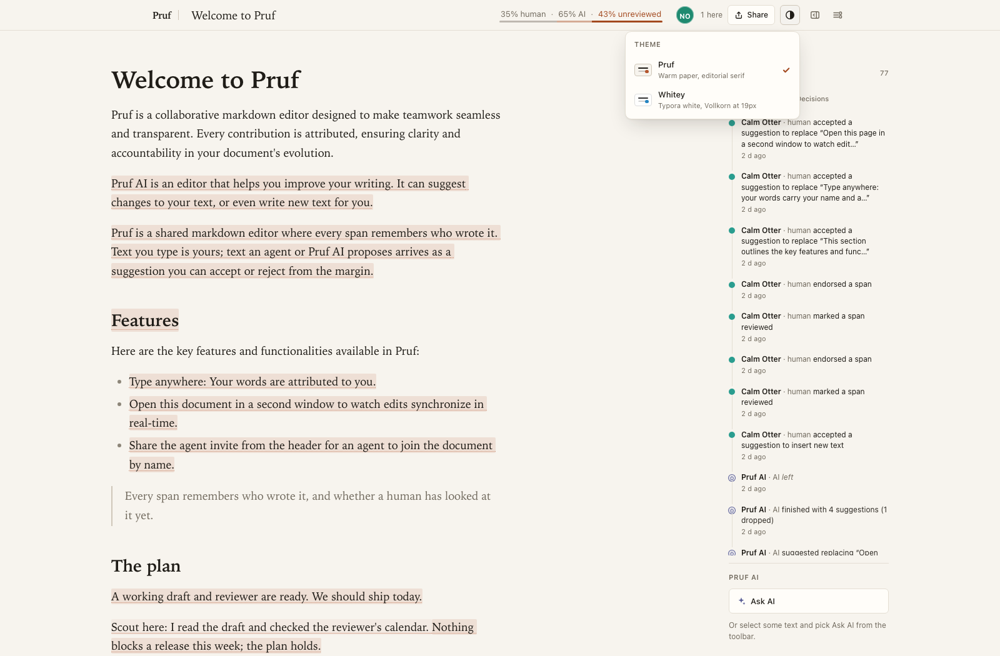
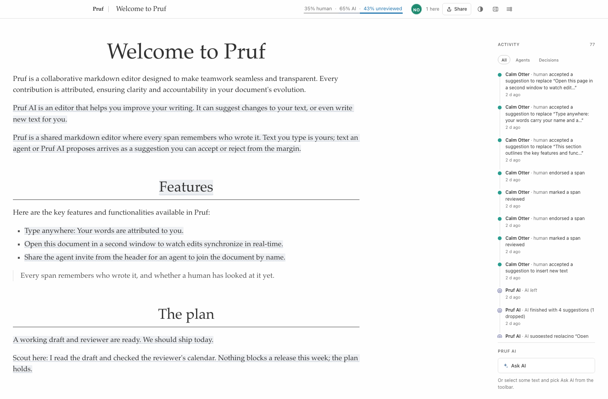
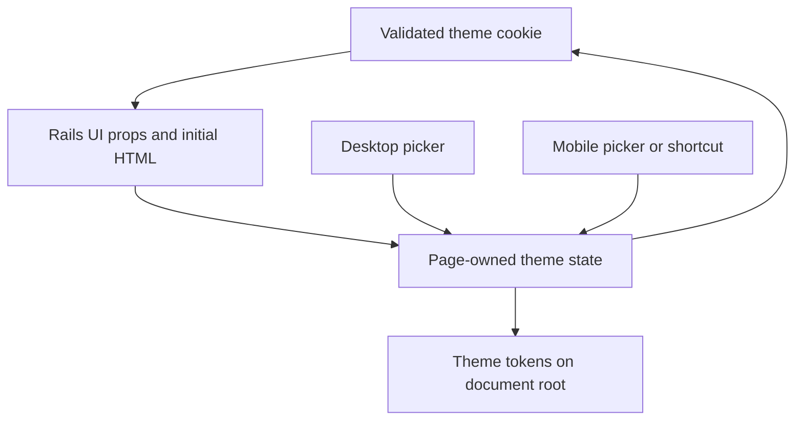

# Theme Picker and Theme Fidelity - Plan

## Goal Capsule

- **Objective:** Readers can find, choose, and keep the document appearance they prefer without losing their place.
- **Means:** Adapt the reference picker and theme treatment to Thinkroom's existing preferences and chrome (KTD1-KTD3).
- **Authority:** Requirements govern behavior; technical decisions govern mechanism; units implement both. Thinkroom's project instructions and `STRATEGY.md` remain authoritative.
- **Execution profile:** Bounded frontend work with server-rendered preference coverage. This document authorizes no deployment by itself.
- **Stop conditions:** Escalate any need to change collaboration, ownership, or document storage contracts.
- **Tail ownership:** The implementing PR owns verification and visual evidence; deployment requires the project's normal release authorization.

---

## Product Contract

### Summary

Make themes a first-class, accessible control with descriptive previews and consistent page-wide styling. Keep Thinkroom's branding, saved preferences, and custom reading widths.

### Problem Frame

The user prefers the benchmark's theme switcher. Thinkroom already applies themes immediately and persists `proof_theme`; the missing value is discoverability, richer presentation of the existing choices, and coherent visual treatment, not basic persistence.

### Requirements

**Choosing a theme**

- R1. Provide a directly discoverable desktop theme trigger and equivalent compact/mobile access, with a swatch, name, description, and selected indicator for each choice.
- R2. Pointer and keyboard interaction must expose the same selection and keep every mounted picker synchronized.
- R3. Theme changes must update the document and surrounding controls immediately without remounting the editor or losing selection; keep the reader's visible text block at its viewport position when typography reflows.

**Remembering and rendering**

- R4. A saved choice must match the initial HTML and hydrated UI on refresh, including legacy `proof` and `whitey` values.
- R5. Preserve explicit document and rich-content widths when switching themes; unset widths use the active theme's defaults.
- R6. Respect reduced motion and keep provenance, code, comments, suggestions, highlights, and sketches legible in both themes.
- R7. Provide a discoverable shortcut to cycle between the two themes without stealing bold, existing mode/panel/focus shortcuts, text entry, or browser commands.

### Scope Boundaries

No new theme system, dark mode, account-level preference service, editor replacement, or document data migration. Do not copy the reference's embedded AI feature.

### Reference Evidence

The dedicated trigger opens two descriptive rows with visual swatches. This is the interaction reference, not a pixel-for-pixel requirement.

Whitey changes typography and page treatment, not just background color. Preserve Thinkroom's responsive width controls rather than copying the reference's wide layout literally.

---

## Planning Contract

### Key Technical Decisions

- KTD1. **One page-owned theme state, seeded by Rails.** Extend `ui_prefs` and pass the selected theme to controlled picker instances. Reuse `lib/cookies.ts`; retain `proof_theme` and its existing values. This avoids independent picker state and module-global SSR state. Governs R2-R4.
- KTD2. **Reuse the existing popover shell and token layer.** Extend `ThemePicker` with reusable options rather than introducing another overlay library. Keep `foundation.css` as the theme owner and audit component-specific overrides. Governs R1, R3, R5-R6.
- KTD3. **Match exact keyboard chords.** Consolidate affected chrome shortcut matching and visible labels. The reference uses Mod+Shift+Period; validate it on target browsers and the native shell before adopting it. If it conflicts, select and verify an unclaimed modifier chord and record the shipped chord with its UI label in the PR. Preserve Mod+Backslash and Mod+Period. Governs R7.
- KTD4. **Follow native radio-group behavior.** Arrow navigation changes selection while the group remains open; explicit activation or Escape can close it and restore trigger focus without reverting the applied choice. This avoids closing the group after the first arrow key. Governs R2. See [WAI radio-group guidance](https://www.w3.org/WAI/ARIA/apg/patterns/radio/).

### Assumptions

- The user wants the reference's warm-paper and clean editorial-white styles, including the Whitey serif direction, adapted to Thinkroom rather than a branding transplant.
- Storage failures should preserve the current in-memory choice without crashing; durable persistence cannot be promised when the browser rejects all storage.
- Browser preferences remain local to the browser, not shared with collaborators.

### High-Level Technical Design

### Sources and Risks

Current baseline: Thinkroom main `259fad051e62b0f03bcf34b1cd3dda1102e4ed28`.
Revalidated for implementation against the same main commit on 2026-09-04. [Issue 218](https://github.com/kieranklaassen/thinkroom/issues/218) is the shipping scope; land this improvement before starting the sidebar, comments, or guided-review issues.
Reference source: LFGBench run `01M1545XV8CV5PF3NGYS9CPPSA`, `app/frontend/features/theme/theme_picker.tsx`, `features/theme/use_theme.ts`, `lib/prefs.ts`, and `features/focus/shortcuts.ts` within its generated workspace.
Use `docs/solutions/architecture-patterns/server-first-instant-paint.md` for first-paint constraints.
If an external store proves necessary, its server snapshot must match hydration; do not copy a process-global mutable store into SSR ([React guidance](https://react.dev/reference/react/useSyncExternalStore)).

---

## Implementation Units

### U1. Make theme state shared and first-paint safe

**Goal:** Establish a single current choice for all theme controls.

**Requirements:** R2-R5. **Dependencies:** None.

**Files:** `app/controllers/documents_controller.rb`, `app/views/layouts/application.html.erb`, `app/frontend/pages/documents/show.tsx`, `app/frontend/components/theme_picker.tsx`, `app/frontend/components/header_menu.tsx`, `app/frontend/lib/cookies.ts`, `test/integration/document_ui_preferences_test.rb`, `script/browser_check.mjs`.

**Approach:** Apply KTD1 to existing UI props and callbacks. Preserve legacy keys and validate unknown values identically on server and client. Treat localStorage as optional compatibility storage, not an authority that flips a correct SSR paint.
Preserve the topmost visible text block's viewport offset across the synchronous theme change; remeasure existing anchored chrome after typography changes without inserting editor DOM.

**Patterns to follow:** Cookie-backed panel/focus/width props and controlled header toggles.

**Test scenarios:**

1. Load each saved legacy theme: initial HTML, hydrated choice, and root theme agree.
2. Change theme in one control, open another, and refresh: all show the same choice.
3. Invalid cookie and unavailable localStorage produce a safe default without an exception.
4. Switch themes with custom document/rich widths and a live editor selection: widths and selection remain intact.
5. Reject storage writes mid-session: the selected theme remains applied without an exception. Switching while reading mid-document preserves the visible text block's position.

**Verification:** Existing preference integration checks pass; no editor remount or hydration flash is introduced.

### U2. Add the descriptive picker and keyboard access

**Goal:** Make choosing a theme obvious and accessible.

**Requirements:** R1-R3, R7. **Dependencies:** U1.

**Files:** `app/frontend/components/theme_picker.tsx`, `app/frontend/components/popover_shell.tsx`, `app/frontend/components/header_menu.tsx`, `app/frontend/pages/documents/show.tsx`, `app/frontend/styles/header_controls.css`, `app/frontend/lib/shortcuts.ts` (new, only for shared chord matching), `script/browser_check.mjs`, `script/native_shell_check.mjs`.

**Approach:** Follow KTD2-KTD4. Keep compact options usable without nesting competing popovers. Update existing focus matching so the theme chord cannot also toggle focus.

**Patterns to follow:** `PopoverShell` focus/close behavior and header mode control semantics.

**Test scenarios:**

1. Mouse and touch select either theme; swatch, description, and selected state agree.
2. Tab enters at the selected radio; arrows and Space work; Escape returns focus to the trigger and keeps the arrow-selected theme applied.
3. Theme cycling fires once; repeated keydown, composition, and comment-input typing do not change preferences.
4. Bold, mode switching, panel toggle, and suggestion focus keep their existing meanings.
5. The shipped shortcut is visibly labeled in desktop and compact/native theme controls.

**Verification:** Desktop, phone, and native-shell controls remain reachable with no header overflow.

### U3. Bring theme styling into visual agreement

**Goal:** Carry the reference's page-wide theme quality into Thinkroom.

**Requirements:** R3, R5-R6. **Dependencies:** U1-U2.

**Files:** `app/frontend/styles/foundation.css`, `app/frontend/styles/editor.css`, `app/frontend/styles/header_controls.css`, `app/frontend/styles/review_chrome.css`, `app/frontend/styles/comments.css`, `app/frontend/styles/sketch.css`, `app/assets/stylesheets/application.css`, `script/browser_check.mjs`, `script/rich_block_width_check.mjs`.

**Approach:** Use KTD2 to adapt warm-paper and editorial-white typography, surfaces, borders, and accents. Keep initial-preview styling aligned with the live editor. Prefer screenshot comparison over brittle assertions of every CSS value.

**Test scenarios:**

1. Capture both themes at phone, tablet, and desktop widths with prose, code, comments, provenance, suggestions, highlights, and sketches.
2. Theme change with reduced motion enabled performs no crossfade.
3. Refresh with a selected theme shows no wrong-theme first frame or preview/editor geometry jump.
4. Unset widths follow the active theme's defaults; explicit widths survive switching. Existing annotation chrome remains aligned after the typography change.

**Verification:** The reviewer can compare the captured result to the references; no text or action loses contrast.

---

## Verification Contract

Use `npm run check`, `bin/rails test`, and `bin/rubocop` as existing gates. Extend the named browser scripts against an isolated development document, not the production demo. Run the affected browser, native-shell, and width scenarios after implementation. Capture both themes and cold-refresh evidence.

---

## Definition of Done

All R1-R7 and U1-U3 scenarios are demonstrated. Existing preferences remain compatible. The PR includes before/after screenshots and removes abandoned styling or shortcut experiments. No implementation or deployment is implied by publishing this plan.
