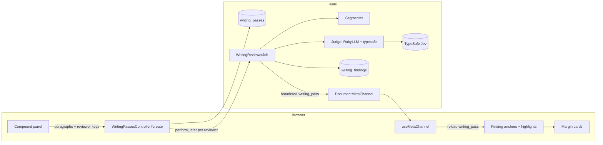
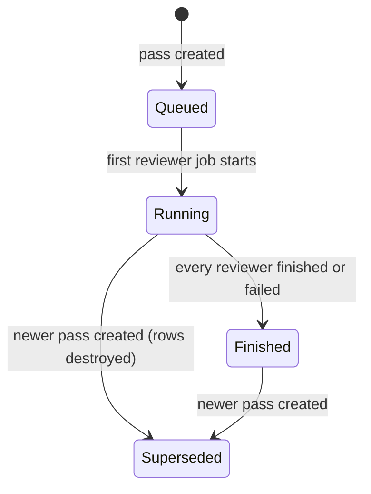
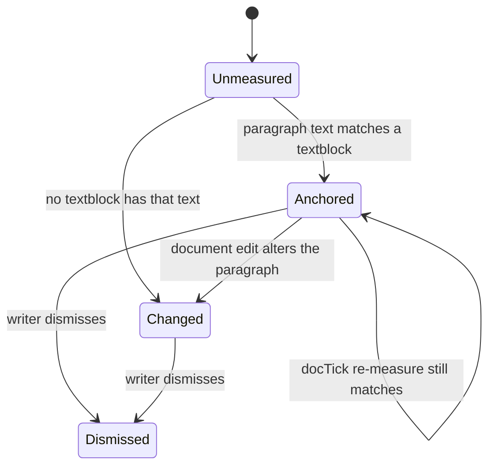

# Compound Writing Mode Powered by Jev - Plan

> Superseded in part by `2026-09-19-0915-refactor-compound-writing-packs-plan.md`: the fifth mode and Cmd+5 are gone (compound writing lives in Comment mode for featured accounts), and the Ruby reviewer registry became packs of lenses. The judging pipeline, anchoring, throttles, caps, and budget below still stand.

## Goal Capsule

- **Objective:** A writer opens a fifth editor mode, runs Compound Writing reviewers over the document, and sees every finding as an inline highlight and a margin annotation that survives reload.
- **Means:** Ask TypeSafe's Jev model typed yes/no questions per phrase, sentence, and paragraph through RubyLLM (KTD1-KTD2), off the request thread (KTD5), and render the answers with Thinkroom's existing highlight and margin primitives (KTD6).
- **Authority:** Requirements govern behavior; KTDs govern mechanism; `STRATEGY.md`, `CLAUDE.md`, and `AGENTS.md` remain authoritative.
- **Execution profile:** Rails service layer, two tables, one job, two small controllers, one new mode and rail panel in the Inertia/React document page.
- **Stop conditions:** Escalate any change to comment or suggestion storage, to document authorization, or to the Yjs sync path. Never commit `TYPESAFE_API_KEY`.
- **Tail ownership:** The implementing PR owns tests, the browser check, and the deploy configuration; deploying is a separate decision.

---

## Product Contract

### Summary

Add a `compound` editor mode (Cmd+5). Its right rail lists the Compound Writing reviewers with a toggle each and a Run all button. A run judges the live document with Jev in the background and streams findings back. Findings paint the flagged text in the reviewer's colour and stack as cards in the margin. Toggles, the mode, and the findings persist across reload.

### Problem Frame

Thinkroom puts people into deliberate modes for reading, judging, and suggesting. It has no mode for pressure-testing prose. The Compound Writing toolbox (EveryInc/compound-writing) holds the lenses writers want, but only as chat skills. Jevgram (EveryInc/jevgram) shows that Jev can answer those lenses as literal yes/no questions over every n-gram, sentence, and paragraph, fast and cheaply, and paint the answers into the text. Thinkroom should offer that inside the document.

"Jeff" in the request is Jev, TypeSafe's System One model. BabyAgent calls it through `ruby_llm` 2 and Kieran's `ruby_llm-typesafe` provider with `TYPESAFE_API_KEY`.

### Requirements

**Mode and access**

- R1. `compound` is a fifth `EditorMode` with the label "Compound", shortcut Cmd+5, a `/d/:slug/compound` URL, and a place in the mode control and native bridge alongside the existing four.
- R2. Compound mode is available to viewers who can write to the document; others are redirected to Read like the other capability modes.
- R3. In compound mode the document stays editable so a writer can fix a flagged phrase in place. After an edit, a finding keeps its highlight when its quote still occurs exactly once in its paragraph; otherwise it is marked changed and never moves to other text.

**Reviewers panel**

- R4. The right rail in compound mode shows every reviewer with its colour, name, one-line description, an on/off toggle, its finding count, and its run state (idle, queued, running, finished, failed with reason).
- R5. Run all judges the document with every reviewer that is on; a reviewer that is off is not run and its findings are hidden.
- R6. Reviewer on/off choices persist for the browser across reload and are shared by desktop and compact layouts.
- R7. When the server has no TypeSafe key, the panel says so and disables running; existing findings still render.
- R8. The panel says when the document text has changed since the last run (a digest of the judged paragraphs compared with the live text) and shows how many findings are marked changed.

**Findings in the document**

- R9. Phrase findings fill the exact flagged phrase in the reviewer's colour; sentence findings underline the sentence in that colour; paragraph and whole-text findings appear as margin cards only.
- R10. Margin cards group the findings of one paragraph, list them by reviewer with the question that fired and the probability, and offer jump, hover-to-spotlight, and dismiss.
- R11. Overlapping findings from several reviewers stay legible: the higher probability paints the background and the others underline.
- R12. Dismissing a finding hides it for everyone until the next run.
- R13. Compact and coarse-pointer layouts reach the reviewers panel through the existing sheet pattern and show margin markers instead of cards.

**Runs**

- R14. A run creates one pass per document; starting a new pass replaces the previous pass and its findings.
- R15. Judging happens in background jobs; the request returns immediately and findings arrive progressively through the document meta channel.
- R16. A pass is refused with a visible message when the document exceeds the size caps (KTD9) or the viewer cannot write.
- R17. Each run is logged as an activity naming the reviewers that ran.

**Configuration**

- R18. `TYPESAFE_API_KEY` is read from the environment only. Development loads it from an untracked `.env` through `bin/dev`; production receives it through Kamal `env.secret` when `KAMAL_COMPOUND_WRITING=1`. The key is never committed or logged.
- R19. `ruby_llm` 2.x and `ruby_llm-typesafe` are added as dependencies; the app boots and its test suite passes with no key configured.

### Acceptance Examples

- AE1. Covers R1, R2. A writer on `/d/x/edit` presses Cmd+5: the URL becomes `/d/x/compound`, the mode control reads "Compound mode", the rail shows the reviewers panel. A view-only link opening `/d/x/compound` lands on `/d/x`.
- AE2. Covers R5, R9, R10, R15. With Hemingway and AI check on, Run all returns within a second, the panel shows both reviewers running, then "utilize" gains a fill in the AI check colour and a margin card lists "AI check: stock AI vocabulary, 0.91" beside its paragraph.
- AE3. Covers R3, R8. The writer replaces "utilize" with "use": the fill disappears, the card entry moves to a "text changed" state, the panel header reads "1 finding changed since the last run". Editing another word in the same paragraph leaves the "utilize" highlight in place.
- AE4. Covers R6, R14. The writer toggles Nemesis off, reloads: Nemesis stays off and its findings are hidden. Run all creates a fresh pass; the old findings are gone and new ones stream in.
- AE5. Covers R7. On a server without the key, the panel shows "Reviewers are not configured on this server" and Run all is disabled.

### Scope Boundaries

- Reviewers are yes/no lenses over text units. Rewrites, suggested replacements, and chat with a reviewer are out of scope (Jev does not write text).
- No live-as-you-type judging; runs are explicit. Jevgram's incremental cache is a later optimisation.
- Comments and suggestions keep their models and margins; compound mode shows finding cards in the margin instead of them.
- Custom user-authored questions, per-question thresholds, and colour pickers are out of scope; the registry is server-defined.

**Deferred to follow-up work**

- CLI and WebMCP parity (`run reviewers` as an agent tool) once the pass API settles.
- Live incremental re-judging of edited paragraphs.
- Per-reviewer runs and reviewer presets (for example a "Publish" set).
- Reviewer results as a whole-text verdict card (BLUF, final pass) beyond the paragraph and text-scope questions in the registry.

### Sources

- EveryInc/compound-writing `main` at `8fd0ec88c00976cf0274cb76552dc7ad9405ca92` (Compound Writing 2.4.1): `skills/cw-*/SKILL.md` and `skills/cw-ai-check/references/ai_tells_lexicon.csv` are the source of every reviewer's questions.
- EveryInc/jevgram `main` at `e7ea07115ce1820eebed884dd6e927900a532c67`: `server.js` (question templates per unit kind, request budgets) and `public/app.js` (`computeResults` non-overlap selection, colour and overlap rendering rules).
- kieranklaassen/ruby_llm-typesafe `main` at `33e680115a43d584b1c0dcff385816f459a4bc71` (gem 0.1.0; RubyGems release `ruby_llm-typesafe 0.1.0`, requires `ruby_llm >= 2.0.0.rc3, < 3`; `ruby_llm 2.0.0` is on RubyGems).
- BabyAgent (`~/baby-agent`): `config/initializers/ruby_llm.rb`, `app/services/classification/questions.rb`, `app/services/classification/classifier.rb`, `app/agents/classification_agent.rb`, `lib/fake_typesafe.rb` show the schema build, the `provider: :typesafe` chat, timeouts, and a development fake.
- Thinkroom: `app/frontend/components/mode_control.tsx` (modes, `MODE_SHORTCUTS`), `app/frontend/pages/documents/show.tsx` (`availableDocumentModes`, `changeMode`, rail composition), `config/routes.rb` mode constraint, `app/controllers/documents_controller.rb` (`document_mode_available?`, `ui_prefs`, lazy props), `app/frontend/lib/highlights.ts` and `app/frontend/editor/comment_anchors.ts` (Custom Highlight API and unique-quote anchoring), `app/frontend/components/margin_annotations.tsx` with `app/frontend/lib/use_margin_stack.ts` (measured margin stack), `app/channels/document_meta_channel.rb` with `app/frontend/lib/use_meta_channel.ts` (cable event to partial reload), `app/controllers/comments_controller.rb` and `app/models/comment.rb` (authorization concern, activity, broadcast).
- `docs/solutions/architecture-patterns/server-first-instant-paint.md`: never insert chrome into ProseMirror-owned DOM; paint with highlights and position cards in the margin.
- `STRATEGY.md`: this is a deliberate human mode for judging prose, not an embedded agent or chat surface.

---

## Planning Contract

### Key Technical Decisions

- KTD1. **Jev through RubyLLM.** Add `ruby_llm` (~> 2.0) and `ruby_llm-typesafe` (~> 0.1). `CompoundWriting::Judge` builds a `RubyLLM::Providers::TypeSafe::Schema` of Noul questions, calls `RubyLLM.chat(model:, provider: :typesafe).with_schema(schema).ask(state)`, and returns probabilities by question id. The judge is a swappable collaborator (`CompoundWriting.judge`) so tests and the browser check use `CompoundWriting::FakeJudge`, a deterministic lexicon-based stand-in enabled by `COMPOUND_WRITING_FAKE_JUDGE=1` outside production. (session-settled: user-directed — chosen over calling TypeSafe's HTTP API or a chat model directly: BabyAgent already wires Jev this way and Jev's calibrated probabilities map straight onto highlight thresholds.) Governs R15, R19.
- KTD2. **Server-defined reviewer registry.** `CompoundWriting::Reviewers` holds every reviewer: key, name, blurb, colour slot, source skill path, and questions (id, scope in `phrase|sentence|paragraph|text`, instruction, true/false criteria, threshold). Questions are literal yes/no questions about "this phrase" or "this sentence", written from the compound-writing skills at the pinned SHA and phrased the way Jevgram's README recommends. Question templates follow Jevgram: phrase questions name the exact phrase and pass the sentence as state; sentence questions pass the paragraph; paragraph questions judge the paragraph as a whole; text questions judge the whole text. The registry ships to the client as a prop. Governs R4, R5, R9.
- KTD3. **The client supplies the judged text.** The compound panel projects the live ProseMirror document into ordered paragraphs (textblocks, text nodes only, code blocks and table cells skipped, each with `index`, `kind`, `text`) and posts them with the run. The server segments sentences and 1-3 word n-grams that do not cross commas, semicolons, colons, or dashes. A finding stores `paragraph_index`, `paragraph_text`, `quote`, `quote_offset`, and `scope`. The client anchors it in three steps: a textblock with identical text maps the stored offset through the same text projection (a repeated paragraph must sit at the stored index, or the finding is changed rather than guessed); failing that, the textblock at the stored index re-anchors the finding when the quote occurs in it exactly once; otherwise the finding is changed. A finding never moves to another paragraph. Server offsets count codepoints; the client converts them to UTF-16 indexes. (Chosen over judging the server's `content_markdown`: the snapshot lags the live document and its flattening cannot map back to editor positions.) Governs R3, R9, R10.
- KTD4. **Persistence and prop shape.** Two tables: `writing_passes` (document, status, requested_by_name, reviewer_keys JSON, reviewer_runs JSON, paragraphs JSON, word_count, finished_at) and `writing_findings` (document, pass, reviewer_key, question_id, scope, paragraph_index, paragraph_text, quote, quote_offset, probability, dismissed_at). A finding's `note` in props is derived from the registry by `question_id`, not stored. Creating a pass destroys the document's earlier passes. `documents#show` exposes `writing_reviewers` (registry, static), `writing_enabled`, and `writing_pass` (pass plus findings) as lazy props; `writing_pass` is `InertiaRails.optional` outside compound mode and eager inside it. `DocumentMetaChannel` broadcasts `:writing_pass`; `useMetaChannel` surfaces it as an `onWritingPass` callback (like `title`) rather than a cable-fed prop, and the compound hook reloads `only: ['writing_pass']` while in compound mode and on entering it. Governs R12, R14, R15.
- KTD5. **One Active Job per reviewer.** `WritingReviewerJob.perform_later(pass_id, reviewer_key)` runs on the app's existing Active Job adapter (in-process `async`; no new queue infrastructure). Each job judges its paragraphs sequentially with requests sized under Jev's budget (estimate three characters per token, keep state plus questions under 48k tokens and at most 200 Nouls per request), persists that paragraph's findings, updates its `reviewer_runs` entry under `with_lock`, and broadcasts. Concurrency comes from the adapter running one job per reviewer at once (bounded by its thread pool), not from threads inside a job. A failed reviewer records its error and the pass finishes when every reviewer has finished or failed. A job whose pass was destroyed by a newer pass exits quietly. (session-settled: user-directed — chosen over Turbo Streams: Thinkroom has no Turbo; the meta channel plus partial reload is its existing real-time pattern.) Governs R14-R17.
- KTD6. **Highlights and cards reuse existing primitives.** Phrase and sentence findings paint through `setHighlight` with one Custom Highlight name per reviewer and treatment (`cw-<key>-fill`, `cw-<key>-under`) styled in a new `compound.css`. Sentence findings always use the underline name. When two phrase findings overlap, the higher probability keeps the fill and the lower one is painted with its reviewer's underline name instead; `setHighlight` gains a priority argument so fills sit above underlines (R11). Paragraph and text findings paint nothing inline. Cards use `useMarginStack` in the same right margin as `MarginAnnotations`, one card per paragraph with findings, replacing comment and suggestion cards while in compound mode. No chrome enters ProseMirror-owned DOM. Governs R9-R11, R13.
- KTD7. **Mode wiring.** Add `'compound'` to `EditorMode`, `MODE_OPTIONS` (shortcut 5), the route constraint, `availableDocumentModes`, and the `preview_editable` mode list in `documents#show` (`document_mode_available?` already returns write access for every non-comment mode; the native bridge iterates `availableModes`). Compound mode is editable like Edit mode (`editable` when the viewer can write, no suggesting). Reviewer off-keys persist in the `pruf_cw_off` cookie, validated against the registry in `ui_prefs` as `ui.compound_reviewers_off`, following the `pruf_activity_filter` pattern. (session-settled: user-directed — Cmd+5 chosen over a panel toggle inside Edit mode: a distinct mode matches Thinkroom's deliberate-modes track and the request.) Governs R1-R3, R6.
- KTD8. **Configuration.** `config/initializers/ruby_llm.rb` sets `typesafe_api_key` from `ENV["TYPESAFE_API_KEY"]`, a 60s `request_timeout`, and two retries. `CompoundWriting.enabled?` is true when the key is present or the fake judge is on. `config/deploy.yml` adds `TYPESAFE_API_KEY` to `env.secret` when `KAMAL_COMPOUND_WRITING=1`; `.kamal/secrets.example`, `.kamal/deploy.env.example`, and `DEPLOYING.md` document it. `config/initializers/filter_parameter_logging.rb` already filters params whose name contains `_key`; the paragraphs payload is not filtered. Governs R7, R18, R19.
- KTD9. **Caps and guards.** A pass accepts at most 6,000 words, 60,000 characters, and 400 paragraphs; over the cap the controller returns the existing Inertia error-bag redirect with a message. Runs require write access through `with_document_write_access` and reuse `rate_limit_contributions`. Because every pass spends against the shared key, `CompoundWriting::Limits` (each ENV-overridable) adds: one running pass per document (a pass stalled past 600 s may be replaced), a 60 s cooldown per document, an unchanged text-plus-reviewers rerun returns the finished pass, daily caps of 40 passes per document and 100 per client address (429 with a message the panel shows), an up-front `PassBudget` estimate refused over 20,000 Noul questions or 1,500 TypeSafe requests per pass, and a process-wide gate of 4 in-flight TypeSafe requests. Paragraph-scope questions skip paragraphs under 15 words; headings receive phrase questions only. Restricting passes to signed-in owners rather than any writer is an open product decision. Governs R16.

### Assumptions

- Cost per full run is small (Jevgram reports about 80 input tokens per judgment; a 1,500-word document with three phrase reviewers is roughly 12,000 judgments). The caps in KTD9 bound the worst case.
- The in-process `async` Active Job adapter is acceptable for now: a pass interrupted by a deploy is left `running`; the panel offers Run all again and the next pass replaces it. A durable queue is a separate decision.
- Duplicate paragraphs are rare; the stored index disambiguates them and a still-ambiguous paragraph marks its findings changed rather than guessing.
- Custom Highlight API support matches the existing comment anchors; browsers without it still get margin cards.

### High-Level Technical Design



```mermaid
sequenceDiagram
  participant W as Writer
  participant B as Browser
  participant Ctl as Controller
  participant Job as WritingReviewerJob x N
  participant Jev as TypeSafe
  W->>B: Run all
  B->>Ctl: POST /d/:slug/writing_passes {reviewers, paragraphs}
  Ctl->>Ctl: destroy older passes, create pass, log activity
  Ctl->>Job: perform_later(pass, reviewer) per reviewer
  Ctl-->>B: 303 back (writing_pass prop reloads)
  loop each paragraph
    Job->>Jev: nouls for (question x unit), state = paragraph or sentence
    Jev-->>Job: probabilities
    Job->>Job: select non-overlapping phrases, keep >= threshold, persist
    Job-->>B: broadcast :writing_pass -> partial reload
  end
  Job->>Job: mark reviewer finished; pass finished when all done
```





### Reviewer registry (directional)

| Key | Name | Source skill | Scopes and question intent |
|---|---|---|---|
| `hemingway` | Hemingway | `cw-hemingway` | phrase: adverb, empty qualifier, redundancy, or inflated phrase to cut; sentence: throat-clearing or passive padding |
| `ai_check` | AI check | `cw-ai-check` + lexicon | phrase: stock AI vocabulary, generic opener, formal transition; sentence: performed symmetry, self-rating commentary, false enthusiasm; paragraph: unearned causal or resolving overcompletion |
| `line_edit` | Line edit | `cw-line-edit` | phrase: hedge, weasel word, empty intensifier, cliché, jargon; sentence: passive voice, back-loaded, echo of an earlier point |
| `tracks` | Tracks | `cw-tracks` | sentence: process or arrival narration; paragraph: scaffolding or warm-up a reader could skip |
| `mom` | Mom | `cw-mom` | sentence: unexplained jargon, name, or insider reference; paragraph: no human stakes, reader loses the thread |
| `reader` | First-time reader | `cw-reader` | sentence: needs rereading or missing setup; paragraph: asks for unearned trust or attention weakens |
| `nemesis` | Nemesis | `cw-nemesis` | sentence: unsupported claim, overgeneralization, weasel attribution, logical leap, false dichotomy; paragraph: thin or cherry-picked evidence |
| `sorkin` | Sorkin | `cw-sorkin` | paragraph: stall, lecture, meander, or dead end with no forward motion |
| `sedaris` | Sedaris | `cw-sedaris` | sentence: generic where a specific, concrete, or self-implicating detail would land |
| `vonnegut` | Vonnegut | `cw-vonnegut` | sentence: neither reveals character nor advances the action; paragraph: setup the piece could cut to start closer to the end |
| `hitchcock` | Hitchcock | `cw-hitchcock` | paragraph: buried stakes or tension released before the payoff |
| `dev_edit` | Developmental edit | `cw-dev-edit` | paragraph: does not earn its place (no claim, no support, out of order); text: opening promises a different piece than delivered |
| `bluf` | BLUF | `cw-bluf` | paragraph: holds the most important idea but arrives late; text: the bottom line is buried |

Thresholds default to 0.7 (Jevgram's default). The registry file cites the pinned compound-writing SHA. Exact wording is the implementer's, written as literal yes/no questions with explicit true/false criteria; the fake judge flags a small lexicon per reviewer so the UI can be exercised offline.

### Sources and Risks

- Jev instruction quality decides usefulness. Keep questions literal ("Is this phrase a hedge, filler, or weakening qualifier?"), avoid intent-level questions ("could this be simpler?"), and keep the true/false criteria explicit, per Jevgram's README.
- Noul ids must be safe identifiers; use `q<n>` per request and map back locally, as Jevgram does.
- Request timeouts: BabyAgent uses per-call timeouts; set `request_timeout` to 60s and let RubyLLM retry 429 and 529.
- The `async` adapter runs jobs in Puma's process on a pool bounded by the processor count; with every reviewer on, one run enqueues thirteen jobs. Each job is sequential (KTD5) and mostly waits on network, so request threads are not starved, but keep the pool size in mind before adding intra-job threads.
- Segmenter abbreviations: keep a short list (Dr., Mr., Mrs., Ms., e.g., i.e., etc., vs.) so titles do not split sentences.
- `writing_pass` can be large; `paragraph_text` is stored once per finding for anchoring. If size becomes a problem, normalise paragraphs into their own table later.
- The route constraint regex and `availableDocumentModes` both enumerate modes; add `compound` to each and cover with tests.

---

## Implementation Units

### U1. Dependencies, RubyLLM configuration, and secrets

**Goal:** The app can talk to Jev when a key exists and boots cleanly when it does not.

**Requirements:** R18, R19. **Dependencies:** None.

**Files:** `Gemfile`, `Gemfile.lock`, `config/initializers/ruby_llm.rb` (new), `app/services/compound_writing.rb` (new module: `enabled?`, `model`, `judge`, `fake_judge?`), `config/deploy.yml`, `.kamal/secrets.example`, `.kamal/deploy.env.example`, `DEPLOYING.md`, `README.md`, `test/config/ruby_llm_test.rb` (new; config tests live in `test/config/`, next to `deploy_config_test.rb`).

**Approach:** Follow KTD1 and KTD8.

1. Add `ruby_llm` (~> 2.0) and `ruby_llm-typesafe` (~> 0.1) after `inertia_rails`; comment the pins.
2. Configure RubyLLM once from `ENV["TYPESAFE_API_KEY"]`, model `ENV.fetch("TYPESAFE_MODEL", "jev-latest")`, a 60s request timeout, and retries.
3. Gate the Kamal secret behind `KAMAL_COMPOUND_WRITING=1`, mirroring `KAMAL_GOOGLE_OAUTH`; document the development `.env` (loaded by overmind/foreman through `bin/dev`) and the production secret.

**Test scenarios:**

1. With `TYPESAFE_API_KEY` unset, `CompoundWriting.enabled?` is false and the app boots.
2. With the key set in ENV, `enabled?` is true (`enabled?` reads ENV live); the initializer's configuration block, called directly with a stubbed ENV, sets `RubyLLM.config.typesafe_api_key`.
3. With `COMPOUND_WRITING_FAKE_JUDGE=1` in test, `enabled?` is true and `judge` is the fake.
4. `RubyLLM::Provider.providers[:typesafe]` is registered after boot.

**Verification:** `bundle install` succeeds on Ruby 3.4.2; `bin/rails test` passes without a key; `bin/kamal config` renders with and without `KAMAL_COMPOUND_WRITING`.

### U2. Reviewer registry, segmentation, judge, and selection

**Goal:** Turn a paragraph into Jev questions and Jev answers into flagged spans.

**Requirements:** R5, R9, R11. **Dependencies:** U1.

**Files:** `app/services/compound_writing/reviewers.rb` (new), `app/services/compound_writing/segmenter.rb` (new), `app/services/compound_writing/judge.rb` (new), `app/services/compound_writing/fake_judge.rb` (new), `app/services/compound_writing/selection.rb` (new), `test/services/compound_writing/reviewers_test.rb`, `test/services/compound_writing/segmenter_test.rb`, `test/services/compound_writing/judge_test.rb`, `test/services/compound_writing/selection_test.rb`.

**Approach:** Follow KTD1-KTD3 and KTD9.

1. Registry: frozen reviewer structs with the table above; expose `all`, `find`, `keys`, and `as_props`.
2. Segmenter: paragraphs to sentences (regex on terminal punctuation followed by whitespace and an opening character), sentences to words with character offsets, 1-3 word n-grams that do not cross `, ; : — –` or sentence ends.
3. Judge: build a schema of Nouls from (question × unit) pairs with the Jevgram templates and criteria, size batches per KTD5, call RubyLLM, return `{ pair_index => probability }`, raise a typed `CompoundWriting::JudgeError` on failure. Fake judge: same interface, flags units containing lexicon words for the reviewer and returns 0.9, otherwise 0.1.
4. Selection: per sentence, sort phrase candidates by probability minus 0.02 per extra word, keep greedy non-overlapping picks, then drop below threshold; sentence and paragraph units pass through the threshold.

**Patterns to follow:** BabyAgent `Classification::Questions.build` for schema building; Jevgram `KINDS` and `computeResults`.

**Test scenarios:**

1. Every reviewer has a unique key, a colour slot, at least one question, and unique question ids; every question scope is valid.
2. Segmenter: "Dr. Smith left. She stayed." yields two sentences with correct offsets (the abbreviation list keeps "Dr." attached); n-grams never span a comma; a heading yields one sentence.
3. Judge builds `q0..qN` ids, puts the enclosing sentence or paragraph in the state, and splits 250 pairs into two requests under the Noul cap (with RubyLLM chat stubbed by a fake chat double).
4. Judge maps a 429 or timeout into `JudgeError` with the reviewer key.
5. Selection prefers "utilize" (0.90) over "can utilize" (0.91) through the shortness bias and keeps non-overlapping picks per sentence.
6. Fake judge flags "utilize" for `ai_check` and nothing for `nemesis`.

**Verification:** Service tests pass; a console session with the fake judge returns findings for a sample paragraph.

### U3. Passes, findings, and the reviewer job

**Goal:** Persist runs and stream findings from background jobs.

**Requirements:** R12, R14-R17. **Dependencies:** U2.

**Files:** `db/migrate/*_create_writing_passes.rb`, `db/migrate/*_create_writing_findings.rb`, `db/schema.rb`, `app/models/writing_pass.rb` (new), `app/models/writing_finding.rb` (new), `app/models/document.rb` (associations, `dependent: :destroy`), `app/jobs/writing_reviewer_job.rb` (new), `app/channels/document_meta_channel.rb` (no change expected; broadcast helper reused), `test/models/writing_pass_test.rb`, `test/models/writing_finding_test.rb`, `test/jobs/writing_reviewer_job_test.rb`, `test/fixtures/*` as needed.

**Approach:** Follow KTD4-KTD5.

1. `WritingPass.start!(document:, requested_by_name:, reviewer_keys:, paragraphs:)` destroys older passes, stores paragraphs as JSON on the pass (`paragraphs`), creates the pass `queued` with `reviewer_runs` `{ key => { status: "queued" } }`, logs the `ran_writing_reviewers` activity, broadcasts, and enqueues one job per reviewer after commit.
2. Job: reload pass or return; mark reviewer running; for each paragraph build units per scope rules (KTD9), judge, select, insert findings in one transaction, broadcast; on `JudgeError` mark the reviewer `failed` with a short message and stop; at the end mark `finished`; recompute pass status under `with_lock`.
3. `as_props` for pass (status, reviewer_runs, finished_at, word_count) and findings (id, reviewer_key, question_id, scope, paragraph_index, paragraph_text, quote, quote_offset, probability, note).
4. `WritingFinding#dismiss!` sets `dismissed_at` and broadcasts.

**Execution note:** Write the job test with the fake judge first; the persisted findings and broadcast count are the contract.

**Test scenarios:**

1. `start!` with two reviewers creates a queued pass with two queued runs, one activity, and enqueues two jobs.
2. `start!` on a document with an existing pass destroys the old pass and its findings first.
3. The job on a paragraph containing "utilize" persists one `ai_check` phrase finding with the correct offset and probability and broadcasts `writing_pass`.
4. A paragraph under 15 words receives no paragraph-scope findings; a heading receives phrase findings only.
5. A `JudgeError` marks that reviewer `failed` with the message, leaves other reviewers untouched, and the pass finishes when the remaining reviewer finishes.
6. A job whose pass was destroyed exits without raising or broadcasting.
7. Two reviewer jobs finishing concurrently both land in `reviewer_runs` (run in sequence in the test, asserting the lock-and-merge path).
8. Dismissing a finding sets `dismissed_at` and excludes it from `as_props` output.

**Verification:** Model and job tests pass; `bin/rails db:migrate` and `db:schema:dump` leave a clean diff.

### U4. Routes, controller, mode gate, and page props

**Goal:** Expose runs, dismissals, the compound route, and the props the page needs.

**Requirements:** R1, R2, R6, R7, R16, R17. **Dependencies:** U3.

**Files:** `config/routes.rb`, `app/controllers/writing_passes_controller.rb` (new), `app/controllers/writing_findings_controller.rb` (new), `app/controllers/documents_controller.rb`, `test/controllers/writing_passes_controller_test.rb`, `test/controllers/writing_findings_controller_test.rb`, `test/integration/document_mode_routing_test.rb` (extend the existing mode-route coverage), `test/integration/document_ui_preferences_test.rb`.

**Approach:** Follow KTD4, KTD7-KTD9.

1. Routes: add `compound` to the mode constraint; `post "d/:slug/writing_passes"`, `patch "writing_findings/:id/dismiss"`.
2. `WritingPassesController#create`: `with_document_write_access`, `rate_limit_contributions`, validate reviewer keys against the registry and paragraphs against the caps, refuse when `CompoundWriting.enabled?` is false, call `WritingPass.start!`, redirect back with `see_other`; errors use the Inertia error-bag redirect pattern from `CommentsController`.
3. `WritingFindingsController#dismiss`: write access, `dismiss!`, redirect back.
4. `documents#show`: add `compound` to the `preview_editable` mode list so the SSR preview and the editor agree; props `writing_reviewers` (static registry), `writing_enabled`, `writing_pass` (eager lambda in compound mode, `InertiaRails.optional` otherwise); `ui_prefs` adds `compound_reviewers_off` from the `pruf_cw_off` cookie filtered to known keys.

**Test scenarios:**

1. `GET /d/:slug/compound` renders the show page for a writer with `ui.mode == "compound"` and a `writing_pass` prop; a comment-only link is redirected to `/d/:slug`.
2. `POST writing_passes` by a writer with valid keys and paragraphs returns 303, creates one pass, enqueues one job per reviewer.
3. `POST` with an unknown reviewer key, or paragraphs over 6,000 words, redirects with an error and creates nothing.
4. `POST` by a view-only viewer is refused through the existing read-only handling.
5. `POST` when `CompoundWriting.enabled?` is false redirects with "Reviewers are not configured on this server".
6. `PATCH dismiss` by a writer dismisses; by a view-only viewer it is refused.
7. `ui.compound_reviewers_off` reflects a valid cookie and drops unknown keys.
8. A partial reload with `only: writing_pass` in read mode returns the prop.

**Verification:** Controller and integration tests pass; `bin/rubocop` and `bin/brakeman` are clean.

### U5. Compound mode and reviewers panel

**Goal:** A fifth mode with Cmd+5 and a rail panel that runs reviewers and shows their state.

**Requirements:** R1-R8, R13. **Dependencies:** U4.

**Files:** `app/frontend/components/mode_control.tsx`, `app/frontend/pages/documents/show.tsx`, `app/frontend/components/compound_panel.tsx` (new), `app/frontend/pages/documents/use_writing_pass.ts` (new), `app/frontend/editor/paragraph_projection.ts` (new), `app/frontend/types/payloads.ts`, `app/frontend/types/index.ts`, `app/frontend/lib/use_meta_channel.ts`, `app/frontend/styles/compound.css` (new), `app/frontend/styles/header_controls.css` (`.mode-control-dot--compound`), `app/frontend/components/activity_panel.tsx` (`ran_writing_reviewers` label), `app/frontend/entrypoints/application.css`, `app/frontend/components/mobile_dock.tsx` (its `SheetKind` union and dock items enumerate the sheets; add the reviewers sheet).

**Approach:** Follow KTD3, KTD4, KTD7.

1. Add `'compound'` to `EditorMode` and `MODE_OPTIONS` with shortcut 5 and the hint "Run writing reviewers and see their findings in the text"; extend `availableDocumentModes` for writers; keep `editable` true in compound mode and `suggesting` false.
2. `paragraph_projection.ts`: walk textblocks in document order, skip code blocks and table cells, return `{ index, kind, text, node position, text segments }` from text nodes only; shared by the run request and the anchor resolver in U6.
3. `use_writing_pass.ts`: own reviewer on/off state seeded from `ui.compound_reviewers_off` and mirrored to the `pruf_cw_off` cookie; `run()` posts reviewer keys and projected paragraphs through Inertia (`router.post` with `preserveState`, `preserveScroll`, `only: ['writing_pass', 'activities']`, `async: true`, matching `use_comments.ts`); reload `writing_pass` on entering compound mode when the prop is absent and on each `onWritingPass` cable callback while in compound mode; derive per-reviewer counts, changed counts, and "text changed since last run" from anchor results (U6).
4. `compound_panel.tsx`: header with Run all, pass status line, configuration notice (R7), reviewer rows (colour dot, name, blurb, switch, count, state), expandable finding list per reviewer with jump and changed states.
5. Add the `onWritingPass` callback to `useMetaChannel` (the prop is not cable-fed for every viewer). Render the panel in the rail and in the compact sheet for compound mode; hide comments, legend, and activity panels there.

**Patterns to follow:** `HighlightLegendPanel` and `CommentsPanel` for rail panel structure; `activityFilter` cookie handling in `show.tsx`; `matchesShortcut` for Cmd+5.

**Test scenarios:**

1. Cmd+5 in Edit mode switches to compound; Cmd+5 with a comment-only link does nothing; the mode control lists Compound with ⌘5.
2. Toggling a reviewer off writes the cookie and hides its findings; reload preserves it.
3. Run all with two reviewers on posts exactly those keys and the projected paragraphs (code block excluded) and shows both as queued.
4. The panel shows "Reviewers are not configured on this server" and a disabled button when `writing_enabled` is false.
5. Compact layout opens the panel through the existing sheet.

**Verification:** `npm run check` passes. Scenarios 1, 2, and 3 run in `script/compound_writing_check.mjs` (U7); scenarios 4 and 5 and both themes are checked manually.

### U6. Finding anchors, inline highlights, and margin cards

**Goal:** Findings appear in the text and the margin, follow edits, and can be dismissed.

**Requirements:** R3, R9-R13. **Dependencies:** U5.

**Files:** `app/frontend/pages/documents/use_finding_anchors.ts` (new), `app/frontend/components/finding_margin_cards.tsx` (new), `app/frontend/components/margin_annotations.tsx` (mount finding cards in compound mode or expose the stack), `app/frontend/pages/documents/show.tsx`, `app/frontend/styles/compound.css`, `app/frontend/lib/highlights.ts` (add priority support if needed).

**Approach:** Follow KTD3 and KTD6.

1. `use_finding_anchors.ts`: on `docTick`, project paragraphs once per document version (WeakMap cache like `comment_anchors.ts`), resolve each finding with the three-step rule in KTD3, verify `textBetween` equals the quote, and build `Range`s; findings that fail are `changed`. Assign fill or underline per KTD6 (overlap demotes the lower probability to underline) and set the highlights for visible reviewers only.
2. Hover and jump: spotlight through a `cw-hot` highlight; jump scrolls without changing the selection, as `jumpToComment` does.
3. `finding_margin_cards.tsx`: group anchored findings by paragraph, place with `useMarginStack` at the paragraph's first position, list findings as reviewer-coloured rows with question note and probability, dismiss through Inertia `router.patch` (`only: ['writing_pass']`, `async: true`), and render markers in focus mode or compact layouts.
4. CSS: `::highlight(cw-<key>-fill)` background per colour slot, `::highlight(cw-<key>-under)` underline, `cw-hot` strong tint, card styles in both themes.

**Patterns to follow:** `useCommentAnchors` for resolution and cleanup; `MarginAnnotations` for stack usage and marker behaviour; `comments.css` for card styling.

**Test scenarios:**

1. A phrase finding on "utilize" highlights exactly that word; editing it to "use" removes the highlight and marks the finding changed within one docTick; editing a different word in the same paragraph keeps the highlight.
2. Two reviewers flagging overlapping phrases render both: the higher probability keeps its fill and the lower one shows as its reviewer's underline.
3. A paragraph finding paints no inline highlight and appears in the margin card for its paragraph.
4. Duplicate paragraphs anchor to the stored index; when one duplicate is deleted, the survivor shows each reviewer's verdict once rather than twice.
5. Dismiss removes the finding for another connected client through the broadcast.
6. Switching to Read mode clears every `cw-*` highlight; returning to compound restores them.
7. Focus mode and phone width show markers and keep jump working.

**Verification:** Scenarios 1, 2, 4, 5, and 6 run in `script/compound_writing_check.mjs` (U7), asserting `CSS.highlights.has('cw-…')` the way `browser_check.mjs` asserts `comment-anchor`. Both themes, reduced motion, and scenario 7 are checked manually. No DOMObserver loop appears (see `server-first-instant-paint.md`).

### U7. Browser check, documentation, and CI wiring

**Goal:** Prove the full loop offline in CI and record the reference SHAs.

**Requirements:** R3, R5, R9, R10, R15. **Dependencies:** U6.

**Files:** `script/compound_writing_check.mjs` (new), `.github/workflows/ci.yml` (add the check to the loop and `COMPOUND_WRITING_FAKE_JUDGE=1` to the server env), `README.md` (feature note), `DEPLOYING.md`, `CHANGELOG.md`.

**Approach:** The check creates a document, opens `/compound`, runs Hemingway and AI check with the fake judge, waits for a `cw-ai_check-fill` highlight and a margin card, edits the flagged word, and asserts the changed state; it also asserts Cmd+5, the reviewer toggle cookie surviving reload, the posted payload excluding a code block, overlap demotion to underline, dismissal reaching a second page, and Read mode clearing the highlights. The not-configured state (R7) is not asserted here because the check's server runs with the fake judge; U4 scenario 5 and U5 scenario 4 cover it.

**Test scenarios:**

1. Covers AE2, AE3. The check passes locally with `COMPOUND_WRITING_FAKE_JUDGE=1` and in CI.
2. Covers AE1. Cmd+5 switches modes in the check.

**Verification:** CI is green on the PR; `bin/kamal config` renders from the worktree with the deploy files present.

---

## Verification Contract

Run `npm run check`, `bin/rubocop`, `bin/brakeman --no-pager`, `bin/bundler-audit`, and `bin/rails test`. Run `node script/compound_writing_check.mjs` against `bin/dev` with `COMPOUND_WRITING_FAKE_JUDGE=1`, and once against the real key with `bin/dev` to confirm a live Jev pass on a sample document. Confirm `bin/kamal config` resolves from the worktree after `set -a; source .kamal/deploy.env; set +a`. Never print the key.

---

## Definition of Done

R1-R19 and AE1-AE5 are demonstrated. Comment, suggestion, and sync contracts are unchanged. The key exists only in untracked `.env` and `.kamal/secrets`. The plan and the PR body name the pinned reference SHAs. Abandoned experiments are removed from the diff. Deploy remains a separate decision.
