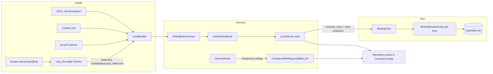

# Compound Writing Packs in Comment Mode - Plan

## Goal Capsule

- **Objective:** The compound writing reviewers become an account feature inside Comment mode: only enabled accounts see them, reviewers come from installable packs sourced from Claude Code plugin marketplaces, and everything from round one (Jev judging, anchoring, streaming, throttles, caps, budget, semaphore, tests, browser check) keeps working.
- **Means:** Per-account feature grants (KTD1), Comment mode hosting (KTD2), a pack model fetched and pinned through `ruby_llm-skills` marketplaces (KTD3-KTD5), and the round-one registry extracted into the first pack (KTD6).
- **Authority:** Requirements govern behavior; KTDs govern mechanism; `docs/plans/2026-09-18-1330-feat-compound-writing-mode-plan.md` (round one) stays authoritative for the judging pipeline it built.
- **Execution profile:** Rails models, a fetch service on the gem, controller gating, React panel changes, migrations with an ENV-driven bootstrap.
- **Stop conditions:** Escalate any change to document authorization, the Yjs sync path, or the comment and suggestion models.
- **Tail ownership:** The implementing PR owns tests, the browser check, `DEPLOYING.md`, `README.md`, and a pack convention document; merge and deploy follow on Kieran's word.

---

## Product Contract

### Summary

Remove the fifth mode and Cmd+5. In Comment mode, an account with the `compound_writing` feature sees a Reviewers panel listing the enabled lenses of its installed packs, runs them, and gets the highlights and margin cards from round one. A pack is a Claude Code plugin from a marketplace (`.claude-plugin/marketplace.json`, `skills/<name>/SKILL.md`) whose skills become Jev yes/no lenses through a sidecar, a curated question set, or a generated fallback. The current 13 reviewers become the first pack, `EveryInc/compound-writing` pinned at `8fd0ec88c00976cf0274cb76552dc7ad9405ca92`, installed for the bootstrap accounts.

### Problem Frame

Round one shipped compound writing as its own mode for every writer and hard-coded the reviewers in Ruby. Kieran wants it gated to his account first with a proper enablement path, folded into the mode that means "review this document", and modular so packs from other marketplaces and other people can be added without a deploy.

### Requirements

**Gating**

- R1. A `compound_writing` feature is granted per account (a durable flag on the user), readable as `User#feature?`, grantable and revocable without a deploy through a rake task, and bootstrapped for the accounts named in `COMPOUND_WRITING_INITIAL_ACCOUNTS` by migration and seed.
- R2. A viewer without the feature (signed out or not granted) sees no reviewers panel, no finding highlights or cards, no compound props, and no compound shortcut; the pass and finding endpoints refuse them.
- R3. Running a pass still requires document write access on top of the feature.

**Mode**

- R4. The `compound` mode, its route, and Cmd+5 are removed; Comment mode hosts the reviewers panel, highlights, and finding cards for featured viewers, alongside comments and suggestions.
- R5. Finding cards share the Comment mode margin stack with comment and suggestion cards without overlapping.

**Packs and lenses**

- R6. A pack is one plugin from a marketplace repository, fetched over HTTPS, pinned to a commit SHA, and stored with its lenses; installing the same locator again refreshes it to the requested ref.
- R7. A lens is one reviewer: key, name, blurb, colour slot, source skill path, questions (scope, question, note, threshold), an optional FakeJudge lexicon, and an origin (`sidecar`, `curated`, or `generated`).
- R8. A featured account can add a pack by locator (`owner/repo`, optional `@ref` and plugin name), remove it, and enable or disable each lens; the panel lists enabled lenses across the account's packs grouped by pack, with per-account persistence replacing the round-one cookie.
- R9. A pass snapshots the lens definitions it ran so jobs, cards, and the panel stay consistent when a pack changes later.
- R10. The convention for turning a SKILL.md into questions is documented for pack authors: a `jev.yml` sidecar beside the SKILL.md, else Thinkroom's curated set for that marketplace and skill, else a generated sentence-and-paragraph lens from the skill's description.

**First pack and continuity**

- R11. The round-one reviewers move out of Ruby into the curated question set for `EveryInc/compound-writing`, and the bootstrap installs that pack at the pinned SHA for the bootstrap accounts with every lens enabled.
- R12. Throttles, caps, budget, semaphore, anchoring, streaming, FakeJudge, tests, and the browser check keep working; the browser check drives the new flow (featured account, Comment mode, pack lenses).
- R13. `DEPLOYING.md` and `README.md` describe the feature grant, the bootstrap variable, packs, and the sidecar convention.

### Acceptance Examples

- AE1. Covers R1, R2. A signed-out visitor opens `/d/x/comment`: comments panel, no reviewers panel, no `writing_*` props. Kieran signs in and opens the same URL: the Reviewers panel shows his compound-writing lenses.
- AE2. Covers R4, R5. In Comment mode Kieran runs the lenses; "utilize" fills, the paragraph's finding card stacks beside the comment card on the same paragraph without overlap; Cmd+5 does nothing and `/d/x/compound` is 404.
- AE3. Covers R6, R8. Kieran adds `EveryInc/compound-writing@main`; the pack refreshes to that commit, its lenses appear grouped under the pack, disabling Nemesis persists across reload and excludes it from the next run.
- AE4. Covers R10. A pack whose skill has `skills/foo/jev.yml` yields that lens verbatim; a skill without a sidecar or curated set yields a generated lens marked `generated`.
- AE5. Covers R11. After deploy, the bootstrap grants the feature and installs the pack for the configured account; a rerun of the migration or seed changes nothing.

### Scope Boundaries

- No pack browsing UI beyond add-by-locator; no per-question thresholds or colours in the UI; no owner-vs-writer product change beyond the feature gate.
- Packs are per account; sharing a pack across a document's collaborators is later work.
- The gem's filesystem Registry and `skills-lock.json` are not used for packs; pinning lives on the pack row (KTD3).

**Deferred to follow-up work**

- Marketplace catalog browsing and one-click install of every plugin in a marketplace.
- Sharing a pack or lens selection with a document, not an account.
- Automatic refresh of unpinned packs on a schedule.

### Sources

- Round one plan and code: `docs/plans/2026-09-18-1330-feat-compound-writing-mode-plan.md`, `app/services/compound_writing/*`, `app/models/writing_pass.rb`, `app/frontend/pages/documents/use_writing_pass.ts`, `use_finding_anchors.ts`, `components/compound_panel.tsx`, `finding_margin_cards.tsx`.
- `ruby_llm-skills` 0.5.0.pre1 (`lib/ruby_llm/skills/marketplace/{locator,fetcher,manifest,tarball,config,github_repo}.rb`, `parser.rb`): HTTPS-only marketplace fetching (api.github.com, raw, codeload tarballs), `Head#sha` pinning, `Manifest.discover`, `Fetcher#source_tree` returning `{ path => bytes }`, `Parser.parse_string` for SKILL.md frontmatter. No `git` binary needed, which matters because the production image's runtime stage has none (`Dockerfile` lines 86-88).
- BabyAgent `app/services/marketplaces/fetcher.rb` and `config/marketplaces.yml`: the adapter shape over the gem and its caps.
- `EveryInc/compound-writing` `main` @ `8fd0ec88c00976cf0274cb76552dc7ad9405ca92`: `.claude-plugin/marketplace.json` (one plugin `compound-writing`, source `./`, version 2.4.1), `skills/cw-*/SKILL.md`.
- Thinkroom `User` (`app/models/user.rb`, no feature storage today), Comment mode wiring in `app/frontend/pages/documents/show.tsx`, `MarginAnnotations`.

---

## Planning Contract

### Key Technical Decisions

- KTD1. **Feature grants on the user.** Add `users.features` (JSON object keyed by feature name, value `{ "granted_at": ... }`), a `Features` module listing known keys (`compound_writing`), `User#feature?(key)`, `grant_feature!`, `revoke_feature!`, and rake tasks `features:grant[email,key]` / `features:revoke[email,key]` / `features:list[key]`. `CompoundWriting.available_to?(user)` is the single gate the controllers and props use. (session-settled: user-directed — chosen over a hard-coded email check: grants must be addable without a deploy.) Governs R1-R3.
- KTD2. **Comment mode hosts compound writing.** Thinkroom's review-shaped mode is Comment (read-only, click or select to comment; STRATEGY's "judging" mode). Remove `compound` from `EditorMode`, `MODE_OPTIONS`, the route constraint, `availableDocumentModes`, and `preview_editable`. In Comment mode, a featured viewer gets the Reviewers panel above the comments panel in the rail, finding highlights, and finding cards inside `MarginAnnotations` (typed items in the one measured stack, KTD2 of the anchored-comments plan). Highlights and the pass reload are active only while `effectiveMode === 'comment'` and the viewer is featured. Fixing a flagged phrase means switching to Edit; findings re-anchor there is not painted. (session-settled: user-directed — chosen over keeping a fifth mode.) Governs R4, R5.
- KTD3. **Packs are DB rows fetched through `ruby_llm-skills` marketplaces.** `WritingPack` (name, display_name, description, source_kind, source_locator, source_ref, source_sha, plugin_name, version, lenses JSON, fetched_at) unique on (source_locator, plugin_name). `CompoundWriting::PackInstaller` uses the gem's `Locator::Source`, `Fetcher.for(source).head` (the pinned SHA), `catalog_files` + `Manifest.discover`, and `source_tree(entry.source, head:)` to read `skills/*/SKILL.md` and sidecars, then `LensBuilder` derives lenses. The gem's `Marketplace.configure` receives the GitHub token (`GITHUB_TOKEN` or `MARKETPLACE_GITHUB_TOKEN`) and caps. The gem's filesystem `Registry`/lockfile is not used: Thinkroom's install target is a per-account DB row and the container filesystem is ephemeral, so the pack row is the lock (locator + SHA). Governs R6.
- KTD4. **Lens derivation order.** For each `skills/<name>/SKILL.md` in the plugin: (1) `skills/<name>/jev.yml` sidecar (schema: `name`, `blurb`, `color`, `lexicon`, `questions[]` with `id`, `scope`, `question`, `note`, `threshold`) → origin `sidecar`; (2) Thinkroom's curated set `config/compound_writing/lenses/<owner>--<repo>.yml` keyed by skill name → origin `curated`; (3) otherwise a generated lens from the frontmatter `description`: one sentence question and one paragraph question phrased "Does this sentence/paragraph have the problem this reviewer looks for: <description>?" → origin `generated`. When a curated set exists for the marketplace, only its skills become lenses (the others are writing tools, not reviewers). Lens keys are `<pack name>/<skill name>`; colour slots are integers 0-15 assigned in order and wrap. Governs R7, R10.
- KTD5. **Per-account pack subscriptions and selection.** `UserWritingPack` (user, pack, `disabled_lens_keys` JSON) unique per (user, pack). `CompoundWriting::LensSet.for(user)` returns the enabled lenses across the account's packs in pack then lens order; it feeds `writing_reviewers`, validates run requests, and replaces the `pruf_cw_off` cookie. Controllers: `WritingPacksController#create` (install by locator, subscribe), `#update` (disabled lens keys), `#destroy` (unsubscribe; the pack row stays for other subscribers), all gated by KTD1 and `rate_limit_contributions`. Governs R8.
- KTD6. **The first pack and the lens snapshot.** Move `CompoundWriting::Reviewers::ALL` into `config/compound_writing/lenses/everyinc--compound-writing.yml` (13 skills, questions, notes, thresholds, lexicons). `CompoundWriting::Bootstrap.run!` builds the pack row offline from that curated set pinned at `8fd0ec88c00976cf0274cb76552dc7ad9405ca92` (version 2.4.1, `fetched_at` nil until a live refresh), grants the feature, and subscribes each account in `COMPOUND_WRITING_INITIAL_ACCOUNTS`; a migration and `db/seeds.rb` call it idempotently. `WritingPass` stores `lenses` (the definitions that ran) and `reviewer_keys` become lens keys; `ParagraphReview`, `TextReview`, `FakeJudge`, and `PassBudget` take lens structs instead of registry lookups. Governs R9, R11, R12.
- KTD7. **Highlight names by colour slot.** CSS `::highlight()` rules are static, so highlight names become `cw-<slot>-fill` / `cw-<slot>-under` for slots 0-15 instead of per-reviewer names; the client maps a finding's lens to its slot through the pass snapshot. Governs R5, R12.

### Assumptions

- Comment mode is the right host; Suggest mode remains for tracked edits. If Kieran prefers Suggest, the change is one predicate.
- GitHub is reachable from the production container for pack installs (the Riffrec and Cursor integrations already call external APIs); the bootstrap itself needs no network.
- One colour palette of 16 slots is enough for the lenses an account enables at once.

### High-Level Technical Design



```mermaid
sequenceDiagram
  participant K as Kieran (Comment mode)
  participant C as WritingPacksController
  participant I as PackInstaller (ruby_llm-skills)
  participant GH as GitHub (api, codeload)
  K->>C: POST /writing_packs {locator: EveryInc/compound-writing@main}
  C->>I: install!(locator, ref, plugin)
  I->>GH: head(ref) -> sha; marketplace.json; tarball(sha)
  I->>I: for each skills/*/SKILL.md: sidecar > curated > generated
  I-->>C: WritingPack (source_sha pinned, lenses)
  C->>C: UserWritingPack for Kieran (all lenses enabled)
  C-->>K: 303 back; writing_reviewers reloads with the new lenses
```

### Sources and Risks

- The gem is a pre-release (`0.5.0.pre1`); pin it exactly and wrap its calls in `PackInstaller` so a later API change is one file.
- Generated lenses from a description are weaker than curated ones; mark them and let users disable them.
- Removing the `compound` route changes URLs that existed for one day; no redirect is needed.
- Bootstrap reads `COMPOUND_WRITING_INITIAL_ACCOUNTS` at migrate and seed time; accounts created later use the rake task.

---

## Implementation Units

### U1. Feature grants and the gate

**Goal:** A durable per-account feature with a rake task and a single gate.

**Requirements:** R1-R3. **Dependencies:** None.

**Files:** `db/migrate/*_add_features_to_users.rb`, `db/schema.rb`, `app/models/user.rb`, `app/models/concerns/features.rb` (new: known keys), `app/services/compound_writing.rb` (`available_to?`), `lib/tasks/features.rake` (new), `test/models/user_test.rb` or new `test/models/user_features_test.rb`, `test/tasks/features_tasks_test.rb`.

**Approach:** Follow KTD1. JSON column with default `{}`; `feature?` reads the key; `grant_feature!` records `granted_at`; unknown keys raise. Rake tasks print what changed and fail on an unknown email or key.

**Test scenarios:**

1. `grant_feature!` then `feature?` is true; `revoke_feature!` flips it; an unknown key raises.
2. `CompoundWriting.available_to?(nil)` is false; a user without the grant is false; with the grant and a configured judge it is true; with the grant but no judge it is still true (the panel shows the not-configured notice).
3. `features:grant[email,compound_writing]` grants and is idempotent; an unknown email exits non-zero with a message.

**Verification:** Model and task tests pass.

### U2. Packs, lenses, subscriptions, and the installer

**Goal:** Packs fetched through the gem and lenses derived by the documented order.

**Requirements:** R6, R7, R10. **Dependencies:** U1.

**Files:** `Gemfile` (`ruby_llm-skills = 0.5.0.pre1`), `db/migrate/*_create_writing_packs.rb` (packs and user_writing_packs), `app/models/writing_pack.rb`, `app/models/user_writing_pack.rb`, `app/models/user.rb` (associations), `app/services/compound_writing/lens.rb` (struct + validation), `app/services/compound_writing/lens_builder.rb`, `app/services/compound_writing/pack_installer.rb`, `app/services/compound_writing/lens_set.rb`, `config/initializers/ruby_llm_skills.rb` (marketplace config), `config/compound_writing/lenses/everyinc--compound-writing.yml`, `docs/compound-writing-packs.md` (new convention doc), tests under `test/services/compound_writing/` and `test/models/`.

**Approach:** Follow KTD3-KTD5. `PackInstaller.install!(locator:, ref:, plugin: nil)` parses `owner/repo[@ref]`, builds the gem source, resolves head, discovers the catalog, picks the plugin (the only one, or by name), fetches its tree, and hands `files` to `LensBuilder.build(files, marketplace:, plugin:)`. `LensBuilder` reads each `skills/<name>/SKILL.md` with the gem's `Parser.parse_string`, applies sidecar > curated > generated, validates with `Lens`, and assigns colour slots. Tests stub the fetcher with an in-memory `{ path => bytes }` double (no network).

**Test scenarios:**

1. Installing a fixture marketplace with one plugin yields a pack with `source_sha` from the head, `version` from the manifest, and lenses in skill order.
2. A skill with a `jev.yml` sidecar becomes a `sidecar` lens with its questions verbatim; a curated skill becomes `curated`; a bare skill becomes `generated` with a sentence and a paragraph question naming the description.
3. When a curated set exists for the marketplace, skills outside it are skipped.
4. Reinstalling the same locator refreshes the existing row (same id, new sha and lenses) and preserves subscribers' disabled keys where the lens still exists.
5. A malformed sidecar (unknown scope, missing question) raises a readable installer error and installs nothing.
6. `LensSet.for(user)` returns enabled lenses across two packs in order, excludes disabled keys, and dedupes a lens key present in two packs by first pack.
7. The `@ref` parse handles `owner/repo`, `owner/repo@main`, `owner/repo@<sha>`, and rejects anything else.

**Verification:** Service and model tests pass; a console `install!("EveryInc/compound-writing")` against GitHub returns 13 curated lenses at the current head.

### U3. Round one on lenses: pass snapshot, jobs, budget, fake judge

**Goal:** The judging pipeline runs from lens definitions instead of the Ruby registry.

**Requirements:** R9, R11, R12. **Dependencies:** U2.

**Files:** `app/models/writing_pass.rb` (`lenses` column and `lens(key)`), `db/migrate/*_add_lenses_to_writing_passes.rb`, `app/jobs/writing_reviewer_job.rb`, `app/services/compound_writing/{paragraph_review,text_review,prompts,pass_budget,fake_judge}.rb`, `app/services/compound_writing/reviewers.rb` (deleted), `app/models/writing_finding.rb` (`note` from the pass snapshot), `app/controllers/writing_passes_controller.rb` (gate, lens validation against `LensSet`), `app/controllers/writing_findings_controller.rb` (gate), tests updated.

**Approach:** Follow KTD6. `WritingPass.start!` takes `lenses:` (validated subset of the account's enabled lenses) and stores them; `reviewer_keys` are lens keys; jobs read `pass.lens(key)`. `FakeJudge` reads the lens lexicon. `PassBudget.estimate(paragraphs, lenses)`. Controllers refuse non-featured viewers with the existing error-bag redirect (`writing_pass: "Compound writing is not enabled for your account"`) or 403 JSON.

**Test scenarios:**

1. A pass stores the lens snapshot; a job judges from it even after the pack's lenses change.
2. A run naming a lens the account has disabled or does not own is refused.
3. A non-featured writer cannot start a pass or dismiss a finding; a featured writer can.
4. Round-one model, job, budget, and judge tests pass on lenses (FakeJudge lexicon per lens).

**Verification:** `bin/rails test` green.

### U4. Bootstrap migration, seed, and props

**Goal:** Kieran's account is granted and subscribed on deploy; the page exposes packs and lenses only to featured viewers.

**Requirements:** R1, R2, R11. **Dependencies:** U3.

**Files:** `app/services/compound_writing/bootstrap.rb`, `db/migrate/*_bootstrap_compound_writing_accounts.rb`, `db/seeds.rb`, `app/controllers/documents_controller.rb` (props gated by `available_to?`: `writing_available`, `writing_reviewers` from `LensSet`, `writing_packs` for the panel, `writing_pass` optional in Comment mode), `config/deploy.yml` (`COMPOUND_WRITING_INITIAL_ACCOUNTS` in `env.clear`), `.kamal/deploy.env.example`, `test/services/compound_writing/bootstrap_test.rb`, `test/integration/writing_pass_flow_test.rb`.

**Approach:** Follow KTD6 and KTD1. `Bootstrap.run!(emails:)` upserts the compound-writing pack row from the curated YAML at the pinned SHA, grants the feature, and subscribes each existing account; idempotent; missing accounts are logged, not errors.

**Test scenarios:**

1. `Bootstrap.run!` with two emails, one existing: grants and subscribes the existing one, logs the other, second run changes nothing.
2. `documents#show` for a signed-out viewer has `writing_available: false` and no `writing_reviewers`, `writing_packs`, or `writing_pass`; for a featured signed-in viewer in Comment mode it has all of them.
3. `deploy.yml` renders `COMPOUND_WRITING_INITIAL_ACCOUNTS` as a string when unset.

**Verification:** Integration and config tests pass.

### U5. Frontend: Comment mode hosting, packs UI, colour slots

**Goal:** The panel, highlights, and cards live in Comment mode for featured viewers; packs and lenses are managed in the panel.

**Requirements:** R2, R4, R5, R8, R12. **Dependencies:** U4.

**Files:** `app/frontend/components/mode_control.tsx`, `app/frontend/pages/documents/show.tsx`, `app/frontend/components/compound_panel.tsx` (packs section, lens toggles per pack, add and remove), `app/frontend/pages/documents/use_writing_pass.ts` (server-persisted selection through `router.patch`, no cookie), `app/frontend/pages/documents/use_finding_anchors.ts` (slot-based highlight names from the pass snapshot), `app/frontend/components/margin_annotations.tsx` (finding cards as typed items in the shared stack), `app/frontend/components/finding_margin_cards.tsx` (rows reused), `app/frontend/styles/compound.css` (16 slot rules), `app/frontend/styles/header_controls.css`, `app/frontend/components/mobile_dock.tsx`, `app/frontend/types/payloads.ts`, `app/controllers/documents_controller.rb` (`ui.compound_reviewers_off` removed).

**Approach:** Follow KTD2, KTD5, KTD7. `isCompound` becomes `showCompound = effectiveMode === 'comment' && writingAvailable`. The Reviewers panel gains a Packs section: each pack with name, version, short SHA, its lenses with switches (PATCH `writing_packs/:id`), a Remove button, and an Add pack form (locator input, POST). Finding cards enter `MarginAnnotations` as a third item kind measured in the same stack.

**Test scenarios:**

1. Signed out in Comment mode: no `.compound-panel`, no `cw-*` highlights (browser check).
2. Featured account in Comment mode: panel present, run paints highlights, a finding card and a comment card on the same paragraph do not overlap.
3. Disabling a lens persists across reload and is excluded from the run payload.
4. Adding a pack by locator against the local fixture marketplace (directory kind in the check, or the FakeJudge path with a stubbed installer) lists its lenses; removing it hides them.
5. Cmd+5 does nothing; `/d/x/compound` is 404.

**Verification:** `npm run check`; `script/compound_writing_check.mjs` rewritten for the new flow and green.

### U6. Docs, browser check, deploy config

**Goal:** Everything documented and proven end to end.

**Requirements:** R12, R13. **Dependencies:** U5.

**Files:** `script/compound_writing_check.mjs`, `.github/workflows/ci.yml` (test account for the check), `DEPLOYING.md`, `README.md`, `docs/compound-writing-packs.md`, `CHANGELOG.md`, `docs/plans/2026-09-18-1330-feat-compound-writing-mode-plan.md` (a superseded note pointing here).

**Approach:** The check signs up a password account, grants the feature through a test-only route or a rake task run by CI before the check (`bin/rails "features:grant[check@example.com,compound_writing]"` plus `compound_writing:install`), then drives Comment mode. A signed-out page asserts the absence of the panel.

**Test scenarios:**

1. Covers AE1, AE2, AE3 in the browser check with the FakeJudge.

**Verification:** CI green; `bin/kamal config` renders; production smoke: signed-out visitor sees no panel; Kieran's account sees lenses in Comment mode.

---

## Verification Contract

Run `npm run check`, `bin/rubocop`, `bin/brakeman --no-pager`, `bin/bundler-audit`, `bin/rails test`, and `node script/compound_writing_check.mjs` against a `COMPOUND_WRITING_FAKE_JUDGE=1` server with a granted check account. Confirm `bin/kamal config` renders with `COMPOUND_WRITING_INITIAL_ACCOUNTS` set and unset. Never print the key.

---

## Definition of Done

R1-R13 and AE1-AE5 are demonstrated. `compound` mode, Cmd+5, the Ruby reviewer registry, and the toggle cookie are gone. The first pack is a `WritingPack` row pinned at `8fd0ec88c00976cf0274cb76552dc7ad9405ca92` and Kieran's account is granted and subscribed on deploy. `docs/compound-writing-packs.md` explains the sidecar convention. Abandoned code is removed. Merge and deploy follow Kieran's word.
