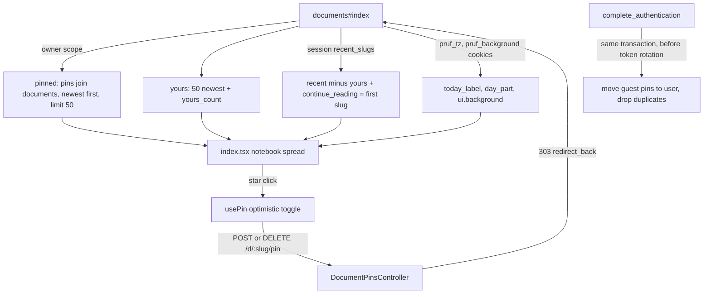

# Notebook index with pinned pages - Plan

## Goal Capsule

- **Objective:** A person who opens Thinkroom lands on their own work: the pages they pinned, where they left off, what was shared with them, and a scannable contents list, with a background they chose, instead of a marketing hero they scroll past every visit.
- **Means:** Rebuild `documents#index` as the "Pinned 1" notebook spread, backed by a new per-owner `DocumentPin` record, an idempotent pin endpoint, and server-computed greeting, date and background props (KTD1, KTD2, KTD4).
- **Authority:** Requirements govern behavior; Key Technical Decisions govern mechanism; `CLAUDE.md`, `STRATEGY.md` and `docs/solutions/architecture-patterns/server-first-instant-paint.md` remain authoritative for dev workflow and first paint. The design reference is the "Pinned 1 · Pinned list" artboard of the Thinkroom Index Redesign canvas.
- **Execution profile:** New table plus UI rewrite of one page; every other page, the native shell, WebMCP tools and ownership semantics keep their current behavior.
- **Stop conditions:** Escalate anything that changes document ownership rules, the owner_token secrecy guarantee, or requires tracking reading activity (unread, word counts, reading position).

---

## Product Contract

### Summary

Replace the index hero and bordered document list with an open notebook: the left page greets the reader, offers New page and Copy agent prompt, and lists Pinned pages, Continue reading and Shared with you; the right page is a Contents list with tag filters, dotted leaders and a star on every row. Pins persist per owner on the server and follow a guest into their account at sign-in. A Background menu switches the surface between four presets stored in a cookie.

### Problem Frame

The index leads with "Thinkroom / Where deeper thinking compounds" and three buttons, so a returning reader scrolls past marketing copy to reach their documents every visit. The agent prompt hides behind a toggle, there is no way to keep an important page within reach once it drops into "Earlier", and the page has no search. The owner iterated on a design canvas through several rounds and chose the notebook spread with a pinned list, fresher white paper, and a background picker.

### Requirements

**Layout and chrome**

- R1. The index renders as a two-page notebook spread centered on a background surface, under a slim top bar with the Thinkroom wordmark, a Background button, a search control and the existing account control; below the tablet breakpoint the pages stack into one column.
- R2. The left page shows, in order: a date line and a greeting, New page and Copy agent prompt actions, Pinned, Continue reading, and Shared with you. Sections with no content render a one-line empty hint (Pinned) or are omitted (Continue reading, Shared with you).
- R3. The greeting reads "Good morning|afternoon|evening, <name>." using the viewer's timezone and name; when there is no name it reads "Good afternoon." without one.
- R4. Copy agent prompt copies the existing agent instruction text and confirms "Copied"; when the clipboard write is refused, the instruction is revealed inline so it can be copied by hand.

**Pinning**

- R5. Every Contents row, every Shared with you row and every Pinned row carries a star button that pins or unpins that document for the current owner; the star state is visible and announced (`aria-pressed`, per-title label).
- R6. Pinned lists the owner's pinned documents newest pin first, each with title, a one-line meta (tags or "Owned by <name>"), independent of the 50-row Contents window.
- R7. Pins belong to the signed-in user, or to the guest owner_token when signed out; a guest's pins move to their account when they sign in, without duplicates.
- R8. Pinning is idempotent, unpinning an unpinned document succeeds, a missing document redirects home, and an owner holds at most 50 pins (the 51st is refused with a visible message).
- R9. Deleting a document removes it from everyone's pins.

**Contents**

- R10. Contents lists the owner's documents in This week and Earlier groups; each row is title, dotted leader and created date, keeps tag editing, and keeps native swipe-to-delete.
- R11. Tag filter links (All plus each tag) and the search control filter Contents together (AND); while either is active every match is shown and empty groups are hidden.
- R12. Without a filter, Earlier shows 8 rows and a "Turn the page, N more" reveal; the footer shows the true total document count, noting when Contents shows only the newest 50.

**Background**

- R13. The Background menu offers Morning, Terracotta, Paper and Night; the choice persists in a cookie, is rendered on first paint by the server, and applies only to the index.
- R14. Night keeps every index control legible (account menu, feedback panel, popovers, tag editor, swipe rows, star states).

**Preserved behavior**

- R15. Ruby Native chrome (navbar menus, FAB on `#new-document-button`, `#agent-start-trigger`, `#account-signout`, `.feedback-button button`), WebMCP index tools, the feedback button, the claim flow and the GitHub footer keep working.

### Key Decisions

- **Notebook spread, pinned as a list** (session-settled: user-approved — chosen over the single-page manuscript, the sidebar library and the Pinned cards grid: the owner picked the book and the list variant across design rounds). Governs R1, R2, R6.
- **Pins persist server-side per owner** (session-settled: user-directed — chosen over browser-only pins: pins must survive across browsers for accounts and follow the app's ownership model). Governs R5, R7, R8.
- **Preset backgrounds only** (session-settled: user-approved — chosen over image upload in this change: presets ship now; upload is follow-up work). Governs R13, R14.
- **No activity tracking on the index** (session-settled: user-approved — chosen over the data-heavy variants with unread dots, word counts and reading position: the owner found them too much). Governs R6, R10.

### Scope Boundaries

- Unread markers, word counts, reading position, suggestion counts and live presence stay off the index.
- Recents are still cleared by `reset_session` at sign-in and sign-out, so Continue reading and Shared with you start empty after either.

### Deferred to Follow-Up Work

- Uploading a custom background image (Active Storage per account, cookie for guests) and a paper tone choice.
- Keeping `session[:recent_slugs]` across sign-in.
- Reordering pins.

---

## Planning Contract

### Key Technical Decisions

- KTD1. **`DocumentPin` table mirrors document ownership.** Columns `document_id` (FK, not null), nullable `user_id` (FK) and nullable `owner_token`, with a check constraint that exactly one owner column is set and two partial unique indexes (`document_id, user_id WHERE user_id IS NOT NULL`; `document_id, owner_token WHERE owner_token IS NOT NULL`), because SQLite treats NULLs as distinct in plain unique indexes. Same shape as `documents_single_owner` in `db/migrate/20260624210000_create_users_and_add_document_owner.rb`. (session-settled: user-directed — chosen over browser-only pins: pins must follow the account across browsers.) Governs R7.
- KTD2. **Pin endpoint is `POST`/`DELETE /d/:slug/pin` on a small `DocumentPinsController < InertiaController`.** It resolves the document by slug with no ownership check (a pin is a private bookmark and every document is readable by link), treats duplicates with an insert-or-ignore on the partial unique index, and follows the `update_tags` redirect contract: success `redirect_back ... status: :see_other`, errors via `inertia: { errors: { pin: ... } }` on a plain 302 so `onError` fires.
- KTD3. **Pin transfer rides inside sign-in.** `complete_authentication` (`app/controllers/concerns/authenticates_user.rb`) moves the guest token's pins to the user before `replace_owner_token!` rotates the token, in one transaction with `claim_documents!`: delete guest pins whose document the user already pinned, re-key the newest remaining guest pins up to the owner's free room under the 50-pin cap, and delete the rest, so the account never exceeds R8's cap. `User#claim_documents!` keeps returning the document count (`test/models/user_test.rb`).
- KTD4. **Greeting, date and background are server props.** The index is SSR (`documents_controller.rb` `inertia_config ssr_enabled`), so the controller computes `today_label`, `day_part` in the `pruf_tz` zone and reads `pruf_background` with `presence_in(%w[morning terracotta paper night]) || "morning"`; the page never reads `Date`, cookies or localStorage in render. The greeting name comes from `viewer.name` or `serverIdentity` guest name, never `userIdentity` (`server-first-instant-paint.md`).
- KTD5. **Background tokens are scoped with `:root:has(.landing[data-background=…])`.** The page root carries `data-background` from the prop; overrides of `--surface`, ink, line and accent tokens (plus `color-scheme: dark` for Night) reach the body background and mobile popovers that `PopoverShell` portals to `document.body`, and disappear when the index unmounts after Inertia navigation. A `<html>` attribute would leak onto document pages.
- KTD6. **Pinned is its own query; Contents keeps the 50-row window.** `pinned` joins pins to documents for the current owner, newest pin first, limit 50. `yours` keeps its tested 50-row cap, and a separate `yours_count` prop feeds the footer.
- KTD7. **Continue reading is the first slug in `session[:recent_slugs]` that resolves to an existing document, resolved before owned docs are removed from `recent`.** `remember_recent` already keeps newest first and is called on show and create. That slug is also excluded from `recent`, so Shared with you never repeats the Continue reading row.
- KTD8. **`usePin` mirrors `useClaim`; star state comes from `pinned`.** Every row derives its star from the slugs in the `pinned` prop (the 50-pin cap equals the query limit, so the list is complete). `usePin` adds or removes the document in `pinned` through `router.optimistic`, keeps a per-slug in-flight ref (clicks during a request are ignored and the star shows pending) and relies on Inertia's rollback when the request fails. Pin reloads use `only: ['pinned', 'yours', 'recent', 'errors']` so the WebMCP manifest is not re-sent, and the existing tag-editor and claim reload lists gain `pinned` so Pinned meta stays current. After an unpin that removes a Pinned row, focus moves to the next row's star, else the previous one, else the Pinned heading, and a polite live region announces "Unpinned <title>".
- KTD9. **Claim becomes a text button.** The current Claim affordance is a star SVG (`RecentClaimButton`), which would collide with pin stars on Shared with you rows.
- KTD10. **Keep the automation hooks.** Root `.landing`, `.landing-wordmark` (still `native-hidden`), `#new-document-button`, `#agent-start-trigger`, `a.document-row-title`, the tag editor classes, `[data-swipe-row]` and `.btn*`/`.share-copy`/`.swipe-row*` shared styles stay; the Playwright checks that assert removed copy (hero tagline, byline, "Have an agent start one", `#agent-start-instructions`, "Your documents", "Recently opened") are updated in the same change.

### High-Level Technical Design

Directional sketch of the data flow, not an implementation spec.

### Assumptions

- Stars appear on Contents, Pinned and Shared with you rows; any readable document can be pinned.
- Greeting boundaries: morning 05:00–11:59, afternoon 12:00–17:59, evening otherwise.
- Default background is Morning; search filters titles and tags client-side over the 50-row window.
- In the native app the Background button and search stay in the page body under the native navbar; the native navbar does not follow the preset.
- "N words this week" is omitted because no cheap source exists.
- A nameless greeting uses the same day part as a named one ("Good evening.").
- Search stays client-side over the 50 newest documents; server-side search across all documents is follow-up work.

### Sources & Research

- Ownership and sign-in merge: `app/controllers/application_controller.rb` (`ensure_owner_token`, `replace_owner_token!`), `app/models/user.rb` (`claim_documents!`), `app/controllers/concerns/authenticates_user.rb`.
- Endpoint template: `DocumentsController#update_tags` and `#destroy` redirect comments; client template `app/frontend/lib/use_claim.ts`.
- Cascades: `Document has_many :yjs_document_updates, dependent: :delete_all` precedent; SQLite enforces FKs.
- Cookie prefs: `DocumentsController#ui_prefs`, `test/integration/document_ui_preferences_test.rb`.

---

## Implementation Units

### U1. DocumentPin model, migration and ownership transfer

- **Goal:** Persist pins per owner and keep them correct through sign-in and deletion (KTD1, KTD3).
- **Requirements:** R7, R8, R9.
- **Files:** `db/migrate/<timestamp>_create_document_pins.rb`, `db/schema.rb`, `app/models/document_pin.rb`, `app/models/document.rb`, `app/models/user.rb`, `app/controllers/concerns/authenticates_user.rb`, `test/models/document_pin_test.rb`, `test/models/user_test.rb`, `test/integration/authentication_flow_test.rb`, `test/integration/ownership_flow_test.rb`.
- **Approach:** Migration with the KTD1 columns, check constraint and partial unique indexes plus an index on `(user_id, created_at)` and `(owner_token, created_at)`. `DocumentPin` scopes `for_owner(user:, token:)` (user wins, blank token matches nothing, same rule as `Document#owned_by?`) and class methods `pin!`/`unpin!` that are idempotent and enforce the 50 cap. `Document has_many :document_pins, dependent: :delete_all`; `User has_many :document_pins, dependent: :delete_all`. A `User#adopt_pins!(owner_token)` called from `complete_authentication` in the same transaction as `claim_documents!`.
- **Test scenarios:**
  - Pinning twice leaves one row; unpinning a never-pinned doc is a no-op.
  - A row with both or neither owner column violates the constraint.
  - The 51st pin for one owner raises the cap error; another owner is unaffected.
  - Destroying a pinned document removes its pins and `destroy` still succeeds.
  - Guest pins two docs, one already pinned by the account, then signs in: the user holds both pins once, no pin keeps the old token, and `claim_documents!` still returns the document count.
  - An account holding 49 pins signs in with 3 guest pins: it ends with 50 (the newest guest pin kept) and a further pin is refused.
  - Logout does not move pins back to a guest.
- **Verification:** `bin/rails test test/models test/integration/authentication_flow_test.rb test/integration/ownership_flow_test.rb`.

### U2. Pin endpoint

- **Goal:** Let the page pin and unpin by slug (KTD2).
- **Requirements:** R5, R8.
- **Dependencies:** U1.
- **Files:** `config/routes.rb`, `app/controllers/document_pins_controller.rb`, `test/integration/document_pins_test.rb`.
- **Approach:** `post "d/:slug/pin"` and `delete "d/:slug/pin"`, named `document_pin`. Unknown slug redirects root with 303; cap error returns `errors: { pin: "You can pin up to 50 pages." }` on 302. The controller declares the same per-IP contribution rate limit `CommentsController` uses (`app/controllers/concerns/write_rate_limited.rb`), because guests can rotate owner tokens and bypass the per-owner cap.
- **Test scenarios:**
  - Guest pins, then the index props list the doc in `pinned`; the same guest unpins and it is gone.
  - Signed-in user pin is stored on `user_id` with no token.
  - Repeated POST and DELETE both answer 303.
  - Missing slug redirects home; forged request without CSRF token is rejected (copy the `ownership_flow_test.rb` pattern).
  - Pin at cap returns the errors bag.
  - Exceeding the burst limit returns 429 and creates no pin.
- **Verification:** `bin/rails test test/integration/document_pins_test.rb`.

### U3. Index props

- **Goal:** Serve everything the notebook renders from the server (KTD4, KTD6, KTD7).
- **Requirements:** R2, R3, R6, R12, R13.
- **Dependencies:** U1.
- **Files:** `app/controllers/documents_controller.rb`, `test/integration/document_index_test.rb`, `test/integration/document_ui_preferences_test.rb`, `test/integration/home_claim_test.rb`, `test/integration/webmcp_props_test.rb`.
- **Approach:** Add `pinned` (index props plus `pinned_at`, `owner_name`, `yours`), `continue_reading` (index props plus ownership props, or null), `yours_count`, `today_label` ("Tuesday, 22 September"), `day_part`, and `ui: { background: }`. Keep the owner_token out of every prop.
- **Test scenarios:**
  - `pruf_tz` set to a zone where it is 07:00 gives `day_part` "morning" and the local date label.
  - Pinned doc older than the 50 newest still appears in `pinned`; `yours_count` reports the true total.
  - `continue_reading` is the most recently opened doc even when owned; nil on a fresh session.
  - When the most recently opened doc was deleted, `continue_reading` falls back to the next existing one.
  - A non-owned most recent doc appears in `continue_reading` and not in `recent`.
  - `pruf_background` "night" yields `ui.background` "night"; an unknown value falls back to "morning".
  - Partial reload for `pinned,yours,recent,errors` does not ship `webmcp`.
- **Verification:** `bin/rails test test/integration/document_index_test.rb test/integration/document_ui_preferences_test.rb test/integration/webmcp_props_test.rb test/integration/home_claim_test.rb`.

### U4. Notebook page

- **Goal:** Render the Pinned 1 design with working pin, search, filters and background menu (KTD8, KTD9, KTD10).
- **Requirements:** R1–R6, R10–R13, R15.
- **Dependencies:** U2, U3.
- **Files:** `app/frontend/pages/documents/index.tsx`, `app/frontend/lib/use_pin.ts`, `app/frontend/components/background_picker.tsx`, `app/frontend/types/payloads.ts`.
- **Approach:** Split the page into left page, contents page and row components inside `index.tsx` or small siblings. Background picker reuses the `ThemePicker` radiogroup + `PopoverShell` pattern and writes `pruf_background` via `setCookie`, updating a local state mirror of the prop. Copy agent prompt keeps the `#agent-start-trigger` id and the existing instruction builder. Search placeholder reads "Search your pages"; when search and tag filter match nothing, Contents shows "No pages match" with a Clear control resetting both; when `yours_count` exceeds 50 an active search notes "Searching your newest 50 of N pages". Below the tablet breakpoint, applying a filter scrolls the Contents heading into view, and a polite live region announces the match count at every width. Keep `NativeNavbar`, `NativeFab`, `useWebmcpTools`, `SwipeRow`, `TagEditor`, `AccountControl`, `FeedbackButton` and the footer.
- **Test scenarios:** Covered by U6 browser checks (pin toggle, search, filter, background persistence, copy fallback) plus `npm run check`.
- **Verification:** `npm run check`; manual pass on `bin/dev` at desktop and 390px widths.

### U5. Notebook styles and background presets

- **Goal:** Fresh notebook look with four legible presets (KTD5).
- **Requirements:** R1, R13, R14.
- **Dependencies:** U4.
- **Files:** `app/frontend/styles/landing.css`, `app/frontend/styles/library.css`, `app/frontend/styles/mobile.css`.
- **Approach:** Replace hero and bordered-list rules with spread, page, leader and star styles; keep `.btn*`, `.share-copy`, `.swipe-row*`, `.account-control`, tag editor rules. Preset blocks set surface, ink, line, accent and paper tokens; Night adds `color-scheme: dark` and dark paper, and overrides the colors `feedback.css` and the account control hardcode so R14 holds. Respect the existing `[data-native-app] .landing` safe-area padding.
- **Test expectation:** none -- styling; legibility is checked in U6 and by a manual Night pass.
- **Verification:** Visual pass on all four presets, desktop and mobile.

### U6. Browser regression checks

- **Goal:** Keep CI's Playwright checks meaningful for the new page (KTD10).
- **Requirements:** R4, R5, R11, R13, R15.
- **Dependencies:** U4, U5.
- **Files:** `script/browser_check.mjs`, `script/native_shell_check.mjs`, `script/webmcp_check.mjs`, `script/mobile_zoom_check.mjs`.
- **Approach:** Replace assertions on removed copy with the new structure; add checks for pin toggle persistence across reload (including focus after unpinning from Pinned), search narrowing Contents, a tag filter narrowing Contents alone and together with search, Background choice surviving reload, Copy agent prompt confirmation, and a refused clipboard write revealing the agent instruction inline. `mobile_zoom_check` asserts that searching at 390px leaves the Contents heading in view.
- **Test scenarios:** Each script passes against `bin/dev` locally; native shell check still finds the FAB, menu items, hidden wordmark and swipe rows.
- **Verification:** `node script/browser_check.mjs`, `node script/native_shell_check.mjs`, `node script/webmcp_check.mjs`, `node script/mobile_zoom_check.mjs` against a running dev server.

---

## Verification Contract

| Gate | Command | Proves |
|---|---|---|
| Types | `npm run check` | Page, hook and payload types compile |
| Lint | `bin/rubocop` | Ruby style |
| Unit and integration | `bin/rails test` | Pins, sign-in transfer, cascade, index props, prefs |
| Browser | `node script/<check>.mjs` for browser, native_shell, webmcp, mobile_zoom | Page behavior, native hooks, WebMCP tools |

## Definition of Done

- All requirements R1–R15 hold on `bin/dev` at desktop and phone widths in all four backgrounds.
- The gates above pass; CI's browser job passes.
- No owner_token appears in any prop; no model or tool name appears in commits, PR text or docs.
- Superseded hero, agent-panel and bordered-list code and styles are removed, with shared classes kept; no abandoned experiment code remains in the diff.
